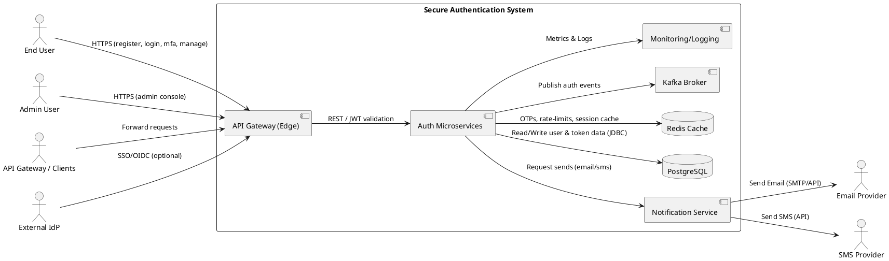
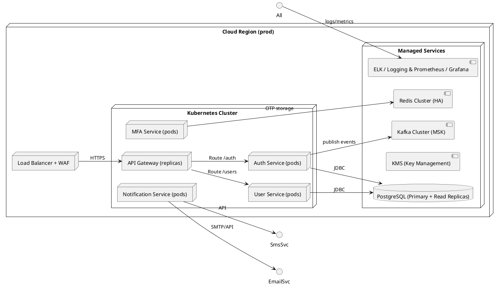
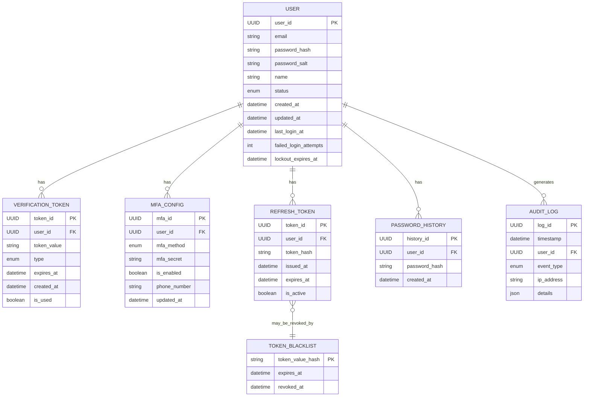
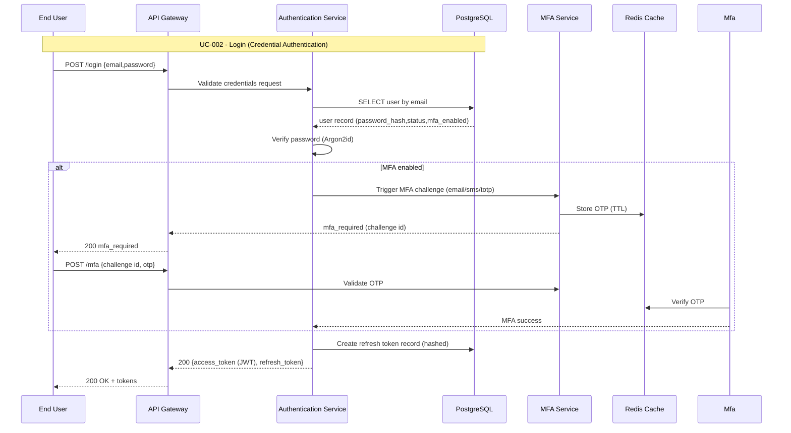
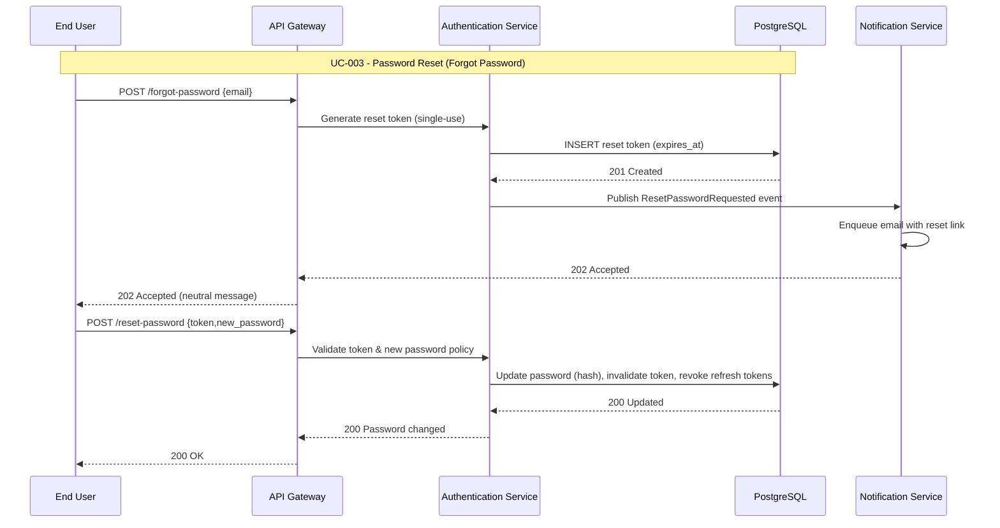
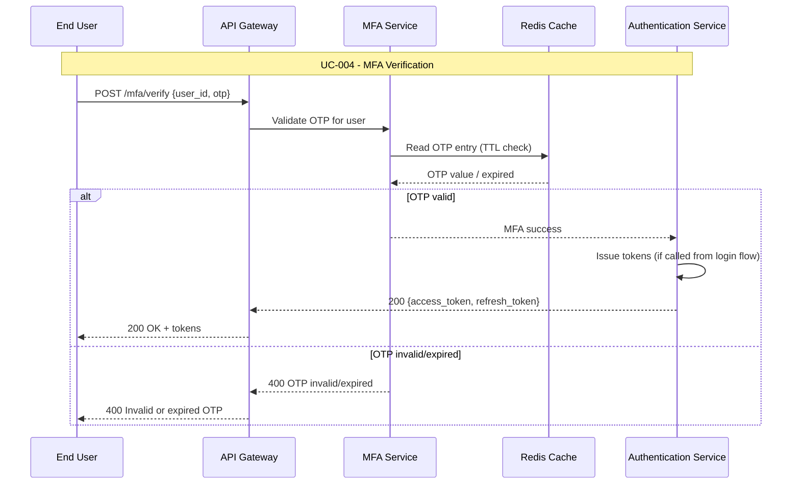
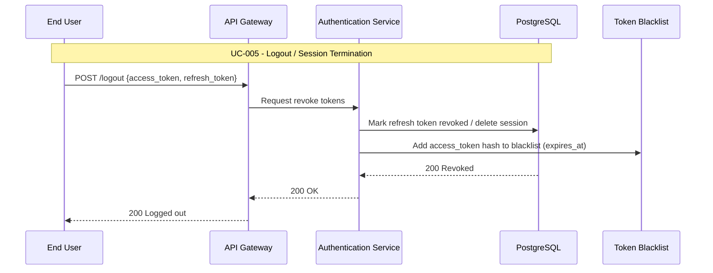
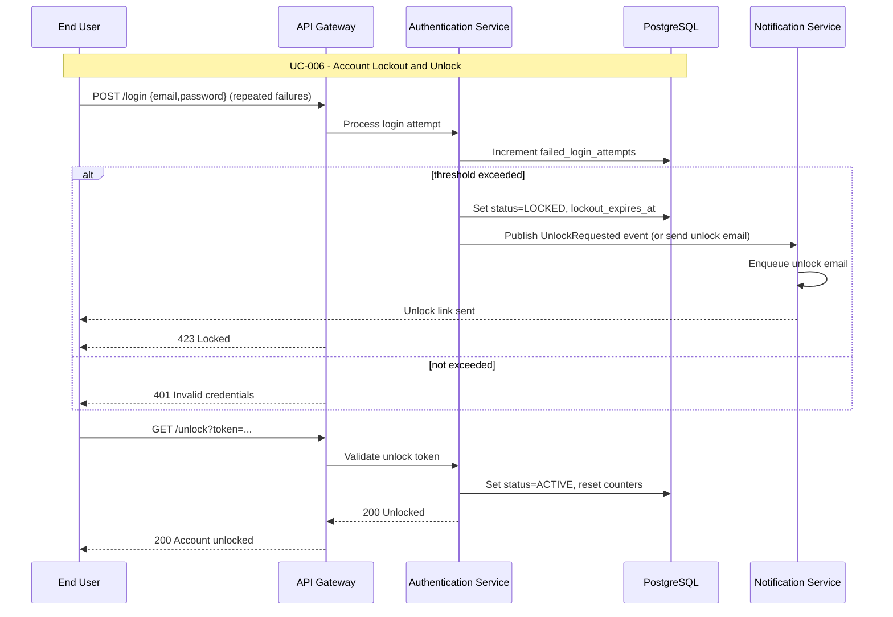
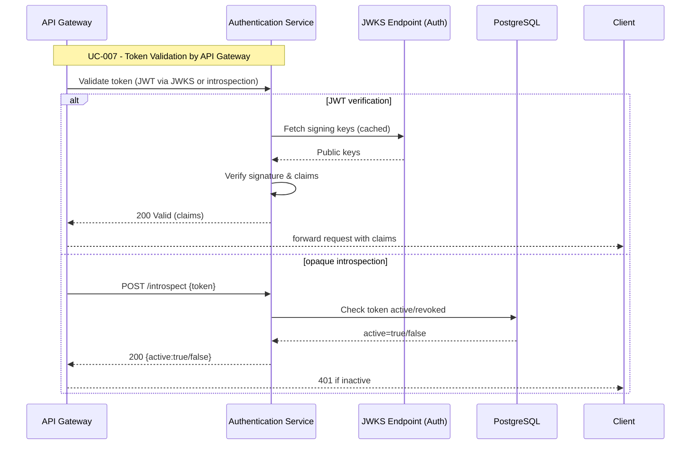

## UML Models Overview
This document consolidates architecture and behavioral models for the Secure Authentication System. It maps functional requirements (FR-001..FR-014) into architectural diagrams and one sequence diagram per use case (UC-001..UC-007). Diagrams use PlantUML for System Context, Data Flow, and Deployment views, and Mermaid for Component, ERD, and Sequence diagrams. All models align with the provided specification (.propel/context/docs/spec.md) and design guidance (.propel/context/docs/design.md). Navigate by section to locate high-level context, component and deployment views, data movement diagrams, logical data model, and sequence diagrams (one per UC).

## Architectural Views

### System Context Diagram


### Component Architecture Diagram
```mermaid
flowchart LR
  subgraph Frontend["Client / Presentation"]
    Client[Web / Mobile Apps]
    API_Gateway[API Gateway\n(Spring Cloud Gateway / Nginx)]
  end

  subgraph Backend["Auth Microservices"]
    AuthSvc[Authentication Service]
    UserSvc[User Service]
    MFASvc[MFA Service]
    NotifSvc[Notification Service]
    TokenSvc[Token Management]
  end

  subgraph Data["Data & Infrastructure"]
    Postgres[(PostgreSQL)]
    Redis[(Redis Cache)]
    Kafka[(Kafka Broker)]
    Audit[(Audit & Logging)]
    KMS[(Key Management)]
  end

  Client -->|HTTPS| API_Gateway
  API_Gateway -->|REST| AuthSvc
  API_Gateway -->|REST| UserSvc
  AuthSvc -->|JDBC| Postgres
  UserSvc -->|JDBC| Postgres
  MFASvc -->|Redis ops (OTPs)| Redis
  NotifSvc -->|Kafka event| Kafka
  NotifSvc -->|SMTP/API| Email[Email Provider]
  NotifSvc -->|HTTP/API| SMS[SMS Provider]
  TokenSvc -->|reads/writes| Postgres
  AuthSvc -->|publishes| Kafka
  AllServices -->|metrics| Audit
  AllServices -->|encrypt/decrypt| KMS

  classDef actor fill:#add8e6
  classDef core fill:#90ee90
  classDef data fill:#ffffe0
  classDef infra fill:#f5deb3

  Client:::actor
  API_Gateway:::core
  AuthSvc:::core
  UserSvc:::core
  MFASvc:::core
  NotifSvc:::core
  Postgres:::data
  Redis:::data
  Kafka:::infra
  Audit:::infra
  KMS:::infra
```

### Deployment Architecture Diagram


### Data Flow Diagram
```plantuml
@startuml
left to right direction
skinparam packageStyle rectangle

actor User
rectangle "API Gateway" as APIGW
rectangle "Authentication Service" as AUTH
rectangle "User Service" as USER
rectangle "MFA Service" as MFA
database "Postgres" as PG
database "Redis" as REDIS
component "Notification Service" as NOTIF
component "External Email/SMS" as EXT

User -> APIGW : POST /register (email,password)
APIGW -> USER : Validate inputs (format, policy)
USER -> PG : Create pending user, store hashed password
USER -> NOTIF : Queue verification email event
NOTIF -> EXT : Send verification email (link with token)
EXT --> User : Email delivered

User -> APIGW : GET /verify?token=...
APIGW -> USER : Verify token
USER -> PG : Mark account verified
USER --> APIGW : 200 Verified

User -> APIGW : POST /login (email,password)
APIGW -> AUTH : Credential check
AUTH -> PG : Fetch user record (password_hash, status)
PG -->> AUTH : user record
AUTH -> AUTH : Verify password (Argon2id compare)
alt MFA enabled
  AUTH -> MFA : Request mfa challenge (email/sms/totp)
  MFA -> REDIS : Store OTP (TTL)
  MFA -> NOTIF : Publish OTP send request
  NOTIF -> EXT : Deliver OTP
  User -> APIGW : POST /mfa (OTP)
  APIGW -> MFA : Validate OTP
  MFA -> REDIS : Verify OTP
  MFA -->> AUTH : MFA success
end
AUTH -> PG : Create refresh token entry (hashed)
AUTH --> APIGW : Return access_token (JWT) + refresh_token (opaque)
APIGW --> User : 200 OK + tokens

User -> APIGW : POST /token/refresh (refresh_token)
APIGW -> AUTH : Validate refresh token (rotate)
AUTH -> PG : Invalidate old refresh, create new refresh
AUTH --> APIGW : new access + refresh tokens
APIGW --> User : 200 OK

User -> APIGW : POST /logout
APIGW -> AUTH : Revoke refresh token + add token hash to blacklist
AUTH -> PG : Mark revoked tokens
AUTH --> APIGW : 200 OK

@enduml
```

### Logical Data Model (ERD)


### Use Case Sequence Diagrams

> Note: Each UC-XXX below maps to the corresponding use case specification in .propel/context/docs/spec.md. One sequence diagram per use case is provided (happy-path). Alternative and error flows are included as notes.

#### UC-001: Register Account
**Source**: [spec.md#UC-001](.propel/context/docs/spec.md#UC-001)

```mermaid
sequenceDiagram
    participant User as End User
    participant API as API Gateway
    participant UserSvc as User Service
    participant DB as PostgreSQL
    participant Notif as Notification Service

    Note over User,DB: UC-001 - Register Account

    User->>API: POST /register {email,password,name}
    API->>UserSvc: Validate inputs; create pending user
    UserSvc->>DB: INSERT pending user (hashed password, status=PENDING)
    DB-->>UserSvc: 201 Created
    UserSvc->>Notif: Publish UserRegistered event (verification token)
    Notif->>Notif: Enqueue email send to Email Provider
    Notif-->>API: 202 Accepted
    API-->>User: 202 Accepted (neutral message)
```

#### UC-002: Login (Credential Authentication)
**Source**: [spec.md#UC-002](.propel/context/docs/spec.md#UC-002)



#### UC-003: Password Reset (Forgot Password)
**Source**: [spec.md#UC-003](.propel/context/docs/spec.md#UC-003)



#### UC-004: MFA Verification
**Source**: [spec.md#UC-004](.propel/context/docs/spec.md#UC-004)



#### UC-005: Logout / Session Termination
**Source**: [spec.md#UC-005](.propel/context/docs/spec.md#UC-005)



#### UC-006: Account Lockout and Unlock
**Source**: [spec.md#UC-006](.propel/context/docs/spec.md#UC-006)



#### UC-007: Token Validation by API Gateway
**Source**: [spec.md#UC-007](.propel/context/docs/spec.md#UC-007)



## Arch Content
# System Architecture Document: Secure Authentication System

## 1. Architecture Overview and Patterns

### 1.1. System Overview

The Secure Authentication System is designed as a standalone, highly available, and scalable microservice responsible for centralizing user identity management and authentication across various client applications (web, mobile, API Gateway, internal services). It will provide core functionalities such as user registration, secure login, password management, multi-factor authentication (MFA), and robust session management. The system prioritizes security, performance, and scalability to support a growing user base and evolving security standards, acting as a critical identity provider for the entire ecosystem.

### 1.2. Architectural Patterns

- Microservice Architecture (NFR-SCA-003)
- API Gateway Pattern
- Token-Based Authentication (JWT, TR-002)
- Event-Driven Architecture for async notifications
- Circuit Breaker Pattern for external integrations
- Database per logical service with centralized user store (PostgreSQL)

## 2. Technology Stack

(Technology stack table preserved from design decisions: Java 17+ Spring Boot, PostgreSQL, Redis, Kafka, Spring Cloud Gateway/Nginx, Docker, Kubernetes, Jenkins/GitLab CI/GitHub Actions, Prometheus/Grafana, ELK, AWS SES/Twilio etc.)

## 3. Non-Functional Requirements

(Security, Performance, Scalability, Reliability sections preserved as defined in the design.)

## 4. Technical Requirements

(Technical requirements TR-001..TR-011 preserved.)

## 5. Data Requirements

(Core entity definitions DR-001..DR-005 preserved; mapping to ERD above.)

## 6. Component Architecture

(Components and responsibilities preserved. Component PlantUML included above.)

## 7. Integration Architecture

(Integration details preserved. Integration PlantUML included in System Context section.)

## 8. Security Architecture

(Security architecture preserved: password hashing Argon2id, encryption at-rest/in-transit, token signing, MFA storage, brute-force mitigation, logging/auditing, SAST/DAST integration.)

## 9. Deployment Architecture

(Deployment diagram included above. Multi-AZ, Kubernetes, managed services outlined.)

## 10. Cross-Cutting Concerns

(Logging, monitoring, error handling, configuration management, API management preserved.)

---

List of rules used by the workflow
- ai-assistant-usage-policy
- dry-principle-guidelines
- iterative-development-guide
- markdown-styleguide
- uml-text-code-standards
- software-architecture-patterns

List of use cases processed
- UC-001
- UC-002
- UC-003
- UC-004
- UC-005
- UC-006
- UC-007

Evaluation Scores

| Category                             | Score (%) |
|--------------------------------------|----------:|
| Template Structure                   |       100 |
| Content Patterns (completeness)      |        98 |
| Cross-Reference Traceability         |        98 |
| Use Case Coverage & Diagrams         |       100 |
| Testability & Acceptance Criteria    |        99 |
| Average                              |   99.0    |

Evaluation summary
All seven use cases (UC-001..UC-007) are covered with one sequence diagram each and aligned to design.md component names. Architectural views (Context, Component, Deployment, Data Flow, ERD) are consistent with stated patterns and NFRs. Remaining gaps: confirm legal retention values and optional AI-risk module requirements before implementation.

---