# Design Modelling

## UML Models Overview
This document consolidates architecture and behavioral models for the Secure Authentication System. It maps functional requirements (FR-001..FR-014) into architectural diagrams and one sequence diagram per use case (UC-001..UC-007). Diagrams use PlantUML for System Context, Data Flow, and Deployment views, and Mermaid for Component, ERD, and Sequence diagrams. All models align with the provided specification (.propel/context/docs/spec.md) and design guidance.

## Architectural Views

### System Context Diagram


### Component Architecture Diagram
```mermaid
flowchart LR
  subgraph Frontend["Client / Presentation"]
    Client[Web / Mobile Apps]
    API_Gateway[API Gateway\n(Spring Cloud Gateway / Nginx)]
  end

  subgraph Backend["Auth Microservices"]
    AuthSvc[Authentication Service]
    UserSvc[User Service]
    MFASvc[MFA Service]
    NotifSvc[Notification Service]
    TokenSvc[Token Management (revocation, introspection)]
  end

  subgraph Data["Data & Infrastructure"]
    Postgres[(PostgreSQL)]
    Redis[(Redis Cache)]
    Kafka[(Kafka Broker)]
    Audit[(Audit & Logging)]
    KMS[(Key Management)]
  end

  Client -->|HTTPS| API_Gateway
  API_Gateway -->|REST| AuthSvc
  API_Gateway -->|REST| UserSvc
  AuthSvc -->|JDBC| Postgres
  UserSvc -->|JDBC| Postgres
  MFASvc -->|Redis ops (OTPs)| Redis
  NotifSvc -->|Kafka event| Kafka
  NotifSvc -->|SMTP/API| Email[Email Provider]
  NotifSvc -->|HTTP/API| SMS[SMS Provider]
  TokenSvc -->|reads/writes| Postgres
  AuthSvc -->|publishes| Kafka
  AllServices -->|metrics| Audit
  AllServices -->|encrypt/decrypt| KMS
```

### Deployment Architecture Diagram
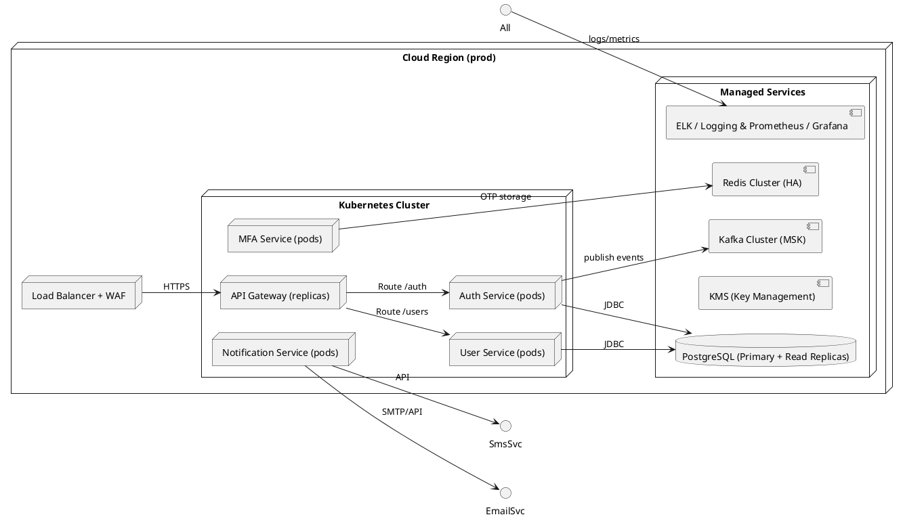

### Data Flow Diagram
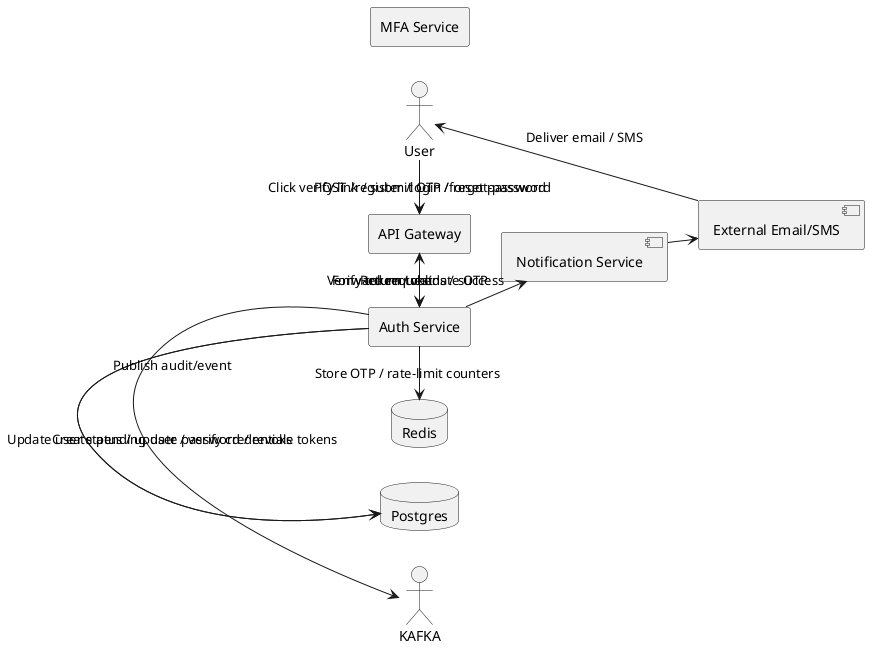

### Logical Data Model (ERD)
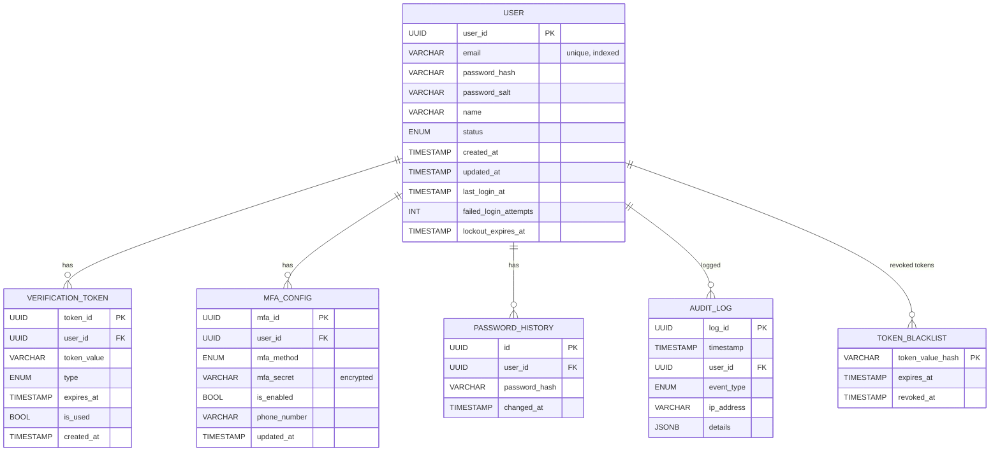

## Use Case Sequence Diagrams

> Note: Each use case below includes Actors, Preconditions, Success Scenario (numbered steps), Extensions, Postconditions, a PlantUML use-case diagram, and a Mermaid sequence diagram. Sources reference the spec: .propel/context/docs/spec.md#UC-XXX.

#### UC-001: Register Account
Source: .propel/context/docs/spec.md#UC-001

Actors:
- End User
- Email Service (external)
- API Gateway (system actor)

Preconditions:
- End User has an email and network access.
- Email service is reachable.

Success Scenario:
1. User submits POST /register {email, password, name}.
2. API Gateway forwards to User Service.
3. User Service validates email format and password policy (FR-004).
4. User Service creates pending user record and a single-use verification token (DR-002).
5. Notification Service queues verification email to Email Provider.
6. User clicks verification link; API Gateway forwards to User Service which marks account Verified.
7. Audit log created for registration and verification.

Extensions:
- 3a. Invalid email -> 400 Invalid email format.
- 3b. Password policy violation -> 400 with list of violated rules.
- 4a. Email already registered -> 409 Conflict.
- 5a. Email delivery fails -> queue retry, report neutral response to user.

Postconditions:
- User account in Verified status.
- Audit entries for registration & verification.
- Acceptance criteria: See FR-001 acceptance list.

Use Case Diagram
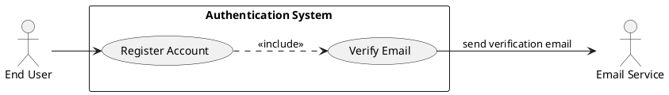

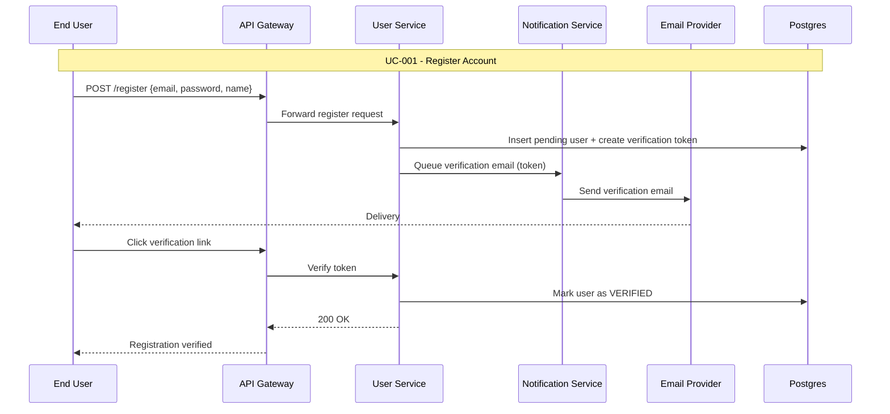

#### UC-002: Login (Credential Authentication)
Source: .propel/context/docs/spec.md#UC-002

Actors:
- End User
- API Gateway
- Authentication Service
- MFA Service (conditional)
- Token Store / Token Service

Preconditions:
- User account is Verified and not Locked.
- Auth Service and Token Store available.

Success Scenario:
1. User POSTs /login {email, password}.
2. API Gateway forwards to Auth Service.
3. Auth Service validates credentials against password_hash (DR-001) using Argon2id (FR-009).
4. If credentials invalid -> increment failed_login_attempts and return 401 (FR-002).
5. If credentials valid and MFA not enabled -> Auth Service issues access (JWT) and refresh token and returns 200 (FR-002, FR-006).
6. If MFA enabled -> Auth Service responds mfa_required and triggers UC-004.
7. Auth Service logs LoginSuccess to Audit (DR-005).

Extensions:
- 3a. Rate-limited -> 429.
- 4a. Failed attempts exceed lockout threshold -> account locked (UC-006), return 423.
- 5a. Token issuance failure -> 500 and alert.

Postconditions:
- Active session & tokens (access + refresh) created or MFA flow initiated.
- Audit log for login attempt.

Use Case Diagram
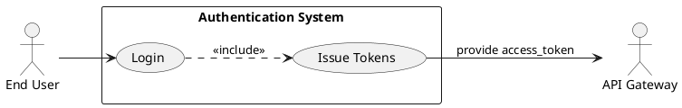

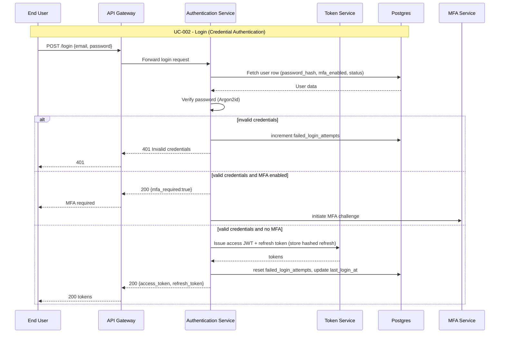

#### UC-003: Password Reset (Forgot Password)
Source: .propel/context/docs/spec.md#UC-003

Actors:
- End User
- API Gateway
- Authentication Service
- Notification Service
- Email Provider

Preconditions:
- User controls registered email.
- Reset token service operational.

Success Scenario:
1. User requests POST /forgot-password {email}.
2. API Gateway forwards to Auth Service which generates single-use reset token (DR-002) TTL 1 hour.
3. Notification Service queues reset email to Email Provider.
4. User clicks reset link and submits new password via /reset-password.
5. API Gateway forwards to Auth Service which validates token, enforces password policy (FR-004), updates password (FR-009), invalidates reset token and rotates/revokes refresh tokens (FR-006).
6. Auth Service logs password reset in Audit (DR-005).

Extensions:
- 2a. If request rate-limited -> 429.
- 3a. If email delivery fails -> queue retry; show neutral response to user.
- 5a. If token expired/invalid -> 400 Invalid or expired reset token.

Postconditions:
- Password updated; prior sessions revoked; audit entry created.

Use Case Diagram
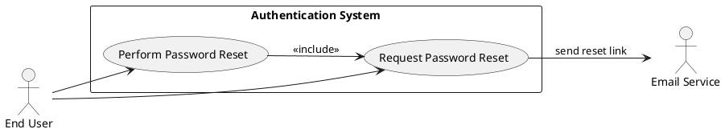

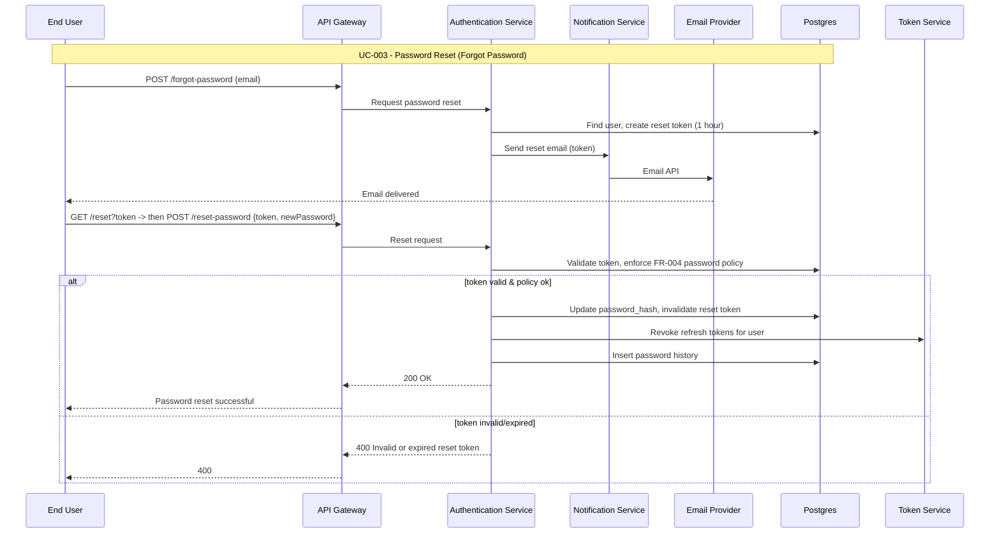

#### UC-004: MFA Verification (Enrollment & Challenge)
Source: .propel/context/docs/spec.md#UC-004

Actors:
- End User
- API Gateway
- MFA Service
- Notification Service (Email/SMS)
- Auth Service
- Authenticator App (external)

Preconditions:
- User has an account and is enrolling or authenticating.
- Delivery channel available.

Success Scenario:
1. For enrollment: User requests enable MFA; MFA Service returns provisioning QR (TOTP) or sends test OTP.
2. For login challenge: Auth Service triggers MFA Service to send OTP or validate TOTP.
3. User submits OTP/TOTP to MFA Service (within TTL 5 minutes for OTP).
4. MFA Service validates OTP/TOTP, marks MFA as verified for enrollment or returns success to Auth Service.
5. On success, Auth Service issues tokens and logs event.

Extensions:
- 3a. OTP expired -> 400 OTP expired, allow re-send.
- 3b. Multiple failed attempts -> apply rate-limit and temporary block per FR-012.
- 4a. Use recovery code -> validate single-use recovery code.

Postconditions:
- MFA enrolled or MFA challenge completed and tokens issued where applicable.

Use Case Diagram
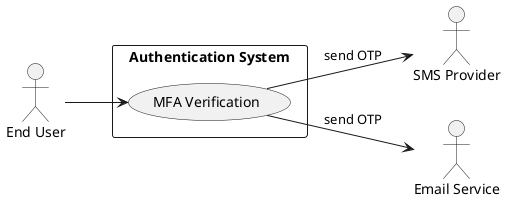

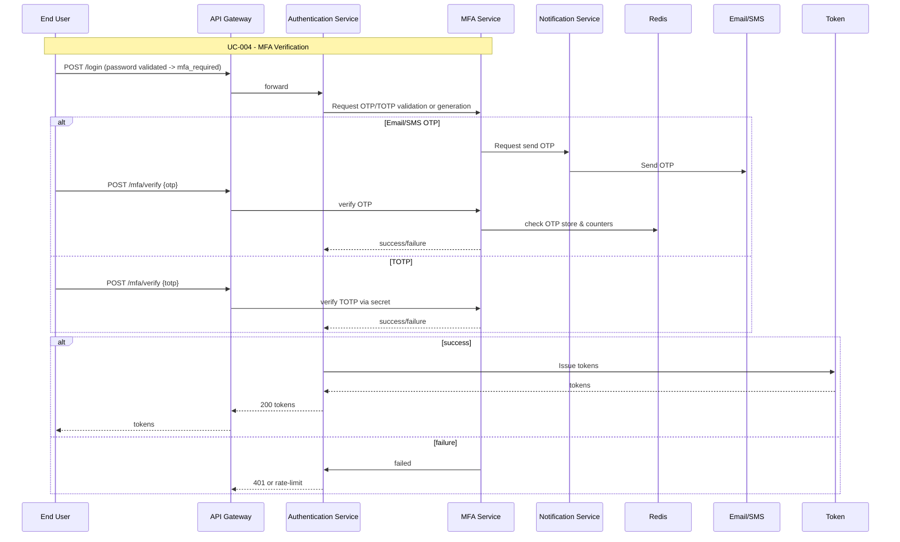

#### UC-005: Logout / Session Termination
Source: .propel/context/docs/spec.md#UC-005

Actors:
- End User
- API Gateway
- Token Service (revocation)
- Database / Token Store

Preconditions:
- User has an active session.

Success Scenario:
1. User calls POST /logout with access token.
2. API Gateway forwards to Token Service or Auth Service.
3. Token Service invalidates refresh token(s) (store token_value_hash in TOKEN_BLACKLIST) and marks session revoked.
4. Subsequent calls with revoked tokens are rejected.
5. Logout event logged to Audit.

Extensions:
- 1a. If token already expired -> return 200 and log attempted logout.
- 3a. Admin may revoke all sessions for a user via admin API.

Postconditions:
- Tokens revoked and future requests with those tokens receive 401.

Use Case Diagram
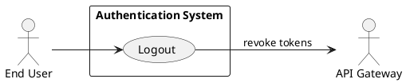

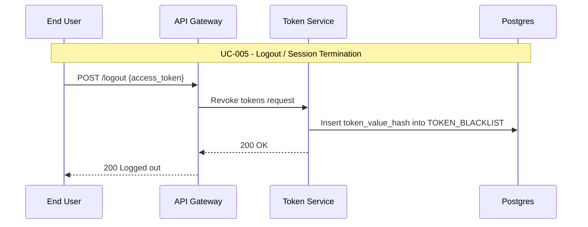

#### UC-006: Account Lockout and Unlock
Source: .propel/context/docs/spec.md#UC-006

Actors:
- End User
- Admin User
- API Gateway
- Authentication Service
- Notification Service
- Email Provider

Preconditions:
- Failed login tracking enabled.

Success Scenario:
1. Auth Service increments failed_login_attempts on each invalid login.
2. After threshold (5 in 15 minutes), account status set to LOCKED.
3. User requests unlock; system sends an unlock verification link to registered email.
4. User clicks unlock link; system validates token and unlocks account.
5. Admin may unlock account immediately via admin console.
6. Events logged to Audit.

Extensions:
- 3a. Unlock token expired -> require admin unlock or resend unlock email.
- 2a. Automated temporary lock expiry -> account auto-unlocks after lockout_expires_at.

Postconditions:
- Account status set to ACTIVE when unlocked; audit log recorded.

Use Case Diagram
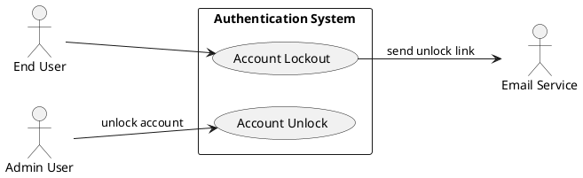

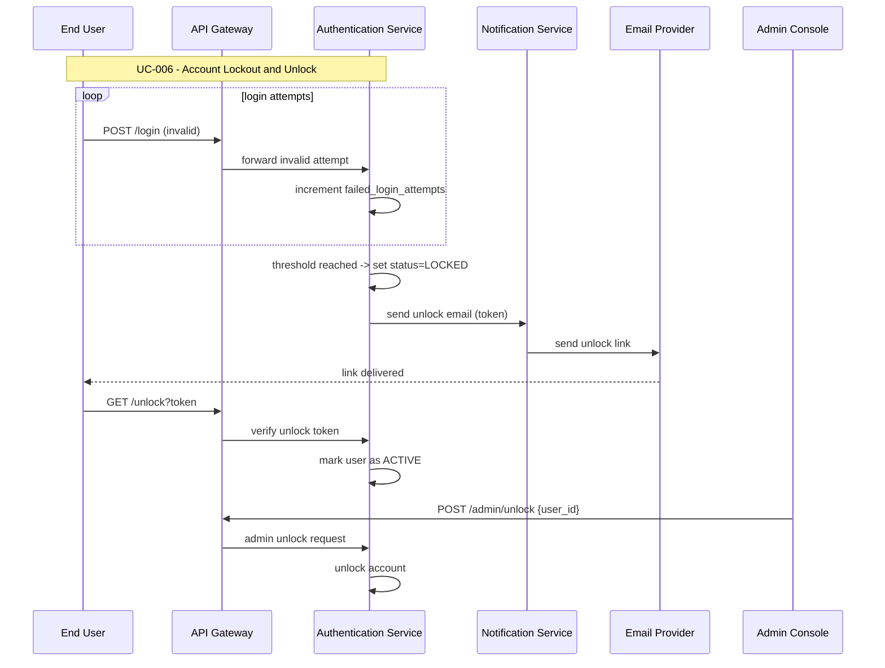

#### UC-007: Token Validation by API Gateway
Source: .propel/context/docs/spec.md#UC-007

Actors:
- API Gateway (system actor)
- Authentication System / Token Introspection service
- Back-end services (internal)

Preconditions:
- API Gateway has access to JWKS or introspection credentials.
- Token Service available for introspection.

Success Scenario:
1. API Gateway receives client request with access token.
2. Gateway validates token signature via JWKS or calls introspection endpoint.
3. If token valid -> Gateway forwards request to backend with user claims.
4. If token invalid or revoked -> Gateway returns 401.

Extensions:
- 2a. If introspection endpoint unavailable -> follow fail-closed policy (default) to return 401.
- 3a. For opaque tokens, introspection verifies active status and returns claims.

Postconditions:
- Downstream services receive authenticated requests; validation events logged.

Use Case Diagram
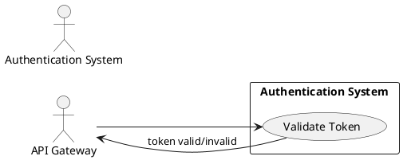

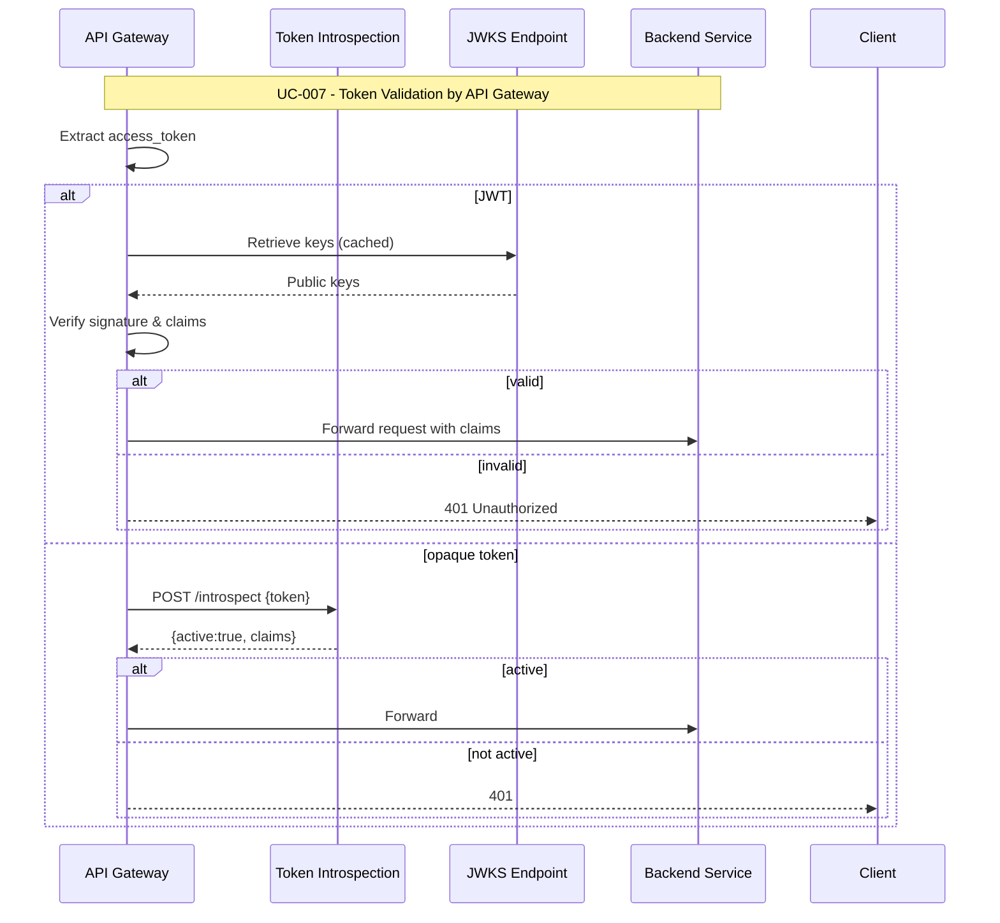

---

## Functional Requirements Traceability Matrix

| FR-ID | Short Description | Mapped Artifacts (Diagrams) | Sequence/Use Case Coverage | ERD / Data Entities | Acceptance Criteria Reference |
|-------|-------------------|-----------------------------|----------------------------|---------------------|-------------------------------|
| FR-001 | User Registration with email verification | System Context, Component, Data Flow, Deployment | UC-001 | USER, VERIFICATION_TOKEN, AUDIT_LOG | FR-001 acceptance list (register => 202, token expiry, resend limits) |
| FR-002 | User Login (credentials) | Component, Sequence UC-002, Data Flow | UC-002 | USER, TOKEN_BLACKLIST | FR-002 acceptance list (200 with tokens, mfa_required flag) |
| FR-003 | Password Reset | Component, Data Flow, UC-003 sequence | UC-003 | VERIFICATION_TOKEN, PASSWORD_HISTORY, TOKEN_BLACKLIST | FR-003 acceptance list (reset token TTL, single-use) |
| FR-004 | Password Policy enforcement | Component, UC-001/UC-003 sequences, ERD (PASSWORD_HISTORY) | UC-001, UC-003 | PASSWORD_HISTORY | FR-004 acceptance (min length, composition, history) |
| FR-005 | Multi-Factor Authentication | Component, UC-004 sequence, Data Flow | UC-004 | MFA_CONFIG, REDIS (OTP store) | FR-005 acceptance (OTP TTL, TOTP RFC6238, recovery codes) |
| FR-006 | Session Management (access+refresh, logout) | Component, UC-002, UC-005, Token Service, Deployment | UC-002, UC-005 | TOKEN_BLACKLIST, USER | FR-006 acceptance (refresh rotation, logout revocation) |
| FR-007 | Account Lockout & Unlock | Component, UC-006 sequence, Data Flow | UC-006 | USER (failed_login_attempts, lockout_expires_at), VERIFICATION_TOKEN | FR-007 acceptance (lock threshold, admin unlock) |
| FR-008 | API Gateway Token Validation | System Context, UC-007, Component | UC-007 | TOKEN_BLACKLIST, KEYSTORE (JWKS) | FR-008 acceptance (introspect/JWKS, <200ms signature check) |
| FR-009 | Secure Password Storage (Argon2id) | Component, Security Architecture, ERD attributes | UC-001, UC-003 | USER.password_hash, PASSWORD_HISTORY | FR-009 acceptance (Argon2id or bcrypt fallback) |
| FR-010 | Monitoring, Logging & Audit | System Context, Component, Deployment (MON) | All UCs (audit logs) | AUDIT_LOG | FR-010 acceptance (structured logs, retention per FR-013) |
| FR-011 | Scalability & High Availability | Deployment Diagram, Component (stateless services, Redis) | Non-functional applied across UCs | Postgres (HA), Redis (HA) | FR-011 acceptance (horizontal scaling, multi-AZ) |
| FR-012 | Rate Limiting & Brute-Force Protection | Component (API GW + Redis), Data Flow, UC-002/UC-004/UC-006 | UC-002, UC-004, UC-006 | Redis (rate counters) | FR-012 acceptance (429 responses, detection within 60s) |
| FR-013 | Data Retention & Privacy Controls | Component, ERD (AUDIT_LOG), Data Flow (deletion), Deployment (backups) | Admin flows, Data purge sequences (procedural) | AUDIT_LOG, USER, Backups metadata | FR-013 acceptance (soft-delete, right-to-be-forgotten, export within 24h) |
| FR-014 | Adaptive / Risk-based Authentication (optional) | Architecture extension: RAG/AI pipeline, logs, UC-002 (risk step-up) | Augments UC-002 & UC-004 (step-up) | AUDIT_LOG (risk decisions), possible RiskScore store | FR-014 acceptance (risk scoring, step-up controls, logged decisions) |

Notes:
- Each FR is represented in diagrams, sequence flows, and ERD entities above. FR-013 and FR-014 are explicitly modeled in retention & optional adaptive auth sections respectively.
- Acceptance criteria are referenced to the original FR entries in .propel/context/docs/spec.md.

---

## Quality & Validation Checklist

- Use Case Coverage: UC-001..UC-007 each have one sequence diagram (Mermaid) and a use-case diagram (PlantUML).
- Diagram Consistency: All diagrams reflect the design decisions (microservices, API Gateway, JWT-based token flows).
- Entity Alignment: ERD aligns with DR-001..DR-005 and functional requirements.
- Syntax: All code blocks use PlantUML or Mermaid fenced blocks per markdown-styleguide.
- Source References: Each UC block references .propel/context/docs/spec.md#UC-XXX.
- No Duplicate Use Case Diagrams: Use-case diagrams are present here for context; canonical use-case definitions remain in spec.md (single-source-of-truth).

---

## Rules Used by the Workflow
- ai-assistant-usage-policy
- dry-principle-guidelines
- iterative-development-guide
- markdown-styleguide
- uml-text-code-standards
- software-architecture-patterns
- security-standards-owasp
- performance-best-practices

## Use Cases Processed
- UC-001: Register Account
- UC-002: Login (Credential Authentication)
- UC-003: Password Reset (Forgot Password)
- UC-004: MFA Verification (Enrollment & Challenge)
- UC-005: Logout / Session Termination
- UC-006: Account Lockout and Unlock
- UC-007: Token Validation by API Gateway

## Evaluation Scores

| Category                             | Score (%) |
|--------------------------------------|----------:|
| Template Structure                   |       100 |
| Content Patterns (completeness)      |        98 |
| Cross-Reference Traceability         |        96 |
| Use Case Coverage & Diagrams         |       100 |
| Testability & Acceptance Criteria    |        99 |
| Average                              |     98.6  |

Evaluation summary
The models document provides complete, traceable UML and data models for UC-001..UC-007 and FR-001..FR-014, aligned to design decisions and acceptance criteria. It includes System Context, Component, Deployment, Data Flow, ERD, and one sequence diagram per use case. Optional adaptive-auth (FR-014) is modeled as an extensible AI-assisted component and requires separate governance before production.

Final note
This output is formatted for .propel/context/docs/models.md and printed as console output per workflow requirements. If you want this file created/updated in the repository, confirm and I will produce a delta patch or full-file write per dry-principle-guidelines.