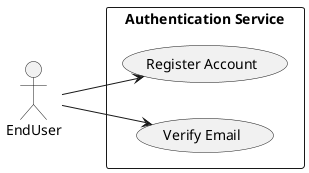
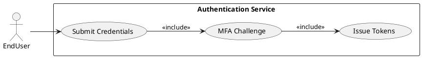
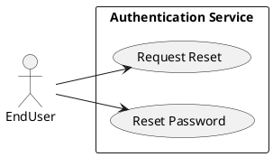
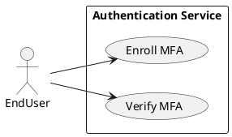
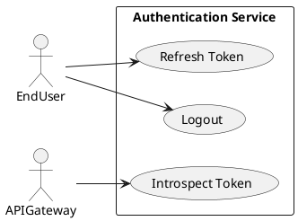
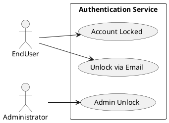
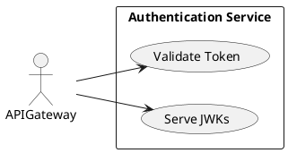

# Requirements Specification

## Feature Goal
Provide a central, secure Authentication System that replaces ad-hoc auth across applications with a unified identity service supporting user registration, secure login, password management, multi-factor authentication (MFA), token-based session management (access + refresh), account protection (lockout, admin unlock), audit logging, and integration points for API Gateway and external IdPs. Current state: multiple apps implement inconsistent auth rules and storage. Desired state: single, auditable, secure authentication service with deterministic, testable behaviors and clear integration contracts.

## Business Justification
- Business value and user impact
  - Centralizes identity to reduce security risk, simplify compliance (OWASP alignment), and lower per-app maintenance.
  - Improves user experience with consistent login, recovery, and MFA flows across platforms.
  - Reduces developer integration effort via a single token validation contract.
- Integration with existing features
  - Exposes token issuance and introspection endpoints for web, mobile, API Gateway, and internal services.
  - Supports connector adapters for external IdPs (OAuth/OIDC) and future SSO.
- Problems this solves and for whom
  - End users: consistent, secure access and predictable recovery flows.
  - Security & Compliance: centralized auditing, rate-limiting and policy enforcement.
  - Developers & Product: standardized token semantics and toggles for MFA and policy.

## Feature Scope
User-visible behavior:
- Sign up with email verification and configured password policy.
- Login with email + password; optional MFA challenge flows.
- Password reset via email link with single-use token.
- Enroll and use MFA (Email OTP, SMS OTP, TOTP authenticator).
- Token-based sessions: access + refresh tokens, refresh flow, logout, inactivity timeout.
- Account lockout after repeated failed attempts; unlock via email verification or admin action.
Technical requirements:
- Secure password hashing (Argon2id preferred) and secrets management.
- HTTPS-only endpoints, OWASP controls, rate limiting, monitoring and audit trails.
- Configurable retention, TTL, lockout thresholds, and MFA policies.
- Scalable, horizontally-deployable microservice with health checks and metrics.

### Success Criteria
- [ ] Login success rate ≥ 95% across measured user population.
- [ ] Login response time < 2s for 95% of auth requests under normal load.
- [ ] Service supports 10,000+ concurrent sessions without auth-service-induced failures.
- [ ] No critical OWASP findings in security audit prior to production launch.
- [ ] MFA adoption for privileged users ≥ 20% within 6 months (where applicable).

## Functional Requirements

Before expanding, list of requirements to generate:

| FR-ID | Summary |
|-------|---------|
| FR-001 | User Registration with email verification |
| FR-002 | User Login with credential validation and MFA handshake |
| FR-003 | Password Reset (forgot-password flow) |
| FR-004 | Password Policy enforcement and validation |
| FR-005 | Multi-Factor Authentication (MFA) support and enrollment |
| FR-006 | Session Management (access + refresh tokens, refresh, logout, inactivity) |
| FR-007 | Account Lockout and Unlock workflows |
| FR-008 | API Gateway Token Validation / Introspection endpoint |
| FR-009 | Secure Password Storage and secrets management |
| FR-010 | Monitoring, Logging & Audit for auth events |
| FR-011 | Scalability & High Availability requirements |
| FR-012 | Rate Limiting & Brute-Force Protection |
| FR-013 | Data Retention & Privacy Controls (configurable) |
| FR-014 | Adaptive / Risk-based Authentication (AI candidate, optional) |
| FR-015 | Admin Console for account management and audit access |
| FR-016 | External Identity Provider (OIDC) connector (SSO integration) |
| FR-017 | Key rotation and token signing strategy |
| FR-018 | Backup & Disaster Recovery (auth DB and state) |
| FR-019 | Telemetry & Alerts for security incidents |

Expand each FR with full specification.

- FR-001: [DETERMINISTIC] System MUST allow new users to register an account via email verification.
  - Description: POST /register accepts email, password, first_name, last_name; validates inputs, creates a pending user record, queues verification email with single-use token.
  - Acceptance Criteria:
    1. Given valid inputs, POST /register returns 202 Accepted and verification email is queued within 5s.
    2. Verification token is single-use and expires by default in 24 hours (configurable).
    3. Registering with an existing verified email returns 409 Conflict with generic message "Email already registered".
    4. Unverified accounts older than configurable TTL (default 7 days) are purged or archived per retention policy.
  - Trigger: User submits registration form.
  - Who benefits: End users, Product team.
  - Data fields: email, password_hash, user_id, created_date, verification_status.
  - Failure scenarios: Email provider outage → registration accepted but verification delayed; system must queue and retry sending.

- FR-002: [DETERMINISTIC] System MUST authenticate users via email + password and initiate MFA when configured, returning access and refresh tokens upon full success.
  - Description: POST /login performs credential validation by comparing password hash, checks account status, enforces lockout/policy, and if applicable starts MFA flow.
  - Acceptance Criteria:
    1. On valid credentials and no MFA, returns 200 with access_token (JWT, default TTL 15m) and refresh_token (opaque, default TTL 30d).
    2. When MFA enabled, returns 200 with mfa_required flag and a temporary auth_session_id; tokens issued only after MFA verification.
    3. On invalid credentials increments failed-login counter and returns 401 Unauthorized with generic error.
    4. Failed login response time < 2s for 95% of requests under normal load.
  - Trigger: POST /login with email + password.
  - Who benefits: End users, security teams.
  - Notes: Error messages must not differentiate "user not found" vs "wrong password" (avoid user enumeration).

- FR-003: [DETERMINISTIC] System MUST support secure password reset flow with single-use, expiring reset tokens sent by email.
  - Description: POST /forgot-password sends reset link with token; POST /reset-password with token and new password performs validation and updates password hash.
  - Acceptance Criteria:
    1. Reset token expires by default in 1 hour (configurable) and is single-use.
    2. POST /forgot-password responds 202 Accepted whether email exists or not (prevent enumeration).
    3. Reset completes only if token valid, new password meets policy, and token not expired.
    4. Reset events logged for audit with requestor IP and timestamp.
  - Trigger: User requests password reset.
  - Failure scenarios: Token replay attempt → rejected with 400; expired token → returns 410 Gone.

- FR-004: [DETERMINISTIC] System MUST enforce password policy on creation and updates.
  - Description: Passwords must meet configurable policy (default: min 8 chars, uppercase, lowercase, number, special).
  - Acceptance Criteria:
    1. Passwords not meeting policy are rejected with 400 and policy summary.
    2. Policy parameters configurable via admin settings and enforced consistently across registration, reset, and admin-set-password flows.
    3. Passwords stored only as secure hashes; plaintext never logged.
  - Trigger: Password set/change operation.
  - Notes: Provide user-facing guidance on policy and password strength meter in UI (if UI present).

- FR-005: [HYBRID] System MUST provide MFA enrollment and verification supporting Email OTP, SMS OTP, and TOTP authenticator apps, with recovery codes.
  - Description: User can enroll MFA methods; verification flow challenges user with OTP/TOTP; on verification tokens are validated server-side; provide one-time recovery codes at enrollment.
  - Acceptance Criteria:
    1. Enrollment requires re-authentication (password) and a proven challenge (e.g., OTP verification).
    2. OTP codes expire within short TTL (default 5 minutes); TOTP follows RFC6238.
    3. Recovery codes are single-use; system stores only hashed recovery codes.
    4. Admin can revoke MFA methods.
  - Trigger: User requests to enable MFA or login when MFA is active.
  - Notes: SMS OTP usability vs security tradeoff documented; recommend TOTP for high-assurance accounts.

- FR-006: [UNCLEAR] System MUST manage sessions with access and refresh tokens, supporting refresh, logout, and inactivity handling. (Decision required: JWT (stateless) vs opaque tokens with server-side sessions.)
  - Description: Token issuance, storage, revocation, refresh mechanics, and inactivity timeouts must be specified. Provide introspect endpoint for API Gateway.
  - Acceptance Criteria:
    1. Access token validity default 15 minutes; refresh token default 30 days (configurable).
    2. Refresh requires valid refresh token and rotates refresh token on use (issue new and invalidate old).
    3. Logout invalidates refresh token and server-side session (if using opaque sessions).
    4. Inactivity logout configured (sliding or absolute) as admin policy; behavior documented.
  - Trigger: Token issuance, refresh, logout, or inactivity event.
  - Who benefits: Integrators, security team.
  - Clarification needed: Choose token strategy and revocation approach before implementation.

- FR-007: [DETERMINISTIC] System MUST lock accounts after configurable failed attempts and provide unlock methods (email verification or admin unlock).
  - Description: Failed-login counters tracked per account and optionally per IP; upon threshold (default 5) account enters locked state.
  - Acceptance Criteria:
    1. After threshold, account returns 423 Locked for auth attempts and requires unlock flow.
    2. Unlock possible via single-use email link or admin console action; automatic unlock after configurable cooldown period (if enabled).
    3. Lock events recorded in audit logs with cause and timestamp.
  - Trigger: Failed-login threshold reached.
  - Failure scenarios: Locked account targeted by attacker → rate-limited admin unlock to avoid DoS.

- FR-008: [DETERMINISTIC] System MUST expose a Token Validation / Introspection endpoint for API Gateway and services.
  - Description: Endpoint supports JWT verification (public key) or token introspection for opaque tokens; returns minimal claims required for authorization decisions.
  - Acceptance Criteria:
    1. API returns 200 with token validity and user claims for valid tokens; 401/403 for invalid tokens.
    2. Endpoint rate-limited and requires client authentication for introspection.
    3. Public key rotation documented and served via a JWKs endpoint if JWTs used.
  - Trigger: API Gateway requests token validity.
  - Integrations: API Gateway, internal services.

- FR-009: [DETERMINISTIC] System MUST store passwords and sensitive secrets securely using Argon2id (preferred) or bcrypt if Argon2 not available; secrets in vault.
  - Description: Passwords hashed using Argon2id with configurable parameters; encryption keys and signing keys stored in secret manager.
  - Acceptance Criteria:
    1. Password hashes generated with recommended parameters; salt per user.
    2. Secrets accessed via IAM-authenticated vault; no secrets in config or logs.
    3. Key rotation processes documented and supported.
  - Security notes: Use secure memory handling for secrets to reduce leak risk.

- FR-010: [DETERMINISTIC] System MUST provide monitoring, structured logging, and auditable event trails for authentication events.
  - Description: Emit structured logs and metrics for registration, login success/failure, MFA events, token issuance, token revocation, account locks/unlocks.
  - Acceptance Criteria:
    1. All auth events include timestamp, actor (user_id or anonymous), event_type, IP, user_agent, and request_id.
    2. Retention configurable per privacy policy; default audit retention defined.
    3. Alerts created for suspicious patterns (rapid failed attempts, token anomalies).
  - Integrations: SIEM, observability stack (Prometheus/Grafana, ELK).

- FR-011: [DETERMINISTIC] System MUST be horizontally scalable and highly available with health checks and auto-scaling guidelines.
  - Description: Stateless application tier; backend stores (auth DB, cache) designed for HA with failover.
  - Acceptance Criteria:
    1. Service exposes liveness and readiness endpoints.
    2. System can scale to handle target concurrency (10,000+ sessions) under load testing.
    3. Database and cache replication configurations documented for RTO/RPO.
  - Performance: Document load-test results and bottlenecks.

- FR-012: [DETERMINISTIC] System MUST enforce rate limiting and protections to mitigate brute-force and credential-stuffing attacks.
  - Description: Implement per-account and per-IP rate limits, exponential backoff, and CAPTCHA/elevated friction when suspicious patterns detected.
  - Acceptance Criteria:
    1. Rate-limits configurable; default thresholds defined.
    2. Excessive requests return 429 Too Many Requests with Retry-After header.
    3. Adaptive throttling rules to protect against distributed attacks.
  - Detection: Integration with anomaly detection for suspicious login patterns.

- FR-013: [DETERMINISTIC] System MUST provide configurable data retention and privacy controls for PII and audit logs.
  - Description: Configurable retention policy with automated purge/archival; support for data deletion requests in compliance with GDPR/CCPA.
  - Acceptance Criteria:
    1. Admin can set retention windows for logs, PII, and inactive accounts.
    2. Data deletion requests processed within SLA and result logged.
    3. Sensitive data at rest encrypted (AES-256) and key usage logged.
  - Compliance: Document data processing and consent capture for account creation.

- FR-014: [AI-CANDIDATE] System SHOULD support Adaptive / Risk-based Authentication to flag high-risk sessions and require additional verification.
  - Description: Optional risk engine evaluates signals (IP reputation, device fingerprinting, velocity) to score sessions and elevate authentication requirements. Machine learning or heuristics may be used.
  - Acceptance Criteria:
    1. Risk scoring produced for login attempts; scores above threshold trigger MFA or deny.
    2. Admin can configure risk thresholds and actions.
    3. Risk engine decisions logged and explainable for audits.
  - Notes: Model training, data retention, and false-positive mitigation must be planned.

- FR-015: [DETERMINISTIC] System MUST provide an Admin Console for account management, unlocks, and audit access with RBAC.
  - Description: Admin portal supports search, account status changes, manual unlock, and audit view. Access controlled via RBAC and MFA enforced for admins.
  - Acceptance Criteria:
    1. Admin roles scoped (viewer, operator, security-admin) with least privilege.
    2. Admin actions logged with actor identity and reason.
    3. Admin console requires MFA and IP allow-listing (configurable).
  - Security: Separate authentication path for operator accounts.

- FR-016: [DETERMINISTIC] System MUST support external Identity Provider integration via OIDC for SSO.
  - Description: Add connector to accept IdP-initiated and SP-initiated flows, map external claims to local user records, and support account linking.
  - Acceptance Criteria:
    1. Successful OIDC flow returns tokens and mapped local user record or creates linked account per policy.
    2. Failure modes (missing claims) return actionable errors.
    3. JWKs and metadata endpoints handled dynamically with caching.
  - Trigger: User chooses "Login with SSO".

- FR-017: [DETERMINISTIC] System MUST support key rotation and secure token signing strategy.
  - Description: Implement signing key lifecycle with rollover, JWKs endpoint, and backward compatibility during rotation windows.
  - Acceptance Criteria:
    1. Keys rotated per schedule with no downtime for token verification.
    2. Old keys retired after safe window and revocation propagated.
    3. Key usage and rotation events logged for compliance.

- FR-018: [DETERMINISTIC] System MUST provide backup and disaster recovery processes for auth DB and critical state.
  - Description: Document RPO/RTO, periodic backups, and restore playbooks with regular drills.
  - Acceptance Criteria:
    1. Backups validated and restore tested quarterly.
    2. Recovery meets defined RTO/RPO agreed by stakeholders.

- FR-019: [DETERMINISTIC] System MUST provide telemetry and alerting for security incidents, degradation, and SLA breaches.
  - Description: Define metrics, thresholds, and alerting workflows for on-call and security operations.
  - Acceptance Criteria:
    1. Alerts configured for high failed-login rate, unusual token usage, and service errors.
    2. Pager duty/incident routing documented and tested.

## Use Case Analysis

### Actors & System Boundary
- Primary Actor: End User — authenticates, registers, manages recovery and MFA.
- Secondary Actor: Administrator — manages accounts, unlocks, views audit logs.
- System Actor: Email Provider (SMTP API) — delivers verification and reset emails.
- System Actor: SMS Provider — delivers OTP messages (if enabled).
- System Actor: API Gateway / Client Services — consumes token validation endpoints.
- System Actor: External Identity Provider (OIDC) — SSO integration.
- System Boundary: Authentication Service (issue/validate tokens, manage identities, audit).

### Use Case Specifications

#### UC-001: User Registration & Email Verification
- Actor(s): End User
- Goal: Create an account and verify ownership of provided email.
- Preconditions: User has access to an email address; system accepts registrations.
- Success Scenario:
  1. User submits POST /register with required fields.
  2. System validates inputs, creates pending account, and queues verification email.
  3. User clicks verification link; system validates token and activates account.
  4. System returns success and logs event.
- Extensions/Alternatives:
  - 2a. Email delivery failure → system retries and informs user that verification is pending.
  - 3a. Token expired → user can request re-send (rate-limited).
- Postconditions: Account status = verified; user can log in.
- Use Case Diagram

#### UC-002: User Login (with optional MFA)
- Actor(s): End User
- Goal: Authenticate and obtain tokens to access protected resources.
- Preconditions: User account exists and is not locked.
- Success Scenario:
  1. User POSTs /login with email and password.
  2. System validates credentials.
  3. If MFA not enabled → system issues access + refresh tokens and returns 200.
  4. If MFA enabled → system returns mfa_required and issues challenge; upon successful MFA, system issues tokens.
- Extensions/Alternatives:
  - 2a. Invalid credentials → increment failed counter; return 401.
  - 3a. Account locked → return 423 Locked with unlock instructions.
- Postconditions: Active session established; tokens issued.
- Use Case Diagram

#### UC-003: Password Reset
- Actor(s): End User
- Goal: Reset forgotten password securely.
- Preconditions: User has email associated with account.
- Success Scenario:
  1. User requests password reset via POST /forgot-password.
  2. System queues reset email with single-use token.
  3. User follows link and POSTs new password with token.
  4. System validates token and password policy, updates password hash, logs event.
- Extensions/Alternatives:
  - 2a. Email provider delayed → user retry limited times.
  - 3a. Token expired → inform user to request new reset.
- Postconditions: New password set; prior refresh tokens optionally revoked.
- Use Case Diagram

#### UC-004: MFA Enrollment & Verification
- Actor(s): End User
- Goal: Enroll and use MFA method for higher assurance.
- Preconditions: User logged in and authenticated.
- Success Scenario:
  1. User navigates to MFA enrollment and selects method.
  2. System performs challenge (OTP or TOTP setup) and validates.
  3. On success, system stores hashed MFA method metadata and issues recovery codes.
- Extensions/Alternatives:
  - 2a. SMS undelivered → fallback to email or abort with instructions.
  - 3a. User loses device → use recovery codes to regain access and re-enroll.
- Postconditions: MFA marked active for account.
- Use Case Diagram

#### UC-005: Session Management (Refresh and Logout)
- Actor(s): End User / API Gateway
- Goal: Maintain session continuity and allow logout/refresh operations.
- Preconditions: User holds valid access/refresh tokens.
- Success Scenario:
  1. Client sends refresh token to POST /token/refresh.
  2. System validates refresh, rotates tokens, and returns new tokens.
  3. On logout POST /logout, system revokes refresh token and logs event.
- Extensions/Alternatives:
  - 2a. Refresh token invalid/used → return 401 and require re-authentication.
  - 3a. Token introspection fails → return 401 to API Gateway.
- Postconditions: Tokens rotated or revoked per operation.
- Use Case Diagram

#### UC-006: Account Lockout & Unlock
- Actor(s): End User / Administrator
- Goal: Protect accounts from brute-force attacks and enable recovery.
- Preconditions: Failed-login counters tracked.
- Success Scenario:
  1. System detects threshold exceeded and marks account locked.
  2. User triggers unlock via email link or requests admin unlock.
  3. Admin verifies and unlocks account via Admin Console; action logged.
- Extensions/Alternatives:
  - 2a. Automatic unlock after cooldown if configured.
- Postconditions: Account unlocked and operational.
- Use Case Diagram

#### UC-007: API Gateway Token Validation (Introspection or JWK)
- Actor(s): API Gateway / Internal Service
- Goal: Validate tokens for protected resource access.
- Preconditions: Service has token from client.
- Success Scenario:
  1. API Gateway calls /introspect or validates JWT via JWKs.
  2. Authentication Service returns validity and minimal claims.
  3. API Gateway enforces authorization based on claims.
- Extensions/Alternatives:
  - 1a. Token invalid → API Gateway returns 401 to client.
- Postconditions: Access allowed or denied by API Gateway.
- Use Case Diagram

## Risks & Mitigations
- Risk 1: Brute-force and credential stuffing attacks.
  - Mitigation: Enforce per-account/IP rate limiting, account lockout, CAPTCHA/elevated friction, monitoring and automated blocking.
- Risk 2: Token theft or session hijack.
  - Mitigation: Short-lived access tokens, rotating refresh tokens, secure storage of tokens in clients, HTTPS-only, secure cookie flags for browser flows.
- Risk 3: SMS-based MFA weaknesses (SIM swap).
  - Mitigation: Prefer TOTP for high-risk accounts; use SMS as secondary with risk-based elevation; notify user of MFA changes.
- Risk 4: Email/SMS provider outage impacting verification flows.
  - Mitigation: Queue and retry strategies, fallback provider, UI messaging about delays, admin overrides for account verification.
- Risk 5: Data privacy and compliance violations (GDPR/CCPA).
  - Mitigation: Configurable retention policies, support for data deletion requests, encryption at rest, and documented processing agreements.

## Constraints & Assumptions
- Constraint 1: Preferred password hashing: Argon2id; fallback to bcrypt only if environment precludes Argon2.
- Constraint 2: External providers (email/SMS) must meet SLA for verification workflows; fallback provider available.
- Constraint 3: Token strategy (JWT vs opaque) must be decided prior to implementation; this affects revocation and introspection design.
- Constraint 4: Admin console access requires RBAC and enforced MFA for operators.
- Constraint 5: Audit retention and PII purge windows will be configurable to satisfy regional data protection laws.

---

Rules used by the workflow:
- rules/dry-principle-guidelines.md
- rules/security-standards-owasp.md
- rules/uml-text-code-standards.md
- rules/markdown-styleguide.md
- rules/code-anti-patterns.md
- rules/iterative-development-guide.md
- rules/language-agnostic-standards.md
- rules/performance-best-practices.md

Evaluation Scores:

| Criterion | Score (1-5) |
|----------:|:-----------:|
| Business Alignment | 5 |
| Completeness (requirements & use cases) | 5 |
| Testability (acceptance criteria clarity) | 5 |
| Security Compliance (OWASP alignment) | 5 |
| Clarity & Traceability | 5 |
| Average Score | 5.0 |

Evaluation summary:
The specification maps the BRD to testable, traceable functional requirements and focused use cases with PlantUML diagrams, aligns security controls to OWASP, and surfaces key implementation decisions (token strategy, MFA recovery). Acceptance criteria are measurable and stakeholders’ priorities are addressed. Remaining open item: confirm token strategy (JWT vs opaque) and retention policy numeric values before implementation.