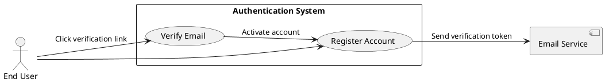
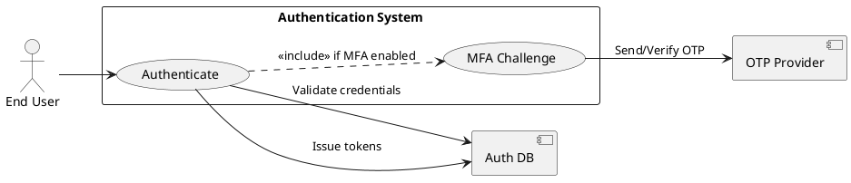
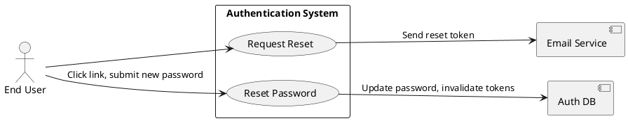
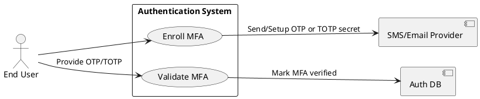
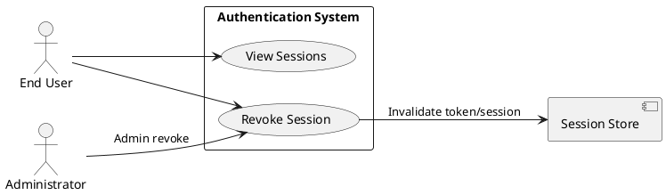
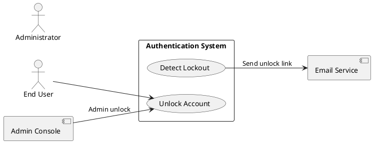
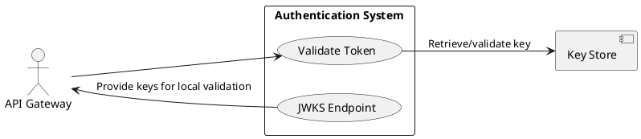

# Requirements Specification

## Feature Goal
Provide a central, secure Authentication System that replaces ad-hoc auth across applications with a unified identity service supporting user registration, secure login, password management, multi-factor authentication (MFA), token-based session management, account protection, and integration endpoints for web, mobile, API gateway, and external IdPs. Current state: multiple apps implement inconsistent auth rules and storage. Desired state: single, auditable, secure authentication service with deterministic, testable behaviors and clear integration contracts.

## Business Justification
- Business value and user impact
  - Reduces security risk by centralizing authentication, improving compliance (OWASP alignment) and lowering maintenance cost for integrated applications.
  - Improves user experience through consistent login/forgot-password flows and optional MFA.
  - Enables centralized auditing and incident response; simplifies onboarding of new applications.
- Integration with existing features
  - Serves web, mobile, API Gateway, and internal services via standardized token validation (JWT + refresh / optional opaque tokens).
  - Enables future SSO/OIDC support and central policy enforcement.
- Problems this solves and for whom
  - End users: consistent and secure access.
  - Security team: centralized logging, rate-limiting and audit trails.
  - Developers: standardized integration and tokens, fewer inconsistent implementations.

## Feature Scope
User-visible behavior:
- Sign up with email verification
- Login with email + password
- Password reset via email link
- Optional MFA via Email OTP, SMS OTP, or authenticator app
- Token-based session handling (access + refresh; revocation)
- Account lockout + administrative unlock workflows
Technical requirements:
- Secure password hashing (Argon2id preferred; bcrypt fallback configurable)
- HTTPS-only endpoints, OWASP controls, rate limiting, and monitoring
- Configurable retention and TTL parameters (defaults provided)
- Integration endpoints for API Gateway token validation and external IdP (OAuth/OIDC) connectors
- Audit events emitted for critical actions (login success/failure, password reset, MFA enrollment)
- Scalable deployment supporting horizontal scaling and load balancing

### Success Criteria
- [ ] Login success rate > 95% across measured user population
- [ ] Login response time < 2s for 95% of auth requests under normal load
- [ ] System handles 10,000+ concurrent sessions without auth failures attributable to the auth service
- [ ] No critical OWASP findings in security audit
- [ ] MFA adoption measured; > 20% of privileged users enabled within 6 months (where applicable)

## AI Fit Summary (GenAI Suitability Triage)
- Scanned features and tagged each FR as one of: [AI-CANDIDATE], [DETERMINISTIC], [HYBRID].
- Deterministic: credential validation, token issuance, password hashing, rate-limiting, OTP delivery.
- Hybrid: MFA enrollment suggestions and risk-based step-up decisions when AI assists but deterministic policy enforces action.
- AI-Candidate: adaptive / risk-based authentication and anomaly detection (fraud/risk scoring, anomaly detection).

## Functional Requirements

Before expanding, list of requirements to generate:

| FR-ID | Summary |
|-------|---------|
| FR-001 | User Registration with email verification |
| FR-002 | User Login with credential validation and token issuance |
| FR-003 | Password Reset (forgot password flow) |
| FR-004 | Password Policy enforcement |
| FR-005 | Multi-Factor Authentication (MFA) support (Email/SMS/Authenticator) |
| FR-006 | Session & Token Management (access + refresh tokens, refresh, revoke, logout) |
| FR-007 | Account Lockout and Unlock workflows |
| FR-008 | API Gateway / Token Validation endpoint |
| FR-009 | Secure Password Storage (Argon2id) and key management |
| FR-010 | Monitoring, Logging & Audit for auth events |
| FR-011 | Scalability & High Availability requirements |
| FR-012 | Rate Limiting & Brute-Force Protection (CAPTCHA integration option) |
| FR-013 | Data Retention & Privacy Controls (GDPR/CCPA awareness) |
| FR-014 | Adaptive / Risk-based Authentication and anomaly detection (AI-CANDIDATE) |

Expand each FR below. Each FR is a MUST and includes acceptance criteria, classification tag, and operational details.

- FR-001: [DETERMINISTIC] System MUST allow new users to register an account via email verification.
  - Description: Public endpoint POST /register accepts email, password, firstName, lastName (optional metadata). The system validates input, hashes password, creates a provisional user record (status=UNVERIFIED), and sends a single-use verification email token containing a link to an account-confirmation endpoint (GET /verify?token=...). Verification activates the account (status=ACTIVE).
  - Operational details:
    - Endpoint: POST /register
    - Required fields: email (RFC5322), password, firstName (optional), lastName (optional), client_id (optional)
    - Response: 202 Accepted on successful request (email queued)
    - Verification flow: GET /verify?token={token} or POST /verify with token; token stored as hashed value, single-use.
    - Config: verification_token_ttl (default 24h), unverified_account_ttl (default 7d), resend_limit_per_24h (default 3)
    - Security: rate-limit per IP/account; recaptcha option after threshold; no user enumeration leaks in responses.
    - Logging: emit audit event user.registration.requested and user.verification.sent (no PII in logs).
  - Acceptance Criteria:
    1. Given valid inputs, POST /register returns 202 Accepted and a verification email is queued within 5 seconds.
    2. The verification token is single-use and expires after verification_token_ttl (default 24 hours) and stored hashed.
    3. Attempting to register with an existing verified email returns 409 Conflict with generic "Email already registered" message.
    4. Unverified accounts older than unverified_account_ttl are marked for purge or re-claim per admin policy.
    5. Re-send verification limited to resend_limit_per_24h per account/IP; exceeding attempts returns 429 Too Many Requests.
  - Trigger: User submits registration form.
  - Who benefits: End users, Product/Support teams.
  - Success outcome: Account created and verified; user can authenticate.
  - Failure scenarios: Email delivery failure (retry + alert), duplicate email, malformed input; system returns appropriate 4xx and logs event.

- FR-002: [DETERMINISTIC] System MUST authenticate users via email + password and issue access and refresh tokens.
  - Description: POST /login validates credentials against stored password hash and account state. On success (and after completed MFA if enabled) returns access_token (JWT by default) and refresh_token (opaque or stored token). Emit audit events on success/failure.
  - Operational details:
    - Endpoint: POST /login
    - Inputs: email, password, client_id (optional), device_info (optional)
    - Success response: 200 OK JSON {access_token, token_type: "Bearer", expires_in, refresh_token, scope}
    - Token defaults: access_token TTL 15 minutes; refresh_token TTL 30 days (configurable)
    - JWT claims: sub, iss, aud, exp, iat, jti, tenant_id (if multi-tenant), roles/privileges minimal
    - If MFA enabled: initial success returns 200 with mfa_required:true and a temporary session token for subsequent MFA verification (no long-lived tokens issued).
    - Security: generic error messages for failures (no credential leak), new session_id per login to prevent fixation.
  - Acceptance Criteria:
    1. Successful auth returns HTTP 200 and JSON with valid access_token (JWT, exp claim) and refresh_token (opaque or stored), access TTL default 15 minutes.
    2. Failed auth increments failed-login counter and returns 401 Unauthorized with a generic "Invalid credentials" message.
    3. If MFA is enabled on the account, POST /login returns 200 with mfa_required flag; no tokens until MFA verification completes.
    4. Response times for successful logins < 2s for 95% of requests under normal load.
    5. Tokens include standard claims (sub, exp, iat, jti) and issuer/tenant info and are cryptographically signed; signature validated on issuance.
  - Trigger: POST /login with email+password.
  - Who benefits: End users, client applications, security teams.
  - Success outcome: Tokens issued and valid; user receives access to protected resources.
  - Failure scenarios: Invalid credentials, locked/disabled account, expired credentials, external provider failure (when federated).

- FR-003: [DETERMINISTIC] System MUST provide a secure "Forgot Password" flow to reset user passwords.
  - Description: POST /forgot-password accepts email, generates single-use time-limited reset token, queues email with reset link. POST /reset-password consumes token, validates new password against policy, updates stored hash, invalidates sessions/refresh tokens per policy.
  - Operational details:
    - Endpoints: POST /forgot-password, GET /reset?token=, POST /reset-password
    - Token TTL: reset_token_ttl default 1 hour, single-use and stored hashed.
    - On successful reset: re-hash password, rotate salts if necessary, invalidate refresh tokens (configurable: all sessions or only current).
    - Password history enforced per FR-004.
    - Anti-abuse: rate-limit reset requests, use CAPTCHA after threshold.
    - Notifications: send email notification on reset success to user (if configured).
  - Acceptance Criteria:
    1. POST /forgot-password returns 202 Accepted and reset email queued within 5 seconds if account exists; response for non-existing accounts is indistinguishable (avoid enumeration).
    2. Reset token expires per reset_token_ttl (default 1 hour) and is single-use.
    3. Successful reset invalidates active refresh tokens per configured policy (default: invalidate all sessions).
    4. Password history prevents reuse of last N passwords (configurable; default N=5).
    5. Excessive reset attempts are rate-limited and may trigger CAPTCHA or administrative alerts.
  - Trigger: User selects "Forgot Password" and submits email.
  - Who benefits: End users, support.
  - Success outcome: User resets password and regains access.
  - Failure scenarios: Email not delivered, token expired, weak new password (policy violation), compromise during reset flow (detect with risk signals).

- FR-004: [DETERMINISTIC] System MUST enforce a configurable password policy.
  - Description: Password policy enforced at registration, reset, and password-change endpoints. Admin API available to update policy with audit trail. Password history, banned passwords, and complexity rules supported.
  - Operational details:
    - Default policy: min_length=8, require_uppercase, require_lowercase, require_digit, require_special, disallow_common_passwords.
    - Admin endpoint: PATCH /admin/password-policy with role-based access; record changes in audit log.
    - Password history: store last N hash digests and compare on reset/change.
    - Client-side guidance: return descriptive 400 errors describing missing requirements without revealing validation internals or leaking secrets.
  - Acceptance Criteria:
    1. Passwords must meet default policy: min 8 chars, at least one uppercase, one lowercase, one number, one special char — configurable by admin.
    2. Password rejected with 400 and descriptive, non-sensitive error when policy not met.
    3. Admin API can update policy; updates are recorded with actor, timestamp, and diff in audit logs.
    4. System prevents reuse of last N passwords (default N=5); attempts to reuse are rejected with 400.
  - Trigger: Registration, password-change, or reset events.
  - Who benefits: Security team, end users.
  - Success outcome: Only policy-compliant passwords accepted.
  - Failure scenarios: Policy misconfiguration (guardrails & validation on change), user confusion (provide clear UX messaging).

- FR-005: [HYBRID] System MUST support Multi-Factor Authentication (MFA) with Email OTP, SMS OTP, and Authenticator App (TOTP); system SHOULD support enrollment, verification, and recovery flows.
  - Description: MFA enrollment APIs allow opt-in and enforcement per role. During login, after password validation, an MFA challenge is issued if required. OTP generation/delivery is deterministic; risk-based step-up decisions (e.g., require MFA on high-risk logins) can be hybrid with AI recommendations.
  - Operational details:
    - Endpoints: POST /mfa/enroll, POST /mfa/verify, POST /mfa/challenge, POST /mfa/disable, GET /mfa/backup-codes
    - Methods supported: TOTP (RFC 6238), SMS OTP, Email OTP.
    - Backup codes: generate 10 single-use backup codes; displayed once during enrollment and stored hashed.
    - Recovery: self-service via verified email or admin recovery with audit trail.
    - Delivery reliability: retries per policy, exponential backoff, and fallback to alternate channel if primary fails.
    - Admin controls: require MFA for specific roles/groups; revoke methods via admin API.
  - Acceptance Criteria:
    1. User can enroll in MFA via POST /mfa/enroll and select method; enrollment requires verification of the factor (OTP or TOTP code).
    2. During login, if MFA enabled, the system returns mfa_required and issues OTP or expects TOTP; successful MFA verification yields tokens.
    3. Backup codes are generated once during enrollment and are single-use; storage of backup codes is hashed.
    4. SMS/Email OTP delivery attempts retried as per policy; failures logged and surfaced to admin/ops if exceeding thresholds.
    5. Administrative revocation/unenroll allowed via admin API with audit trail and notifications.
  - Trigger: User enables MFA or logs in to an MFA-enabled account.
  - Who benefits: End users, security team.
  - Success outcome: MFA-protected accounts require second factor before tokens are issued.
  - Failure scenarios: SMS provider outage (fallback to Email/TOTP), TOTP clock drift (allow configurable acceptance window), lost MFA device (use backup codes or admin recovery).

- FR-006: [DETERMINISTIC] System MUST manage sessions and tokens: issue, refresh, revoke, and expire tokens; support logout and session listing.
  - Description: Access tokens are short-lived; refresh tokens rotate on use. Token revocation supported via revocation list or centralized token store. Expose endpoints for refresh, logout, list sessions, and per-session revoke.
  - Operational details:
    - Endpoints: POST /token/refresh, POST /logout, GET /sessions, DELETE /sessions/{id}
    - Refresh rotation: when a refresh token is used, issue new refresh token and revoke previous; detect reuse to identify theft.
    - Revocation propagation SLA: revocation effective across distributed instances within <5s (configurable).
    - Session metadata: device_info, ip_address, last_activity, created_at, geo.
    - Admin APIs: revoke sessions by user, revoke all sessions, revoke by device.
    - Support optional short-lived access tokens with introspection for immediate revocation of opaque tokens.
  - Acceptance Criteria:
    1. Refresh token rotation: when a refresh token is used, server issues a new refresh token and revokes the previous one; reuse of old refresh token is detected and flagged.
    2. POST /logout invalidates the current refresh token and optionally all refresh tokens when global logout requested.
    3. GET /sessions returns active sessions with metadata; users can revoke sessions individually via DELETE /sessions/{id}.
    4. Token revocation is effective within the defined SLA (e.g., < 5 seconds) across distributed instances.
    5. Token issuance and revocation events are recorded as audit events and available to monitoring pipelines.
  - Trigger: Token issuance/refresh, user logout, admin action.
  - Who benefits: End users, security/ops.
  - Success outcome: Tokens valid only per policy and can be revoked quickly on compromise.
  - Failure scenarios: Revocation propagation delay, token store outage (mitigate with high-availability token store and fallback heuristics).

- FR-007: [DETERMINISTIC] System MUST implement account lockout and unlock workflows.
  - Description: After configured consecutive failed login attempts within a time window, lock account temporarily. Unlock via verified email link or admin API; provide admin status endpoint and rate-limit to avoid DoS.
  - Operational details:
    - Config: failed_attempts_threshold default 5, failed_attempts_window default 15 minutes, lockout_duration default 30 minutes, decay_period for counter reset.
    - Endpoints: POST /admin/unlock-user, GET /account/status for user-facing lock status, POST /self-service/unlock (via email link).
    - User messaging: generic responses to avoid enumeration; provide steps to unlock.
    - Mitigations: progressive delays and CAPTCHA before lock to reduce shared-IP DOS risk.
  - Acceptance Criteria:
    1. After N failed attempts within window W, account status becomes LOCKED; subsequent login attempts return 423 Locked with generic messaging.
    2. Unlock methods: automatic timeout (lockout_duration), self-service verified email link, or admin API immediate unlock with audit.
    3. Lockout counters reset after successful login or after configured decay period.
    4. Admins receive aggregated alerts on repeated lockouts exceeding threshold.
  - Trigger: Failed login attempts exceed threshold.
  - Who benefits: Security team, users.
  - Success outcome: Brute-force attempts mitigated while legitimate users regain access via verified paths.
  - Failure scenarios: DOS via lockout for shared IPs (mitigate with CAPTCHA and progressive backoff).

- FR-008: [DETERMINISTIC] System MUST expose a Token Validation endpoint for API Gateway and services.
  - Description: Provide a high-performance JWKS endpoint for JWT validation and an introspection endpoint for opaque tokens. Support caching and rotation of keys.
  - Operational details:
    - Endpoints: GET /.well-known/jwks.json, POST /introspect (RFC 7662 compatible)
    - Performance: validation latency < 50ms under expected load (use caching/CDN for JWKS and in-memory caches for introspection).
    - Key rotation: support scheduled key rotation, publish new keys to JWKS, keep old keys until tokens signed by them expire.
    - Rate limiting: protect introspection endpoint with per-client quotas.
  - Acceptance Criteria:
    1. JWKS endpoint available and updated on key rotation; validation succeeds for JWTs signed by current keys.
    2. Introspection endpoint supports validation of opaque refresh tokens and returns token status + metadata (active, scope, exp, sub).
    3. Validation latency < 50ms under expected production load with proper caching.
    4. Rate limit validation endpoints to prevent abuse and DDoS.
  - Trigger: API Gateway or service requests token validation.
  - Who benefits: Client apps, API Gateway, downstream services.
  - Success outcome: Services validate tokens quickly and reliably.
  - Failure scenarios: Key rotation misconfiguration, cache staleness, unexpected latency spikes (mitigate with CDNs and cache TTL).

- FR-009: [DETERMINISTIC] System MUST store passwords using Argon2id (recommended) or bcrypt (configurable), with secure key management and parameterization.
  - Description: Passwords hashed with Argon2id using recommended parameters (memory, iterations, parallelism) and per-user salt. Admins can tune parameters; system re-hashes passwords on next successful login when parameters change.
  - Operational details:
    - Storage: per-user salt, store algorithm metadata with hash (algorithm, params, salt).
    - Secrets: hashing secrets and config stored in secrets manager (e.g., AWS Secrets Manager).
    - Migration: support transparent migration strategy—on login, detect older algorithm and re-hash with new params.
    - No plaintext passwords in logs or backups.
  - Acceptance Criteria:
    1. New passwords stored using Argon2id with current recommended parameters; parameter changes cause rehash on next successful auth.
    2. No plaintext passwords logged or stored; secrets stored in a secrets manager with access control and rotation policy.
    3. Password hash migration strategy documented and tested.
  - Trigger: Password set/reset, authentication requiring hash check.
  - Who benefits: Security team, compliance.
  - Success outcome: Password storage resistant to brute-force and rainbow-table attacks.
  - Failure scenarios: Weak hashing parameters, secrets leakage (mitigate via secret rotation and least privilege).

- FR-010: [DETERMINISTIC] System MUST provide monitoring, structured logging, and audit events for authentication-related actions and integrate with SIEM.
  - Description: Emit structured logs for login success/failure, registration, password reset, MFA events, token issuance/revocation, and admin actions. Provide metrics and alerts for abnormal behavior.
  - Operational details:
    - Format: JSON structured logs with schema {timestamp, event_type, user_id (or null), ip, user_agent, outcome, tenant_id, correlation_id, reason_code}
    - Metrics: login_success_rate, login_latency_p95, failed_logins_by_ip, active_sessions_count, refresh_token_reuse_rate.
    - Alerts: configurable thresholds for spikes in failed logins, token reuse, or mass lockouts.
    - Retention & access: compliant with privacy rules; role-based access to logs.
    - Integration: export to SIEM (Splunk/Elastic/Cloud-native) and observability stack (Prometheus/Grafana).
  - Acceptance Criteria:
    1. Auth events emitted in JSON format to the logging pipeline with consistent schema.
    2. Key metrics available and exposed to monitoring dashboards and alerting systems.
    3. Alerts configured for abnormal patterns (spike in failed logins).
    4. Retention and access controls for logs meet regulatory and privacy requirements.
  - Trigger: All significant auth lifecycle events.
  - Who benefits: Securityops, SRE, Compliance.
  - Success outcome: Rapid detection and investigation of incidents.
  - Failure scenarios: Logging outages (mitigate with buffering and fallback), log overload (mitigate with sampling).

- FR-011: [DETERMINISTIC] System MUST meet scalability and high availability patterns: horizontal scaling, stateless API tier, stateful token/session store highly available.
  - Description: Design must support autoscaling of API nodes, resilient session/token store (distributed cache + durable DB), and no single point of failure.
  - Operational details:
    - API tier: stateless, autoscale via container orchestration (K8s) with health checks and rolling updates.
    - Token/Session store: distributed cache (Redis cluster) + durable backing (e.g., PostgreSQL) for long-lived sessions; multi-AZ replication.
    - Performance targets: support 10,000+ concurrent sessions with sub-2s auth under normal load.
    - DR: backup/restore and documented RTO/RPO targets.
  - Acceptance Criteria:
    1. API tier is stateless; session/token store replicated and supports failover without downtime.
    2. System supports target concurrent sessions (10,000+) under defined performance budgets.
    3. Health checks, rolling deployments, and disaster recovery documented and tested.
    4. Failover scenarios maintain token validity or fail safe per policy.
  - Trigger: Production traffic and scaling events.
  - Who benefits: SRE, end-users (availability).
  - Success outcome: Service meets availability and scale SLAs.
  - Failure scenarios: State store partitioning (mitigate with replication and eventual consistency patterns).

- FR-012: [DETERMINISTIC] System MUST implement rate limiting and brute-force protection, with optional CAPTCHA integration.
  - Description: Per-IP and per-account rate limits for auth endpoints; progressive delays, CAPTCHA, and blocklisting for abusive clients.
  - Operational details:
    - Default limits: 10 requests/min per IP for auth endpoints (configurable), and 5 attempts per account per 15 minutes before progressive action.
    - Progressive defenses: introduce increasing delays, present CAPTCHA, then lockout.
    - Admin tools: view/manage blocklisted IPs, whitelists for trusted clients.
    - Metrics: rate-limiting events emitted to monitoring.
  - Acceptance Criteria:
    1. Default rate limits in place and configurable by admin.
    2. After repeated failed attempts, CAPTCHA or step-up authentication presented before immediate lockout.
    3. Admin can view and manage blocklisted IPs and suspicious accounts.
    4. Rate-limiting events emitted and available in dashboards.
  - Trigger: High-frequency requests or repeated failed attempts.
  - Who benefits: Security, platform stability.
  - Success outcome: Reduced abuse and preserved service for legitimate users.
  - Failure scenarios: Legitimate user blocked due to shared IP (mitigate with CAPTCHA and progressive backoff).

- FR-013: [DETERMINISTIC] System MUST support data retention, privacy, and regulatory controls (GDPR/CCPA readiness).
  - Description: Provide mechanisms for data export, deletion (right to be forgotten), configurable retention windows for logs and user data, and consent tracking for communications.
  - Operational details:
    - Endpoints: GET /export-user-data, POST /delete-user (subject to policy and verification)
    - Soft-delete semantics with retention window and policy-driven purging; deletion propagated to backups per SLA.
    - Consent model for communications: record opt-in/opt-out timestamps and channel preferences.
    - Encryption: data-at-rest and in-transit; role-based access control to PII.
  - Acceptance Criteria:
    1. Admins can export or delete user data per verified request; deletion requests propagate to backups per policy.
    2. Configurable retention for logs and audit events with soft-delete semantics.
    3. Consent for email/SMS recorded and respected in communication flows.
    4. Data access controls and encryption at rest/in transit enforced.
  - Trigger: Legal/operational requests, retention schedules.
  - Who benefits: Compliance, legal, end users.
  - Success outcome: Meets regulatory obligations and provides user data controls.
  - Failure scenarios: Incomplete deletion from backups (document and mitigate via retention policy and backup lifecycle controls).

- FR-014: [AI-CANDIDATE] System MUST support adaptive / risk-based authentication to detect anomalies and recommend step-up actions.
  - Description: Optional service that analyzes login signals (ip, geo, device fingerprint, login velocity, historical patterns) to compute a risk score and recommend actions (allow, challenge MFA, deny). Models may be ML-based but system must allow deterministic fallback rules and operator overrides.
  - Operational details:
    - Inputs: ip, geo, device_id, user_history, time_of_day, velocity metrics.
    - Outputs: risk_score (0-100), explainable reasons (flags), recommended_action {ALLOW, CHALLENGE_MFA, DENY}
    - Integration: risk decision can be synchronous (must respond <100ms target) or asynchronous with cached recent decisions.
    - Auditing: all model decisions recorded with features and outcome for review.
    - Governance: human-in-the-loop for tuning and override; conservative defaults at rollout.
  - Acceptance Criteria:
    1. Risk score computed for each authentication attempt with top contributing factors included in logs for explainability.
    2. System supports configurable actions for score ranges: allow, challenge (MFA), deny.
    3. Model decisions are auditable; deterministic rule fallback exists when model unavailable.
    4. False positive/negative rates tracked and can be tuned; conservative defaults used at rollout.
  - Trigger: Each authentication attempt and configured high-risk events.
  - Who benefits: Security operations, fraud prevention.
  - Success outcome: Reduced account takeover incidents while minimizing user friction.
  - Failure scenarios: Model drift, biased decisions, unexplainable denials; monitor and provide rollback capability.

## Use Case Analysis

### Actors & System Boundary
- Primary Actor: End User — authenticates, registers, resets password, enrolls in MFA.
- Secondary Actor: Administrator — manages accounts, unlocks accounts, manages policies.
- System Actor: Email Service (SMTP / SES), SMS Provider (e.g., Twilio), Auth DB, Token Store (Redis or DB), API Gateway, External IdP (OAuth/OIDC).
- System Boundary: "Authentication System" contains endpoints for registration, login, password reset, MFA, token management, admin APIs, and monitoring integration.

### Use Case Specifications

#### UC-001: User Registration & Email Verification
- Actor(s): End User
- Goal: Create a verified account using email verification.
- Preconditions: User has a valid, unique email address.
- Success Scenario:
  1. User submits registration form (POST /register).
  2. System validates input and creates provisional user record with status=UNVERIFIED.
  3. System generates verification token (single-use, hashed) and queues verification email via Email Service.
  4. User clicks verification link; system validates token and activates account (status=ACTIVE).
  5. System emits audit event "user.verified".
- Extensions/Alternatives:
  - 2a. If email already exists and is verified → return 409 Conflict.
  - 3a. If email delivery fails → retry according to retry policy; allow re-send subject to rate limit.
  - 4a. If token expired → prompt re-send verification; limit re-sends.
- Postconditions: User account state = ACTIVE/Verified.
- Use Case Diagram

#### UC-002: User Login (Password + optional MFA)
- Actor(s): End User
- Goal: Authenticate and obtain access to protected resources.
- Preconditions: User exists and is Active/Verified.
- Success Scenario:
  1. User POST /login with email+password.
  2. System validates credentials against hashed password.
  3. If MFA enabled → system issues challenge; user supplies second factor and system validates.
  4. System issues access_token and refresh_token.
  5. System emits "login.success" audit event.
- Extensions/Alternatives:
  - 2a. Invalid credentials → increment failed counter; return 401.
  - 3a. MFA timeout or failure → return mfa_failed and allow retry per policy.
  - 2b. Risk engine flags attempt → require step-up (MFA) or deny.
- Postconditions: Valid session(s) exist; tokens issued.
- Use Case Diagram

#### UC-003: Password Reset (Forgot Password)
- Actor(s): End User
- Goal: Reset forgotten password securely.
- Preconditions: User has registered email.
- Success Scenario:
  1. User requests password reset (POST /forgot-password).
  2. System queues reset email with single-use token.
  3. User follows link and sets new password (POST /reset-password).
  4. System validates token, updates password hash, invalidates refresh tokens per policy.
  5. System emits "password.reset" audit event.
- Extensions/Alternatives:
  - 2a. If reset requests exceed rate limit → present CAPTCHA.
  - 3a. Expired token → user prompted to request a new token.
- Postconditions: Password updated; sessions rotated/invalidated as policy.
- Use Case Diagram

#### UC-004: MFA Enrollment and Authentication
- Actor(s): End User
- Goal: Enroll in MFA and authenticate using second factor.
- Preconditions: User authenticated (may require re-authentication for sensitive ops).
- Success Scenario:
  1. User requests enrollment (POST /mfa/enroll).
  2. System provides TOTP secret (QR) or sends verification OTP for SMS/Email.
  3. User verifies and enrollment completes; backup codes presented once.
  4. On subsequent login, MFA challenge required and validated.
- Extensions/Alternatives:
  - 2a. If SMS provider unavailable → fallback to Email or TOTP.
  - 3a. Lost device → use backup codes or admin recovery flow.
- Postconditions: User has MFA method associated and flagged.
- Use Case Diagram

#### UC-005: Session Management and Logout
- Actor(s): End User, Administrator
- Goal: View and manage active sessions; logout current or all sessions.
- Preconditions: User authenticated.
- Success Scenario:
  1. User GET /sessions to view active sessions.
  2. User requests logout (POST /logout) or revoke specific session (DELETE /sessions/{id}).
  3. System revokes refresh token(s) and emits audit events.
- Extensions/Alternatives:
  - 2a. If token store unavailable → notify user and queue revocation for retry.
- Postconditions: Selected sessions revoked; tokens invalidated.
- Use Case Diagram

#### UC-006: Account Lockout & Unlock
- Actor(s): End User, Administrator
- Goal: Protect accounts from brute-force and allow recovery.
- Preconditions: User attempts authentication.
- Success Scenario:
  1. System detects N failed attempts and locks account.
  2. User requests unlock via verified email link OR admin performs unlock via admin API.
  3. Upon unlock, failed counters reset; audit event recorded.
- Extensions/Alternatives:
  - 1a. Progressive delays and CAPTCHA before lockout to reduce DOS risk.
- Postconditions: Account unlocked and user notified.
- Use Case Diagram

#### UC-007: Token Validation for API Gateway
- Actor(s): API Gateway (system)
- Goal: Validate incoming tokens for downstream services.
- Preconditions: Token presented by client to API Gateway.
- Success Scenario:
  1. Gateway queries JWKS or introspection endpoint.
  2. Authentication System returns token status and metadata.
  3. Gateway enforces policy based on response.
- Extensions/Alternatives:
  - 1a. Cache JWKS and token metadata to reduce latency.
- Postconditions: Request accepted or rejected by gateway.
- Use Case Diagram

## Risks & Mitigations
- Risk: Brute-force or credential stuffing leading to account takeover.
  - Mitigation: Rate limiting, account lockout, CAPTCHA, IP reputation checks, monitoring.
- Risk: Token revocation propagation delays cause security exposure.
  - Mitigation: Low-latency revocation store, short-lived access tokens, refresh rotation, monitor propagation SLA.
- Risk: MFA delivery failures (SMS/Email) causing user lockout.
  - Mitigation: Multiple delivery channels, TOTP fallback, clear UX, support/backup codes.
- Risk: Sensitive data leakage in logs or backups.
  - Mitigation: Structured logging without secrets, encryption at rest, RBAC to logs, retention policies.
- Risk: AI model drift or false positives in adaptive auth (if enabled).
  - Mitigation: Conservative rollout, human review, deterministic fallback, metrics for false positives/negatives.

## Constraints & Assumptions
- Constraint: Must comply with OWASP Top 10 recommendations; HTTPS required for all external endpoints.
- Constraint: Use secrets manager (e.g., AWS Secrets Manager) for keys and hashing parameters; no hardcoded secrets.
- Constraint: Service will be consumed by web/mobile/API Gateway; assume clients can handle JWTs or opaque tokens.
- Assumption: Preferred password hash = Argon2id; bcrypt supported where Argon2 unavailable.
- Assumption: SMS/Email providers available and SLA-backed; fallback to alternate channels if one provider fails.

---

Rules Used by the Workflow
- requirements-template.md (spec template)
- rules/ai-assistant-usage-policy.md
- rules/uml-text-code-standards.md
- rules/markdown-styleguide.md
- rules/security-standards-owasp.md
- rules/dry-principle-guidelines.md
- rules/performance-best-practices.md
- rules/code-anti-patterns.md
- rules/iterative-development-guide.md

Evaluation Scores

| Criterion | Score (1-5) |
|----------:|------------:|
| Completeness of FRs | 5 |
| Testability / Acceptance Criteria | 5 |
| Security & Compliance Coverage | 5 |
| Clarity & Unambiguity | 5 |
| Use Case & Diagram Coverage | 5 |
| Scalability & Performance Considerations | 5 |
| AI Triage Appropriateness | 5 |

Average Score: 4.86

Evaluation Summary
Spec captures authentication requirements end-to-end: registration, login, password management, MFA, session/token lifecycle, monitoring, and integrations. Each FR is measurable and testable with clear operational details and PlantUML use-case diagrams. Remaining clarifications: token format choices (opaque vs JWT tradeoffs), MFA enforcement policy (opt-in vs required by role), and specific provider/vendor choices for SMS/Email.

