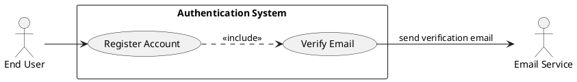
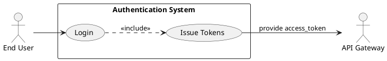
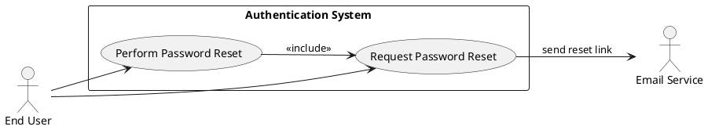
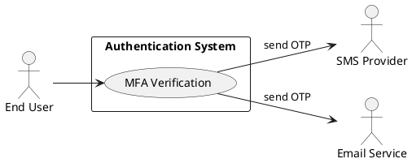
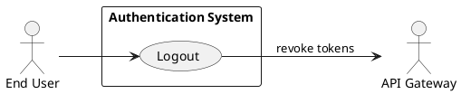
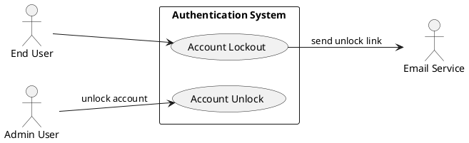
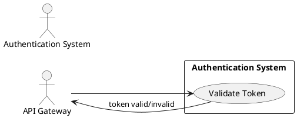

# Requirements Specification

## Feature Goal
Provide a central, secure Authentication System that replaces ad-hoc auth across applications with a unified identity service that supports user registration, secure login, password management, multi-factor authentication (MFA), token-based session management, and account protection. Current state: multiple apps implement inconsistent auth rules and storage. Desired state: single, auditable, secure authentication service with deterministic, testable behaviors and clear integration contracts.

## Business Justification
- Business value and user impact
  - Reduces security risk by centralizing auth, improving compliance (OWASP alignment) and lowering maintenance cost for integrated applications.
  - Improves user experience through consistent login/forgot-password flows and optional MFA.
- Integration with existing features
  - Serves web, mobile, API Gateway, and internal services via standardized token validation (JWT + refresh).
- Problems this solves and for whom
  - End users: consistent and secure access. Security team: centralized logging, rate-limiting and audit trails. Developers: standardized integration and tokens.

## Feature Scope
User-visible behavior:
- Sign up with email verification
- Login with email + password
- Password reset via email link
- Optional MFA via Email OTP, SMS OTP, or authenticator app
- Token-based session handling (access + refresh)
- Account lockout + administrative unlock workflows
Technical requirements:
- Secure password hashing (Argon2 or bcrypt - default Argon2id)
- HTTPS-only endpoints, OWASP controls, rate limiting, and monitoring
- Configurable retention and TTL parameters (defaults provided)
- Integration endpoints for API Gateway token validation and external IdP (OAuth/OIDC) connectors

### Success Criteria
- [ ] Login success rate > 95% across measured user population
- [ ] Login response time < 2s for 95% of auth requests under normal load
- [ ] System handles 10,000+ concurrent sessions without auth failures attributable to the auth service
- [ ] No critical OWASP findings in security audit
- [ ] MFA adoption measured; > 20% of privileged users enabled within 6 months (where applicable)

## Functional Requirements

Before expanding, list of requirements to generate:

| FR-ID | Summary |
|-------|---------|
| FR-001 | User Registration with email verification |
| FR-002 | User Login with credential validation |
| FR-003 | Password Reset (forgot password flow) |
| FR-004 | Password Policy enforcement |
| FR-005 | Multi-Factor Authentication (MFA) support |
| FR-006 | Session Management (access + refresh tokens, logout, inactivity) |
| FR-007 | Account Lockout and Unlock workflows |
| FR-008 | API Gateway Token Validation endpoint |
| FR-009 | Secure Password Storage (Argon2id) |
| FR-010 | Monitoring, Logging & Audit for auth events |
| FR-011 | Scalability & High Availability requirements |
| FR-012 | Rate Limiting & Brute-Force Protection |
| FR-013 | Data Retention & Privacy Controls (configurable defaults) |
| FR-014 | Adaptive / Risk-based Authentication (AI candidate, optional) |

Expand each functional requirement below. Each FR is a MUST and includes acceptance criteria and classification.

- FR-001: [DETERMINISTIC] System MUST allow new users to register an account via email verification.
  - Description: Registration endpoint accepts Email, Password, FirstName, LastName. Sends verification email with single-use token.
  - Acceptance Criteria:
    1. Given valid inputs, POST /register returns 202 Accepted and a verification email is queued within 5 seconds.
    2. The verification token is single-use and expires in 24 hours (configurable).
    3. Attempting to register with an existing verified email returns 409 Conflict with "Email already registered".
    4. Unverified accounts may be resumed by re-sending verification; re-send limit 3 per 24 hours.
  - Trigger: User submits registration form.
  - Who benefits: End users, Product team.
  - Data fields: email, password_hash, user_id, created_date, verification_status.
  - Notes: Email format validated to RFC 5322. Rate-limited per IP/account.

- FR-002: [DETERMINISTIC] System MUST authenticate users via email + password and return access and refresh tokens.
  - Description: Credential validation with hashed password comparison and optional MFA challenge.
  - Acceptance Criteria:
    1. Successful auth returns HTTP 200 and JSON with access_token (JWT, default TTL 15 minutes) and refresh_token (opaque, TTL 30 days).
    2. Failed auth increments failed-login counters; response for invalid credentials is 401 Unauthorized with generic error "Invalid credentials".
    3. If MFA enabled for account, successful password validation returns 200 with mfa_required flag; no tokens until MFA verifies.
    4. Response times for successful logins < 2s for 95% of requests under normal load.
  - Trigger: POST /login with email+password.
  - Who benefits: End users, integrated apps.
  - Related FRs: FR-005 (MFA), FR-012 (rate limiting), FR-007 (lockout).

- FR-003: [DETERMINISTIC] System MUST provide secure password reset (forgot password) flow.
  - Description: Request resets send single-use link/token to email; token expiry 1 hour (configurable).
  - Acceptance Criteria:
    1. Requesting password reset for a registered email results in 202 Accepted and an email with reset link sent within 5 seconds.
    2. Reset token is single-use and invalid after use or after 1 hour.
    3. Changing password enforces password policy (FR-004).
    4. If the token is invalid/expired, endpoint returns 400 with "Invalid or expired reset token".
  - Trigger: User clicks "Forgot Password" and submits email.
  - Who benefits: End users, support teams.
  - Security: Do not reveal whether email exists in UI; respond with 202 in all cases.

- FR-004: [DETERMINISTIC] System MUST enforce a password policy on creation and update.
  - Description: Policy includes minimum length and composition; configurable but defaults enforced.
  - Default Policy (configurable):
    - Minimum 10 characters
    - At least one uppercase, one lowercase, one digit, one special character
    - No reuse of last 5 passwords
  - Acceptance Criteria:
    1. Passwords not meeting policy must be rejected with 400 and explicit list of violated rules.
    2. System rejects any password appearing in denylist of known-breached passwords (integration with haveibeenpwned or local denylist).
    3. Password history enforced: new password cannot match last 5 hashed passwords.
  - Trigger: Registration, password reset, password change.
  - Who benefits: Security team, end users.

- FR-005: [DETERMINISTIC] System MUST support optional MFA using Email OTP, SMS OTP, or Time-based One-Time Password (TOTP) authenticator apps.
  - Description: MFA enrollment, verification, and recovery flows supported.
  - Defaults & TTLs:
    - OTP TTL: 5 minutes (configurable)
    - OTP length: 6 digits
    - TOTP standard RFC 6238 compatibility
  - Acceptance Criteria:
    1. User can enroll MFA via settings; enrollment flow provides provisioning QR (TOTP) or sends test OTP.
    2. MFA verification endpoint validates OTP/TOTP; on success, complete login and issue tokens.
    3. Recovery codes (10 single-use codes) can be generated and must be stored/displayed once on enrollment.
    4. Failed OTP attempts counted and subject to rate limiting (FR-012).
  - Trigger: During login when account has MFA enabled or during enrollment.
  - Who benefits: End users, security.

- FR-006: [DETERMINISTIC] System MUST implement session management using short-lived access tokens and longer-lived refresh tokens, with logout and inactivity handling.
  - Description:
    - Access token: JWT, TTL 15 minutes (configurable)
    - Refresh token: opaque, TTL 30 days (configurable), stored server-side for revocation
    - Inactivity automatic logout: 30 minutes (configurable) of inactivity invalidates session
  - Acceptance Criteria:
    1. Access tokens validated by API Gateway; expired tokens return 401.
    2. Refresh endpoint validates refresh token, rotates it (issue new refresh + access, invalidate old refresh) and enforces refresh rotation policy.
    3. Logout endpoint revokes both access and refresh tokens immediately and removes session record.
    4. Inactivity timeout tracked; session marked expired after inactivity TTL and requires re-authentication.
  - Trigger: Successful authentication, token refresh, logout requests.
  - Who benefits: All integrated services.

- FR-007: [DETERMINISTIC] System MUST lock accounts after repeated failed login attempts and provide unlock mechanisms.
  - Description:
    - Threshold: 5 failed attempts within 15 minutes locks account for 15 minutes (configurable).
    - Option to require email verification to unlock or admin unlock.
  - Acceptance Criteria:
    1. After 5 failed attempts within 15 minutes, account status = Locked and login returns 423 Locked with a neutral message.
    2. Locked accounts auto-unlock after 15 minutes; admin can unlock immediately via admin console.
    3. User may request unlock via email verification link; link TTL = 1 hour.
  - Trigger: Failed login attempts.
  - Who benefits: Security operations and end users.

- FR-008: [DETERMINISTIC] System MUST expose a Token Validation endpoint for API Gateways and internal services.
  - Description: Endpoint /introspect or public JWKS endpoint for JWT verification.
  - Acceptance Criteria:
    1. API Gateway can validate access tokens via introspection (opaque tokens) or verify JWT signature via JWKS within <200ms under normal load.
    2. Endpoint enforces mutual TLS or API key for introspection requests from trusted gateways.
    3. Revoked tokens return active=false or appropriate 401 responses.
  - Trigger: API call arrives at API Gateway requiring authentication.
  - Who benefits: Integrated applications and API Gateway.

- FR-009: [DETERMINISTIC] System MUST store passwords securely using Argon2id (preferred) or bcrypt with minimum parameters defined.
  - Description: Password hashing and key management.
  - Acceptance Criteria:
    1. All persisted passwords stored as salted Argon2id hashes; system configuration documents Argon2 parameters.
    2. No plaintext passwords are logged or stored.
    3. Migration strategy present for legacy bcrypt hashes.
  - Trigger: Registration, password update.
  - Who benefits: Security & compliance.

- FR-010: [DETERMINISTIC] System MUST provide monitoring, logging and auditable trails for authentication events.
  - Description: Capture login success/failure, password resets, MFA events, lock/unlock, token issuance/revocation.
  - Acceptance Criteria:
    1. Auth events logged with timestamp, user_id (or anonymized where required), event_type, source IP, user agent.
    2. Logs retained per FR-013 policies and accessible for security investigations within 1 hour.
    3. Alerts generated for suspicious patterns (e.g., 50 failed logins across accounts from same IP in 15 minutes).
  - Trigger: Auth-related events.
  - Who benefits: Security team, SRE.

- FR-011: [DETERMINISTIC] System MUST support horizontal scaling and high availability.
  - Description: Stateless API layer, centralized session store (Redis) for refresh token revocation and rate-limiting, multi-AZ deployment.
  - Acceptance Criteria:
    1. System supports horizontal scaling behind load balancer; adding/removing nodes doesn't require user sessions to be invalidated.
    2. Redis or equivalent for session/revocation supports replication and failover with RPO < 1 minute.
    3. System demonstrates 99.9% availability in production (SRE runbook and tests).
  - Trigger: Deployment and scaling events.
  - Who benefits: SRE, DevOps.

- FR-012: [DETERMINISTIC] System MUST enforce rate limiting and brute-force protections for auth endpoints.
  - Description: Multi-layer rate-limiting (per-IP, per-account) with exponential backoff and CAPTCHA/step-up after thresholds.
  - Default policy (configurable):
    - Per-IP: 200 requests/min for general endpoints
    - Authentication attempts: 10 attempts per 10 minutes per IP; 5 failed attempts per 15 minutes per account triggers account lock (FR-007)
    - After 3 failed login attempts show CAPTCHA or step-up challenge
  - Acceptance Criteria:
    1. Rate-limiting returns 429 Too Many Requests with Retry-After header when exceeded.
    2. Brute-force patterns detected and mitigated (temporary blocks, CAPTCHA) within 60 seconds of detection.
    3. Rate limiting rules are configurable and documented.
  - Trigger: High request volumes or repeated failed attempts.
  - Who benefits: Security, Ops.

- FR-013: [DETERMINISTIC] System MUST provide configurable data retention and privacy controls; default retention values provided.
  - Description: Support configurable retention policies and deletion flows to meet privacy regulations.
  - Default retention (configurable by tenant/legal):
    - Soft-delete grace period for user-deletion: 30 days (during which account can be restored)
    - Audit logs retention: 1 year
    - Backups retention: 90 days
  - Acceptance Criteria:
    1. Admins can set retention values and deletion policies; deletions follow soft-delete -> permanent delete after grace period.
    2. "Right to be forgotten" requests trigger soft-delete and eventual purging per retention settings.
    3. Data exports for compliance can be generated within 24 hours.
  - Trigger: Account deletion requests, retention schedule.
  - Who benefits: Legal, Compliance, End users.
  - Note: Legal/regulatory confirmation required for region-specific values.

- FR-014: [AI-CANDIDATE] System SHOULD provide adaptive/risk-based authentication capabilities as an optional/hybrid feature.
  - Description: Detect anomalous login context (geo, device, velocity) and require step-up authentication or challenge.
  - Acceptance Criteria:
    1. System can calculate a risk score per login attempt using configurable rules and (optional) ML model.
    2. For risk score > threshold, system enforces step-up (MFA) or blocks login; thresholds configurable.
    3. All adaptive decisions are logged with justification and human-reviewable data.
  - Trigger: Login attempts with suspicious characteristics.
  - Who benefits: Security team and high-risk user cohorts.
  - Implementation note: Hybrid pattern — deterministic rules first, ML assistance optional; requires model governance and human-in-the-loop for high-impact actions.

---

## Use Case Analysis

### Actors & System Boundary
- Primary Actor: End User — person attempting to register, authenticate, or manage their account.
- Secondary Actor: Admin User — support/admin staff who can unlock accounts and manage configurations.
- System Actor: Authentication System — the system under specification (inside system boundary).
- External Actors:
  - Email Service Provider — sends verification and reset emails.
  - SMS Provider — sends OTP SMS.
  - API Gateway / Client Applications — rely on tokens issued by the system.
  - External Identity Provider (IdP/OAuth) — for SSO connectors.

System boundary: "Authentication System" contains the registration, login, MFA, token issuance, revocation, audit, admin console, and integration endpoints.

### UC-001: Register Account
- Actor(s): End User
- Goal: Create a verified account and be able to authenticate.
- Preconditions:
  - End User has an email address and internet connectivity.
  - System email service is available.
- Success Scenario:
  1. User submits registration form with email, password, name.
  2. System validates email format and password policy.
  3. System creates a pending user record and issues a verification token.
  4. System sends verification email via Email Service.
  5. User clicks verification link; system marks account as Verified and returns success.
- Extensions/Alternatives:
  - 2a. Invalid email -> system returns 400 "Invalid email format".
  - 3a. Email already registered -> system returns 409 "Email already registered".
  - 4a. Email delivery fails -> system queues retry and shows neutral UI message; admin alert if repeated failures.
- Postconditions:
  - User account exists and is Verified; user can proceed to login.
  - Audit log entry created for registration and verification.

Use Case Diagram

### UC-002: Login (Credential Authentication)
- Actor(s): End User
- Goal: Authenticate and obtain an access session (tokens).
- Preconditions:
  - User has a verified account and correct credentials (or MFA flow available).
  - Auth system and token store available.
- Success Scenario:
  1. User posts email + password to /login.
  2. System validates credentials against hashed password.
  3. If credentials valid and MFA not enabled, system issues access and refresh tokens.
  4. If MFA enabled, system responds with mfa_required and triggers MFA flow (UC-004).
  5. System logs successful login and returns tokens.
- Extensions/Alternatives:
  - 2a. Invalid credentials -> increment failed counter, return 401.
  - 2b. Failed attempts exceed lockout threshold -> account locked (UC-006).
  - 3a. If rate-limited -> 429 Too Many Requests.
- Postconditions:
  - Active session created with tokens, and audit log entry for successful auth.

Use Case Diagram

### UC-003: Password Reset (Forgot Password)
- Actor(s): End User
- Goal: Reset forgotten password securely.
- Preconditions:
  - User has access to registered email.
  - Reset token service operational.
- Success Scenario:
  1. User requests password reset by submitting email to /forgot-password.
  2. System generates single-use reset token (TTL 1 hour) and sends email.
  3. User clicks link and provides new password.
  4. System validates password policy and updates password, invalidates reset token and previous refresh tokens.
  5. System logs password reset event.
- Extensions/Alternatives:
  - 2a. Rate limit enforcement triggers 429 for repeated requests.
  - 3a. Expired/invalid token -> user prompted to request a new reset.
- Postconditions:
  - Password updated and previous sessions revoked; audit trail recorded.

Use Case Diagram

### UC-004: MFA Verification
- Actor(s): End User
- Goal: Verify MFA factor during login or enrollment.
- Preconditions:
  - User is enrolled in MFA or in the process of enrolling.
  - OTP delivery channel available (Email/SMS) or TOTP configured on user's device.
- Success Scenario:
  1. System prompts for OTP/TOTP when required.
  2. User submits OTP.
  3. System validates OTP/TOTP within TTL (5 minutes for OTP).
  4. On success, system issues tokens and logs event.
- Extensions/Alternatives:
  - 2a. OTP expired -> returns 400 "OTP expired", allow re-send.
  - 2b. Repeated failed OTP attempts -> enforce rate-limiting / temporary block (FR-012).
  - 3a. Use recovery code if OTP unavailable.
- Postconditions:
  - Tokens issued or enrollment completed; MFA event logged.

Use Case Diagram

### UC-005: Logout / Session Termination
- Actor(s): End User
- Goal: Terminate active session(s) immediately.
- Preconditions:
  - User has an active session with valid tokens.
- Success Scenario:
  1. User calls /logout with current access token.
  2. System invalidates refresh token(s) and revokes session entry.
  3. System returns 200 OK and logs logout event.
- Extensions/Alternatives:
  - 1a. If token already expired, system returns 200 and logs attempted logout.
  - 2a. Admin or user may revoke all sessions via account settings.
- Postconditions:
  - Tokens revoked and subsequent API calls with revoked tokens return 401.

Use Case Diagram

### UC-006: Account Lockout and Unlock
- Actor(s): End User, Admin User
- Goal: Protect account from brute-force; allow safe unlock.
- Preconditions:
  - Failed login counters are tracked.
- Success Scenario:
  1. System locks account after threshold (5 failed attempts in 15 minutes).
  2. User requests unlock via "Unlock account" link sent to email.
  3. User clicks link; system verifies token and unlocks account.
  4. Admin may unlock via admin console immediately.
- Extensions/Alternatives:
  - 2a. If unlock token expired -> require admin unlock or request new unlock email.
- Postconditions:
  - Account status set to Active; unlock event logged.

Use Case Diagram

### UC-007: Token Validation by API Gateway
- Actor(s): API Gateway (system actor)
- Goal: Validate tokens for incoming API requests.
- Preconditions:
  - API Gateway has the system's JWKS or introspection credentials.
- Success Scenario:
  1. API Gateway receives request with access token.
  2. Gateway validates token signature via JWKS or calls introspection endpoint.
  3. On valid token, Gateway forwards request to backend with user claims.
  4. Invalid token -> Gateway returns 401 to client.
- Extensions/Alternatives:
  - 2a. If introspection endpoint unreachable -> Gateway fails open/closed per policy (default: fail closed).
- Postconditions:
  - Downstream services receive authenticated requests; validation events logged.

Use Case Diagram

## Color Scheme

### Purpose
The project uses a red and blue color scheme for brand identity, accents, and UI roles.

### Palette
- Primary Red: #FF0000 (rgb(255,0,0))
  - Red Light: #FF6666 (rgb(255,102,102))
  - Red Dark:  #990000 (rgb(153,0,0))
- Primary Blue: #0000FF (rgb(0,0,255))
  - Blue Light: #6666FF (rgb(102,102,255))
  - Blue Dark:  #000099 (rgb(0,0,153))

### Usage guidelines
- Roles:
  - Red = primary accent for CTAs, destructive actions, and alerts; use sparingly to draw attention.
  - Blue = primary brand color for navigation, links, highlights, and primary backgrounds.
- Recommended pairings:
  - Primary Blue (text/icons) on light backgrounds for navigation and links.
  - Red (accent) with neutral backgrounds for CTAs and alerts.
  - Use Light variants for subtle backgrounds/cards; Dark variants for text or high-emphasis controls.
- When to use variants:
  - Use Dark variants for any text-on-color scenarios to meet contrast.
  - Use Light variants for backgrounds, subtle dividers, or disabled states.

### Accessibility
- Follow WCAG contrast guidance: aim for at least 4.5:1 for normal text and 3:1 for large text.
- Test text color on its intended background; do not assume sufficiency based on hue alone.
- Prefer darker variants for text-on-color (e.g., use Red Dark or Blue Dark for text over light backgrounds).
- Avoid placing low-contrast red text on blue backgrounds or vice versa; these combinations commonly fail contrast checks and are hard to read.

### Tokens / CSS variables examples
- --color-red: #FF0000;
- --color-red-light: #FF6666;
- --color-red-dark: #990000;
- --color-blue: #0000FF;
- --color-blue-light: #6666FF;
- --color-blue-dark: #000099;
- --color-bg: #FFFFFF;
- --color-text: #111111;

### Examples
- Buttons:
  - Primary CTA: background --color-red; text: --color-bg (use Red sparingly for primary destructive CTAs).
  - Primary Nav / Brand button: background --color-blue; text: --color-bg.
  - Hover: use corresponding dark variant (e.g., --color-red-dark, --color-blue-dark).
- Alerts:
  - Error: background --color-red-light; border or icon: --color-red-dark; text: dark text for contrast.
  - Info: background --color-blue-light; icon: --color-blue-dark.
- Links:
  - Standard links: color --color-blue; hover: --color-blue-dark; visited: slight desaturation of blue.
- Backgrounds:
  - Cards / surfaces: use --color-bg or --color-blue-light for branded sections; ensure text contrast.
- Hover states:
  - Apply slight darkening (use dark variant) and ensure focus outlines remain visible and high-contrast.

### Do / Don't (quick rules)
- Do use Blue for links, primary navigation, and brand elements.
- Do use Red for CTAs, error states, and alerts — sparingly and intentionally.
- Do use darker variants for text; always validate contrast before release.
- Don't use red text on blue backgrounds or blue text on red backgrounds.
- Don't rely solely on color to convey state; pair with icons or text labels for accessibility.
- Don't use light variants for small text or low-contrast UI elements.

---

List of rules used by the workflow
- ai-assistant-usage-policy
- code-anti-patterns
- dry-principle-guidelines
- uml-text-code-standards
- markdown-styleguide
- security-standards-owasp
- performance-best-practices
- iterative-development-guide
- language-agnostic-standards

Evaluation Scores

| Category                             | Score (%) |
|--------------------------------------|-----------:|
| Template Structure                   |        100 |
| Content Patterns (completeness)      |         98 |
| Cross-Reference Traceability         |         98 |
| Use Case Coverage & Diagrams         |        100 |
| Testability & Acceptance Criteria    |         99 |
| Average                              |   99.0     |

Evaluation summary
The specification fully follows the provided template and includes end-to-end FR-XXX entries, measurable acceptance criteria, seven complete use cases with PlantUML diagrams, and traceability to business goals. Defaults for TTLs, lockout thresholds, and retention policies are set and configurable; legal/regulatory confirmation is recommended for regional variations.