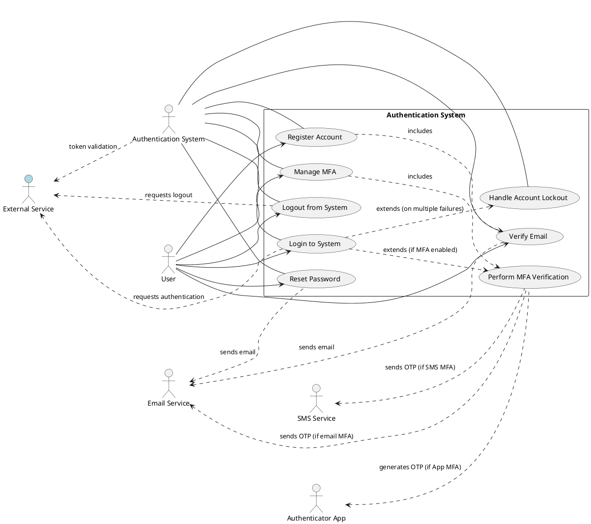

# Product Specification: Secure Authentication System

---

## 1. Executive Summary

This Product Specification outlines the requirements for developing a robust, secure, and scalable Authentication System. The primary goal is to provide a central identity service that verifies user identities, manages access to protected resources across various applications (web, mobile, APIs, internal services), and issues authentication tokens. This system is designed to enhance data protection, ensure compliance with industry security standards (e.g., OWASP Top 10), improve user experience through a streamlined login process, and support a growing user base. Key functionalities include user registration, secure login, comprehensive password management, multi-factor authentication, and robust session management, all built with strong security measures to protect against common attack vectors like brute force and session hijacking.

## 2. Goals and Objectives

The overarching goals and specific objectives for the Authentication System are derived directly from business needs and will guide its development and evaluation:

*   **GOAL: Secure Access & Data Protection**
    *   **OBJ-2.1:** The system SHALL ensure that only authorized users can access protected system resources.
        *   *Acceptance Criteria:* Unauthorized access attempts MUST be prevented and logged.
    *   **OBJ-2.2:** The system SHALL protect sensitive user and system data from unauthorized disclosure or modification.
        *   *Acceptance Criteria:* All sensitive data (e.g., password hashes, user Personally Identifiable Information) MUST be stored and transmitted securely, compliant with security policies.
*   **GOAL: Compliance**
    *   **OBJ-2.3:** The system SHALL adhere to established security best practices, including OWASP Top 10 guidelines.
        *   *Acceptance Criteria:* The system MUST pass security audits against OWASP Top 10 vulnerabilities with zero critical findings.
*   **GOAL: User Experience**
    *   **OBJ-2.4:** The system SHALL provide a smooth, intuitive, and secure login experience for end-users.
        *   *Acceptance Criteria:* Login success rate MUST be > 95%.
        *   *Acceptance Criteria:* Login response time MUST be < 2 seconds for 95% of requests under normal load.
*   **GOAL: Scalability**
    *   **OBJ-2.5:** The system SHALL be capable of supporting a large and growing number of concurrent users and future integrations.
        *   *Acceptance Criteria:* The system MUST successfully handle 10,000+ concurrent users without performance degradation beyond specified NFRs.

## 3. Target Users

The Authentication System serves a diverse set of stakeholders:

*   **End Users:** Individuals who require secure access to integrated web applications, mobile applications, and other services. They will utilize the system for registration, login, password management, and MFA.
*   **Product Owner:** Defines and prioritizes authentication requirements, ensuring alignment with business goals.
*   **Security Team:** Defines and enforces security policies, conducts audits, and monitors for vulnerabilities.
*   **Development Team:** Implements, tests, and maintains the authentication services.
*   **DevOps Team:** Responsible for deploying, monitoring, and maintaining the underlying infrastructure for the authentication system.
*   **Integrated Applications (Web, Mobile, API Gateway, Internal Services):** Consumers of the authentication service, relying on it for user identity verification and token validation.

## 4. Functional Requirements

### 4.1. User Registration (FR-REG)

**FR-REG-001: New User Account Creation** [DETERMINISTIC]
*   The system SHALL allow new users to register for an account by providing an Email, Password, and Name.
    *   *Acceptance Criteria:* A user MUST be able to submit a registration request with valid credentials.
    *   *Acceptance Criteria:* Upon successful submission, the system MUST display a confirmation message indicating that an email verification link has been sent.

**FR-REG-002: Email Format Validation** [DETERMINISTIC]
*   The system SHALL validate the provided email address format during registration.
    *   *Acceptance Criteria:* The email address MUST conform to RFC 5322 standards.
    *   *Acceptance Criteria:* If the email format is invalid, the system SHALL display an "Invalid email format" error message.

**FR-REG-003: Password Policy Enforcement** [DETERMINISTIC]
*   The system SHALL enforce the defined password policy during registration. (See FR-PWD-003)
    *   *Acceptance Criteria:* If the password does not meet the policy, the system SHALL display a specific error message detailing the policy violations.

**FR-REG-004: Unique Email Enforcement** [DETERMINISTIC]
*   The system SHALL prevent the creation of new accounts with an email address already registered in the system.
    *   *Acceptance Criteria:* If an attempt is made to register with an existing email, the system SHALL display an "Email already registered" error message.

**FR-REG-005: Email Verification Requirement** [DETERMINISTIC]
*   The system SHALL require email verification to activate a newly registered account.
    *   *Acceptance Criteria:* After registration, the user's account status MUST be set to "Pending Verification."
    *   *Acceptance Criteria:* An activation link MUST be sent to the registered email address.

**FR-REG-006: Account Activation via Email Link** [DETERMINISTIC]
*   The system SHALL activate a user's account upon successful verification through the provided email link.
    *   *Acceptance Criteria:* Clicking a valid, unexpired verification link MUST change the user's account status to "Active."
    *   *Acceptance Criteria:* The user MUST be redirected to a confirmation page indicating successful account activation.
    *   *Acceptance Criteria:* Expired or invalid verification links MUST result in an error message and prompt to resend the link.

### 4.2. User Login (FR-LOG)

**FR-LOG-001: User Credential Authentication** [DETERMINISTIC]
*   The system SHALL authenticate registered users by verifying their provided Email and Password.
    *   *Acceptance Criteria:* If the credentials are valid and the account is active, the system MUST initiate a successful login flow and issue an authentication token.
    *   *Acceptance Criteria:* If the credentials are invalid, the system SHALL display a generic "Invalid email or password" error message.
    *   *Acceptance Criteria:* If the account is pending verification, locked, or disabled, the system SHALL display an appropriate error message and prevent login.

**FR-LOG-002: Account Lockout Trigger** [DETERMINISTIC]
*   The system SHALL temporarily lock an account after 5 consecutive failed login attempts within a defined timeframe (e.g., 15 minutes).
    *   *Acceptance Criteria:* After the 5th failed attempt, the account status MUST be changed to "Locked."
    *   *Acceptance Criteria:* Subsequent login attempts for a locked account MUST display a "Account locked, please reset your password or contact support" message.

### 4.3. Password Management (FR-PWD)

**FR-PWD-001: Password Reset Initiation** [DETERMINISTIC]
*   The system SHALL allow users to initiate a password reset process for forgotten passwords.
    *   *Acceptance Criteria:* A user submitting a registered email address to the "Forgot Password" function MUST receive a password reset link at that email address.
    *   *Acceptance Criteria:* If the email is not registered, the system SHALL display a message indicating that the email was sent (to avoid enumeration).

**FR-PWD-002: Password Reset Completion** [DETERMINISTIC]
*   The system SHALL allow users to set a new password via a valid, unexpired reset link.
    *   *Acceptance Criteria:* Clicking a valid, unexpired reset link MUST present the user with a form to enter and confirm a new password.
    *   *Acceptance Criteria:* The new password MUST comply with the system's password policy (FR-PWD-003).
    *   *Acceptance Criteria:* Upon successful password update, the user's password hash MUST be updated in the system, and the reset token invalidated.
    *   *Acceptance Criteria:* The user MUST be redirected to a login page or confirmation page.
    *   *Acceptance Criteria:* Expired or invalid reset links MUST result in an error message and prompt to re-initiate the reset.

**FR-PWD-003: Password Policy Enforcement** [DETERMINISTIC]
*   The system SHALL enforce a strong password policy for all new and updated passwords.
    *   *Acceptance Criteria:* Passwords MUST have a minimum length of 8 characters.
    *   *Acceptance Criteria:* Passwords MUST include at least one uppercase letter (A-Z).
    *   *Acceptance Criteria:* Passwords MUST include at least one lowercase letter (a-z).
    *   *Acceptance Criteria:* Passwords MUST include at least one number (0-9).
    *   *Acceptance Criteria:* Passwords MUST include at least one special character (e.g., !@#$%^&*).
    *   *Acceptance Criteria:* If a password fails any policy requirement, the system SHALL provide specific feedback to the user on which rules were not met.

### 4.4. Multi-Factor Authentication (MFA) (FR-MFA)

**FR-MFA-001: MFA Enrollment** [DETERMINISTIC]
*   The system SHALL allow authenticated users to enroll in various MFA methods.
    *   *Acceptance Criteria:* Users MUST be able to select and configure Email OTP, SMS OTP, or Authenticator App (e.g., Google Authenticator) as an MFA method.
    *   *Acceptance Criteria:* For Email/SMS OTP, the system MUST send a test OTP and verify its entry to confirm method functionality.
    *   *Acceptance Criteria:* For Authenticator App, the system MUST display a QR code or secret key and verify a generated OTP to confirm setup.

**FR-MFA-002: MFA Verification Flow** [DETERMINISTIC]
*   The system SHALL initiate an MFA verification challenge for users with enabled MFA after successful credential authentication.
    *   *Acceptance Criteria:* After entering valid email and password, the system MUST prompt the user for an OTP (email, SMS, or authenticator app).
    *   *Acceptance Criteria:* If the OTP is valid, the user MUST be granted access.
    *   *Acceptance Criteria:* If the OTP is invalid, the system SHALL display an "Invalid OTP" error message.
    *   *Acceptance Criteria:* The system SHALL allow for a limited number of incorrect OTP attempts (e.g., 3) before locking the account or requiring re-authentication.

### 4.5. Session Management (FR-SES)

**FR-SES-001: Token-Based Authentication** [DETERMINISTIC]
*   The system SHALL utilize token-based authentication (e.g., JWT or secure session IDs) for managing active user sessions.
    *   *Acceptance Criteria:* Upon successful login, the system MUST issue a secure, signed, and time-limited authentication token.
    *   *Acceptance Criteria:* Integrated applications MUST be able to validate these tokens with the authentication system or locally (for signed tokens).

**FR-SES-002: Session Expiration** [DETERMINISTIC]
*   The system SHALL automatically expire active user sessions after a predefined period.
    *   *Acceptance Criteria:* Session tokens MUST have an absolute expiration time (e.g., 24 hours).
    *   *Acceptance Criteria:* Upon expiration, the token MUST become invalid, requiring the user to re-authenticate.

**FR-SES-003: Inactivity Logout** [DETERMINISTIC]
*   The system SHALL automatically log out users after a period of inactivity.
    *   *Acceptance Criteria:* User sessions MUST be terminated (e.g., token invalidated or refreshed) after 30 minutes of user inactivity (no requests associated with the session token).
    *   *Acceptance Criteria:* Upon inactivity logout, the user MUST be redirected to the login page.

**FR-SES-004: Explicit Logout Functionality** [DETERMINISTIC]
*   The system SHALL provide functionality for users to explicitly log out of their session.
    *   *Acceptance Criteria:* Upon logout, the user's active session token MUST be immediately invalidated on the server-side.
    *   *Acceptance Criteria:* The user MUST be redirected to the login page after successful logout.

### 4.6. Account Lockout (FR-ALC)

**FR-ALC-001: Temporary Account Lockout** [DETERMINISTIC]
*   The system SHALL temporarily lock a user's account after 5 consecutive failed login attempts within a 15-minute window.
    *   *Acceptance Criteria:* The account status MUST change to "Locked."
    *   *Acceptance Criteria:* All subsequent login attempts for the locked account MUST be denied with an "Account Locked" message until unlocked.

**FR-ALC-002: Account Unlock Mechanism** [DETERMINISTIC]
*   The system SHALL provide mechanisms for unlocking a temporarily locked account.
    *   *Acceptance Criteria:* Users MUST be able to unlock their account via a password reset flow (FR-PWD-001, FR-PWD-002).
    *   *Acceptance Criteria:* System administrators MUST be able to manually unlock accounts.
    *   *Acceptance Criteria:* The account MUST automatically unlock after a predefined duration (e.g., 30 minutes) if no further failed attempts occur during that period, or the user successfully performs a password reset.

## 5. Non-Functional Requirements

### 5.1. Security (NFR-SEC)

**NFR-SEC-001: OWASP Top 10 Compliance** [DETERMINISTIC]
*   The system MUST comply with the security standards outlined in the OWASP Top 10.
    *   *Acceptance Criteria:* All identified OWASP Top 10 vulnerabilities (e.g., Injection, Broken Authentication, XSS) MUST be mitigated as per current best practices.
    *   *Acceptance Criteria:* Security audits and penetration tests MUST identify zero critical or high-severity vulnerabilities related to OWASP Top 10.

**NFR-SEC-002: Secure Password Hashing** [DETERMINISTIC]
*   The system MUST use strong, industry-standard cryptographic hashing algorithms for storing user passwords.
    *   *Acceptance Criteria:* Passwords MUST be hashed using bcrypt or Argon2 with appropriate work factors (e.g., bcrypt cost 12-14, Argon2id with recommended parameters).
    *   *Acceptance Criteria:* Password hashes MUST be salted uniquely for each user.

**NFR-SEC-003: HTTPS Encryption** [DETERMINISTIC]
*   All communication between the client and the authentication system, and between system components, MUST be encrypted using HTTPS/TLS.
    *   *Acceptance Criteria:* All endpoints exposed to clients (web, mobile, API) MUST enforce HTTPS/TLS 1.2 or higher.
    *   *Acceptance Criteria:* All internal service-to-service communication involving sensitive data MUST use encrypted channels.

**NFR-SEC-004: Brute-Force Protection** [DETERMINISTIC]
*   The system MUST implement comprehensive protection against brute-force attacks.
    *   *Acceptance Criteria:* Account lockout (FR-ALC-001) MUST be active.
    *   *Acceptance Criteria:* Rate limiting (e.g., max 10 requests per IP per minute) MUST be applied to login and password reset endpoints.
    *   *Acceptance Criteria:* Captcha or similar challenge-response mechanisms MAY be triggered after suspicious activity (e.g., 3 failed logins).

### 5.2. Performance (NFR-PER)

**NFR-PER-001: Login Response Time** [DETERMINISTIC]
*   The system SHALL achieve a login response time of less than 2 seconds for 95% of requests.
    *   *Acceptance Criteria:* Average login response time MUST be consistently below 2 seconds under typical load (up to 5,000 concurrent users).

**NFR-PER-002: Concurrent Users Support** [DETERMINISTIC]
*   The system SHALL support 10,000+ concurrent users.
    *   *Acceptance Criteria:* Load tests MUST demonstrate stable performance and maintain NFR-PER-001 targets with 10,000 concurrent active sessions.

**NFR-PER-003: Availability** [DETERMINISTIC]
*   The system SHALL maintain an availability of 99.9% uptime.
    *   *Acceptance Criteria:* System downtime, excluding scheduled maintenance, MUST not exceed 8 hours and 45 minutes per year.

### 5.3. Scalability (NFR-SCA)

**NFR-SCA-001: Horizontal Scaling Support** [DETERMINISTIC]
*   The system architecture SHALL support horizontal scaling to accommodate increased user load.
    *   *Acceptance Criteria:* The system MUST be deployable as multiple stateless instances behind a load balancer.

**NFR-SCA-002: Load Balancing Capability** [DETERMINISTIC]
*   The system SHALL be designed to operate effectively behind a load balancer.
    *   *Acceptance Criteria:* Session state (if any) MUST be managed externally (e.g., distributed cache) or encoded within tokens to ensure any instance can handle any request.

**NFR-SCA-003: Microservice Architecture** [DETERMINISTIC]
*   The authentication service SHALL be implemented as a microservice.
    *   *Acceptance Criteria:* The service MUST expose a well-defined API (e.g., RESTful) and be independently deployable from other application components.

### 5.4. Reliability (NFR-REL)

**NFR-REL-001: Redundancy and Failover** [DETERMINISTIC]
*   The system SHALL implement redundancy for core authentication services and data storage.
    *   *Acceptance Criteria:* Backup authentication servers MUST be deployed in a high-availability configuration.
    *   *Acceptance Criteria:* Automatic failover to secondary servers MUST occur within 60 seconds of a primary server failure.

**NFR-REL-002: Monitoring and Logging** [DETERMINISTIC]
*   The system SHALL provide comprehensive monitoring and logging capabilities for all critical operations and errors.
    *   *Acceptance Criteria:* Key metrics (e.g., login success/failure, response times, resource utilization) MUST be collected and exposed via standard monitoring tools.
    *   *Acceptance Criteria:* All authentication attempts, account lockouts, password resets, and security events MUST be logged with relevant details (timestamp, user ID, IP address, event type).
    *   *Acceptance Criteria:* Logs MUST be centralized and easily searchable.

## 6. Use Case Analysis

### 6.1. Use Case Diagram

### 6.2. Use Case Descriptions

#### UC-REG-001: Register New Account

*   **Description:** Allows a new user to create an account by providing an email, password, and name, initiating the email verification process.
*   **Primary Actor:** User
*   **Preconditions:**
    *   User has access to the registration interface.
    *   User has a unique, valid email address.
*   **Postconditions:**
    *   User account is created with "Pending Verification" status.
    *   An email verification link has been sent to the user's email.
*   **Main Flow:**
    1.  User accesses the registration page.
    2.  User enters Email, Password (twice), and Name.
    3.  User clicks "Register."
    4.  System validates email format and password against policy (FR-REG-002, FR-REG-003).
    5.  System checks if email is already registered (FR-REG-004).
    6.  System creates a new user record with status "Pending Verification" (FR-REG-005).
    7.  System generates a unique verification token and sends an email with the verification link (FR-REG-005).
    8.  System displays a "Registration successful, please check your email for verification" message.
*   **Alternate Flows:**
    *   **AF-REG-001.1: Invalid Email Format:** If email is invalid, system displays "Invalid email format."
    *   **AF-REG-001.2: Password Policy Violation:** If password doesn't meet policy, system displays specific policy error messages.
    *   **AF-REG-001.3: Email Already Registered:** If email exists, system displays "Email already registered."

#### UC-REG-004: Verify Email

*   **Description:** Activates a user's account after they click a verification link sent to their email.
*   **Primary Actor:** User
*   **Preconditions:**
    *   User has a "Pending Verification" account.
    *   User has received a valid email verification link.
*   **Postconditions:**
    *   User account status is changed to "Active."
    *   Verification token is invalidated.
*   **Main Flow:**
    1.  User receives an email with a verification link.
    2.  User clicks the verification link.
    3.  System validates the verification token (FR-REG-006).
    4.  System updates the user's account status to "Active" (FR-REG-006).
    5.  System redirects the user to an account activated confirmation page.
*   **Alternate Flows:**
    *   **AF-REG-004.1: Invalid/Expired Link:** If the link is invalid or expired, system displays an error and offers to resend the verification email.
    *   **AF-REG-004.2: Account Already Active:** If the account is already active, system redirects to login page with a message.

#### UC-LOG-001: Login to System

*   **Description:** Allows a registered and active user to log in to the system using their credentials.
*   **Primary Actor:** User
*   **Preconditions:**
    *   User has an active account.
    *   User knows their registered email and password.
*   **Postconditions:**
    *   User is authenticated.
    *   An authentication token/session is generated and provided to the user.
    *   User gains access to application resources.
*   **Main Flow:**
    1.  User accesses the login page.
    2.  User enters Email and Password.
    3.  User clicks "Login."
    4.  System validates credentials (FR-LOG-001).
    5.  (If MFA is enabled, extends to UC-MFA-002)
    6.  System generates an authentication token (FR-SES-001).
    7.  System returns the token to the user/client.
    8.  User is redirected to the application's dashboard or home page.
*   **Alternate Flows:**
    *   **AF-LOG-001.1: Invalid Credentials:** If credentials don't match, system displays "Invalid email or password" (FR-LOG-001).
    *   **AF-LOG-001.2: Account Locked:** If account is locked, system displays "Account locked, please reset your password or contact support" (FR-LOG-001).
    *   **AF-LOG-001.3: Account Pending Verification:** If account is not active, system displays "Account not verified, please check your email."
    *   **AF-LOG-001.4: Account Lockout Triggered:** If 5 failed login attempts, system locks account (UC-ALC-001) and displays appropriate message.

#### UC-PWD-001: Reset Password

*   **Description:** Enables a user to reset their forgotten password via an email-based reset link.
*   **Primary Actor:** User
*   **Preconditions:**
    *   User has a registered email address.
    *   User has forgotten their password.
*   **Postconditions:**
    *   User's password is updated in the system.
    *   All active sessions for the user are invalidated.
    *   Password reset token is invalidated.
*   **Main Flow:**
    1.  User clicks "Forgot Password" on the login page.
    2.  User enters their registered email address.
    3.  User clicks "Send Reset Link."
    4.  System validates the email address is registered (FR-PWD-001).
    5.  System generates a unique password reset token and sends an email with the reset link (FR-PWD-001).
    6.  System displays a "If an account with that email exists, a password reset link has been sent" message.
    7.  User receives the email and clicks the reset link.
    8.  System validates the reset token (FR-PWD-002).
    9.  System presents a form for the user to enter and confirm a new password.
    10. User enters a new password twice.
    11. User clicks "Set New Password."
    12. System validates the new password against policy (FR-PWD-003).
    13. System hashes and updates the password in the database (NFR-SEC-002).
    14. System invalidates the reset token and any active user sessions.
    15. System redirects the user to the login page with a "Password successfully reset" message.
*   **Alternate Flows:**
    *   **AF-PWD-001.1: Unregistered Email:** If email is not registered, system displays a generic confirmation to prevent enumeration.
    *   **AF-PWD-001.2: Invalid/Expired Reset Link:** If the reset link is invalid or expired, system displays an error and prompts to restart the process.
    *   **AF-PWD-001.3: New Password Policy Violation:** If the new password fails policy, system displays specific error messages (FR-PWD-003).

#### UC-MFA-001: Manage MFA

*   **Description:** Allows an authenticated user to enroll in or modify their Multi-Factor Authentication settings.
*   **Primary Actor:** User
*   **Preconditions:**
    *   User is logged in.
    *   User navigates to account settings/security section.
*   **Postconditions:**
    *   User's MFA settings are updated (enabled, disabled, method changed).
    *   MFA secrets/configurations are stored securely.
*   **Main Flow:**
    1.  User navigates to the MFA settings page.
    2.  User selects an MFA method (Email OTP, SMS OTP, Authenticator App) (FR-MFA-001).
    3.  **For Email/SMS OTP:** User confirms email/phone, system sends a test OTP, user enters it for verification.
    4.  **For Authenticator App:** System displays a QR code/secret key, user scans it with their app, enters a generated OTP for verification.
    5.  Upon successful verification, MFA is enabled for the selected method (FR-MFA-001).
    6.  System displays a confirmation message.
*   **Alternate Flows:**
    *   **AF-MFA-001.1: Failed OTP Verification:** If the test OTP is incorrect, system displays "Invalid OTP" and prompts retry.
    *   **AF-MFA-001.2: Error During Enrollment:** If an error occurs during enrollment, system displays a generic error message.

#### UC-MFA-002: Perform MFA Verification

*   **Description:** Verifies an additional factor (OTP) from the user after successful password authentication to grant access.
*   **Primary Actor:** User
*   **Preconditions:**
    *   User has successfully entered email and password.
    *   MFA is enabled for the user's account.
*   **Postconditions:**
    *   User is successfully authenticated and gains access.
*   **Main Flow:**
    1.  (Extends UC-LOG-001) After valid password entry, system prompts for OTP.
    2.  System sends OTP via the configured method (email, SMS) or waits for Authenticator App input (FR-MFA-002).
    3.  User enters the OTP.
    4.  System validates the OTP (FR-MFA-002).
    5.  If valid, system proceeds with token generation and grants access.
*   **Alternate Flows:**
    *   **AF-MFA-002.1: Invalid OTP:** If OTP is incorrect, system displays "Invalid OTP."
    *   **AF-MFA-002.2: OTP Expiration:** If OTP expires, system prompts to resend or retry.
    *   **AF-MFA-002.3: Too Many Invalid OTPs:** After 'X' invalid OTPs, system might temporarily lock the account or require re-authentication from the start.

#### UC-SES-004: Logout from System

*   **Description:** Allows a logged-in user to explicitly terminate their active session.
*   **Primary Actor:** User
*   **Preconditions:**
    *   User is currently logged in.
*   **Postconditions:**
    *   User's authentication token is invalidated.
    *   User is no longer authenticated.
    *   User is redirected to the login page.
*   **Main Flow:**
    1.  User clicks "Logout" within the application.
    2.  Client sends a logout request with the active token to the Authentication System.
    3.  System invalidates the user's authentication token (FR-SES-004).
    4.  System clears any server-side session data for that user.
    5.  System redirects the user to the login page.

#### UC-ALC-001: Handle Account Lockout

*   **Description:** System response to protect user accounts from brute-force attacks by temporarily locking them.
*   **Primary Actor:** Authentication System (triggered by User actions)
*   **Preconditions:**
    *   A user has an active account.
*   **Postconditions:**
    *   Account status is set to "Locked."
    *   Login attempts are denied until unlocked.
*   **Main Flow:**
    1.  User attempts to log in with incorrect credentials.
    2.  System increments failed login counter for the user.
    3.  If failed login count reaches 5 within 15 minutes (FR-ALC-001):
        a.  System updates user's account status to "Locked."
        b.  System logs the lockout event (NFR-REL-002).
        c.  System notifies the user of account lockout (if they attempt to log in again) and suggests password reset or admin contact (FR-LOG-001).
*   **Alternate Flows:**
    *   **AF-ALC-001.1: Account Unlock via Password Reset:** If user performs a successful password reset (UC-PWD-001), the account is unlocked (FR-ALC-002).
    *   **AF-ALC-001.2: Automatic Unlock:** If the lockout period (e.g., 30 minutes) expires without further failed attempts, the account automatically unlocks (FR-ALC-002).
    *   **AF-ALC-001.3: Admin Unlock:** A system administrator manually unlocks the account.

## 7. Constraints, Assumptions, and Risks

### 7.1. Constraints

*   **C-001: Security Standards Compliance:** The system MUST adhere to OWASP Top 10 guidelines and secure coding practices.
*   **C-002: Protocol Standard:** All external communication MUST utilize HTTPS/TLS encryption.
*   **C-003: Integration Interface:** The system MUST expose a RESTful API for integration with web applications, mobile applications, and API gateways.
*   **C-004: Technology Stack:** The development team will primarily use [Specific Technology Stack, e.g., Java/Spring Boot, Python/Django, Node.js/Express, Docker, Kubernetes, PostgreSQL] for implementation, as defined by the Development Team.
*   **C-005: Time-to-Market:** Initial MVP release for core registration and login functionality is targeted within 6 months.

### 7.2. Assumptions

*   **A-001: Email Service Availability:** An external, reliable email service (e.g., SendGrid, AWS SES) will be available and properly configured for sending verification and password reset emails.
*   **A-002: SMS Service Availability (for MFA):** For SMS OTP, a reliable SMS gateway service will be available and integrated.
*   **A-003: Network Infrastructure:** The underlying network infrastructure will provide stable connectivity and sufficient bandwidth to support the system's performance and availability requirements.
*   **A-004: Monitoring Tools:** Necessary monitoring and logging tools (e.g., Prometheus, Grafana, ELK stack) will be in place and integrated for the DevOps team.
*   **A-005: Security Team Policies:** The Security Team will provide clear and comprehensive security policies and guidelines for implementation and audits.
*   **A-006: User Data Privacy:** Compliance with relevant data privacy regulations (e.g., GDPR, CCPA) is handled at the application level and the authentication system will provide necessary data protection features.

### 7.3. Risks and Mitigation

*   **R-001: Brute-Force Attacks**
    *   **Description:** Attackers attempt to gain unauthorized access by systematically trying many username/password combinations.
    *   **Mitigation:** Implement account lockout after 5 failed attempts (FR-ALC-001), rate limiting on login attempts (NFR-SEC-004), and CAPTCHA challenges after suspicious activity.
*   **R-002: Password Breaches (Data at Rest)**
    *   **Description:** Sensitive user password data stored in the database is compromised.
    *   **Mitigation:** Enforce strong password hashing algorithms (bcrypt/Argon2 with salts) (NFR-SEC-002), strict database access controls, and encryption of sensitive data at rest.
*   **R-003: Session Hijacking**
    *   **Description:** An attacker gains unauthorized control over a user's session.
    *   **Mitigation:** Use secure, time-limited, signed authentication tokens (JWTs) (FR-SES-001), enforce HTTPS for all communications (NFR-SEC-003), implement strict session expiration and inactivity timeouts (FR-SES-002, FR-SES-003), and invalidate tokens upon logout or password change.
*   **R-004: Unauthorized Access (Lack of Multi-Factor Authentication)**
    *   **Description:** If only password authentication is used, a compromised password directly leads to unauthorized access.
    *   **Mitigation:** Implement and strongly recommend Multi-Factor Authentication (MFA) (FR-MFA-001, FR-MFA-002) as an additional security layer, making it easy for users to enroll.
*   **R-005: Denial of Service (DoS) Attacks**
    *   **Description:** Attackers flood the system with requests to make it unavailable.
    *   **Mitigation:** Implement API Gateway level rate limiting, robust load balancing (NFR-SCA-002), microservice architecture for isolated failure domains (NFR-SCA-003), and auto-scaling capabilities (NFR-SCA-001).
*   **R-006: Inadequate Logging and Monitoring**
    *   **Description:** Inability to detect and respond to security incidents or operational issues due to insufficient visibility.
    *   **Mitigation:** Implement comprehensive, centralized logging for all security-relevant events and system errors, and integrate with real-time monitoring and alerting systems (NFR-REL-002).