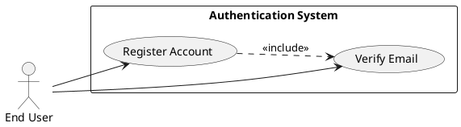
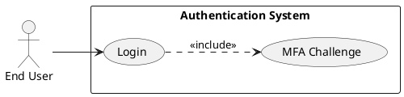
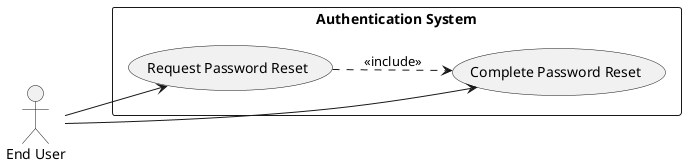
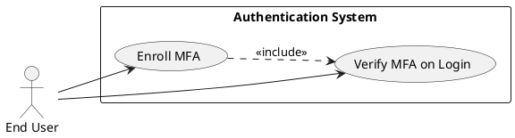
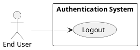
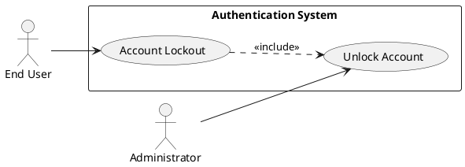
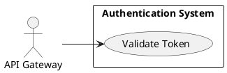

# Requirements Specification

## Feature Goal
Provide a central, secure Authentication System that replaces ad-hoc auth across applications with a unified identity service supporting user registration, secure login, password management, multi-factor authentication (MFA), token-based session management, account protection, and integration points (API Gateway, OAuth/OIDC IdPs). Current state: multiple apps implement inconsistent auth rules and storage. Desired state: single, auditable, secure authentication service with deterministic, testable behaviors and clear integration contracts.

## Business Justification
- Business value and user impact
  - Reduces security risk by centralizing authentication, improving compliance (OWASP alignment) and lowering maintenance cost for integrated applications.
  - Improves user experience through consistent login, forgot-password flows, optional MFA, and reduced friction integrating new applications.
- Integration with existing features
  - Serves web, mobile, API Gateway, and internal services via standardized token validation (JWT + refresh) and optional OAuth/OIDC connectors.
- Problems this solves and for whom
  - End users: consistent and secure access and recovery flows.
  - Security team: centralized logging, rate-limiting, and audit trails.
  - Developers: standardized integration and token validation endpoints.

## Feature Scope
User-visible behavior:
- Sign up with email verification
- Login with email + password
- Password reset via email link
- Optional MFA via Email OTP, SMS OTP, or authenticator app (TOTP)
- Token-based session handling (access + refresh)
- Account lockout + administrative unlock workflows
Technical requirements:
- Secure password hashing (Argon2id recommended)
- HTTPS-only endpoints, OWASP controls, rate limiting, and monitoring
- Configurable retention and TTL parameters
- Integration endpoints for API Gateway token validation and external IdP connectors

### Success Criteria
- [ ] Login success rate > 95% across measured user population
- [ ] Login response time < 2s for 95% of auth requests under normal load
- [ ] System handles 10,000+ concurrent sessions without auth failures attributable to the auth service
- [ ] No critical OWASP findings in security audit
- [ ] MFA adoption > 20% among privileged users within 6 months

## Functional Requirements

Before expanding, list of requirements to generate:

| FR-ID | Summary |
|-------|---------|
| FR-001 | User Registration with email verification |
| FR-002 | User Login with credential validation |
| FR-003 | Password Policy enforcement |
| FR-004 | Password Reset (forgot password flow) |
| FR-005 | Multi-Factor Authentication (MFA) enrollment & validation |
| FR-006 | Session Management (access + refresh tokens, logout, revocation) |
| FR-007 | Session Expiration & Automatic Logout (inactivity) |
| FR-008 | Account Lockout and Unlock workflows |
| FR-009 | API Gateway Token Validation / Introspection |
| FR-010 | Integration with Identity Providers (OAuth / SSO) |
| FR-011 | Audit Logging & Security Events |
| FR-012 | Rate Limiting & Brute-Force Protection |
| FR-013 | Secure Password Storage (Argon2id) |
| FR-014 | Monitoring, Alerting & Health Endpoints |
| FR-015 | Adaptive / Risk-Based Authentication (future, AI-assisted) |
| FR-016 | Administrative User Management (unlock, disable accounts) |
| FR-017 | Data Retention & Privacy Controls (GDPR, configurable) |

Expand each FR listed above with full specification.

- FR-001: [DETERMINISTIC] System MUST allow new users to register an account via email verification.
  - Description: Registration endpoint accepts Email, Password, FirstName, LastName (optionally metadata). System validates email format and password policy, creates an unverified account, and sends a single-use verification link/token.
  - Acceptance Criteria:
    1. Given valid inputs, POST /register returns 202 Accepted and a verification email is queued within 5 seconds.
    2. Verification token is single-use and expires in 24 hours (configurable).
    3. Registering with an existing verified email returns 409 Conflict with generic message "Email already registered".
    4. Re-send verification limited to 3 per 24 hours per account/IP.
  - Trigger: User submits registration form.
  - Who benefits: End users, Product team.
  - Success outcome: Account is created and marked verified after link is used.
  - Failure scenarios: Email not delivered, token expired, duplicate registration.
  - Dependencies: Email provider (SMTP/SES), rate limiter, audit logging.

- FR-002: [DETERMINISTIC] System MUST authenticate users via email and password and return access and refresh tokens (or indicate MFA required).
  - Description: POST /login validates credentials against stored password hash; on success issues access_token (JWT, default TTL 15 minutes) and refresh_token (opaque, TTL 30 days). If MFA enabled, return mfa_required and suspend token issuance until MFA is verified.
  - Acceptance Criteria:
    1. Successful authentication returns HTTP 200 with access_token and refresh_token and user session metadata.
    2. Failed auth returns 401 Unauthorized and increments failed-login counters.
    3. If MFA enabled, response is 200 with mfa_required=true and no tokens; subsequent valid MFA verification returns tokens.
    4. 95th percentile response time < 2s under normal load.
  - Trigger: POST /login with email+password.
  - Who benefits: End users, client applications.
  - Failure scenarios: Locked account, invalid credentials, rate-limited IP.
  - Dependencies: Password hashing, session store for refresh tokens (if used), MFA service.

- FR-003: [DETERMINISTIC] System MUST enforce a password policy on account creation and password updates.
  - Description: Enforce configurable password rules (min length 8, uppercase, lowercase, digit, special char), disallow common weak passwords, and prevent reuse of last N passwords (configurable).
  - Acceptance Criteria:
    1. Passwords failing policy are rejected with 400 Bad Request and non-revealing error details.
    2. Password history enforced; attempt to reuse last N passwords is rejected.
    3. Password policy configurable via admin API.
  - Trigger: Account creation or password change.
  - Who benefits: Security team, end users.
  - Dependencies: Secure password hashing, password history storage.

- FR-004: [DETERMINISTIC] System MUST provide a secure password reset (forgot password) flow.
  - Description: User requests reset; system sends a single-use reset link/token to verified email; token expires in configurable short window (default 1 hour).
  - Acceptance Criteria:
    1. POST /forgot-password returns 202 Accepted and reset email queued within 5 seconds for verified emails.
    2. Reset token single-use and expires after 1 hour by default (configurable).
    3. After successful password reset user is notified and previous refresh tokens invalidated.
    4. Rate-limit resets per account/IP to prevent abuse.
  - Trigger: User clicks "Forgot Password" and submits email.
  - Who benefits: End users, security team.
  - Failure scenarios: Unverified email, expired token, email not delivered.
  - Dependencies: Email provider, token store, session revocation mechanism.

- FR-005: [DETERMINISTIC] System MUST support MFA enrollment and verification via Email OTP, SMS OTP, and TOTP authenticator apps.
  - Description: Users may enroll MFA methods; during login flow, if an account has MFA enabled the system must challenge and verify MFA before issuing tokens.
  - Acceptance Criteria:
    1. MFA enrollment endpoints allow adding/removing methods with verification steps.
    2. MFA verification endpoint validates OTP/TOTP and returns tokens on success.
    3. Backup/recovery options available (recovery codes) and able to be rotated/invalidated.
    4. SMS and email OTP delivery tracked and throttled; TOTP validated per RFC 6238.
  - Trigger: User opts in or admin requires MFA.
  - Who benefits: End users, security team.
  - Dependencies: SMS provider, email provider, TOTP library, secure storage for MFA secrets.

- FR-006: [DETERMINISTIC] System MUST manage sessions via short-lived access tokens and longer-lived refresh tokens with revocation capability.
  - Description: Issue JWT access tokens and opaque refresh tokens; provide logout endpoint to revoke refresh token and a token revocation mechanism (blacklist or introspection).
  - Acceptance Criteria:
    1. Logout invalidates refresh token and optionally active access tokens via revocation strategy.
    2. Refresh flow issues new access_token and rotates refresh_token; rotated refresh tokens invalidate previous one.
    3. Token introspection endpoint available for API Gateway (low-latency).
  - Trigger: Successful login, token refresh, logout.
  - Who benefits: Client apps, security team.
  - Failure scenarios: Stale tokens, revocation lag.
  - Dependencies: Token store (for refresh/revocation), secure JWT signing keys (rotateable).

- FR-007: [DETERMINISTIC] System MUST expire sessions after configurable inactivity and absolute timeouts.
  - Description: Enforce inactivity timeout for access via refresh token and absolute maximum session duration for refresh tokens.
  - Acceptance Criteria:
    1. Inactivity timeout leads to invalidated session and requires re-authentication.
    2. Absolute session TTL enforced even if refresh continues.
    3. Admin-configurable timeouts via configuration.
  - Trigger: Periodic checks or token validation.
  - Who benefits: Security posture and operational teams.
  - Dependencies: Session metadata store.

- FR-008: [DETERMINISTIC] System MUST lock accounts after repeated failed login attempts and provide secure unlock mechanisms.
  - Description: After N failed attempts (default 5) within timeframe, lock account for configurable duration or until verified via email/admin unlock.
  - Acceptance Criteria:
    1. After 5 failed attempts within rolling window, account enters locked state and login attempts return 423 Locked with generic message.
    2. Unlock via verified email link OR admin console action.
    3. Locked accounts produce audit event and alert when threshold is crossed.
  - Trigger: Failed login attempts.
  - Who benefits: Security team and legitimate users (protection).
  - Dependencies: Rate limiter, audit logging, admin UI/API.

- FR-009: [DETERMINISTIC] System MUST expose a token validation/introspection endpoint for API Gateway and internal services.
  - Description: Provide low-latency introspection or public key JWKS endpoint for JWT verification; support introspection for opaque tokens.
  - Acceptance Criteria:
    1. JWKS endpoint available for public key retrieval and updated on key rotation.
    2. Introspection returns token active state, user_id, scopes, and expiry.
    3. Endpoint protected and rate-limited.
  - Trigger: API Gateway token validation request.
  - Who benefits: API Gateway, client services.
  - Dependencies: Key management system, cache layer for performance.

- FR-010: [HYBRID] System MUST support integration with external Identity Providers (OAuth2 / OIDC SSO).
  - Description: Support standard OAuth2/OIDC flows (Authorization Code with PKCE for SPAs), map external identities to local accounts, allow linking/unlinking accounts.
  - Acceptance Criteria:
    1. System can accept ID tokens from configured IdPs and create/link local account or sign-in.
    2. Admin UI to configure IdP clients, scopes, and mapping rules.
    3. Maintain audit trail of federated logins.
  - Trigger: User chooses SSO provider on login.
  - Who benefits: End users and IT integrating SSO.
  - Failure scenarios: Misconfigured IdP, mismatched claims.
  - Dependencies: OIDC client libraries, secure storage for client secrets.

- FR-011: [DETERMINISTIC] System MUST log authentication and security events centrally with sufficient detail for audit and incident response.
  - Description: Emit structured logs/events for registration, login success/failure, password changes, MFA events, lock/unlock, token issuance/revocation.
  - Acceptance Criteria:
    1. Events include timestamp, user_id (if available), IP, user agent, event type, and outcome.
    2. Logs forwarded to central SIEM within 60 seconds; retention configurable.
    3. Critical events trigger alerts per configured thresholds.
  - Trigger: Security-relevant actions.
  - Who benefits: Security operations, auditors.
  - Dependencies: Logging pipeline (ELK/CloudWatch/Splunk), alerting system.

- FR-012: [DETERMINISTIC] System MUST implement rate limiting and anti-brute-force protections per IP and per account.
  - Description: Apply layered rate limits: global, per-IP, per-account; support exponential backoff and CAPTCHA challenge for suspicious patterns.
  - Acceptance Criteria:
    1. Default rate-limits prevent brute-force attempts while allowing normal usage (configurable).
    2. Suspicious behavior yields progressively stricter controls (throttle, temporary block).
    3. Admins can override limits and review events.
  - Trigger: High request rates or repeated failures.
  - Who benefits: Security team, legitimate users.
  - Dependencies: Distributed rate limiter, shared cache (Redis).

- FR-013: [DETERMINISTIC] System MUST store passwords securely using Argon2id (preferred) or bcrypt with appropriate parameters.
  - Description: Use per-user salts, appropriate memory/time parameters, and secret-keyed hashing if supported.
  - Acceptance Criteria:
    1. Passwords hashed and salted using Argon2id with parameters documented and adjustable.
    2. Migration plan for legacy hashes (detect and re-hash on login).
  - Trigger: Account creation or password update.
  - Who benefits: Security team, users.
  - Dependencies: Crypto libraries, secure secret management.

- FR-014: [DETERMINISTIC] System MUST provide monitoring, health, and alerting endpoints and metrics.
  - Description: Expose health/readiness endpoints, authentication metrics (latency, error rates, active sessions), and integrate with monitoring and alerting.
  - Acceptance Criteria:
    1. /health and /metrics endpoints available and respond within 200ms.
    2. Instrumentation for login success/failure, MFA failures, token issuance, lockouts.
    3. Alerts for sustained error rate or resource exhaustion.
  - Trigger: Monitoring systems polling or metric thresholds.
  - Who benefits: DevOps, SRE.
  - Dependencies: Metrics backend (Prometheus), dashboards, alerting rules.

- FR-015: [AI-CANDIDATE] System MAY provide adaptive/risk-based authentication to evaluate login risk and require step-up authentication dynamically.
  - Description: Use behavioral signals (IP reputation, device fingerprint, velocity) to calculate risk score and trigger step-up (MFA, challenge) when above threshold. AI components used for scoring are optional and must be explainable.
  - Acceptance Criteria:
    1. Risk scoring integrates with login flow and can force MFA on high-risk flows.
    2. Scoring model must be auditable and have fallback deterministic rules.
    3. Flagged events produce higher-fidelity audit logs and review pipeline.
  - Trigger: Login or token refresh events with risk signals present.
  - Who benefits: Security team for fraud reduction; may impact UX.
  - Dependencies: Risk service / ML model, data sources, privacy review.
  - Notes: Marked AI-CANDIDATE; if implemented, ensure human-reviewable explanations and model governance.

- FR-016: [DETERMINISTIC] System MUST provide administrative user management functions (disable, unlock, force password reset).
  - Description: Admin UI/API to view user status, force unlocks, disable accounts, and trigger password resets. Actions must be audited and permissioned.
  - Acceptance Criteria:
    1. Admin actions require least-privilege roles and 2FA for critical actions.
    2. All admin actions generate audit events.
  - Trigger: Admin user action.
  - Who benefits: Support and security teams.
  - Dependencies: RBAC system, admin UI.

- FR-017: [DETERMINISTIC] System MUST support configurable data retention and privacy controls including account deletion and data export for compliance.
  - Description: Provide APIs to delete or export user data per regulatory requirements (GDPR), with configurable retention defaults and purge workflows.
  - Acceptance Criteria:
    1. Account deletion anonymizes or purges personal data per policy.
    2. Data export endpoint provides user data in machine-readable format.
    3. Retention policies enforced automatically and auditable.
  - Trigger: User request or admin policy action.
  - Who benefits: Legal, privacy officers, end users.
  - Dependencies: Data lifecycle service, backup/archive processes.

**Note**: All FRs must include monitoring, structured logging, and secure defaults (HTTPS, secure cookies where applicable, HTTP security headers). All FRs where external providers are used must include fallback/error handling and observability.

## Use Case Analysis

### Actors & System Boundary
- Primary Actor: End User — registers, logs in, enrolls MFA, requests password reset.
- Secondary Actor: Administrator — manages accounts, unlocks, configures policies.
- System Actor: API Gateway — validates tokens for protected services.
- External Systems: Email Provider, SMS Provider, Identity Provider (OIDC), SIEM/Logging, Key Management Service (KMS).

### Use Case Specifications

#### UC-001: Register Account
- Actor(s): End User
- Goal: Create a verified user account.
- Preconditions: User has a valid email address and meets password policy.
- Success Scenario:
  1. User submits registration form with email and password to POST /register.
  2. System validates input and creates unverified account.
  3. System sends verification email with single-use token.
  4. User clicks verification link; system verifies token and marks account verified.
- Extensions/Alternatives:
  - 2a. Email already exists: return 409 Conflict.
  - 3a. Email delivery fails: queue retry and surface user guidance.
  - 4a. Token expired: user requests re-send; limited to 3 per 24 hours.
- Postconditions: Account is verified and ready for login; audit event recorded.

##### Use Case Diagram

#### UC-002: Login
- Actor(s): End User
- Goal: Authenticate and receive access to protected resources.
- Preconditions: User has a verified account.
- Success Scenario:
  1. User POSTs /login with email and password.
  2. System validates credentials; if correct and MFA not required → issue tokens and return 200.
  3. If MFA is enabled → return mfa_required and prompt for MFA; on valid MFA, issue tokens.
- Extensions/Alternatives:
  - 2a. Invalid credentials: 401 Unauthorized and increment failed-login counter.
  - 2b. Account locked: 423 Locked returned.
  - 3a. MFA fails: return 401 and allow retry up to configured attempts.
- Postconditions: Active session established with access & refresh tokens; login event logged.

##### Use Case Diagram

#### UC-003: Password Reset (Forgot Password)
- Actor(s): End User
- Goal: Reset forgotten password securely.
- Preconditions: User has a verified email associated with account.
- Success Scenario:
  1. User submits email to POST /forgot-password.
  2. System queues reset email with single-use token.
  3. User clicks reset link and submits new password.
  4. System validates new password, updates password hash, invalidates existing refresh tokens, and notifies user.
- Extensions/Alternatives:
  - 2a. Email not found or unverified: return 202 without revealing existence.
  - 3a. Token expired: prompt to request new reset.
- Postconditions: Password updated and previous sessions revoked; event logged.

##### Use Case Diagram

#### UC-004: Enroll & Use MFA
- Actor(s): End User
- Goal: Enroll and use MFA method (TOTP/SMS/Email).
- Preconditions: User has a verified account and is authenticated.
- Success Scenario:
  1. User requests enrollment via POST /mfa/enroll specifying method.
  2. System generates secret or sends verification OTP.
  3. User submits verification code; system verifies and marks method active.
  4. On login, system challenges and validates MFA before issuing tokens.
- Extensions/Alternatives:
  - 2a. SMS delivery fails: allow retry and alternate method.
  - 3a. Failed verification: reject and require re-enroll attempt.
- Postconditions: MFA method is enrolled and will be used for subsequent authentication.

##### Use Case Diagram

#### UC-005: Logout / Session Termination
- Actor(s): End User
- Goal: Terminate the active session and revoke tokens.
- Preconditions: User has an active refresh token.
- Success Scenario:
  1. User calls POST /logout with refresh token.
  2. System revokes refresh token and records logout event.
  3. Subsequent use of the revoked refresh token is rejected.
- Extensions/Alternatives:
  - 2a. Token not found: return 200 to avoid token probing.
- Postconditions: Session terminated and audit logged.

##### Use Case Diagram

#### UC-006: Account Lockout & Unlock
- Actor(s): End User, Administrator
- Goal: Protect accounts from brute-force and enable secure unlock.
- Preconditions: Repeated failed login attempts detected.
- Success Scenario:
  1. System locks account after configured failed attempts.
  2. System sends unlock instructions to verified email.
  3. Admin may unlock via admin UI with audited action.
- Extensions/Alternatives:
  - 2a. If email not delivered, admin unlock path required.
  - 3a. Automated unlock after configured timeout.
- Postconditions: Account unlocked or remains locked pending admin action.

##### Use Case Diagram

#### UC-007: Token Validation for API Access
- Actor(s): API Gateway (System Actor)
- Goal: Validate tokens presented by client services and allow/deny access.
- Preconditions: Client presents access token or uses introspection.
- Success Scenario:
  1. API Gateway calls JWKS or introspection endpoint.
  2. Authentication System verifies token signature or checks token store and returns token active state and claims.
  3. Gateway allows or denies request based on response.
- Extensions/Alternatives:
  - 2a. Key rotation: JWKS updated and cached by gateway; fallbacks handled.
  - 3a. Introspection timeout: gateway applies cached decisions or fail-closed per policy.
- Postconditions: Access granted or denied; validation event logged.

##### Use Case Diagram

## Risks & Mitigations
- Brute Force & Credential Stuffing
  - Mitigation: Rate limiting per IP/account, account lockout, CAPTCHA, monitoring & alerting.
- OTP Delivery Failures & SIM Swap Fraud
  - Mitigation: Offer TOTP as primary secure option, SMS as fallback; detect SIM swap via carrier data (where available); notify users of changes.
- Token Revocation Complexity (stateless JWTs)
  - Mitigation: Use short-lived access tokens + refresh tokens with revocation list or opaque refresh tokens and introspection endpoint; document tradeoffs.
- Email/SMS Provider Outage
  - Mitigation: Use redundant providers, fallback queues, and degrade gracefully (e.g., fallback to admin-assisted unlock).
- Privacy & Compliance Risk (GDPR)
  - Mitigation: Provide data export and deletion APIs, retention policies, and data minimization; log consent and data processing activities.

## Constraints & Assumptions
- System will use HTTPS for all endpoints and industry-standard libraries for crypto (Argon2/TOTP/OIDC).
- SMS/email providers may have variable deliverability and latency; design for retries and user guidance.
- Default session/token TTLs are configurable by admin; production defaults: access token 15 min, refresh token 30 days.
- Integration with third-party IdPs requires admin configuration (client IDs/secrets); IdP uptime and claim formats are outside control.
- Migration of legacy users requires password reset on first login if legacy hashes are incompatible.

---

List of rules used by the workflow:
- rules/ai-assistant-usage-policy.md
- rules/code-anti-patterns.md
- rules/dry-principle-guidelines.md
- rules/iterative-development-guide.md
- rules/language-agnostic-standards.md
- rules/markdown-styleguide.md
- rules/performance-best-practices.md
- rules/security-standards-owasp.md
- rules/uml-text-code-standards.md

Evaluation Scores:

| Category | Score (1-5) |
|----------|-------------|
| Business Alignment | 5 |
| Testability & Acceptance Criteria | 5 |
| Clarity & Completeness | 4 |
| Security & Compliance (OWASP) | 5 |
| Technical Feasibility & Integration | 4 |

Average Score: 4.6

Evaluation summary:
The specification aligns strongly with business goals and OWASP requirements, providing measurable acceptance criteria and clear use cases with PlantUML diagrams. Technical integration points and security controls are explicit; remaining clarifications focus on token revocation strategy, IdP specifics, and MFA provider choices to finalize implementation details.