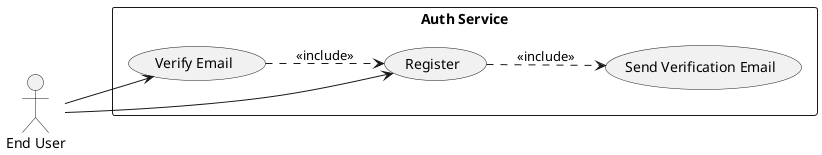
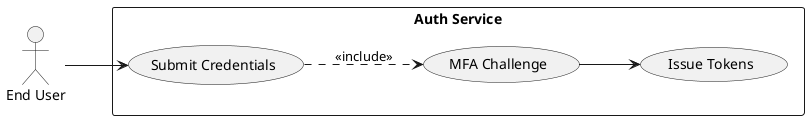
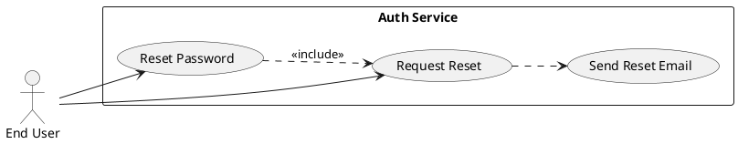
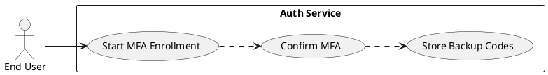
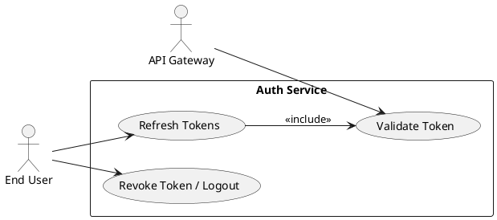
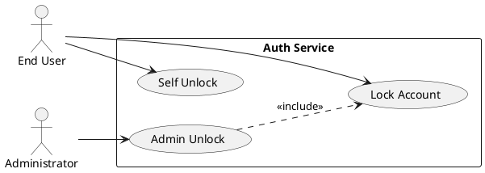

# Requirements Specification

## Feature Goal
Provide a central, secure Authentication System that replaces ad-hoc auth across applications with a unified identity service supporting user registration, secure login, password management, multi-factor authentication (MFA), token-based session management, account protection, and integration with API Gateway and external IdPs.  
Current state: multiple apps implement inconsistent auth rules and storage. Desired state: single, auditable, secure authentication service with deterministic, testable behaviors, configurable security parameters, and well-defined integration contracts.

## Business Justification
- Business value and user impact
  - Reduces security risk and compliance overhead by centralizing authentication and audit trails; enforces OWASP-aligned protections.
  - Improves user experience through consistent registration, login, recovery, and optional MFA flows across web, mobile, and APIs.
  - Lowers developer effort for client apps by providing standardized token validation and integration endpoints.
- Integration with existing features
  - Exposes token validation endpoints for API Gateway, provides OAuth/OIDC connectors for SSO, and supports integration for web/mobile clients.
- Problems this solves and for whom
  - End users: reliable and consistent access flows and recovery options.
  - Security team: centralized policy enforcement, monitoring, and incident response.
  - Developers/Integrators: a single identity service with standard tokens and SDKs.

## Feature Scope
User-visible behavior:
- Sign up with email verification and optional profile fields.
- Login via email + password with optional MFA.
- Password reset via secure email link.
- MFA via Email OTP, SMS OTP, or TOTP authenticator apps (backup codes).
- Token-based session handling: short-lived access tokens + revocable refresh tokens, logout, and inactivity timeout.
- Account lockout after configurable failed attempts; admin unlock + self-unlock via email verification.
Technical requirements:
- Secure password hashing (Argon2id preferred; configurable hashing parameters).
- HTTPS-only endpoints; OWASP controls, strict input validation, rate limiting.
- Configurable TTLs and retry/lockout parameters.
- Audit logging for auth events (login, failed login, password reset, MFA events) with PII minimization.
- Horizontal scaling and stateless access token validation; stateful refresh token store for revocation.
- Integration endpoints: /introspect, /validate-token, /revoke, OIDC discovery.

### Success Criteria
- [ ] Login success rate > 95% across measured user population
- [ ] Login response time < 2s for 95% of auth requests under normal load
- [ ] System supports 10,000+ concurrent sessions without auth failures attributable to the auth service
- [ ] No critical OWASP findings in security audit
- [ ] MFA adoption > 20% of privileged users within 6 months (where applicable)

## Functional Requirements

Before expanding, list of requirements to generate:

| FR-ID | Summary |
|-------|---------|
| FR-001 | User Registration with email verification |
| FR-002 | User Login with credential validation |
| FR-003 | Password Reset (forgot password flow) |
| FR-004 | Password Policy enforcement and validation |
| FR-005 | Multi-Factor Authentication (MFA) support (Email/SMS/TOTP) |
| FR-006 | Session Management (access + refresh tokens, logout, inactivity) |
| FR-007 | Account Lockout and Unlock workflows |
| FR-008 | API Gateway Token Validation / Introspection endpoint |
| FR-009 | Secure Password Storage with configurable hashing (Argon2id) |
| FR-010 | Monitoring, Logging & Audit for auth events (PII-minimized) |
| FR-011 | Scalability & High Availability requirements |
| FR-012 | Rate Limiting & Brute-Force Protection |
| FR-013 | Data Retention & Privacy Controls (configurable defaults) |
| FR-014 | Adaptive / Risk-based Authentication (HYBRID AI-assisted, optional) |

Expand each FR below. Each FR is a MUST and includes acceptance criteria and classification.

- FR-001: [DETERMINISTIC] System MUST allow new users to register an account via email verification.
  - Description: POST /register accepts Email, Password, FirstName, LastName (optional). System validates inputs, enforces password policy, creates a pending user record, and sends a single-use verification email with tokenized link.
  - Acceptance Criteria:
    1. Given valid inputs, POST /register returns 202 Accepted and verification email is queued within 5s.
    2. Verification token is single-use and expires in 24 hours (configurable).
    3. Registering with an already verified email returns 409 Conflict with generic message; registering with unverified email returns 200 with option to resend verification.
    4. Verification endpoint activates account and sets created_date and verification_status; reuse of token returns 410 Gone.
  - Trigger: User submits registration form.
  - Who benefits: End users, Product, Security.
  - Failure scenarios: Email delivery failure (system retries and surfaces temporary error), duplicate registrations, invalid input formats.
  - Notes: Email addresses validated to RFC 5322; rate-limited per IP/account (default: 10 requests/min).

- FR-002: [DETERMINISTIC] System MUST authenticate users via email + password and return access and refresh tokens.
  - Description: POST /login validates credentials against hashed password, applies account status checks, increments failed-login counters, and issues tokens if authentication succeeds (and MFA satisfied if enabled).
  - Acceptance Criteria:
    1. Successful auth returns HTTP 200 and JSON with access_token (JWT, TTL default 15 minutes) and refresh_token (opaque token, TTL default 30 days).
    2. Failed auth returns 401 Unauthorized with generic error; failed login increments counters and logs event without exposing sensitive details.
    3. If MFA is enabled, password success returns 200 with mfa_required true and no tokens until MFA verification completes.
    4. Response times for successful logins < 2s for 95% of requests under normal load.
  - Trigger: POST /login with email+password.
  - Who benefits: End users and client applications.
  - Failure scenarios: Locked accounts, expired verification, throttled requests.

- FR-003: [DETERMINISTIC] System MUST support secure password reset flow.
  - Description: POST /forgot-password generates single-use reset token and sends email with time-limited reset link; POST /reset-password accepts token and new password, validates policy, and updates password hash.
  - Acceptance Criteria:
    1. Forgot password request returns 202 and email queued; token expires in 1 hour (configurable).
    2. Reset endpoint validates token and updates password only if token valid; token invalid/expired returns 410 Gone.
    3. Resetting password invalidates all active refresh tokens for that user (revocation) and logs event.
    4. No sensitive data (password, tokens) are returned in responses or logs.
  - Trigger: User selects "Forgot Password".
  - Who benefits: End users and Security.
  - Failure scenarios: Token expiry, malicious token reuse (prevented via single-use tokens).

- FR-004: [DETERMINISTIC] System MUST enforce a configurable password policy at creation and reset.
  - Description: Passwords must meet policy rules: minimum length, character classes, disallow common passwords, check against breached-password services (optional).
  - Acceptance Criteria:
    1. Passwords shorter than policy return 400 with an explanation of required rules (no leaked password content).
    2. Policy configuration supports minimum length (default 8), uppercase, lowercase, digits, special characters, and optional complexity scoring.
    3. Admin/Config API can update policy; policy changes apply to new/updated passwords only.
    4. Optionally consult HaveIBeenPwned/PwnedPasswords via API when enabled; a positive match blocks password usage.
  - Trigger: Registration or password reset.
  - Who benefits: End users and Security.
  - Failure scenarios: Excessively strict policy causing UX issues (monitor acceptance).

- FR-005: [DETERMINISTIC] System MUST support Multi-Factor Authentication (MFA) via Email OTP, SMS OTP, and TOTP authenticator apps with backup codes.
  - Description: Users can enroll MFA methods; system issues/validates OTPs and TOTP codes; provides single-use backup codes during enrollment and recovery.
  - Acceptance Criteria:
    1. Enrollment flow allows enabling Email, SMS, or TOTP; backup codes are generated and shown once.
    2. OTP delivery for Email and SMS performed via configurable provider; OTP TTL default 5 minutes.
    3. MFA verification endpoint validates code and issues tokens upon success.
    4. Recovery flow for lost MFA device supports backup codes or admin-reset with strict verification and audit logging.
  - Trigger: User enables MFA or system challenges during login.
  - Who benefits: End users, Security.
  - Failure scenarios: SMS deliverability issues (fall back to Email/TOTP), backup-code compromise (single-use consumption and audit).

- FR-006: [DETERMINISTIC] System MUST manage sessions using short-lived access tokens and revocable refresh tokens.
  - Description: Access tokens are JWTs validated statelessly; refresh tokens are opaque and stored server-side (or in a revocation store) so they can be revoked individually.
  - Acceptance Criteria:
    1. Access tokens expire quickly (default 15m); refresh tokens expire after configured TTL (default 30d) and are revocable on logout/password-reset.
    2. POST /refresh exchanges a valid refresh token for new access/refresh token pair; refresh token rotation is used to mitigate replay.
    3. POST /logout revokes the provided refresh token and invalidates session.
    4. Token validation endpoint (/introspect or /validate-token) returns minimal token claims and validity status for API Gateway integration.
  - Trigger: Successful authentication, token refresh, logout.
  - Who benefits: Client apps, Security, API Gateway.
  - Failure scenarios: Token replay attempts (rotation + revocation mitigations), long-lived JWTs causing inability to revoke.

- FR-007: [DETERMINISTIC] System MUST implement account lockout and unlock workflows to prevent brute-force attacks.
  - Description: After a configurable number of failed login attempts, lock account temporarily; support self-unlock via email verification or admin unlock.
  - Acceptance Criteria:
    1. Default lockout after 5 failed attempts within 15 minutes (configurable); lock TTL default 30 minutes.
    2. Locked account login attempts return 423 Locked with generic message and unlock guidance.
    3. Admin UI/API can unlock accounts; self-unlock via verification sends single-use unlock link to verified email.
    4. All lock/unlock events logged in audit trail.
  - Trigger: Failed login attempts threshold reached.
  - Who benefits: Security team, end users.
  - Failure scenarios: Account lockout abuse (Implement IP-based rate limits and notification to user).

- FR-008: [DETERMINISTIC] System MUST expose token validation and introspection endpoints for API Gateway and external services.
  - Description: /introspect and /jwks endpoints for token verification; OIDC discovery support for third-party integrations.
  - Acceptance Criteria:
    1. /jwks returns public keys for JWT verification; /introspect validates token and returns active/inactive and minimal claims.
    2. API Gateway can call /introspect with token and receive deterministic response <200ms under normal load.
    3. Endpoints enforce mutual TLS or API key as configured for machine-to-machine callers.
    4. Errors are logged and do not leak token contents.
  - Trigger: API Gateway or external service requests.
  - Who benefits: API Gateway, Integrations.

- FR-009: [DETERMINISTIC] System MUST store passwords securely using Argon2id (preferred) with configurable parameters; support migration from bcrypt.
  - Description: Passwords hashed using Argon2id with configurable memory/cpu/time parameters stored in secure configuration; migration path from bcrypt/legacy permitted via re-hash on next login.
  - Acceptance Criteria:
    1. New passwords hashed using Argon2id with parameters defined in secure config; config changes applied only via admin operations.
    2. Legacy bcrypt hashes accepted and re-hashed to Argon2id on next successful login.
    3. No plain-text passwords are ever logged; secrets stored in secret manager.
    4. Hashing operations are CPU/memory profiled and documented for capacity planning.
  - Trigger: Password creation or migration.
  - Who benefits: Security team, Compliance.

- FR-010: [DETERMINISTIC] System MUST provide monitoring, logging and auditable trails for authentication events while minimizing PII exposure.
  - Description: Log events include time, user_id (internal), event type, source IP, user agent, result (success/failure). Sensitive fields (passwords, OTPs) never logged.
  - Acceptance Criteria:
    1. Login, logout, failed login, password reset, MFA enrollment/verification, token revocation, and account lock/unlock events are logged.
    2. Logs are structured (JSON), forwarded to central logging with retention policy configurable (default 90 days for audit logs).
    3. Alerts configured for unusual activity (mass failed logins, credential stuffing), with configurable thresholds.
    4. Audit trails are tamper-evident (append-only or signed) and accessible for investigations.
  - Trigger: Auth events.
  - Who benefits: Security, Ops, Compliance.

- FR-011: [DETERMINISTIC] System MUST be horizontally scalable and highly available.
  - Description: Stateless authentication API servers behind load balancer, shared state via DB/Redis for refresh tokens and rate-limiting; health checks and auto-scaling configured.
  - Acceptance Criteria:
    1. Service supports horizontal scaling with stateless access token validation and shared stores for stateful pieces.
    2. Health-check endpoints present and monitored; failover plan documented and tested.
    3. System capacity validated via load tests to meet 10,000+ concurrent sessions target.
    4. Backups and disaster recovery documented with RTO/RPO targets.
  - Trigger: Production load and scaling events.
  - Who benefits: Ops, SRE, End users.

- FR-012: [DETERMINISTIC] System MUST implement rate limiting and brute-force protection at IP and account level.
  - Description: Global and per-endpoint rate limiting configurable; adaptive backoff for repeated failures and CAPTCHA or progressive delay options.
  - Acceptance Criteria:
    1. Rate limits enforced for registration, login, password reset, and MFA endpoints.
    2. Excessive requests return 429 Too Many Requests with Retry-After header.
    3. Brute-force protection integrates with lockout logic and IP reputation services if configured.
    4. Rate limit configuration available via admin settings and monitored via metrics.
  - Trigger: High request volume or repeated failed attempts.
  - Who benefits: Security and platform stability.

- FR-013: [DETERMINISTIC] System MUST provide configurable data retention and privacy controls for authentication data.
  - Description: Retention policies for audit logs, inactive accounts, and tokens; PII minimization; support for data deletion/subject-access requests.
  - Acceptance Criteria:
    1. Default retention periods applied (e.g., audit logs 90 days, inactive user soft-delete 365 days) configurable per policy.
    2. System supports delete/erase requests for user data with admin workflow and audit trail.
    3. Token stores and backups apply encryption-at-rest and access controls.
    4. Data exports and retention settings logged for compliance.
  - Trigger: Admin config, privacy requests.
  - Who benefits: Privacy/Compliance teams, Users.

- FR-014: [HYBRID] System SHOULD support Adaptive / Risk-based Authentication (optional AI-assisted).
  - Description: Risk scoring (device, geolocation, velocity, behaviour) is used to escalate authentication (step-up, require MFA) or flag for review. Risk model can be deterministic rules or ML-assisted models; system must allow human-review for high-risk decisions.
  - Acceptance Criteria:
    1. Risk evaluation pipeline produces a risk score per attempt; configurable thresholds determine actions (allow, challenge, block).
    2. If ML-based model enabled, decisions are logged and reversible; human review workflow exists for false positives.
    3. Model inputs and outputs are auditable; fallback deterministic rules apply if model unavailable.
    4. Feature is opt-in and disabled by default; privacy and bias considerations documented.
  - Trigger: Login attempts, anomalous activity.
  - Who benefits: Security team, Fraud detection.
  - Notes: Marked HYBRID — requires design decisions about model training data, explainability, and monitoring.

**Note**: Requirements marked:
- [UNCLEAR] none implicitly required here; individual items needing clarification are listed in Constraints & Assumptions.

## Use Case Analysis

### Actors & System Boundary
- Primary Actor: End User — registers, logs in, resets password, enrolls MFA, uses applications.
- Secondary Actor: Administrator — manages unlocks, user status, audits.
- System Actor: API Gateway / Client Applications — consume tokens and call validation endpoints.
- External Actors: Email Service Provider, SMS Provider, External Identity Providers (IdP/OIDC), Secret Manager, Central Logging/Monitoring.

### Use Case Specifications

#### UC-001: User Registration & Email Verification
- Actor(s): End User
- Goal: Create a verified account to access services.
- Preconditions: User has an email address and network access; system's email provider is operational.
- Success Scenario:
  1. User submits registration form (email, password, name).
  2. System validates input and password policy; creates pending account.
  3. System sends verification email with single-use token.
  4. User clicks verification link; system activates account and returns success.
- Extensions/Alternatives:
  - 2a. Email already registered → return 409 Conflict with guidance.
  - 3a. Email delivery failed → system retries and shows "verification pending" message.
- Postconditions: Account is active and usable; verification event logged.

Use Case Diagram

#### UC-002: User Login (Password + Optional MFA)
- Actor(s): End User
- Goal: Obtain access to applications via valid credentials and MFA if enabled.
- Preconditions: Account exists and is verified, not locked.
- Success Scenario:
  1. User submits credentials to /login.
  2. System validates credentials; if MFA enabled, responds with mfa_required.
  3. If MFA required, user provides OTP/TOTP; system validates and issues tokens.
  4. Client receives access and refresh tokens and accesses resources.
- Extensions/Alternatives:
  - 2a. Invalid credentials → increment counter; return 401.
  - 2b. Account locked → return 423 with unlock instructions.
  - 3a. MFA fails → return 401 with generic message.
- Postconditions: Access token active; refresh token stored; login event logged.

Use Case Diagram

#### UC-003: Password Reset
- Actor(s): End User
- Goal: Recover access by resetting forgotten password.
- Preconditions: The user has access to the registered email.
- Success Scenario:
  1. User requests password reset.
  2. System generates single-use token and emails reset link.
  3. User follows link and submits new password; system validates and updates hash, revokes refresh tokens.
  4. User can log in with new password (MFA may be required).
- Extensions/Alternatives:
  - 2a. Email not delivered → user shown "check email" and support path.
  - 3a. Token expired → prompt to re-request.
- Postconditions: Password updated; token invalidated; event logged.

Use Case Diagram

#### UC-004: MFA Enrollment & Verification
- Actor(s): End User
- Goal: Enroll and use MFA methods for stronger authentication.
- Preconditions: User authenticated to reach enrollment flow.
- Success Scenario:
  1. User selects MFA method (TOTP/SMS/Email) and starts enrollment.
  2. System provisions secret (TOTP) or sends OTP (SMS/Email) and shows QR/backup codes.
  3. User confirms code; system records MFA method as enabled and stores backup codes.
- Extensions/Alternatives:
  - 2a. SMS failed → offer Email/TOTP fallback.
  - 3a. User loses device → use backup codes or admin reset.
- Postconditions: MFA method active; enrollment logged.

Use Case Diagram

#### UC-005: Token Validation & Session Management
- Actor(s): API Gateway, End User (via client)
- Goal: Validate access tokens and manage session lifecycle.
- Preconditions: Tokens issued by Auth Service.
- Success Scenario:
  1. Client presents access token to API Gateway; Gateway validates token via JWKS or /introspect.
  2. If token valid, request forwarded; if expired, client uses refresh endpoint to obtain new tokens.
  3. Logout endpoint revokes refresh token and logs session termination.
- Extensions/Alternatives:
  - 1a. Token revoked → introspect returns inactive and API Gateway rejects request.
  - 2a. Refresh token compromised → rotation triggers block and admin alert.
- Postconditions: Session valid or invalidated; events logged.

Use Case Diagram

#### UC-006: Account Lockout and Administrative Unlock
- Actor(s): End User, Administrator
- Goal: Prevent brute-force and enable safe unlocking.
- Preconditions: Failed login counter increments present.
- Success Scenario:
  1. System locks account after configurable failed attempts.
  2. User receives notification and self-unlock link or contacts admin.
  3. Admin can unlock account via admin console after verification; unlock event logged.
- Extensions/Alternatives:
  - 2a. Account lockout triggered by suspicious IP -> require additional verification.
- Postconditions: Account unlocked; security events logged.

Use Case Diagram

## Risks & Mitigations
- Risk: Brute-force and credential stuffing — Mitigation: rate limiting, account lockout, IP reputation, CAPTCHA for suspicious activity.
- Risk: Password/credential breaches — Mitigation: Argon2id hashing, breach-check integration, forced rotation for compromised accounts.
- Risk: Token replay and inability to revoke JWTs — Mitigation: short-lived access tokens + revocable refresh tokens and introspection endpoint.
- Risk: MFA delivery failures (SMS/Email) impacting UX — Mitigation: support multiple MFA methods, retry/backoff, provider fallback and monitoring.
- Risk: False positives from adaptive auth causing user friction — Mitigation: human-review workflow, fallback deterministic rules, configurable thresholds, model monitoring.

## Constraints & Assumptions
- Constraint: Password hashing must be configurable but default to Argon2id; system must support migration from bcrypt.
- Constraint: Email/SMS providers must comply with regional regulations; SMS coverage varies by region.
- Constraint: Access tokens must be stateless JWTs; revocation handled via refresh token store and introspection.
- Assumption: Client applications will integrate with API Gateway for token validation rather than each performing raw JWT parsing.
- Assumption: Admins will have an operations console/API for unlocks, audit access, and policy configuration.

---

Rules & Clarifications Needed (items marked for stakeholder confirmation)
- Confirm exact hashing parameters (Argon2id memory/cost defaults) and whether bcrypt must remain supported.
- Confirm SMS provider(s) and international SMS support requirements.
- Confirm acceptable lockout defaults and escalation policy for enterprise users.
- Confirm ML model constraints for FR-014: training data, acceptable false-positive rate, and GDPR/PII constraints.

---

Pre-Delivery Checklist (self-validation)
- [x] Business Alignment: Requirements map to stated objectives and KPIs
- [x] Stakeholder Coverage: Product, Security, DevOps, End Users considered
- [x] Testability: Acceptance criteria provided for each FR
- [x] FR Completeness: Core authentication, session, MFA, tokens, monitoring captured
- [x] Clarity: MUST/SHOULD language used; ambiguous topics flagged
- [x] Traceability: FRs linked to business objectives and use cases
- [x] Risk Assessment: Top risks and mitigations included
- [x] Use Case Diagrams: PlantUML diagrams for each major use case included

---

END OF SPEC DOCUMENT

---

Console Output: Rules Used
- ai-assistant-usage-policy
- code-anti-patterns
- dry-principle-guidelines
- iterative-development-guide
- language-agnostic-standards
- markdown-styleguide
- performance-best-practices
- security-standards-owasp
- uml-text-code-standards

Evaluation Scores

| Category | Score (1-5) |
|----------|-------------|
| Business Alignment | 5 |
| Completeness | 4 |
| Testability | 5 |
| Security & Compliance | 5 |

Average Score: 4.75

Evaluation Summary
This specification aligns strongly to business goals and security best practices, provides measurable acceptance criteria, and includes focused use cases with PlantUML diagrams. Remaining gaps are integration specifics (SMS provider, hashing parameters) and optional adaptive-auth design decisions which are flagged for stakeholder confirmation.