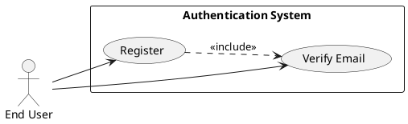
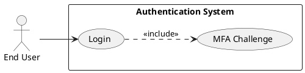
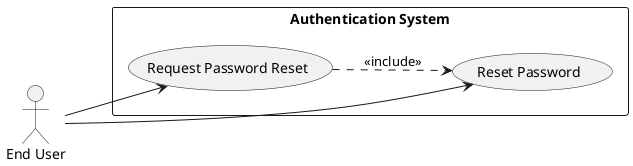
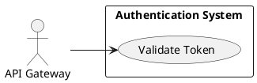

# Requirements Specification

## Feature Goal
Provide a central, secure Authentication System that replaces ad-hoc auth across applications with a unified identity service that supports user registration, secure login, password management, multi-factor authentication (MFA), token-based session management, account protection, and auditable authentication events.  
Current state: multiple applications implement inconsistent auth rules and storage. Desired state: single, auditable, secure authentication service with deterministic, testable behaviors, clearly defined integration contracts, and optional AI-assisted risk detection for future enhancement.

## Business Justification
- Business value and user impact
  - Centralizes authentication to reduce security risk, streamline integrations, and lower maintenance cost.
  - Improves user experience with consistent registration/login/forgot-password flows and optional MFA.
  - Enables security and compliance teams to monitor, audit, and enforce policies centrally (OWASP alignment).
- Integration with existing features
  - Exposes standard token validation endpoints for web, mobile, API Gateway, and internal services; supports OAuth/OIDC connectors for external IdPs.
- Problems this solves and for whom
  - End users: consistent and secure access with predictable recovery flows.
  - Security team: unified logging, rate-limits, and audit trails.
  - Developers: consistent token format and integration patterns across products.

## Feature Scope
User-visible behavior:
- Sign up with email and verification flow
- Login with email + password (with optional MFA)
- Password reset via verified email link
- MFA enrollment and verification (Email OTP, SMS OTP, TOTP)
- Token-based session handling (access + refresh), logout, inactivity timeout
- Account lockout after configurable failed attempts and unlock via email/admin
Technical requirements:
- Secure password hashing (Argon2id recommended; bcrypt allowed)
- HTTPS-only endpoints, OWASP controls, rate limiting, and monitoring
- Configurable TTLs and thresholds (verification token, access token, refresh token, lockout)
- Integration endpoints for API Gateway token validation and external IdPs (OAuth/OIDC)
- Audit logging with configurable retention and PII handling

### Success Criteria
- [ ] Login success rate > 95% across measured user population
- [ ] Login response time < 2s for 95% of auth requests under normal load
- [ ] System supports 10,000+ concurrent sessions without auth failures attributable to the auth service
- [ ] No critical OWASP findings in security audit
- [ ] MFA adoption > 20% of privileged users within 6 months (where applicable)

## Functional Requirements

Before expanding, list of requirements to generate:

| FR-ID | Summary |
|-------|---------|
| FR-001 | User Registration with email verification |
| FR-002 | Email Verification & Account Activation |
| FR-003 | User Login with credential validation and token issuance |
| FR-004 | Password Reset (forgot password flow) |
| FR-005 | Password Policy enforcement |
| FR-006 | Multi-Factor Authentication (MFA) support |
| FR-007 | Session Management (access + refresh tokens, logout, inactivity) |
| FR-008 | Account Lockout and Unlock workflows |
| FR-009 | Rate Limiting & Brute-Force Protection |
| FR-010 | Secure Password Storage & Cryptography |
| FR-011 | API Gateway Token Validation endpoint & Integration |
| FR-012 | Monitoring, Logging & Audit for auth events |
| FR-013 | Performance, Scalability & Availability requirements |
| FR-014 | Adaptive / Risk-based Authentication (AI-Candidate, optional) |
| FR-015 | Administrative Controls (admin unlock, disable, view audit) |
| FR-016 | Data Retention & Privacy Controls |
| FR-017 | Future Integrations: SSO / Social Login / Biometric (UNCLEAR) |

Expand each FR below. Each FR is a MUST and includes acceptance criteria and classification.

- FR-001: [DETERMINISTIC] System MUST allow new users to register an account via email verification.
  - Description: Public endpoint accepts Email, Password, FirstName, LastName. Server validates inputs, enforces password policy, creates a pending account, and sends a single-use verification email link/token.
  - Acceptance Criteria:
    1. Given valid inputs, POST /register returns 202 Accepted and a verification email is queued within 5 seconds.
    2. The verification token is single-use and expires in 24 hours (configurable).
    3. Attempting to register with an existing verified email returns 409 Conflict with "Email already registered".
    4. Re-send verification limited to 3 attempts per 24 hours per account; excess returns 429 Too Many Requests.
  - Trigger: User submits registration form.
  - Who benefits: End users, Product team.
  - Failure scenarios: Invalid email format (400), weak password (400), rate limit exceeded (429).

- FR-002: [DETERMINISTIC] System MUST validate email verification tokens and activate accounts.
  - Description: GET/POST /verify?token=... validates token, activates account, records verification timestamp, deletes/invalidates token.
  - Acceptance Criteria:
    1. Valid token activates account and returns 200 OK; verification timestamp stored.
    2. Expired or used tokens return 400 Bad Request with clear reason.
    3. Activation triggers audit event "account.verified" with user_id and actor IP.
  - Trigger: User clicks verification link.
  - Postcondition: Account status = Active.

- FR-003: [DETERMINISTIC] System MUST authenticate users via email + password and issue access and refresh tokens.
  - Description: POST /login validates credentials against stored password hash; if valid and MFA not enabled, issues access_token (JWT) and refresh_token (opaque or JWT depending on design).
  - Acceptance Criteria:
    1. Successful auth returns HTTP 200 and JSON with access_token (JWT, default TTL 15 minutes) and refresh_token (opaque, TTL 30 days).
    2. Failed auth increments failed-login counters; response is 401 Unauthorized with generic "Invalid credentials".
    3. If MFA enabled, login response returns 200 with mfa_required: true and no tokens until MFA validated.
    4. Response times for successful logins < 2s for 95% of requests under normal load.
  - Trigger: POST /login with email+password.
  - Failure scenarios: Locked accounts (423 Locked), rate-limited IP (429).

- FR-004: [DETERMINISTIC] System MUST provide secure password reset (forgot password) flow.
  - Description: POST /forgot-password generates a single-use, time-limited reset token sent to verified email. POST /reset-password consumes token to set a new password (enforced by policy).
  - Acceptance Criteria:
    1. Reset token TTL default 1 hour (configurable); token single-use.
    2. POST /forgot-password returns 202 Accepted even if email not found (to avoid enumeration).
    3. Reset attempts limited to 3 per 24 hours per account; excess returns 429.
    4. Successful reset invalidates existing refresh tokens for the account.
  - Trigger: User initiates forgot-password.
  - Security note: Reset links include one-time token and do not contain credentials.

- FR-005: [DETERMINISTIC] System MUST enforce a server-side password policy.
  - Description: Passwords must meet configured strength rules and be validated server-side at create/reset.
  - Acceptance Criteria:
    1. Default policy: minimum 8 characters, 1 uppercase, 1 lowercase, 1 number, 1 special character.
    2. Attempts to set passwords violating policy return 400 with policy failure details.
    3. Policy configurable per tenant/environment with documented defaults.
  - Trigger: Registration or password reset submissions.

- FR-006: [HYBRID] System MUST support Multi-Factor Authentication (MFA) using Email OTP, SMS OTP, and TOTP authenticator apps.
  - Description: Users can enroll MFA methods; on login, system issues OTP or TOTP challenge and verifies before issuing tokens.
  - Acceptance Criteria:
    1. User can enroll/deactivate MFA methods from account settings; enrollment requires verification (OTP or TOTP code).
    2. OTPs expire after 5 minutes (configurable); max 5 attempts per OTP.
    3. TOTP verification uses RFC 6238-compatible alg and accepts a configurable clock skew (default ±1 step).
    4. If MFA is enabled for an account, tokens are only issued after successful MFA verification.
  - Trigger: Enrollment or login when MFA enabled.
  - Notes: SMS provider selection and compliance (e.g., region restrictions) documented as integration details.

- FR-007: [DETERMINISTIC] System MUST manage sessions using access and refresh tokens, and support logout and inactivity timeouts.
  - Description: Issue short-lived access tokens and longer-lived refresh tokens; provide endpoints to refresh and revoke tokens and to logout.
  - Acceptance Criteria:
    1. Access token TTL default 15 minutes; refresh token TTL default 30 days (configurable).
    2. POST /token/refresh validates refresh_token and issues new access_token; rotation applied to refresh tokens to support revocation.
    3. POST /logout revokes active refresh tokens and invalidates access tokens server-side where applicable.
    4. Inactivity timeout configurable; inactive sessions expire and require re-authentication.
  - Trigger: Successful authentication or token refresh.
  - Security: Include revocation lists or token introspection support for immediate invalidation.

- FR-008: [DETERMINISTIC] System MUST implement account lockout and unlock workflows.
  - Description: After configurable failed attempts (default 5), account temporarily locks; unlock via email verification or administrative action.
  - Acceptance Criteria:
    1. Default threshold 5 failed attempts within 15 minutes triggers lock for 30 minutes (configurable).
    2. Unlock via "unlock" link sent to account email or via admin console action.
    3. Locked accounts return 423 Locked with minimal leak of information.
  - Trigger: Repeated failed authentication attempts.
  - Failure scenarios: Attack patterns should trigger escalations/alerts.

- FR-009: [DETERMINISTIC] System MUST provide rate limiting and brute-force protection per IP and per account.
  - Description: Enforce layered rate limits for authentication endpoints to mitigate abuse.
  - Acceptance Criteria:
    1. Per-IP and per-account rate limits applied to /login, /register, /forgot-password, /verify endpoints with configurable thresholds.
    2. Exceeding thresholds returns 429 Too Many Requests and logs event.
    3. Rate-limits support dynamic adjustments (configuration & feature toggles).
  - Trigger: High-frequency requests from same IP/account.

- FR-010: [DETERMINISTIC] System MUST securely store passwords and secrets using approved cryptographic practices.
  - Description: Passwords hashed with Argon2id (preferred) or bcrypt with strong cost parameters; secrets stored in managed secret store.
  - Acceptance Criteria:
    1. Passwords stored only as salted hashes; never logged nor returned.
    2. Secret keys loaded from environment/secret manager, never in source.
    3. Crypto algorithms and parameters documented and reviewable.
  - Security: Use TLS 1.2+ for all network transport.

- FR-011: [DETERMINISTIC] System MUST expose an API Gateway token validation endpoint and integrate with external IdPs (OAuth/OIDC).
  - Description: Provide introspection/validation endpoint and support OIDC flows for external IdPs.
  - Acceptance Criteria:
    1. API Gateway can call /introspect (or validate JWT) to check token validity and scopes.
    2. OAuth/OIDC connector supports standard authorization_code flow and maps claims required by relying services.
    3. Integration documented with required claims and signature verification method (JWKs).
  - Trigger: API Gateway or external service requests token validation.

- FR-012: [DETERMINISTIC] System MUST log authentication events and provide audit trails with configurable retention.
  - Description: Log key events: register, verify, login.success, login.failed, password.reset, mfa.enroll, token.refresh, logout, account.lock/unlock.
  - Acceptance Criteria:
    1. Audit events include user_id, timestamp, event_type, source IP, user agent, and correlation id.
    2. Logs are immutable (append-only) and retention configurable with secure access controls.
    3. Sensitive fields are redacted or hashed for privacy (PII handling).
  - Trigger: Any auth-related event.

- FR-013: [DETERMINISTIC] System MUST meet performance, scalability and availability targets.
  - Description: Architectural requirements for horizontal scaling, load balancing, and HA deployments.
  - Acceptance Criteria:
    1. System supports 10,000+ concurrent sessions and horizontal scaling with stateless API nodes (session state in DB or token introspection).
    2. Mean login response <2s for 95% of requests under normal load.
    3. Availability target 99.9% with failover and backups validated.
  - Trigger: Production load and traffic patterns.

- FR-014: [AI-CANDIDATE] System SHOULD support Adaptive / Risk-based Authentication as an optional future capability.
  - Description: System may score login attempts for risk (device, IP reputation, velocity) and require step-up authentication when score exceeds threshold. This is an AI candidate for anomaly detection and risk scoring.
  - Acceptance Criteria:
    1. Risk scoring runs asynchronously and labels high-risk attempts for step-up auth; initial implementation may be rule-based, with a roadmap for ML models.
    2. Feature must be feature-flagged and evaluated in staging before production.
    3. Decisions must be auditable and reversible by admins.
  - Trigger: Suspicious login patterns.
  - Note: Classify as [AI-CANDIDATE]; require separate design/AI-architecture work.

- FR-015: [DETERMINISTIC] System MUST provide administrative controls for account management and investigation.
  - Description: Admin console or API to view audit logs, unlock/disable accounts, and manage configuration.
  - Acceptance Criteria:
    1. Admin actions are audited and require RBAC permissions.
    2. Admin API returns paginated, filterable audit events.
    3. Admin actions cannot bypass MFA enrollment without documented exception workflows.
  - Trigger: Security team or administrators.

- FR-016: [DETERMINISTIC] System MUST support configurable data retention and privacy controls.
  - Description: Logs and PII retention follow configurable policies; supports data export and deletion requests to comply with GDPR.
  - Acceptance Criteria:
    1. Retention periods configurable and enforced; deletion workflows documented.
    2. Data export endpoint supports user-requested data exports in machine-readable format.
    3. Deletion anonymizes or removes PII while preserving required audit trail entries with minimal metadata.
  - Trigger: Regulatory/operational requirements.

- FR-017: [UNCLEAR] System MUST plan for Future Integrations: SSO / Social Login / Biometric options (scope and requirements to be clarified).
  - Description: Placeholder for SSO, Social login (Google/Microsoft), and biometric authentication. Requirements and privacy/regulatory constraints need clarification.
  - Acceptance Criteria:
    1. Work items created after stakeholder decision with mapped scope and security review.
    2. No production rollout without privacy/regulatory approval and design for account linking/merging.

## Use Case Analysis

### Actors & System Boundary
- Primary Actor: End User — authenticates, manages MFA, resets password.
- Secondary Actor: Administrator — manages accounts, views audit logs, unlocks accounts.
- System Actor: API Gateway — validates tokens for downstream services.
- External Actors: Email Provider, SMS Provider, OAuth/OIDC Identity Providers.
- System Boundary: "Authentication System" providing REST APIs for registration, login, MFA, token management, admin operations, and token introspection.

### Use Case Specifications

#### UC-001: User Registration & Verification
- Actor(s): End User
- Goal: Create and activate a new account using email verification.
- Preconditions: Email not already associated with a verified account.
- Success Scenario:
  1. User submits registration form with email, password, name to POST /register.
  2. System validates input and password policy; creates pending account and generates verification token.
  3. System sends verification email with token link.
  4. User clicks link; system validates token and activates account.
  5. System records audit event "account.registered" and "account.verified".
- Extensions/Alternatives:
  - 2a. If password fails policy, return 400 with guidance.
  - 3a. If email provider delivery fails, system retries and logs.
  - 4a. If token expired, user may request re-send (rate-limited).
- Postconditions: account.status = Active; verification timestamp stored.

Use Case Diagram

#### UC-002: User Login (with optional MFA)
- Actor(s): End User
- Goal: Authenticate and obtain access to protected resources.
- Preconditions: Account exists and is not locked; email verified.
- Success Scenario:
  1. User submits credentials to POST /login.
  2. System validates credentials; if invalid, increments failed counter.
  3. If credentials valid and MFA disabled, system issues access and refresh tokens.
  4. If MFA enabled, system responds mfa_required and issues MFA challenge (OTP or TOTP); upon verification tokens issued.
- Extensions/Alternatives:
  - 2a. If account locked, return 423 and instructions.
  - 3a. If rate limit exceeded, return 429.
- Postconditions: Active session established; audit event "login.success".

Use Case Diagram

#### UC-003: Password Reset
- Actor(s): End User
- Goal: Allow a user to securely reset a forgotten password.
- Preconditions: User has a verified email.
- Success Scenario:
  1. User requests reset via POST /forgot-password.
  2. System queues reset email with single-use token.
  3. User uses link to POST /reset-password with token and new password.
  4. System validates token and password policy, updates password, invalidates existing refresh tokens, and logs event.
- Extensions:
  - 2a. If email not found, system returns 202 to avoid enumeration.
- Postconditions: Password updated; previous sessions revoked.

Use Case Diagram

#### UC-004: Enroll and Use MFA
- Actor(s): End User
- Goal: Enroll and use MFA to secure account.
- Preconditions: User is authenticated and email verified.
- Success Scenario:
  1. User chooses MFA method from settings and initiates enrollment.
  2. System issues verification OTP or shows TOTP secret for provisioning.
  3. User submits verification code; system validates and marks method as active.
  4. On subsequent login, MFA is required and must be verified before issuing tokens.
- Extensions:
  - 2a. Provide recovery/backout flow (backup codes) for lost devices.
- Postconditions: MFA method active; audit event recorded.

Use Case Diagram

#### UC-005: Token Validation for API Gateway
- Actor(s): API Gateway
- Goal: Validate access token for downstream services.
- Preconditions: Token presented in Authorization header.
- Success Scenario:
  1. API Gateway calls /introspect or validates JWT signature locally.
  2. Authentication System returns token validity, scopes, and user_id.
  3. API Gateway allows or denies access based on validation.
- Extensions:
  - 1a. If token revoked, return invalid/401.
- Postconditions: Request allowed or denied; token lookup audited.

Use Case Diagram

## Risks & Mitigations (Top 5)
- Brute-force attacks -> Mitigation: Per-IP and per-account rate-limiting, account lockout, progressive delays, and monitoring alerts.
- Password breaches -> Mitigation: Argon2id password hashing, no plaintext storage, breach detection and forced resets on compromise.
- Session hijacking -> Mitigation: Short-lived access tokens, refresh token rotation, TLS enforced, token revocation/introspection.
- MFA circumvention / recovery abuse -> Mitigation: Secure enrollment flows, backup codes, admin-review for recovery requests, fraud detection.
- SMS/Email delivery failure or abuse -> Mitigation: Provider redundancy, delivery retries, fallback (email -> app), and monitoring for spam/abuse.

## Constraints & Assumptions (Top 5)
- Constraint: All traffic must use TLS 1.2+; no plaintext transport allowed.
- Assumption: Email provider and SMS provider integrations will be available and contractually approved by DevOps/security.
- Constraint: Secrets and keys must be stored in a managed secret store (e.g., Azure Key Vault, AWS Secrets Manager).
- Assumption: Downstream services (API Gateway) will adopt the token introspection or public JWKs for JWT verification.
- Constraint: Regulatory/data residency restrictions (GDPR) may require data localization; retention defaults must be configurable.

-----

Console Output (per workflow instructions)

Rules used by the workflow:
- ai-assistant-usage-policy
- code-anti-patterns
- dry-principle-guidelines
- iterative-development-guide
- language-agnostic-standards
- markdown-styleguide
- performance-best-practices
- security-standards-owasp
- uml-text-code-standards

Evaluation Scores
| Criterion | Score (1-4) | Notes |
|----------:|:-----------:|-------|
| Completeness | 4 | All BRD sections mapped; FRs and UCs present |
| Testability | 4 | Measurable acceptance criteria for FRs |
| Clarity | 4 | Requirements use MUST and explicit triggers/outcomes |
| Security Alignment | 4 | OWASP and crypto requirements specified |
| Implementation Feasibility | 3 | Some design decisions (token revocation strategy, SMS provider, SSO scope) require clarification |

Average Score: 3.8

Evaluation summary:
The specification comprehensively translates the BRD into testable, traceable functional requirements and use cases. Security, performance, and integration needs are explicit. Remaining clarifications are targeted (token revocation approach, SMS/compliance, SSO scope) and do not block deterministic implementation of core features.