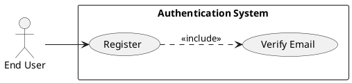
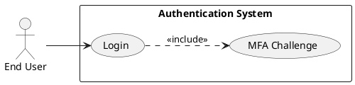
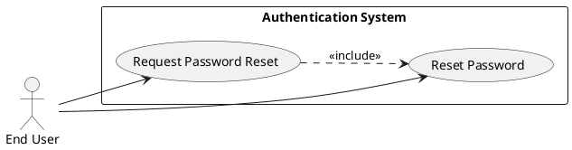
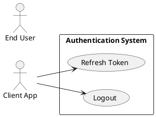
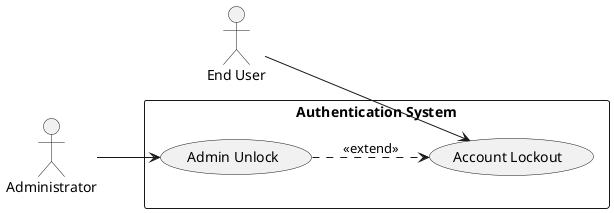

# Requirements Specification

## Feature Goal
Provide a central, secure Authentication System that replaces ad-hoc auth across applications with a unified identity service supporting user registration, secure login, password management, multi-factor authentication (MFA), token-based session management, and account protection. Current state: multiple apps implement inconsistent auth rules and storage. Desired state: single, auditable, secure authentication service with deterministic, testable behaviors and clear integration contracts.

## Business Justification
- Business value and user impact
  - Reduces security risk by centralizing auth, improving compliance (OWASP alignment) and lowering maintenance cost for integrated applications.
  - Improves user experience through consistent login/forgot-password flows and optional MFA.
  - Enables consistent audit trails and centralized policy enforcement for security and compliance teams.
- Integration with existing features
  - Serves web, mobile, API Gateway, and internal services via standardized token validation (JWT + refresh / opaque tokens).
  - Acts as a canonical identity provider for future SSO, SCIM provisioning, and federation.
- Problems this solves and for whom
  - End users: consistent and secure access.
  - Security team: centralized logging, rate-limiting and audit trails.
  - Developers: standardized integration and tokens; reduced duplicated auth code.

## Feature Scope
User-visible behavior:
- Sign up with email verification
- Login with email + password
- Password reset via email link
- Optional MFA via Email OTP, SMS OTP, or authenticator app
- Token-based session handling (access + refresh)
- Account lockout + administrative unlock workflows

Technical requirements:
- Secure password hashing (Argon2id preferred)
- HTTPS-only endpoints, OWASP controls, rate limiting, and monitoring
- Configurable retention and TTL parameters (defaults provided)
- Integration endpoints for API Gateway token validation and external IdP (OAuth/OIDC) connectors

### Success Criteria
- [ ] Login success rate > 95% across measured user population
- [ ] Login response time < 2s for 95% of auth requests under normal load
- [ ] System handles 10,000+ concurrent sessions without auth failures attributable to the auth service
- [ ] No critical OWASP findings in security audit
- [ ] MFA adoption measured; > 20% of privileged users enabled within 6 months (where applicable)

## GenAI Suitability Triage Summary
- Most core authentication functions are rule-based and deterministic: registration, login, token issuance, password reset, MFA flows → [DETERMINISTIC].
- Analytics-driven features (adaptive / risk-based authentication, anomaly detection, login risk scoring) are marked [AI-CANDIDATE] and require explainability, auditability, and human-in-the-loop controls.
- No hybrid use-cases were identified in the core flows; any recommendation or auto-remediation features should be classified [HYBRID] with human confirmation.

## Functional Requirements

Before expanding, list of requirements to generate:

| FR-ID | Summary |
|-------|---------|
| FR-001 | User Registration with email verification |
| FR-002 | User Login with credential validation |
| FR-003 | Password Reset (forgot password flow) |
| FR-004 | Password Policy enforcement |
| FR-005 | Multi-Factor Authentication (MFA) support |
| FR-006 | Session Management (access + refresh tokens, logout, inactivity) |
| FR-007 | Account Lockout and Unlock workflows |
| FR-008 | API Gateway Token Validation endpoint |
| FR-009 | Secure Password Storage (Argon2id) |
| FR-010 | Monitoring, Logging & Audit for auth events |
| FR-011 | Scalability & High Availability requirements |
| FR-012 | Rate Limiting & Brute-Force Protection |
| FR-013 | Data Retention & Privacy Controls (configurable defaults) |
| FR-014 | Adaptive / Risk-based Authentication (AI-CANDIDATE) |

Expand each FR listed above with full specification.

- FR-001: [DETERMINISTIC] System MUST allow new users to register an account via email verification.
  - Description: Registration endpoint accepts email, password, first_name, last_name; creates an unverified account and sends a single-use verification link/token.
  - Acceptance Criteria:
    1. Given valid inputs, POST /register returns 202 Accepted and a verification email is queued within 5 seconds.
    2. Verification token is single-use and expires after 24 hours (configurable).
    3. Attempting to register with an existing verified email returns 409 Conflict with "Email already registered".
    4. Re-send verification limited to 3 per 24 hours per account and 10 per IP per hour.
  - Trigger: User submits registration form.
  - Who benefits: End users, Product & Security teams.
  - Data fields: email, password_hash, user_id, created_date, verification_status.
  - Notes: Email validated per RFC 5322; rate-limited per IP/account.

- FR-002: [DETERMINISTIC] System MUST authenticate users via email + password and issue access and refresh tokens.
  - Description: Credential validation uses secure hash compare; optional MFA challenge may be required before token issuance.
  - Acceptance Criteria:
    1. Successful auth returns HTTP 200 with access_token (JWT, TTL default 15 min) and refresh_token (opaque, TTL default 30 days).
    2. Failed auth increments failed-login counters; invalid credentials return 401 Unauthorized with generic "Invalid credentials".
    3. If MFA enabled, response includes mfa_required and does not return tokens until MFA verified.
    4. 95th percentile response time < 2s under normal load.
  - Trigger: POST /login with email + password payload.
  - Who benefits: End users, integrated applications.
  - Notes: Do not leak whether email exists; use uniform response times and generic errors.

- FR-003: [DETERMINISTIC] System MUST provide a secure "Forgot Password" flow to reset passwords.
  - Description: User requests password reset; system sends single-use reset link/token that expires (default 1 hour).
  - Acceptance Criteria:
    1. POST /password/forgot returns 202 Accepted and queues reset email within 5 seconds.
    2. Reset token is single-use and expires per policy (default 1 hour).
    3. Completing reset requires token and new password meeting password policy; after reset, all active access tokens for that user are revoked.
    4. Repeated requests are rate-limited (e.g., 5 per 24 hours).
  - Trigger: User selects "Forgot Password".
  - Who benefits: End users, Security team.
  - Notes: Do not include sensitive info in emails; support recovery codes for MFA users.

- FR-004: [DETERMINISTIC] System MUST enforce configurable password policy at registration and password-change operations.
  - Description: Password constraints: min length, character classes, banned passwords, history (no reuse of last N).
  - Acceptance Criteria:
    1. Passwords failing policy return 400 with specific validation errors (e.g., "password must include uppercase").
    2. Enforce configurable password history (default N=5) and minimum age/maximum age if enabled.
    3. Validate on client and server; server-side is authoritative.
  - Trigger: Registration or password change API call.
  - Who benefits: Security & Compliance teams.
  - Notes: Provide clear UX messages for each rule (not showing exact policy details that aid attackers).

- FR-005: [DETERMINISTIC] System MUST support Multi-Factor Authentication (MFA) with Email OTP, SMS OTP, and TOTP (authenticator app).
  - Description: MFA enrollment, verification, and authentication flows with recovery codes and device management.
  - Acceptance Criteria:
    1. User can enable MFA via POST /mfa/enroll and verify via OTP/TOTP; successful enrollment stores MFA method metadata.
    2. Login: after password validation, when MFA enabled, require OTP/TOTP; issuance of tokens occurs only after MFA verification.
    3. Provide a secure recovery code generation flow; recovery codes are single-use and shown once.
    4. Admins may view MFA status (not secrets) via protected admin endpoints.
  - Trigger: User opts into MFA or attempts login when MFA enabled.
  - Who benefits: End users, Security team.
  - Notes: SMS OTP subject to provider delivery constraints—offer fallback methods.

- FR-006: [DETERMINISTIC] System MUST manage sessions with access and refresh tokens, support token refresh, logout, and inactivity expiry.
  - Description: Issue short-lived access tokens and longer-lived refresh tokens; allow refresh revocation and forced logout.
  - Acceptance Criteria:
    1. POST /token/refresh accepts valid refresh_token and returns new access_token and optionally rotated refresh_token.
    2. POST /logout invalidates current refresh token and optionally all active sessions for the user (if requested).
    3. Access tokens expire at TTL; refresh tokens can be revoked (blacklist or token-versioning) and must be validated on use.
    4. Password change, account lock, or admin disable invalidates existing sessions.
  - Trigger: Token refresh, logout, password change, admin action.
  - Who benefits: End users, Security & Ops.
  - Notes: Choose revocation strategy (token revocation list vs token version claim) and document trade-offs.

- FR-007: [DETERMINISTIC] System MUST implement account lockout and unlock workflows to mitigate brute-force attacks.
  - Description: Lock account after configurable failed attempts with unlock methods via email verification or admin action.
  - Acceptance Criteria:
    1. Default lock after 5 failed attempts within 15 minutes (configurable).
    2. Locked accounts receive notification and unlock via email verification or admin console; temporary lock duration configurable (e.g., 30 minutes) before auto-unlock.
    3. Admins may immediately unlock and view lockout history via audit logs.
  - Trigger: Repeated failed login attempts or manual admin action.
  - Who benefits: Security team, End users.
  - Notes: Provide clear messaging and DoS protection to prevent account enumeration.

- FR-008: [DETERMINISTIC] System MUST expose a Token Validation endpoint for API Gateway and services to validate tokens.
  - Description: Lightweight endpoints to introspect/validate access tokens and return minimal claims.
  - Acceptance Criteria:
    1. GET /token/validate accepts Authorization header and returns 200 + minimal claims when valid, and 401 when invalid/expired.
    2. Endpoint performance target: <50 ms p95 for introspection under normal load (cacheable).
    3. Support JWT verification via public keys (JWKS) and opaque token introspection with secure calls.
  - Trigger: API Gateway or service calls token validation before allowing access.
  - Who benefits: Integrators, API Gateway, Apps.
  - Notes: Prefer caching public keys and token introspection results to reduce latency.

- FR-009: [DETERMINISTIC] System MUST store passwords using secure hashing (Argon2id recommended) and never store plaintext.
  - Description: Use memory-hard hashing algorithm with configurable parameters; support migration from older hashes.
  - Acceptance Criteria:
    1. Passwords hashed with Argon2id (or bcrypt if environment constraints) with parameters documented and reviewable.
    2. Support re-hashing on login for legacy algorithms to upgrade to Argon2id.
    3. No API returns password or password_hash.
  - Trigger: Registration, password change, login (for re-hash).
  - Who benefits: Security & Compliance.
  - Notes: Keyed hashing or peppering must be documented and secrets stored in a secret manager.

- FR-010: [DETERMINISTIC] System MUST provide monitoring, structured logging, and auditable events for critical authentication actions.
  - Description: Emit structured audit events for registration, login success/fail, password reset, MFA events, lockouts, admin actions.
  - Acceptance Criteria:
    1. Audit events include timestamp, user_id (if available), event_type, source IP, user agent, outcome, and correlation id.
    2. Logs stored in tamper-resistant centralized logging system with retention policy configurable.
    3. Generate alerts for suspicious activity patterns (e.g., high failed login rates).
  - Trigger: All critical auth operations and security events.
  - Who benefits: Security operations, Compliance.
  - Notes: PII minimization in logs; apply encryption and access controls.

- FR-011: [DETERMINISTIC] System MUST support horizontal scaling and high availability.
  - Description: Stateless API layer, shared session/state stores (Redis, DB), automated failover, and load balancing.
  - Acceptance Criteria:
    1. Architecture supports horizontal scaling of API instances and shared caches/datastores with demonstrated capacity for 10k+ concurrent sessions.
    2. Automated failover and health checks configured; RTO/RPO defined.
    3. CI/CD and rolling deploy strategy minimizes downtime; SLOs documented to achieve 99.9% availability.
  - Trigger: Production traffic and scaling events.
  - Who benefits: DevOps, End users.
  - Notes: Provide capacity testing plan and monitoring dashboards.

- FR-012: [DETERMINISTIC] System MUST implement rate limiting and brute-force protection at IP and account levels.
  - Description: Apply global and per-endpoint rate limits; detect and mitigate brute-force attempts with progressive delays or blocks.
  - Acceptance Criteria:
    1. Login endpoints rate-limited per IP and per account (configurable thresholds).
    2. Detected brute-force results in incremental backoff and eventual lockout per FR-007.
    3. Admins can view and override rate-limits/blocks with audit trail.
  - Trigger: High request rates or repeated failed actions.
  - Who benefits: Security & Ops.
  - Notes: Use distributed rate limiting suitable for multi-instance deployment.

- FR-013: [DETERMINISTIC] System MUST provide configurable data retention and privacy controls for user identities.
  - Description: Support configurable retention periods, deletion workflows, and export (for compliance).
  - Acceptance Criteria:
    1. Administrative API to mark and purge accounts respecting retention and legal hold flags.
    2. Support data export of personal data for a user (for GDPR requests) within a specified SLA (e.g., 72 hours).
    3. Deleted accounts remove PII per policy while preserving non-PII audit entries.
  - Trigger: Admin request, user deletion request, compliance processes.
  - Who benefits: Privacy & Compliance teams.
  - Notes: Document retention defaults and override rules.

- FR-014: [AI-CANDIDATE] System MAY implement adaptive/risk-based authentication to adjust authentication requirements based on risk signals.
  - Description: Evaluate login risk using signals (IP reputation, device fingerprint, geolocation, velocity) and recommend or enforce higher assurance (MFA) for risky attempts.
  - Acceptance Criteria:
    1. Risk scoring model provides explainable score and recommended action (allow, require MFA, deny) with human-auditable logs.
    2. Model decisions are logged and reversible; allow policy overrides and human review workflows.
    3. Model performance and fairness metrics monitored; must support rollback to deterministic rules.
  - Trigger: Login attempt with risk signals.
  - Who benefits: Security & Fraud teams.
  - Notes: Requires privacy review, data governance, versioning, and human-in-the-loop for deny decisions. Must include explainability and test datasets. This is an AI candidate and must follow ML governance.

---

## Use Case Analysis

### Actors & System Boundary
- Primary Actor: End User — authenticates to access applications.
- Secondary Actor: Administrator — manages accounts, unlocks accounts, views audit logs.
- System Actor: API Gateway / Client Applications — rely on token validation.
- External Systems: Email Provider, SMS Provider, Authenticator App (TOTP), Identity Providers (OAuth/OIDC), Central Logging/Monitoring.

### Use Case Specifications

#### UC-001: User Registration & Email Verification
- Actor(s): End User
- Goal: Create a verified user account to access protected resources.
- Preconditions: Registration feature enabled; email delivery available.
- Success Scenario:
  1. User submits POST /register with email, password, name.
  2. System validates input and password policy.
  3. System creates unverified account and issues verification token.
  4. System queues verification email with single-use link.
  5. User clicks link; system validates token and marks account verified.
  6. System returns confirmation; user may log in.
- Extensions/Alternatives:
  - 2a. If email already verified → return 409 Conflict.
  - 3a. If email delivery fails repeatedly, system marks account for retry and notifies support.
- Postconditions: Account verified and active; verification event logged.

Use Case Diagram

#### UC-002: User Login (Password + optional MFA)
- Actor(s): End User
- Goal: Authenticate and receive access to application resources.
- Preconditions: User account created and verified; service available.
- Success Scenario:
  1. User submits POST /login with credentials.
  2. System validates credentials and checks lockout status.
  3. If credentials invalid → increment failed counter and return 401.
  4. If MFA enabled → return mfa_required and await OTP/TOTP verification.
  5. Upon MFA success (or no MFA) system issues access_token and refresh_token.
  6. System logs authentication event.
- Extensions/Alternatives:
  - 2a. If account locked → return 423 Locked and trigger unlock workflow.
  - 4a. If MFA attempt fails → allow limited retries; on repeated failures trigger lockout.
- Postconditions: Valid session established; tokens issued.

Use Case Diagram

#### UC-003: Password Reset (Forgot Password)
- Actor(s): End User
- Goal: Reset password when user cannot recall current password.
- Preconditions: Account exists; email delivery functional.
- Success Scenario:
  1. User requests POST /password/forgot with email.
  2. System queues reset email with single-use token.
  3. User clicks reset link and posts new password to /password/reset with token.
  4. System validates token and password policy, updates password, revokes sessions.
  5. System logs password reset event.
- Extensions/Alternatives:
  - 2a. If token expired → inform user and allow re-request with rate limits.
  - 4a. For MFA users, require MFA verification as part of reset flow if policy requires.
- Postconditions: Password updated; previous sessions revoked; audit logged.

Use Case Diagram

#### UC-004: Enable / Verify MFA and MFA Login
- Actor(s): End User
- Goal: Enroll and use MFA for enhanced account protection.
- Preconditions: User logged in and access to chosen second factor (email/SMS/app).
- Success Scenario:
  1. User starts POST /mfa/enroll specifying method.
  2. System sends verification code or presents TOTP secret for authenticator app.
  3. User verifies code via POST /mfa/verify.
  4. System marks MFA method active and provides recovery codes.
  5. Subsequent logins require MFA step per configuration.
- Extensions/Alternatives:
  - 2a. If SMS delivery fails, offer email or authenticator app fallback.
  - 4a. If user loses device, allow recovery via recovery codes or admin-assisted verification.
- Postconditions: MFA method associated with account; recovery codes stored/displayed once.

Use Case Diagram

#### UC-005: Session Management (Token Refresh, Logout)
- Actor(s): End User, API Gateway
- Goal: Maintain and terminate sessions securely.
- Preconditions: User has valid refresh token or active access token.
- Success Scenario:
  1. Client calls POST /token/refresh with refresh_token.
  2. System validates refresh token and issues new access_token (and rotates refresh_token if configured).
  3. For logout, client calls POST /logout and system invalidates refresh token and optionally all sessions.
  4. System logs session events and updates session store.
- Extensions/Alternatives:
  - 2a. If refresh token revoked or expired → return 401 and require re-authentication.
  - 3a. Admin can forcibly revoke all sessions for a user.
- Postconditions: Token lifecycle enforced; revoked tokens denied.

Use Case Diagram

#### UC-006: Account Lockout and Administrative Unlock
- Actor(s): End User, Administrator
- Goal: Protect accounts from brute-force and allow administrative remediation.
- Preconditions: Lockout thresholds configured.
- Success Scenario:
  1. Multiple failed login attempts exceed threshold; system locks account and notifies user.
  2. User requests unlock via email verification link or support ticket.
  3. Administrator may unlock account via admin console after verification steps.
  4. Unlock action recorded in audit logs.
- Extensions/Alternatives:
  - 2a. If automated email unlock fails, admin override available with audit trail.
- Postconditions: Account unlocked; audit entry created.

Use Case Diagram

## Risks & Mitigations
- Risk: Brute-force / credential stuffing attacks
  - Mitigation: FR-012 rate limiting, FR-007 lockout, IP reputation checks, anomaly detection.
- Risk: Password or token disclosure (data breach)
  - Mitigation: FR-009 secure hashing (Argon2id), rotate signing keys, encrypt sensitive fields, secret manager usage.
- Risk: MFA delivery failures (SMS/email) causing account lockouts
  - Mitigation: Provide multiple MFA methods, retry/backoff, admin recovery flows, monitoring for delivery failures.
- Risk: Inaccurate AI risk decisions (false positives/negatives)
  - Mitigation: Human-in-the-loop for deny actions, logging/explainability, conservative default policies, model evaluation/rollback.
- Risk: Token revocation inefficiencies (stale tokens accepted)
  - Mitigation: Implement revocation strategy (token versioning / blacklist with expiry), short access token TTLs, immediate revocation on password change.

## Constraints & Assumptions
- Constraint: All communications require TLS; no plaintext transport.
- Constraint: Secret material (pepper, signing keys) stored in a secret manager; no hardcoding.
- Constraint: System must operate in a horizontally scalable environment; stateful data in managed stores (Redis, DB).
- Assumption: Email and SMS providers available and reliable; fallbacks required.
- Assumption: Regulatory requirements (GDPR) apply and data subject requests must be supported.

## Implementation Considerations
- Token strategy: Short-lived JWT access token (15m) signed with rotating keys via JWKS; opaque refresh tokens stored server-side or validated via token version claim. Document trade-offs and choose one strategy.
- Revocation: Prefer token versioning stored on user record to invalidate existing tokens on sensitive events for O(1) check; use revocation list for immediate invalidation with TTL to limit storage.
- Hashing: Argon2id recommended with parameters set by Security Team and stored in config; support migration flows from legacy hashes.
- MFA: Use standard TOTP (RFC 6238) for authenticator apps; store only shared secret encrypted; generate recovery codes stored hashed or shown once.
- Providers: Abstract Email/SMS providers behind adapters for retry and fallback. Template management for emails must avoid PII disclosure.
- Observability: Emit structured logs and metrics; correlate with request IDs and provide dashboards for SLOs and security alerts.
- Testing: Include unit, integration, and security tests (OWASP test cases) and performance tests for target concurrency.

## Pre-Delivery Checklist
- [ ] Business Alignment: Requirements map to business objectives and KPIs
- [ ] Stakeholder Coverage: Security, Product, DevOps, and End User needs covered
- [ ] Testability: Acceptance criteria provided for each FR
- [ ] FR Completeness: All BRD items mapped to FRs
- [ ] Clarity: Unambiguous MUST statements and measurable thresholds
- [ ] Traceability: FRs linked to stakeholders and success metrics
- [ ] Risk Assessment: Top risks identified with mitigations
- [ ] Use Case Diagrams: UC-001 through UC-006 provided

---

Rules used by this workflow:
- ai-assistant-usage-policy
- dry-principle-guidelines
- security-standards-owasp
- uml-text-code-standards
- markdown-styleguide
- performance-best-practices
- code-anti-patterns
- language-agnostic-standards
- iterative-development-guide

Evaluation Scores

| Criterion               | Score (1-5) |
|------------------------:|:-----------:|
| Business Alignment      | 5           |
| Testability             | 5           |
| Clarity                 | 4           |
| Completeness            | 4           |
| Security Compliance     | 5           |
| Average                 | 4.6         |

Evaluation summary:
The specification aligns strongly with business and security objectives, is testable, and covers core authentication use cases with measurable acceptance criteria. Clarity and completeness are high; remaining gaps (token revocation specifics, provider choices, retention SLAs) are noted as unresolved items to finalize before implementation.