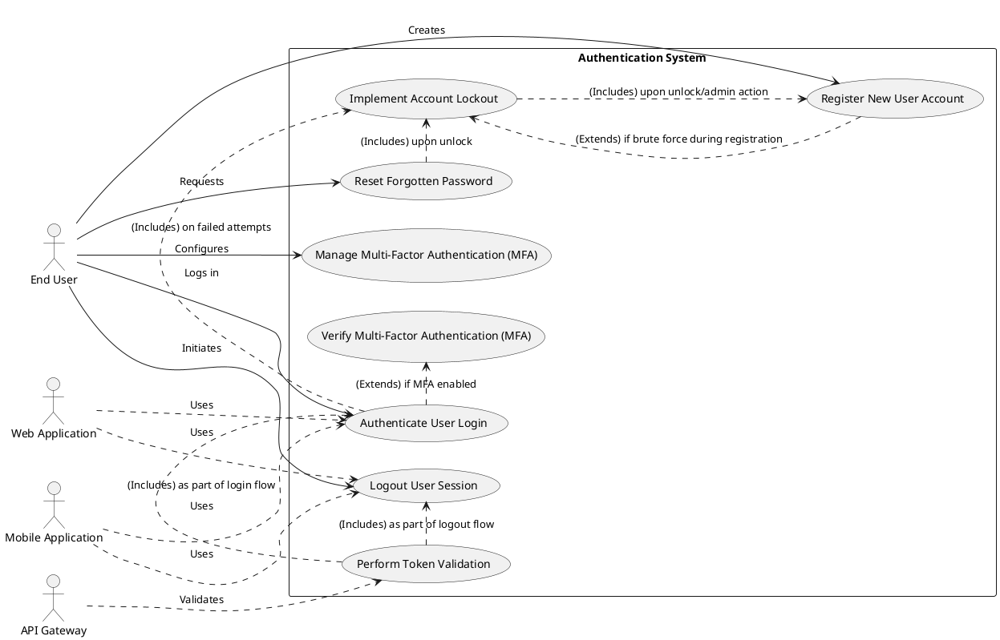

# Product Specification: Authentication System

## 1. Executive Summary

This Product Specification outlines the detailed requirements for the development and implementation of a robust and secure Authentication System. The primary objective is to establish a central identity service that securely verifies user identities, controls access to protected application resources, and issues authentication tokens. This system is critical for safeguarding sensitive user data, ensuring compliance with industry security standards like OWASP Top 10, and providing a scalable, reliable, and user-friendly authentication experience across web applications, mobile applications, and internal services via an API Gateway. Key functionalities include user registration with email verification, secure login authentication, comprehensive password management (including policy enforcement and reset capabilities), multi-factor authentication (MFA), and robust session management with token-based mechanisms and account lockout features.

## 2. Goals and Objectives

The Authentication System is designed to achieve the following strategic business objectives:

*   **Secure Access:** Ensure that only authorized and verified users can access the system's protected resources and sensitive functionalities.
*   **Data Protection:** Implement robust security measures to protect sensitive user credentials, personal information, and system data from unauthorized access or breaches.
*   **Compliance:** Adhere strictly to industry-recognized security best practices and standards, particularly OWASP Top 10, to mitigate common web application vulnerabilities.
*   **User Experience:** Deliver a seamless, intuitive, and secure login and authentication experience that minimizes user friction while maintaining high security.
*   **Scalability:** Develop an authentication service capable of supporting a large and growing number of concurrent users and transactions without compromising performance or reliability.

## 3. Target Users

The Authentication System will serve multiple categories of users and integrating systems:

*   **End Users:** Individuals who require secure access to the application's web or mobile interfaces. They will interact directly with the system for registration, login, password management, and MFA.
*   **Web Applications:** Client applications that integrate with the Authentication System to authenticate users and manage their sessions.
*   **Mobile Applications:** Client applications that integrate with the Authentication System to provide secure access for mobile users.
*   **API Gateway:** An intermediary service that will utilize the Authentication System for validating authentication tokens and securing access to various backend APIs.
*   **Security Team:** Stakeholders responsible for defining, auditing, and enforcing security policies and ensuring compliance.
*   **Development Team:** Engineers responsible for implementing, testing, and maintaining the authentication services and integrating them with client applications.
*   **DevOps Team:** Personnel responsible for deploying, monitoring, and maintaining the infrastructure supporting the Authentication System, ensuring its availability and performance.

## 4. Functional Requirements (FR)

### FR-001: User Registration and Account Creation [HYBRID]

**Description:** The system shall provide a mechanism for new users to securely create a new account within the application.

**Requirements:**

1.  The system SHALL allow a new user to provide their Email, Password, and Name during the registration process.
    *   **Acceptance Criteria:** The user interface MUST present distinct input fields for Email, Password, and Name.
2.  The system SHALL validate the format of the provided email address.
    *   **Acceptance Criteria:** Upon submission, the system MUST reject email addresses that do not conform to a standard email regex pattern (e.g., `user@domain.com`).
3.  The system SHALL enforce the defined password security policy (refer to FR-004) during registration.
    *   **Acceptance Criteria:** If the provided password does not meet the criteria specified in FR-004, the system MUST display an error message and prevent account creation.
4.  The system SHALL prevent the creation of an account if the provided email address is already registered.
    *   **Acceptance Criteria:** If an attempt is made to register with an existing email, the system MUST return an error message indicating that the email is already in use.
5.  Upon successful submission of valid registration details, the system SHALL create a new user account in a "pending verification" status.
    *   **Acceptance Criteria:** A new user record MUST be created in the database with a status of 'Pending' and a unique User ID.

### FR-002: Email Verification for Account Activation [HYBRID]

**Description:** The system shall require email verification to activate newly registered user accounts.

**Requirements:**

1.  Upon successful registration (FR-001), the system SHALL automatically send a unique, time-bound email verification link to the user's registered email address.
    *   **Acceptance Criteria:** An email containing a verification link (e.g., `https://example.com/verify?token=XYZ`) MUST be sent to the user's provided email address within 30 seconds of registration. The link MUST expire after 24 hours.
2.  The system SHALL activate the user account upon successful clicking of the verification link.
    *   **Acceptance Criteria:** When a user clicks a valid verification link, their account status MUST change from 'Pending' to 'Active'.
3.  The system SHALL handle invalid or expired verification links gracefully.
    *   **Acceptance Criteria:** If a user clicks an invalid or expired verification link, the system MUST display an informative error message and offer an option to resend the verification email.

### FR-003: User Login Authentication [HYBRID]

**Description:** The system shall authenticate registered users attempting to access the application.

**Requirements:**

1.  The system SHALL provide an interface for users to enter their Email and Password for login.
    *   **Acceptance Criteria:** The login page MUST contain distinct input fields for Email and Password and a "Login" submission button.
2.  The system SHALL validate the provided credentials against stored user data.
    *   **Acceptance Criteria:** The system MUST compare the provided email and password hash with the stored hash using a secure comparison method.
3.  Upon successful validation of credentials, the system SHALL indicate a successful login and proceed with session management (refer to FR-008).
    *   **Acceptance Criteria:** For valid credentials, the system MUST return a success status code (e.g., HTTP 200 OK) and an authentication token.
4.  Upon unsuccessful validation of credentials (e.g., incorrect email/password, unverified account), the system SHALL display a generic error message.
    *   **Acceptance Criteria:** For invalid credentials, the system MUST return a consistent error message (e.g., "Invalid email or password.") without distinguishing between incorrect email or password.
5.  The system SHALL track failed login attempts per user account and trigger the account lockout mechanism (refer to FR-011).
    *   **Acceptance Criteria:** For each failed login attempt, the system MUST increment a counter associated with the user's email.

### FR-004: Password Policy Enforcement [DETERMINISTIC]

**Description:** The system shall enforce a strong password policy to enhance account security.

**Requirements:**

1.  Passwords SHALL have a minimum length of 8 characters.
    *   **Acceptance Criteria:** Any password shorter than 8 characters MUST be rejected during registration and password reset.
2.  Passwords SHALL include at least one uppercase letter.
    *   **Acceptance Criteria:** Any password without an uppercase letter MUST be rejected during registration and password reset.
3.  Passwords SHALL include at least one lowercase letter.
    *   **Acceptance Criteria:** Any password without a lowercase letter MUST be rejected during registration and password reset.
4.  Passwords SHALL include at least one numerical digit (0-9).
    *   **Acceptance Criteria:** Any password without a numerical digit MUST be rejected during registration and password reset.
5.  Passwords SHALL include at least one special character (e.g., `!@#$%^&*`).
    *   **Acceptance Criteria:** Any password without a special character MUST be rejected during registration and password reset.

### FR-005: Password Reset Mechanism [HYBRID]

**Description:** The system shall allow users to securely reset forgotten passwords.

**Requirements:**

1.  The system SHALL provide a "Forgot Password" option on the login page.
    *   **Acceptance Criteria:** A clickable "Forgot Password" link or button MUST be present on the login interface.
2.  Upon user initiation, the system SHALL request the user's registered email address.
    *   **Acceptance Criteria:** A dedicated input field for email address MUST be displayed when "Forgot Password" is selected.
3.  If the email address is registered, the system SHALL send a unique, time-bound password reset link to that email.
    *   **Acceptance Criteria:** An email containing a secure password reset link (e.g., `https://example.com/reset?token=XYZ`) MUST be sent to the registered email within 30 seconds. The link MUST expire after 60 minutes.
4.  The system SHALL allow the user to set a new password via the reset link, enforcing FR-004.
    *   **Acceptance Criteria:** Upon clicking a valid reset link, the user MUST be directed to a page where they can input a new password twice, and the system MUST validate the new password against FR-004.
5.  Upon successful password reset, the system SHALL invalidate the reset token and update the user's password hash in the database.
    *   **Acceptance Criteria:** After a new password is set, the reset token MUST become unusable, and the `Password Hash` field for the user in the database MUST be updated with the new hash.

### FR-006: Multi-Factor Authentication (MFA) Configuration [HYBRID]

**Description:** The system shall allow users to optionally enable and configure Multi-Factor Authentication (MFA) for enhanced security.

**Requirements:**

1.  The system SHALL provide options for users to enable or disable MFA from their account settings.
    *   **Acceptance Criteria:** A dedicated section in the user's account settings MUST allow toggling MFA status (enabled/disabled).
2.  The system SHALL support Email OTP (One-Time Password) as an MFA method.
    *   **Acceptance Criteria:** When selected, the system MUST send an OTP to the user's registered email for verification during MFA setup and login.
3.  The system SHALL support SMS OTP as an MFA method.
    *   **Acceptance Criteria:** When selected, the system MUST send an OTP to a verified mobile number via SMS for verification during MFA setup and login. (Assumes a mechanism for users to add/verify phone numbers)
4.  The system SHALL support Authenticator App (e.g., Google Authenticator) as an MFA method.
    *   **Acceptance Criteria:** When selected, the system MUST display a QR code or secret key for the user to configure their authenticator app, and then verify an initial OTP generated by the app.

### FR-007: Multi-Factor Authentication (MFA) Verification [HYBRID]

**Description:** The system shall enforce MFA for users who have enabled it during the login process.

**Requirements:**

1.  For users with MFA enabled, after successful primary credential validation (FR-003), the system SHALL prompt for an MFA code.
    *   **Acceptance Criteria:** After a user enters correct email/password, if MFA is enabled, the system MUST present a screen to input the OTP.
2.  The system SHALL generate and send an OTP via the user's configured MFA method (Email, SMS, or Authenticator App).
    *   **Acceptance Criteria:** If Email OTP is chosen, an OTP email MUST be sent within 10 seconds. If SMS OTP is chosen, an SMS MUST be sent within 10 seconds. For Authenticator App, the user generates the OTP locally.
3.  The system SHALL validate the provided OTP within a short time window.
    *   **Acceptance Criteria:** The system MUST accept a valid OTP for a maximum of 60 seconds from its generation/display.
4.  Upon successful OTP validation, the user SHALL be granted access to the application.
    *   **Acceptance Criteria:** If the OTP is correct, the system MUST return a success status code (e.g., HTTP 200 OK) and an authentication token.
5.  Upon unsuccessful OTP validation, the system SHALL display an error message and prevent access.
    *   **Acceptance Criteria:** If the OTP is incorrect or expired, the system MUST display an error message (e.g., "Invalid or expired OTP.") and keep the user from gaining access.

### FR-008: Token-based Session Management [DETERMINISTIC]

**Description:** The system shall manage user sessions using secure, token-based authentication.

**Requirements:**

1.  Upon successful authentication (login or MFA completion), the system SHALL issue a cryptographically signed JSON Web Token (JWT) or a secure session ID.
    *   **Acceptance Criteria:** A valid JWT conforming to RFC 7519 or a securely generated opaque session ID MUST be returned as part of the successful login response.
2.  The issued token SHALL contain essential claims or information for identifying the user and supporting access control decisions by client applications or API Gateways.
    *   **Acceptance Criteria:** The JWT payload MUST include `sub` (subject/user ID), `iss` (issuer), `aud` (audience), `exp` (expiration time), `iat` (issued at time), and potentially `roles` or other authorization-relevant claims.
3.  The system SHALL provide a mechanism for client applications or the API Gateway to validate the authenticity and integrity of issued tokens.
    *   **Acceptance Criteria:** A public key or API endpoint for verifying the JWT signature MUST be available.
4.  The system SHALL ensure the confidentiality and integrity of session tokens during transit.
    *   **Acceptance Criteria:** All communication involving session tokens MUST occur over HTTPS.

### FR-009: Session Expiration [DETERMINISTIC]

**Description:** The system shall manage session lifetimes and automatically log out inactive users.

**Requirements:**

1.  Authentication tokens SHALL have a defined expiration period.
    *   **Acceptance Criteria:** JWTs MUST include an `exp` claim specifying an expiration time, typically 15-30 minutes for short-lived access tokens and 24 hours for refresh tokens (if implemented).
2.  The system SHALL automatically terminate user sessions after a period of inactivity.
    *   **Acceptance Criteria:** If no activity is detected from a user for more than 30 minutes, their current session token MUST be considered invalid by the system and require re-authentication.
3.  Upon session expiration, the user SHALL be required to re-authenticate to regain access.
    *   **Acceptance Criteria:** After an expired session, any subsequent request with the old token MUST result in an "Unauthorized" response (HTTP 401), redirecting the user to the login page.

### FR-010: Explicit Logout Functionality [DETERMINISTIC]

**Description:** The system shall allow users to explicitly terminate their active sessions.

**Requirements:**

1.  The system SHALL provide a "Logout" option within the application interface.
    *   **Acceptance Criteria:** A clearly visible "Logout" button or menu item MUST be available to authenticated users.
2.  Upon receiving a logout request, the system SHALL immediately invalidate the user's current session token.
    *   **Acceptance Criteria:** When a logout request is processed, the associated token MUST be added to a server-side blacklist or revoked, rendering it unusable for subsequent requests.
3.  After successful logout, the user SHALL be redirected to the login page.
    *   **Acceptance Criteria:** Upon successful logout, the application MUST redirect the user to the primary login endpoint.

### FR-011: Account Lockout Mechanism [DETERMINISTIC]

**Description:** The system shall implement an account lockout mechanism to protect against brute-force attacks.

**Requirements:**

1.  The system SHALL temporarily lock a user account after 5 consecutive failed login attempts.
    *   **Acceptance Criteria:** If a user attempts to log in unsuccessfully 5 times within a 5-minute window, their `Status` field in the database MUST change to 'Locked', and further login attempts MUST be rejected with a "Account locked" message.
2.  Locked accounts SHALL remain locked for a minimum duration.
    *   **Acceptance Criteria:** A locked account MUST remain locked for at least 15 minutes before automatic unlock.
3.  The system SHALL provide a mechanism for users to unlock their account via email verification.
    *   **Acceptance Criteria:** Upon receiving an "Account locked" message, the user MUST be presented with an option to initiate an email-based account unlock process, similar to password reset (FR-005).
4.  The system SHALL provide an administrative interface to manually unlock accounts.
    *   **Acceptance Criteria:** An authorized administrator MUST be able to view locked accounts and manually change their status from 'Locked' to 'Active'.

## 5. Non-Functional Requirements (NFR)

### NFR-001: Security Compliance [DETERMINISTIC]

**Description:** The system shall adhere to stringent security standards and practices to protect against vulnerabilities and breaches.

**Requirements:**

1.  The system SHALL be designed and implemented to comply with the OWASP Top 10 security risks.
    *   **Acceptance Criteria:** A security audit and penetration test conducted by an independent third party MUST confirm that the system addresses all relevant OWASP Top 10 vulnerabilities (e.g., Injection, Broken Authentication, Sensitive Data Exposure).
2.  Passwords SHALL be stored using strong, one-way cryptographic hashing algorithms.
    *   **Acceptance Criteria:** All user passwords MUST be hashed using bcrypt or Argon2 with appropriate work factors, and the raw password MUST NEVER be stored.
3.  All communication between the Authentication System and client applications/services SHALL be encrypted using HTTPS.
    *   **Acceptance Criteria:** All API endpoints exposed by the Authentication System MUST enforce HTTPS, rejecting any HTTP requests.
4.  The system SHALL implement comprehensive protection against brute-force attacks.
    *   **Acceptance Criteria:** In addition to account lockout (FR-011), the system MUST implement rate limiting on login attempts (e.g., max 10 login attempts per IP per minute) and password reset requests.
5.  Sensitive data, including password hashes and MFA secrets, SHALL be stored encrypted at rest.
    *   **Acceptance Criteria:** Database fields containing `Password Hash` and any MFA secrets MUST be encrypted using industry-standard encryption protocols (e.g., AES-256).

### NFR-002: Performance [DETERMINISTIC]

**Description:** The system shall deliver high performance for core authentication operations.

**Requirements:**

1.  Login authentication response time SHALL be less than 2 seconds.
    *   **Acceptance Criteria:** 95% of successful login requests MUST complete and return a token to the client within 2 seconds under peak load conditions (NFR-002.2).
2.  The system SHALL support at least 10,000 concurrent active users.
    *   **Acceptance Criteria:** The system MUST maintain login response times within the target (NFR-002.1) when simulating 10,000 users simultaneously performing authentication actions.
3.  System availability SHALL be 99.9% uptime.
    *   **Acceptance Criteria:** The Authentication System MUST be operational and accessible for 99.9% of the scheduled service time per month, excluding planned maintenance.

### NFR-003: Scalability [DETERMINISTIC]

**Description:** The system shall be architected to support growth in user base and traffic.

**Requirements:**

1.  The authentication service SHALL support horizontal scaling.
    *   **Acceptance Criteria:** The system architecture MUST allow for adding new service instances (e.g., Docker containers, VMs) without requiring code changes or downtime, leveraging stateless design where possible.
2.  The system SHALL be compatible with load balancing solutions.
    *   **Acceptance Criteria:** The authentication service instances MUST be deployable behind standard load balancers (e.g., AWS ELB, NGINX) to distribute traffic efficiently.
3.  The system SHALL be designed as a microservice compatible component.
    *   **Acceptance Criteria:** The authentication service MUST expose clearly defined API boundaries and operate independently from other application services, facilitating integration into a microservice ecosystem.

### NFR-004: Reliability [DETERMINISTIC]

**Description:** The system shall be resilient to failures and provide continuous service.

**Requirements:**

1.  The system SHALL utilize backup authentication servers.
    *   **Acceptance Criteria:** At least two geographically distinct and synchronously replicated authentication service instances MUST be deployed.
2.  The system SHALL implement automatic failover mechanisms.
    *   **Acceptance Criteria:** In the event of a primary server failure, traffic MUST automatically be rerouted to a healthy backup server within 60 seconds without manual intervention.
3.  The system SHALL provide comprehensive monitoring and logging capabilities.
    *   **Acceptance Criteria:** All authentication events (login attempts, registration, password resets, MFA events) MUST be logged with sufficient detail (e.g., timestamp, user ID, IP address, status) to a centralized logging system, and key performance metrics MUST be monitored with alerts for anomalies.

### NFR-005: Data Persistence [DETERMINISTIC]

**Description:** The system shall securely store and manage essential user data.

**Requirements:**

1.  The system SHALL persistently store user data including `User ID`, `Email`, `Password Hash`, `Created Date`, `Last Login`, and `Status`.
    *   **Acceptance Criteria:** A robust and scalable database schema MUST be defined and implemented to store these fields for each registered user.
2.  The `Password Hash` field SHALL never contain the plain-text password.
    *   **Acceptance Criteria:** Database queries on the `Password Hash` field MUST only return hashed values, never original user-entered passwords.

### NFR-006: Integration Capability [DETERMINISTIC]

**Description:** The system shall provide well-defined interfaces for integration with other applications and services.

**Requirements:**

1.  The Authentication System SHALL expose RESTful APIs for integration with web applications, mobile applications, and the API Gateway.
    *   **Acceptance Criteria:** API documentation (e.g., OpenAPI/Swagger) MUST be provided for all exposed endpoints, detailing request/response formats, authentication methods, and error codes.
2.  The system SHALL be architected to allow for future integration with external Identity Providers (e.g., OAuth, SSO, Social Login).
    *   **Acceptance Criteria:** The internal user model and authentication flow MUST be extensible to accommodate federated identity without major architectural redesign.

## 6. Use Case Analysis

### UC-001: Register New User Account

*   **Actors:** End User
*   **Trigger:** End User navigates to the registration page and initiates account creation.
*   **Pre-conditions:**
    *   End User does not have an existing account.
    *   End User has internet connectivity.
*   **Main Success Scenario:**
    1.  End User provides valid Email, Password (meeting FR-004), and Name.
    2.  System validates input formats (FR-001.2).
    3.  System checks if email already exists (FR-001.4).
    4.  System creates account in 'Pending Verification' status (FR-001.5).
    5.  System sends email verification link (FR-002.1).
    6.  End User receives and clicks verification link.
    7.  System activates account (FR-002.2).
    8.  System confirms account creation.
*   **Post-conditions:** End User has an active, registered account and can log in.
*   **Alternate Flows:**
    *   **AF-1.1: Invalid Email Format:** System displays "Invalid email format" error (FR-001.2).
    *   **AF-1.2: Password Policy Violation:** System displays error detailing password requirements (FR-001.3).
    *   **AF-1.3: Email Already Registered:** System displays "Email already registered" error (FR-001.4).
    *   **AF-1.4: Verification Link Expired/Invalid:** System displays error, offers to resend link (FR-002.3).

### UC-002: Authenticate User Login

*   **Actors:** End User, Web Application, Mobile Application, API Gateway
*   **Trigger:** End User attempts to log in to the application.
*   **Pre-conditions:**
    *   End User has a registered and active account.
    *   End User has internet connectivity.
*   **Main Success Scenario:**
    1.  End User enters Email and Password on login page (FR-003.1).
    2.  System validates credentials (FR-003.2).
    3.  *(If MFA is disabled)* System issues authentication token (FR-008.1).
    4.  System grants access to application resources.
*   **Post-conditions:** End User is authenticated and has an active session.
*   **Alternate Flows:**
    *   **AF-2.1: Invalid Credentials:** System displays "Invalid email or password" error (FR-003.4). Failed login attempt incremented (FR-003.5).
    *   **AF-2.2: Account Locked:** System displays "Account locked due to too many failed attempts" (FR-011.1).
    *   **AF-2.3: Unverified Account:** System displays "Account not verified, please check your email" and optionally offers to resend verification link.
    *   **AF-2.4: MFA Enabled:** (Pre-condition: MFA is enabled for the user)
        1.  System prompts for MFA code (FR-007.1).
        2.  End User provides correct MFA code (FR-007.2, FR-007.3).
        3.  System issues authentication token (FR-007.4, FR-008.1).

### UC-003: Reset Forgotten Password

*   **Actors:** End User
*   **Trigger:** End User clicks "Forgot Password" on the login page.
*   **Pre-conditions:**
    *   End User has a registered account.
    *   End User has access to their registered email.
*   **Main Success Scenario:**
    1.  End User clicks "Forgot Password" (FR-005.1).
    2.  End User provides registered email address (FR-005.2).
    3.  System sends password reset link to email (FR-005.3).
    4.  End User receives and clicks the reset link.
    5.  End User sets a new password that meets FR-004 (FR-005.4).
    6.  System updates password hash and invalidates reset token (FR-005.5).
    7.  System confirms password reset.
*   **Post-conditions:** End User's password is reset, and they can log in with the new password.
*   **Alternate Flows:**
    *   **AF-3.1: Unregistered Email:** System displays a generic "If the email is registered, a password reset link has been sent" message to prevent enumeration attacks.
    *   **AF-3.2: Reset Link Expired/Invalid:** System displays error, offers to resend link (similar to FR-002.3 handling).
    *   **AF-3.3: New Password Fails Policy:** System displays error (FR-005.4).

### UC-004: Manage Multi-Factor Authentication (MFA)

*   **Actors:** End User
*   **Trigger:** End User accesses their account settings.
*   **Pre-conditions:**
    *   End User is authenticated and has an active session.
*   **Main Success Scenario (Enable MFA - Authenticator App):**
    1.  End User navigates to MFA settings.
    2.  End User selects "Enable MFA" and chooses "Authenticator App" (FR-006.1, FR-006.4).
    3.  System displays QR code/secret key.
    4.  End User scans QR code with Authenticator App.
    5.  End User enters initial OTP generated by app.
    6.  System verifies OTP (FR-006.4).
    7.  System enables MFA for the account.
*   **Post-conditions:** MFA is enabled and configured for the End User's account.
*   **Alternate Flows:**
    *   **AF-4.1: OTP Mismatch:** System displays "Incorrect OTP, please try again."
    *   **AF-4.2: Disable MFA:**
        1.  End User navigates to MFA settings.
        2.  End User selects "Disable MFA" and confirms with current password or existing MFA (e.g., OTP).
        3.  System disables MFA for the account.

### UC-005: Logout User Session

*   **Actors:** End User, Web Application, Mobile Application
*   **Trigger:** End User explicitly requests to end their session or session expires due to inactivity.
*   **Pre-conditions:**
    *   End User is authenticated and has an active session.
*   **Main Success Scenario:**
    1.  End User clicks "Logout" (FR-010.1).
    2.  Client application sends logout request with current token to Authentication System.
    3.  System invalidates session token (FR-010.2).
    4.  System redirects End User to login page (FR-010.3).
*   **Post-conditions:** End User's session is terminated, and they are no longer authenticated.
*   **Alternate Flows:**
    *   **AF-5.1: Session Expiration:** (Triggered by system, not user)
        1.  System detects inactivity for configured period (FR-009.2).
        2.  System automatically invalidates session token.
        3.  On next request, client receives "Unauthorized" and redirects End User to login page (FR-009.3).

### UC-006: Account Lockout and Unlock

*   **Actors:** End User, Authentication System
*   **Trigger:** End User makes multiple failed login attempts.
*   **Pre-conditions:**
    *   End User has an account.
*   **Main Success Scenario (Lockout):**
    1.  End User makes 4 failed login attempts (FR-011.1).
    2.  End User makes 5th failed login attempt.
    3.  System locks the account (FR-011.1).
    4.  System displays "Account locked" error message.
*   **Post-conditions:** End User's account is locked and cannot be used for login.
*   **Alternate Flows (Unlock via Email):**
    1.  End User attempts to log in with a locked account, receives "Account locked" message (FR-011.1).
    2.  End User initiates "Unlock Account" process (FR-011.3).
    3.  System sends unlock link to registered email.
    4.  End User clicks link and confirms unlock.
    5.  System changes account status from 'Locked' to 'Active'.
*   **Alternate Flows (Automatic Unlock):**
    1.  Account is locked.
    2.  15 minutes elapse (FR-011.2).
    3.  System automatically changes account status to 'Active'.

### PlantUML Use Case Diagram

## 7. Constraints, Assumptions, and Risks

### 7.1. Constraints

1.  **Security Standards:** The Authentication System MUST comply with all relevant security standards, including OWASP Top 10 guidelines, and undergo regular security audits and penetration testing.
2.  **Password Hashing Algorithm:** The system MUST use either bcrypt or Argon2 for password hashing, with dynamically adjustable work factors.
3.  **Communication Protocol:** All external communication with the Authentication System APIs MUST be secured using HTTPS (TLS 1.2 or higher).
4.  **Token Standard:** JSON Web Tokens (JWT) or secure opaque session IDs will be used for session management.
5.  **Performance Targets:** Login response times, concurrent user support, and system availability targets (NFR-002) are mandatory for production deployment.
6.  **Integration Interface:** The system MUST expose well-documented RESTful APIs as its primary integration interface.

### 7.2. Assumptions

1.  **Infrastructure Support:** The underlying infrastructure (cloud environment, networking) will provide necessary capabilities for horizontal scaling, load balancing, and automatic failover.
2.  **Email/SMS Gateway:** Reliable and performant third-party email and SMS service providers will be available for sending verification emails, password reset links, and MFA OTPs.
3.  **API Gateway Availability:** An API Gateway component capable of integrating with and consuming tokens from the Authentication System will be in place for managing access to backend services.
4.  **Client Application Compliance:** Integrating web and mobile applications will adhere to secure coding practices and properly handle authentication tokens and session management.
5.  **Security Team Engagement:** The Security Team will be actively involved throughout the development lifecycle, providing guidance and approving security implementations.

### 7.3. Risks and Mitigation

| Risk                      | Description                                                                 | Mitigation Strategy                                                                                                                                                                                                                                                                                                                                             |
| :------------------------ | :-------------------------------------------------------------------------- | :------------------------------------------------------------------------------------------------------------------------------------------------------------------------------------------------------------------------------------------------------------------------------------------------------------------------------------------------------ |
| **Brute Force Attacks**   | Attackers attempting to guess user passwords through numerous automated login attempts. | **Mitigation:** Implement aggressive account lockout (FR-011) and rate limiting on login attempts per IP address/user within a defined time window. Utilize CAPTCHA for suspicious login attempts. Deploy WAF (Web Application Firewall) with bot detection.                                                                                             |
| **Password Breaches**     | Compromise of user passwords due to weak hashing, database breach, or credential stuffing. | **Mitigation:** Enforce strong password policy (FR-004). Use strong, modern, adaptive hashing algorithms (bcrypt/Argon2) (NFR-001.2). Store password hashes encrypted at rest (NFR-001.5). Implement MFA (FR-006, FR-007) to add an extra layer of protection even if passwords are leaked. Conduct regular security audits (NFR-001.1).                      |
| **Session Hijacking**     | An attacker gaining unauthorized control of a user's active session.         | **Mitigation:** Enforce HTTPS for all communications (NFR-001.3). Use secure, short-lived, cryptographically signed tokens (JWTs) (FR-008.1). Implement explicit logout (FR-010) and automatic session expiration (FR-009). Ensure tokens are not stored in insecure client-side locations (e.g., local storage).                                             |
| **Unauthorized Access**   | Malicious actors gaining access to protected resources without proper authentication. | **Mitigation:** Robust authentication (FR-003) and authorization token validation (FR-008). Implement MFA (FR-006, FR-007). Regularly update and patch all system components. Adhere to the principle of least privilege for system access. Conduct regular security testing (penetration testing, vulnerability scanning) (NFR-001.1). |
| **System Downtime**       | Failure of authentication services leading to inability for users to log in.  | **Mitigation:** Implement high availability architecture with redundant servers and automatic failover (NFR-004.1, NFR-004.2). Comprehensive monitoring and logging (NFR-004.3) to detect and respond to issues quickly. Regular backups of critical data.                                                                                             |
| **Scalability Bottlenecks** | Performance degradation or system crashes under high user load.               | **Mitigation:** Design for horizontal scaling and statelessness where possible (NFR-003.1). Implement load balancing (NFR-003.2). Optimize database queries and use caching for frequently accessed data. Conduct stress testing to identify bottlenecks early.                                                                                        |