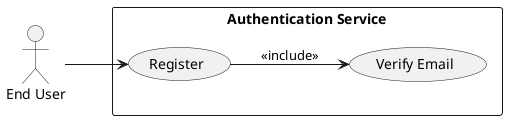
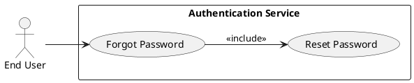
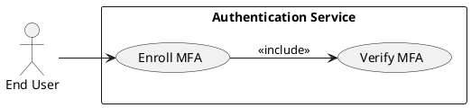
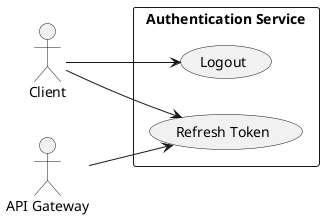
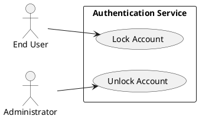
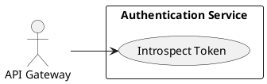

# Requirements Specification

## Feature Goal
Provide a central, secure Authentication System that replaces ad-hoc auth across applications with a unified identity service that supports user registration, secure login, password management, multi-factor authentication (MFA), token-based session management, account protection, and integration with API Gateway and external IdPs.  
Current state: multiple apps implement inconsistent auth rules and storage. Desired state: single, auditable, secure authentication service with deterministic, testable behaviors and clear integration contracts.

## Business Justification
- Business value and user impact
  - Reduces security risk by centralizing authentication, improving compliance (OWASP alignment) and lowering maintenance cost for integrated applications.
  - Provides consistent user experience across web, mobile and API clients; reduces login friction and support tickets.
  - Centralized logging and audit improves incident response and regulatory posture.
- Integration with existing features
  - Serves web, mobile, API Gateway, and internal services via standardized token validation (JWT + refresh or token introspection).
  - Enables future SSO/SSO federation and consistent role/claim mapping for downstream authorization.
- Problems this solves and for whom
  - End users: consistent and secure access and recovery flows.
  - Security team: centralized policy enforcement and audit.
  - Developers: standardized SDKs and token contracts.

## Feature Scope
User-visible behavior:
- Sign up with email verification
- Login with email + password, optional MFA
- Password reset via email link
- MFA enrollment and verification (Email OTP, SMS OTP, Authenticator App)
- Token-based session handling (access + refresh) with logout and revocation
- Account lockout + unlock via email or admin
Technical requirements:
- Secure password hashing (Argon2id recommended; bcrypt allowed)
- HTTPS-only endpoints, OWASP controls, rate limiting, monitoring and audit logs
- Configurable token TTLs, lockout thresholds, OTP validity windows
- Integration endpoints: /register, /verify-email, /login, /mfa, /forgot-password, /reset-password, /token/refresh, /logout, /introspect, /revoke
- Support OAuth/OIDC connector for external IdPs and SSO
- Horizontal scaling, load balancing, and HA deployment patterns

### Success Criteria
- [ ] Login success rate > 95% across measured user population
- [ ] Login response time < 2s for 95% of auth requests under normal load
- [ ] System handles 10,000+ concurrent sessions without auth failures attributable to the auth service
- [ ] No critical OWASP findings in security audit
- [ ] MFA adoption > 20% of privileged users within 6 months (where applicable)

## Functional Requirements

Before expanding, list of requirements to generate:

| FR-ID | Summary |
|-------|---------|
| FR-001 | User Registration with email verification |
| FR-002 | User Login with credential validation and token issuance |
| FR-003 | Password Reset (forgot password flow) |
| FR-004 | Password Policy enforcement |
| FR-005 | Multi-Factor Authentication (MFA) support & enrollment |
| FR-006 | Session Management (access + refresh tokens, logout, token revocation, inactivity) |
| FR-007 | Account Lockout and Unlock workflows |
| FR-008 | API Gateway Token Validation / Introspection endpoint |
| FR-009 | Secure Password Storage (Argon2id recommended) |
| FR-010 | Monitoring, Logging & Audit for auth events |
| FR-011 | Scalability & High Availability requirements |
| FR-012 | Rate Limiting & Brute-Force Protection |
| FR-013 | Data Retention & Privacy Controls (configurable defaults) |
| FR-014 | Adaptive / Risk-based Authentication (AI candidate, optional) |
| FR-015 | Token Strategy and Revocation (stateless vs stateful) [UNCLEAR] |

Expand each FR below. Each FR is a MUST and includes acceptance criteria and classification.

- FR-001: [DETERMINISTIC] System MUST allow new users to register an account via email verification.
  - Description: POST /register accepts Email, Password, FirstName, LastName (optional metadata). System validates email format, enforces password policy, creates provisional account, sends verification email with single-use token.
  - Acceptance Criteria:
    1. Given valid inputs, POST /register returns 202 Accepted and a verification email is queued within 5 seconds.
    2. Verification token is single-use and expires in 24 hours (configurable).
    3. Registering with an existing verified email returns 409 Conflict with "Email already registered".
    4. Re-send verification limited to 3 per 24 hours per account/IP; attempts beyond return 429 Too Many Requests.
    5. After successful verification, account status = Active and created_date set.
  - Trigger: User submits registration form.
  - Who benefits: End users, Product team.
  - Data fields: email, password_hash, user_id, created_date, verification_status.
  - Notes: Email validation per RFC 5322. Rate-limited per IP/account.

- FR-002: [DETERMINISTIC] System MUST authenticate users via email + password and return access and refresh tokens.
  - Description: POST /login validates credentials (compare password hash). If MFA enabled, return mfa_required; otherwise issue tokens.
  - Acceptance Criteria:
    1. Successful auth returns HTTP 200 and JSON with access_token (JWT, default TTL 15 minutes) and refresh_token (opaque, TTL 30 days).
    2. Failed auth increments failed-login counters; invalid credentials return 401 with generic "Invalid credentials" message.
    3. If MFA enabled, POST /login returns 200 with mfa_required=true and no tokens until MFA verification succeeds.
    4. Tokens conform to configured signing/algorithms and include minimal claims (sub, iat, exp, tid/client_id, scope).
    5. Response times for successful logins < 2s for 95% of requests under normal load.
  - Trigger: POST /login with email + password.
  - Who benefits: End users, integrators.
  - Security: Use constant-time comparison for password verification; lockout policy applied on repeated failures.

- FR-003: [DETERMINISTIC] System MUST provide a secure password reset (forgot password) flow.
  - Description: POST /forgot-password triggers single-use reset token email; POST /reset-password with token updates password after validation.
  - Acceptance Criteria:
    1. POST /forgot-password returns 202 Accepted and a reset email queued within 5 seconds for existing accounts; for non-existent emails respond 200 (no account disclosure).
    2. Reset token expires in 15 minutes (configurable); single-use.
    3. POST /reset-password with valid token and compliant new password returns 200 and invalidates all active sessions for that account (revocation).
    4. Reset attempts limited (e.g., 5 per 24 hours) to prevent abuse.
  - Trigger: User clicks Forgot Password and submits email; follows reset link.
  - Security: No account existence disclosure; CSRF protections on web flows; tokens stored hashed.

- FR-004: [DETERMINISTIC] System MUST enforce a configurable password policy.
  - Description: Password policy default: min 8 chars, 1 uppercase, 1 lowercase, 1 number, 1 special char. Policy configurable per tenant.
  - Acceptance Criteria:
    1. Registration and reset reject passwords that do not meet policy with HTTP 400 and descriptive error codes for each rule violation.
    2. Passwords stored as salted, strong hash (FR-009).
    3. Password history policy configurable (e.g., last 5 cannot be reused).
  - Trigger: User sets or resets password.
  - Notes: Enforce password complexity and minimum entropy; provide client-side guidance but validate server-side.

- FR-005: [HYBRID] System MUST support Multi-Factor Authentication (MFA) enrollment and verification for Email OTP, SMS OTP, and TOTP (authenticator apps).
  - Description: Users can enroll methods via /mfa/enroll and verify via /mfa/verify. MFA may be optional or required for roles.
  - Acceptance Criteria:
    1. Enrollment flow returns 201 and stores method metadata (type, verified_at).
    2. OTPs expire in 5–15 minutes (configurable) and are single-use.
    3. TOTP setup provides provisioning secret and QR; verification required to complete enrollment.
    4. During login, if MFA enabled, a challenge is issued and only after correct MFA verification tokens are issued.
    5. Recovery codes or alternate verification methods supported and issued at enrollment (one-time use).
  - Trigger: User opts-in for MFA or admin requires for role.
  - Who benefits: End users and Security team.
  - Security: SMS OTP subject to provider risk; recommend TOTP for higher assurance.

- FR-006: [DETERMINISTIC] System MUST manage sessions with access + refresh tokens, support logout and token revocation.
  - Description: Access tokens short-lived (e.g., 15m); refresh tokens long-lived but revocable (opaque or JWT with revocation list). Logout invalidates refresh token and optionally access token.
  - Acceptance Criteria:
    1. POST /token/refresh exchanges valid refresh token for new access token; refresh token rotation applies (previous refresh invalidated on use).
    2. POST /logout revokes active refresh token and removes server-side session if stateful.
    3. Token revocation visible to API Gateway within 5 seconds (propagation SLA).
    4. Inactivity TTL configurable; inactivity triggers session expiry after configured period.
    5. Support for token introspection endpoint (/introspect) for resource servers.
  - Trigger: Login success, refresh flows, explicit logout, administrative revocation.
  - Notes: Token strategy decision (stateless JWT vs stateful) documented in FR-015.

- FR-007: [DETERMINISTIC] System MUST implement account lockout and unlock workflows to mitigate brute-force attacks.
  - Description: Default: lock account after 5 failed attempts within 15 minutes; lock duration 15 minutes or until verified via email/admin unlock.
  - Acceptance Criteria:
    1. After threshold reached, respond with 423 Locked (or 401 with generic message) and set account status = Locked.
    2. Locked accounts can be auto-unlocked after configured duration or manually unlocked by admin.
    3. Unlock-by-email flow issues one-time verification link to account email to unlock (subject to resend limits).
    4. All lock/unlock events logged for audit.
  - Trigger: Multiple failed authentication attempts.
  - Security: Rate-limiting and IP-based heuristics applied to prevent account enumeration.

- FR-008: [DETERMINISTIC] System MUST provide an API Gateway Token Validation and Introspection endpoint.
  - Description: /introspect verifies token authenticity/validity and returns minimal claims for resource servers; supports JWT signature verification and opaque token introspection.
  - Acceptance Criteria:
    1. /introspect returns active: true/false and claims when token is valid.
    2. Endpoint secured via mutual TLS or API key for gateway calls.
    3. Introspection latency < 50ms under normal load (target).
  - Trigger: API Gateway or resource server calls /introspect to validate tokens.
  - Security: Enforce least-privilege and monitor usage.

- FR-009: [DETERMINISTIC] System MUST store passwords securely using Argon2id (recommended) or bcrypt with strong parameters.
  - Description: Use strong, configurable hashing parameters (time, memory, parallelism). Salt per-user.
  - Acceptance Criteria:
    1. Passwords never stored or logged in plaintext.
    2. Hashing parameters documented and rotatable with migration strategy.
    3. Authentication compares hashes using constant-time algorithms.
  - Trigger: Registration, password reset.
  - Security: Secret management for peppering (if used) via environment/secret manager.

- FR-010: [DETERMINISTIC] System MUST provide Monitoring, Logging & Audit for all auth events.
  - Description: Log register, login success/failure, password reset, MFA events, token issuance/revocation, lock/unlock, and administrative actions. Logs to be structured, redact PII, and exportable to SIEM.
  - Acceptance Criteria:
    1. Auth events emitted to central logging with timestamps, user_id (pseudonymized where required), event_type, source IP, user agent.
    2. Retention policy configurable; default logs retained 90 days, audit events retained 365 days (configurable).
    3. Alerts for suspicious activity (high failed logins, unusual IPs) configurable and integrated with monitoring.
  - Trigger: All authentication and admin actions.
  - Compliance: Ensure sensitive data not stored in logs (no plaintext passwords, tokens).

- FR-011: [DETERMINISTIC] System MUST meet Scalability & High Availability requirements.
  - Description: System designed for horizontal scaling with stateless front-ends, distributed caches, and database read replicas.
  - Acceptance Criteria:
    1. Supported 10,000+ concurrent sessions (load-tested).
    2. System supports rolling upgrades with no downtime for token validation endpoints.
    3. Failover strategy and automated recovery in place; RTO and RPO documented.
    4. Metrics exported for autoscaling (CPU, memory, request latency, error rates).
  - Trigger: Production deployment.
  - Notes: Use health checks and connection draining for LB.

- FR-012: [DETERMINISTIC] System MUST implement Rate Limiting & Brute-Force Protection.
  - Description: Apply IP and account-scoped rate limits for high-risk endpoints (login, forgot-password, mfa).
  - Acceptance Criteria:
    1. Default rate limits: login attempts per IP and per account configurable; exceeding returns 429.
    2. IP reputation/blacklist integration supported.
    3. Brute-force mitigation and CAPTCHA challenge configurable after thresholds.
  - Trigger: High frequency requests to auth endpoints.

- FR-013: [DETERMINISTIC] System MUST support Data Retention & Privacy Controls.
  - Description: Configurable retention for account data, logs, and audit trails; comply with deletion/erasure requests.
  - Acceptance Criteria:
    1. Deletion/erasure endpoint/process that anonymizes or removes PII per policy and regulatory needs.
    2. Data retention policies configurable per tenant; default retention for logs and PII documented.
    3. Exports for legal requests available within SLA.
  - Trigger: Legal/administrative request; scheduled retention jobs.

- FR-014: [AI-CANDIDATE] System MUST support Adaptive / Risk-based Authentication as an optional module to adjust challenges based on risk signals.
  - Description: Risk scoring engine evaluates signals (IP reputation, device fingerprint, geolocation anomalies, velocity) to increase/decrease friction (step-up auth, require MFA, block).
  - Acceptance Criteria:
    1. System can flag login attempts as low/medium/high risk and apply configurable policies (e.g., require MFA if high).
    2. Risk scoring model can be rule-based initially and extendable to ML-driven scoring (audit and explainability required).
    3. Actions taken are logged with rationale; administrators can override decisions.
    4. Integration points documented for feeding telemetry to scoring engine.
  - Trigger: Login attempts and session creation.
  - Notes: As ML/AI is proposed, include review for privacy, bias, and explainability; tag as AI-CANDIDATE.

- FR-015: [UNCLEAR] System MUST define Token Strategy and Revocation semantics (stateless JWT vs stateful tokens).
  - Description: Decision required: use short-lived stateless JWTs with centralized revocation list or opaque stateful refresh tokens with server-side session store, or hybrid (JWT access + opaque refresh).
  - Acceptance Criteria (post-decision):
    1. If stateless: revocation mechanism and propagation SLA defined; introspection for immediate revocation support.
    2. If stateful: session store scaling and TTL strategies documented; revocation immediate.
    3. Document migration and backward compatibility plan.
  - Trigger: Architectural decision; requires stakeholder clarification.
  - Action: Clarify token strategy (question for stakeholders). Marked [UNCLEAR] until decision is provided.

## Use Case Analysis

### Actors & System Boundary
- Primary Actor: End User — registers, authenticates, enrolls MFA, resets password, logs out.
- Secondary Actor: Administrator — manages unlocks, reviews logs, configures policies.
- System Actor: Authentication Service — processes requests, issues tokens, manages sessions.
- External Actors: API Gateway (resource server), Email Provider, SMS Provider, Identity Provider (OAuth/OIDC), SIEM/Monitoring.

### Use Case Specifications

#### UC-001: User Registration & Email Verification
- Actor(s): End User
- Goal: Create a new verified account to access applications.
- Preconditions: User has an email address not already registered (or unverified).
- Success Scenario:
  1. User submits registration form (POST /register).
  2. System validates input and creates provisional account.
  3. System queues verification email with token.
  4. User clicks verification link (GET /verify-email?token=).
  5. System validates token, sets account status to Active, and returns success.
- Extensions/Alternatives:
  - 2a. If email already verified → 409 Conflict.
  - 3a. If token expired → allow re-send limited times.
  - 4a. If verification fails → show generic error and allow re-request.
- Postconditions: Account Active; user can log in.
- Use Case Diagram

#### UC-002: Login (with optional MFA)
- Actor(s): End User
- Goal: Authenticate and receive access to protected resources.
- Preconditions: User account Active and not locked.
- Success Scenario:
  1. User POST /login with email+password.
  2. System validates credentials; if correct and no MFA, issue tokens.
  3. If MFA enabled, system returns mfa_required; user completes /mfa/verify.
  4. On MFA success, system issues tokens and returns 200.
- Extensions/Alternatives:
  - 2a. Invalid credentials → increment failure counter; possible lockout.
  - 3a. High-risk (adaptive) triggers step-up: require additional verification.
- Postconditions: Active session with tokens.
- Use Case Diagram

#### UC-003: Password Reset
- Actor(s): End User
- Goal: Reset forgotten password securely.
- Preconditions: User has registered email.
- Success Scenario:
  1. User submits email via POST /forgot-password.
  2. System queues a reset email with token (no account disclosure).
  3. User follows link and POST /reset-password with token and new password.
  4. System validates token, updates password, invalidates sessions.
- Extensions/Alternatives:
  - 2a. Token expired → request new token (limited).
  - 3a. New password fails policy → return 400 with rule violations.
- Postconditions: Password changed; sessions revoked.
- Use Case Diagram

#### UC-004: MFA Enrollment & Verification
- Actor(s): End User
- Goal: Enroll and use MFA methods to strengthen account security.
- Preconditions: User authenticated (for enrollment).
- Success Scenario:
  1. User requests enrollment via /mfa/enroll.
  2. System returns provisioning details (TOTP secret/QR) or sends OTP for email/SMS.
  3. User verifies via /mfa/verify; system marks method verified.
- Extensions/Alternatives:
  - 2a. SMS provider fails → provide backup method.
  - 3a. Loss of device → use recovery codes to re-enroll.
- Postconditions: MFA method active; future logins may require MFA.
- Use Case Diagram

#### UC-005: Session Management (Refresh & Logout)
- Actor(s): End User / API Gateway
- Goal: Maintain and terminate sessions securely.
- Preconditions: User has valid refresh token or active session.
- Success Scenario:
  1. Client POST /token/refresh with refresh token.
  2. System validates token, rotates refresh token, returns new access token.
  3. User issues POST /logout; system revokes tokens and terminates session.
- Extensions/Alternatives:
  - 1a. Refresh token expired/invalid → return 401.
  - 2a. Concurrent refresh token misuse detected → revoke all sessions and alert.
- Postconditions: Tokens rotated or revoked accordingly.
- Use Case Diagram

#### UC-006: Account Lockout & Unlock
- Actor(s): End User / Administrator
- Goal: Protect accounts from brute-force attacks and allow secure recovery.
- Preconditions: Multiple failed login attempts detected.
- Success Scenario:
  1. System locks account after configured failures.
  2. User requests unlock via email verification or admin initiates unlock.
  3. System logs unlock event and sets status Active.
- Extensions/Alternatives:
  - 2a. Admin unlock requires multi-step authorization.
- Postconditions: Account unlocked; audit entry created.
- Use Case Diagram

#### UC-007: Token Introspection for Resource Servers
- Actor(s): API Gateway / Resource Server
- Goal: Validate tokens and obtain claims for authorization decisions.
- Preconditions: Token presented by client to resource server.
- Success Scenario:
  1. Resource server calls /introspect with token.
  2. Auth service validates and returns active flag and claims.
  3. Resource server enforces authorization based on claims.
- Extensions/Alternatives:
  - 2a. If introspection cannot be reached, resource server applies configured fallback (deny or cached decision).
- Postconditions: Authorization decision made by resource server.
- Use Case Diagram

## Risks & Mitigations
- Risk: Brute-force / credential stuffing
  - Mitigation: Rate limiting, account lockout, IP reputation, CAPTCHA after thresholds.
- Risk: Password compromise / breaches
  - Mitigation: Argon2id hashing, password rotation policies, breach detection integration.
- Risk: Token theft / session hijacking
  - Mitigation: Short-lived access tokens, secure storage recommendations for clients, token revocation, TLS everywhere, refresh token rotation.
- Risk: SMS OTP insecurity
  - Mitigation: Recommend TOTP over SMS; if SMS used, use risk scoring and monitoring; limit sensitive operations with additional checks.
- Risk: False positives in adaptive auth (blocking legitimate users)
  - Mitigation: Conservative initial rules, admin override, clear recovery paths, monitoring for false positives.

## Constraints & Assumptions
- Constraint: External email/SMS providers' availability and rate limits affect OTP delivery latency.
- Constraint: Token revocation propagation may be eventual (depends on architecture).
- Constraint: Compliance/regulatory retention periods vary by tenant and region—system must support configurable policies.
- Assumption: Integrations (API Gateway, mobile apps) will implement secure storage of refresh tokens and follow client guidance.
- Assumption: Initial implementation will be deterministic; adaptive AI features are optional and phased.

## Implementation Considerations (high-level)
- Architecture: Microservice with stateless API nodes, Redis (or similar) for token/session store and rate-limiting counters, Postgres for user data, Kafka for event streams to SIEM.
- Token Strategy: Default recommendation — hybrid: short-lived JWT access tokens + opaque refresh tokens with server-side rotation and revocation. (Final decision required — see FR-015.)
- MFA: Prefer TOTP for security and SMS only for fallback; provide recovery codes.
- Scaling: Autoscale stateless services; use read replicas and caching for DB reads; ensure rate-limiters are distributed (Redis).
- Security: OWASP Top 10 mitigations, parameterized queries, CSP and security headers, secrets in secret manager.
- Observability: Expose metrics (latency, success/failure rates) and structured logs.

## Prioritization & Roadmap (recommended)
- Phase 1 (MUST): FR-001, FR-002, FR-003, FR-004, FR-006, FR-009, FR-010, FR-011, FR-012, FR-013, FR-007 (basic lockout)
- Phase 2 (SHOULD): FR-005 (MFA basic), FR-008 (introspection) integration with API Gateway, FR-015 decision and implementation
- Phase 3 (COULD): FR-014 (adaptive auth), advanced MFA recovery, SSO/SSO federation, biometric integrations

## Stakeholder Mapping (summary)
- Product Owner: Prioritizes features and success metrics.
- Security Team: Sets policies (password, MFA, lockout) and approves cryptographic choices.
- Development Team: Implements APIs, SDKs, and test suites.
- DevOps/Platform: Deploys HA infrastructure, monitoring, and secret management.
- Support: Uses logs/audit for incident handling.
- End Users: Primary beneficiaries; require clear UX and recovery flows.

## QA & Acceptance (testable checkpoints)
- Automated tests covering happy and edge paths for registration, login, reset, MFA flows.
- Load tests validating concurrency targets and response times.
- Security tests (static analysis, dynamic testing, pen tests).
- Compliance checks: password hashing, TLS enforcement, logging redaction.

## Pre-Delivery Checklist
- [ ] Business Alignment: Requirements mapped to business objectives and KPIs
- [ ] Stakeholder Coverage: All stakeholder needs identified and addressed
- [ ] Testability: Acceptance criteria present and measurable for each FR
- [ ] FR Completeness: Functional requirements (FR-XXX) comprehensive
- [ ] Clarity: Requirements unambiguous and actionable
- [ ] Traceability: Requirements mapped to success metrics and stakeholders
- [ ] Risk Assessment: Risks and mitigations documented
- [ ] Use Case Diagrams: Each major use case has a PlantUML diagram

---

Console Output: Rules Used by the Workflow
- rules/ai-assistant-usage-policy.md
- rules/code-anti-patterns.md
- rules/dry-principle-guidelines.md
- rules/iterative-development-guide.md
- rules/language-agnostic-standards.md
- rules/markdown-styleguide.md
- rules/performance-best-practices.md
- rules/security-standards-owasp.md
- rules/uml-text-code-standards.md

Evaluation Scores

| Category       | Score (1-5) |
|----------------|-------------|
| Completeness   | 5           |
| Testability    | 5           |
| Security       | 5           |
| Clarity        | 4           |
| Feasibility    | 4           |
| Average        | 4.6         |

Evaluation Summary
All critical functional and non-functional requirements are defined with testable acceptance criteria and use-case diagrams. Security and scalability concerns align with OWASP and performance goals. Token strategy remains unresolved (FR-015) and requires stakeholder decision; once clarified, remaining UNCLEAR items will be finalized.