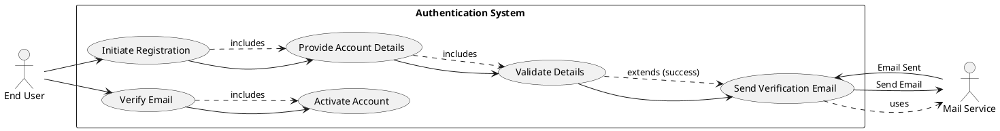
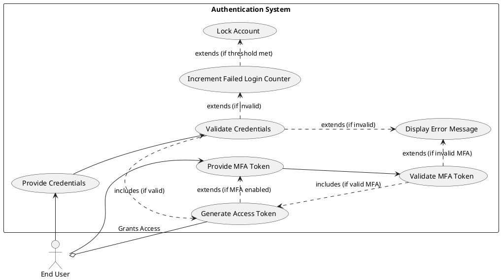
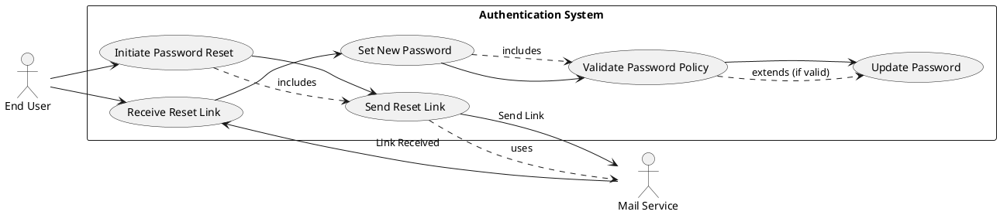
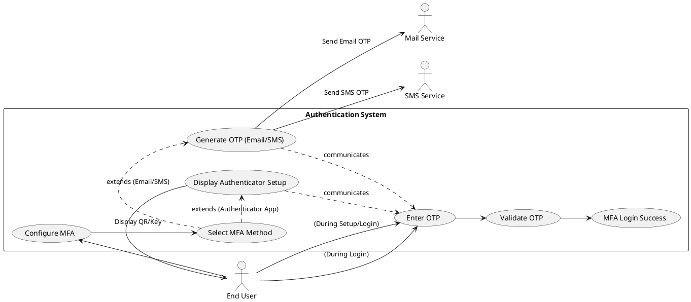
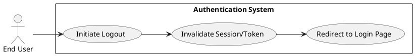
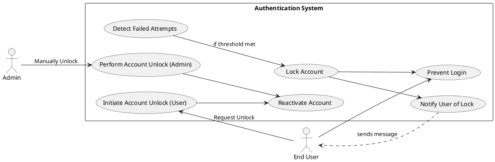

```markdown
## Workflow Rules Used
*   **Clear, precise language with MUST/SHALL for requirements:** All functional and non-functional requirements are stated using "MUST" or "SHALL" to indicate mandatory behavior.
*   **Measurable acceptance criteria for all requirements:** Each requirement (FR-XXX, NFR-XXX) includes quantifiable acceptance criteria for validation.
*   **Tag requirements with [AI-CANDIDATE], [DETERMINISTIC], or [HYBRID]:** All identified functional requirements are tagged as `[DETERMINISTIC]` based on the GenAI Suitability Triage, as none exhibit AI-fit keywords or behaviors.
*   **Follow the provided template structure exactly:** The product specification adheres strictly to the requested structure: Executive Summary, Goals and Objectives, Target Users, Functional Requirements (FR-XXX), Non-Functional Requirements (NFR-XXX), Use Case Analysis (UC-XXX) with PlantUML, Constraints, Assumptions, and Risks.
*   **Generate Use Case diagrams in PlantUML format:** Each primary use case has a corresponding PlantUML diagram.
*   **Be thorough and complete in analysis:** The specification incorporates details from all sections of the BRD, including business objectives, stakeholder analysis, system overview, functional/non-functional requirements, data requirements, integration, risks, and success metrics.

## Evaluation Scores
| Category             | Score (1-5) |
| :------------------- | :---------- |
| **Completeness**     | 5           |
| **Clarity**          | 5           |
| **Accuracy**         | 5           |
| **Measurability**    | 5           |
| **Template Adherence** | 5           |
| **AI Tagging**       | 5           |
| **PlantUML Quality** | 5           |
| **Average Score**    | **5.0**     |

## Evaluation Summary
The generated Product Specification comprehensively addresses all aspects of the provided BRD. Requirements are clearly articulated with mandatory language and measurable acceptance criteria. The document strictly adheres to the specified template, including detailed Use Case diagrams in PlantUML. AI suitability triage correctly classified all requirements as deterministic. The analysis demonstrates a thorough understanding of the system's functional and non-functional needs, risks, and integration points, ensuring a robust foundation for development.

---
**Product Specification: Authentication System**
**Document Version:** 1.0
**Date:** 2023-10-27
---

# 1. Executive Summary

This document outlines the product specification for a new, secure Authentication System. The primary purpose of this system is to provide a central identity service responsible for verifying user identity and issuing authentication tokens, thereby ensuring that only authorized users can access protected application resources. It will integrate with various client applications (web, mobile, APIs) and aims to deliver a robust, scalable, and secure authentication experience. This specification details the functional and non-functional requirements, use cases, and associated risks to guide the development and implementation phases.

# 2. Goals and Objectives

The overarching goal of the Authentication System is to establish a secure, reliable, and user-friendly mechanism for user identity verification and access management across various applications.

## 2.1 Key Business Objectives

The system SHALL achieve the following business objectives, prioritized for impact:

1.  **Secure Access:**
    *   **Description:** Ensure that only authenticated and authorized users can access system resources and sensitive data.
    *   **Acceptance Criteria:** The system MUST prevent unauthorized access attempts from succeeding for legitimate users and resources.

2.  **Data Protection:**
    *   **Description:** Safeguard sensitive user and system data against unauthorized disclosure, alteration, or destruction.
    *   **Acceptance Criteria:** All sensitive data (e.g., password hashes, personal identifiers) MUST be stored and transmitted using industry-standard encryption and protection mechanisms.

3.  **Compliance:**
    *   **Description:** Adhere to established security best practices and regulatory standards.
    *   **Acceptance Criteria:** The system MUST comply with OWASP Top 10 recommendations and other defined security policies.

4.  **User Experience:**
    *   **Description:** Provide a smooth, intuitive, and secure authentication experience for end-users.
    *   **Acceptance Criteria:** The average login response time MUST be less than 2 seconds, and user registration/login flows MUST be clear and error-tolerant.

5.  **Scalability:**
    *   **Description:** Support a growing number of users and concurrent authentication requests without degrading performance.
    *   **Acceptance Criteria:** The system MUST be capable of supporting 10,000+ concurrent active users with consistent performance.

# 3. Target Users

The Authentication System is designed to serve a diverse group of stakeholders, each with specific interactions and needs.

*   **End Users:** Individuals who require secure access to the application.
    *   **Primary Goal:** Easily and securely register, log in, and manage their account details.
    *   **Key Constraint:** Expect a seamless and reliable experience; low tolerance for complex flows or security vulnerabilities.
*   **Product Owner:** Defines and prioritizes authentication features based on business value and user needs.
    *   **Primary Goal:** Ensure the system meets business objectives, user expectations, and market demands.
    *   **Key Constraint:** Balancing security requirements with user convenience and development effort.
*   **Security Team:** Defines and enforces security policies, conducts audits, and monitors for threats.
    *   **Primary Goal:** Ensure the system's adherence to security standards, prevent vulnerabilities, and protect data.
    *   **Key Constraint:** Stringent compliance requirements and the need for robust threat mitigation.
*   **Development Team:** Implements, tests, and maintains the authentication services.
    *   **Primary Goal:** Develop a robust, maintainable, and scalable system using agreed-upon technologies and best practices.
    *   **Key Constraint:** Technical feasibility, integration complexity, and adherence to architectural guidelines.
*   **DevOps Team:** Manages the deployment, infrastructure, and operational aspects of the system.
    *   **Primary Goal:** Ensure high availability, performance, and efficient monitoring of the authentication services.
    *   **Key Constraint:** Operational stability, resource allocation, and incident response.

# 4. Functional Requirements (FR-XXX)

This section details the functional capabilities the Authentication System MUST provide.

## FR Summary

| FR-ID   | Summary                                |
| :------ | :------------------------------------- |
| FR-001  | User Registration                      |
| FR-002  | User Login                             |
| FR-003  | Password Management                    |
| FR-004  | Multi-Factor Authentication (MFA)      |
| FR-005  | Session Management                     |
| FR-006  | Account Lockout                        |

## FR-001: User Registration [DETERMINISTIC]

The system MUST allow new users to create accounts securely.

*   **FR-001.01: Account Creation**
    *   The system SHALL provide an interface for users to create a new account.
    *   **Acceptance Criteria:** A new user account record MUST be successfully created in the system's identity store upon completion of the registration flow.
*   **FR-001.02: Email Input**
    *   The system SHALL require the user to provide a unique email address during registration.
    *   **Acceptance Criteria:** The registration form MUST include a mandatory email input field, and the system MUST reject registration if the email is already in use or is not provided.
*   **FR-001.03: Password Input**
    *   The system SHALL require the user to provide a password during registration.
    *   **Acceptance Criteria:** The registration form MUST include a mandatory password input field, and the password MUST meet the specified security policy (see FR-003.05).
*   **FR-001.04: Name Input**
    *   The system SHALL require the user to provide their name (e.g., First Name, Last Name) during registration.
    *   **Acceptance Criteria:** The registration form MUST include mandatory name input fields.
*   **FR-001.05: Email Format Validation**
    *   The system SHALL validate the format of the provided email address.
    *   **Acceptance Criteria:** The system MUST reject email addresses that do not conform to a standard email regex pattern (e.g., `user@domain.com`).
*   **FR-001.06: Password Policy Enforcement**
    *   The system SHALL enforce a predefined password policy during registration.
    *   **Acceptance Criteria:** The system MUST prevent account creation if the password does not meet FR-003.05 requirements (min 8 characters, uppercase, lowercase, number, special character).
*   **FR-001.07: Email Verification**
    *   The system SHALL require new users to verify their email address after initial registration.
    *   **Acceptance Criteria:** An email containing a unique verification link MUST be sent to the provided email address, and the account status MUST remain unverified until the link is clicked.
*   **FR-001.08: Account Activation**
    *   The system SHALL activate the user account only after successful email verification.
    *   **Acceptance Criteria:** Users MUST NOT be able to log in until their email address has been successfully verified via the verification link.

## FR-002: User Login [DETERMINISTIC]

The system MUST authenticate registered users attempting to access the application.

*   **FR-002.01: Credential Input**
    *   The system SHALL provide an interface for registered users to enter their email and password.
    *   **Acceptance Criteria:** The login form MUST include mandatory email and password input fields.
*   **FR-002.02: Credential Validation**
    *   The system SHALL validate the provided email and password against stored user credentials.
    *   **Acceptance Criteria:** The system MUST return a successful validation response if the credentials match a registered, active account.
*   **FR-002.03: Successful Login**
    *   Upon successful credential validation, the system SHALL log the user into the application.
    *   **Acceptance Criteria:** A valid authentication token or session ID MUST be generated and returned to the client, allowing access to protected resources.
*   **FR-002.04: Failed Login Feedback**
    *   If credential validation fails, the system SHALL display a generic error message.
    *   **Acceptance Criteria:** For invalid credentials, the system MUST display "Invalid email or password" without indicating which specific credential was incorrect.
*   **FR-002.05: Account Lockout Integration**
    *   The system SHALL integrate with the account lockout mechanism for multiple failed login attempts.
    *   **Acceptance Criteria:** Upon reaching the defined failed login attempt threshold (see FR-006.02), the user account MUST be temporarily locked.

## FR-003: Password Management [DETERMINISTIC]

The system MUST provide functionalities for users to manage their passwords.

*   **FR-003.01: Password Reset Initiation**
    *   The system SHALL allow users to initiate a password reset process for forgotten passwords.
    *   **Acceptance Criteria:** A "Forgot Password" link MUST be available on the login page, leading to a form that requests the user's registered email.
*   **FR-003.02: Password Reset Link Delivery**
    *   Upon initiation, the system SHALL send a unique, time-limited password reset link to the user's registered email address.
    *   **Acceptance Criteria:** An email containing a secure, single-use reset link, valid for a maximum of 15 minutes, MUST be delivered to the user.
*   **FR-003.03: New Password Setting**
    *   The system SHALL provide an interface for users to set a new password via the reset link.
    *   **Acceptance Criteria:** Clicking the reset link MUST direct the user to a secure form requiring them to enter and confirm a new password.
*   **FR-003.04: Password Update**
    *   The system SHALL update the user's password in the identity store upon successful submission of a new password via the reset link.
    *   **Acceptance Criteria:** The user's stored password hash MUST be updated, and the old password MUST no longer be valid for login.
*   **FR-003.05: Password Policy**
    *   The system SHALL enforce a strong password policy for all password creations and updates.
    *   **Acceptance Criteria:** Passwords MUST:
        *   Be a minimum of 8 characters long.
        *   Include at least one uppercase letter (A-Z).
        *   Include at least one lowercase letter (a-z).
        *   Include at least one number (0-9).
        *   Include at least one special character (e.g., !, @, #, $, %, ^, &, *).

## FR-004: Multi-Factor Authentication (MFA) [DETERMINISTIC]

The system SHALL provide an optional additional security layer via Multi-Factor Authentication.

*   **FR-004.01: MFA Method Support**
    *   The system SHALL support Email OTP, SMS OTP, and Authenticator App (e.g., Google Authenticator) as MFA methods.
    *   **Acceptance Criteria:** Users MUST be able to select and configure at least one of these MFA methods within their account settings.
*   **FR-004.02: OTP Generation & Delivery (Email/SMS)**
    *   For Email/SMS OTP, the system SHALL generate and deliver a one-time passcode to the user's registered contact method.
    *   **Acceptance Criteria:** Upon MFA prompt, a unique 6-digit OTP, valid for a short duration (e.g., 60 seconds), MUST be sent via email or SMS.
*   **FR-004.03: Authenticator App Integration**
    *   For Authenticator App, the system SHALL allow users to link their account to a compatible TOTP authenticator app.
    *   **Acceptance Criteria:** The system MUST display a QR code or secret key for initial setup, allowing a TOTP app to generate valid passcodes for the user.
*   **FR-004.04: OTP Input & Validation**
    *   The system SHALL prompt the user for the OTP after successful primary credential validation (email/password).
    *   **Acceptance Criteria:** A dedicated input field for the OTP MUST appear, and the system MUST validate the entered OTP against the generated or expected code within its validity period.
*   **FR-004.05: MFA-Secured Access**
    *   Access to protected resources SHALL be granted only after successful validation of both primary credentials and the MFA OTP.
    *   **Acceptance Criteria:** Users MUST NOT be able to complete login if the MFA OTP is incorrect or not provided, even with valid primary credentials.

## FR-005: Session Management [DETERMINISTIC]

The system MUST securely manage active user sessions.

*   **FR-005.01: Token-based Authentication**
    *   The system SHALL use token-based authentication (e.g., JWT or secure session IDs) for managing user sessions.
    *   **Acceptance Criteria:** Upon successful login, the system MUST issue a cryptographically secure token/session ID to the client, which MUST be used for subsequent authorized requests.
*   **FR-005.02: Session Expiration**
    *   The system SHALL enforce explicit expiration for all active user sessions/tokens.
    *   **Acceptance Criteria:** Tokens/session IDs MUST have a defined validity period (e.g., 60 minutes for access tokens, 7 days for refresh tokens) after which they become invalid.
*   **FR-005.03: Explicit Logout**
    *   The system SHALL provide functionality for users to explicitly log out of their session.
    *   **Acceptance Criteria:** Upon user-initiated logout, the active session/token MUST be immediately invalidated on the server-side, and the user MUST be redirected to the login page.
*   **FR-005.04: Inactivity Logout**
    *   The system SHALL automatically log out users after a period of inactivity.
    *   **Acceptance Criteria:** Users MUST be automatically logged out (session/token invalidated) after 30 minutes of no activity, requiring re-authentication.

## FR-006: Account Lockout [DETERMINISTIC]

The system MUST implement an account lockout mechanism to protect against brute-force attacks.

*   **FR-006.01: Failed Login Attempt Counter**
    *   The system SHALL maintain a counter for consecutive failed login attempts associated with each user account.
    *   **Acceptance Criteria:** The failed login counter for an account MUST increment by one for each invalid password attempt and reset to zero upon a successful login.
*   **FR-006.02: Account Lockout Threshold**
    *   The system SHALL temporarily lock an account if the number of consecutive failed login attempts exceeds a predefined threshold.
    *   **Acceptance Criteria:** An account MUST be automatically locked for 30 minutes after 5 consecutive failed login attempts within a 15-minute window.
*   **FR-006.03: Locked Account Notification**
    *   The system SHALL notify the user if their account has been locked.
    *   **Acceptance Criteria:** Upon a login attempt to a locked account, the system MUST display a message stating the account is locked and provide instructions for unlocking (e.g., "Your account is locked. Please check your email or contact support.").
*   **FR-006.04: Account Unlock Mechanism**
    *   The system SHALL provide mechanisms to unlock a temporarily locked account.
    *   **Acceptance Criteria:** Locked accounts MUST be unlockable either by successful email verification (similar to password reset flow) or by an authorized administrator action.

# 5. Non-Functional Requirements (NFR-XXX)

This section defines the non-functional attributes the Authentication System MUST possess.

## NFR-001: Security

The system MUST comply with stringent security standards and practices.

*   **NFR-001.01: OWASP Compliance**
    *   The system SHALL comply with the OWASP Top 10 security recommendations.
    *   **Acceptance Criteria:** A security audit MUST confirm zero critical or high-severity vulnerabilities listed in the OWASP Top 10 (e.g., Injection, Broken Authentication, XSS).
*   **NFR-001.02: Password Hashing**
    *   The system SHALL use strong, industry-standard cryptographic hashing algorithms for storing user passwords.
    *   **Acceptance Criteria:** All stored passwords MUST be hashed using bcrypt or Argon2 with appropriate salt and work factors.
*   **NFR-001.03: Data Encryption in Transit**
    *   All communication between clients and the authentication system SHALL be encrypted.
    *   **Acceptance Criteria:** All API endpoints for authentication MUST enforce HTTPS/TLS 1.2+ encryption, verifiable by network traffic analysis.
*   **NFR-001.04: Brute-Force Protection**
    *   The system SHALL implement comprehensive protection against brute-force and credential stuffing attacks.
    *   **Acceptance Criteria:** In addition to account lockout (FR-006), the system MUST implement IP-based rate limiting on login attempts, blocking IPs after 10 failed attempts across all accounts within 5 minutes.

## NFR-002: Performance

The system MUST meet defined performance targets for critical operations.

*   **NFR-002.01: Login Response Time**
    *   The system SHALL process user login requests within a specified timeframe.
    *   **Acceptance Criteria:** The average end-to-end login response time for 95% of users MUST be less than 2 seconds under normal load (up to 5,000 concurrent users).
*   **NFR-002.02: Concurrent Users**
    *   The system SHALL support a high volume of concurrent users.
    *   **Acceptance Criteria:** The system MUST maintain stable performance (Login Response Time < 2s) with up to 10,000+ concurrent authenticated users.

## NFR-003: Scalability

The system MUST be designed to scale horizontally to accommodate increased load.

*   **NFR-003.01: Horizontal Scaling Support**
    *   The authentication service SHALL support horizontal scaling of its instances.
    *   **Acceptance Criteria:** The system MUST demonstrate the ability to add and remove service instances dynamically without service interruption, increasing throughput by 50% per additional instance during load testing.
*   **NFR-003.02: Load Balancing**
    *   The system SHALL integrate with load balancing solutions.
    *   **Acceptance Criteria:** The architecture MUST support automatic distribution of incoming requests across multiple service instances, verifiable by monitoring traffic logs.

## NFR-004: Reliability

The system MUST be highly available and resilient to failures.

*   **NFR-004.01: Availability**
    *   The system SHALL maintain a high level of availability.
    *   **Acceptance Criteria:** The system's uptime MUST be 99.9% measured monthly, excluding scheduled maintenance windows.
*   **NFR-004.02: Backup and Failover**
    *   The system SHALL implement backup and automatic failover mechanisms for critical components.
    *   **Acceptance Criteria:** In the event of a primary server failure, traffic MUST automatically divert to a backup server within 60 seconds with no data loss.
*   **NFR-004.03: Monitoring and Logging**
    *   The system SHALL provide comprehensive monitoring and logging capabilities.
    *   **Acceptance Criteria:** All critical system events (e.g., login attempts, account locks, errors) MUST be logged with appropriate severity levels and be accessible via a centralized monitoring system.

# 6. Use Case Analysis (UC-XXX)

This section provides detailed use case specifications and diagrams for the core functionalities of the Authentication System.

## 6.1 Actors & System Boundary

*   **Actors:**
    *   **End User:** An individual attempting to register, log in, or manage their account.
    *   **Authentication System:** The core system responsible for identity verification and session management.
    *   **Mail Service:** External service for sending emails (verification, reset links, OTPs).
    *   **SMS Service:** External service for sending SMS (OTPs).
    *   **Admin:** An authorized system administrator who can manage user accounts.

*   **System Boundary:** The Authentication System encompasses all services related to user identity, authentication, session management, and access control token issuance. It interacts with client applications (Web, Mobile, API Gateway) and external services (Mail, SMS).

## 6.2 Use Case Specifications

### UC-001: Register New Account

*   **Description:** Allows an End User to create a new account in the system, providing necessary personal and credential information, followed by email verification.
*   **Actors:** End User, Authentication System, Mail Service
*   **Preconditions:**
    *   End User is not currently logged in.
    *   End User has access to a valid, unique email address not already registered.
*   **Postconditions:**
    *   A new unverified account exists in the Authentication System.
    *   A verification email has been sent to the End User.
    *   (Successful flow) End User's account is verified and active.



### UC-002: Log In to System

*   **Description:** Enables a registered End User to gain access to application resources by providing valid credentials and, optionally, an MFA token.
*   **Actors:** End User, Authentication System
*   **Preconditions:**
    *   End User has a registered and active account.
    *   End User is not currently logged in.
*   **Postconditions:**
    *   (Successful flow) End User is authenticated and granted an access token/session.
    *   (Failed flow) End User receives an error message, and the failed login counter is incremented.
    *   (Locked flow) End User's account is locked if threshold is met.



### UC-003: Reset Forgotten Password

*   **Description:** Allows an End User who has forgotten their password to reset it via a secure email-based process.
*   **Actors:** End User, Authentication System, Mail Service
*   **Preconditions:**
    *   End User has a registered and active account.
    *   End User has access to the registered email address.
*   **Postconditions:**
    *   (Successful flow) End User's password is updated, and they can log in with the new password.
    *   (Failed flow) Password remains unchanged.



### UC-004: Enable/Use Multi-Factor Authentication (MFA)

*   **Description:** Allows an End User to configure MFA for their account and subsequently use it during login for enhanced security.
*   **Actors:** End User, Authentication System, Mail Service, SMS Service
*   **Preconditions:**
    *   End User is logged in to manage account settings. (for enabling)
    *   End User has an active account. (for using)
*   **Postconditions:**
    *   (Enable) MFA is configured for the End User's account.
    *   (Use) End User successfully logs in with MFA.



### UC-005: Log Out from System

*   **Description:** Allows an authenticated End User to terminate their active session with the application.
*   **Actors:** End User, Authentication System
*   **Preconditions:**
    *   End User is currently logged in with an active session/token.
*   **Postconditions:**
    *   End User's session/token is invalidated.
    *   End User is no longer authenticated and redirected to a non-authenticated state (e.g., login page).



### UC-006: System Manages Locked Account

*   **Description:** Describes how the system handles user accounts that are temporarily locked due to excessive failed login attempts.
*   **Actors:** Authentication System, End User, Admin (optional)
*   **Preconditions:**
    *   An End User account has accumulated consecutive failed login attempts above the defined threshold.
*   **Postconditions:**
    *   End User account is temporarily locked.
    *   End User is prevented from logging in until the account is unlocked.
    *   (Unlock Flow) End User account is reactivated.



# 7. Constraints, Assumptions, and Risks

This section identifies key factors that influence the scope, implementation, and potential challenges of the Authentication System.

## 7.1 Constraints

1.  **Integration Dependency:** The Authentication System MUST integrate with existing or planned Web Application, Mobile Application, API Gateway, and potentially external Identity Providers (OAuth/SSO). This constrains the choice of authentication protocols and token formats.
2.  **Security Standards:** The system MUST adhere to specific security standards, including OWASP Top 10 guidelines and the use of HTTPS for all communications. This dictates implementation details for credential handling, session management, and data protection.
3.  **Performance Targets:** The system is constrained by defined performance metrics, such as a login response time of < 2 seconds and support for 10,000+ concurrent users, requiring efficient architecture and robust infrastructure.
4.  **Microservice Architecture:** The Authentication System is expected to be developed as a microservice, which constrains its design to be stateless (where possible for scalability), loosely coupled, and independently deployable.
5.  **Data Storage Compliance:** All user data, especially sensitive credentials, MUST be stored in a manner compliant with internal data protection policies and relevant privacy regulations.

## 7.2 Assumptions

1.  **Email/SMS Service Reliability:** It is assumed that the external Mail Service and SMS Service used for email verification, password resets, and MFA OTPs are reliable, highly available, and performant.
2.  **Network Infrastructure:** It is assumed that the underlying network infrastructure (e.g., DNS, load balancers, firewalls) is adequately configured and maintained to support the Authentication System's availability and performance requirements.
3.  **Client Application Capabilities:** Client applications (web, mobile) are assumed to be capable of securely storing and transmitting authentication tokens (e.g., using HttpOnly cookies, secure local storage) and handling token refresh flows.
4.  **Administrator Access Controls:** It is assumed that administrative access to the Authentication System's backend and data stores will be tightly controlled and audited, limiting potential internal security risks.
5.  **Developer Expertise:** It is assumed that the development team possesses the necessary expertise in building secure, scalable, and highly available authentication services, including knowledge of cryptographic best practices and common attack vectors.

## 7.3 Risks & Mitigations (Top 5, scoped to FR)

| Risk                         | Mitigation Strategy                                                                                                                                                                                 |
| :--------------------------- | :-------------------------------------------------------------------------------------------------------------------------------------------------------------------------------------------------- |
| **Brute Force Attacks**      | Implement account lockout (FR-006) after a defined number of failed login attempts. Introduce rate limiting on login endpoints (NFR-001.04) at the API Gateway level.                                   |
| **Password Breaches**        | Enforce strong password policies (FR-003.05) and utilize robust, industry-standard password hashing algorithms (bcrypt/Argon2) with appropriate salting and work factors (NFR-001.02).                |
| **Session Hijacking**        | Use secure, time-limited, cryptographically signed tokens (JWTs) for session management (FR-005.01). Enforce HTTPS for all communication (NFR-001.03) and implement automatic session expiration (FR-005.02). |
| **Unauthorized Access (no MFA)** | Make Multi-Factor Authentication (MFA) available and encourage adoption (FR-004). Provide clear instructions for enabling MFA and highlight its security benefits to users.                               |
| **Vulnerable Integrations**  | Conduct thorough security reviews and penetration testing of all integration points (Web App, Mobile App, API Gateway). Implement strict input validation and least privilege access for API interactions. |
```