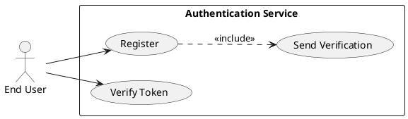
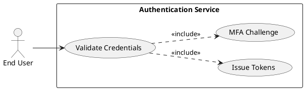
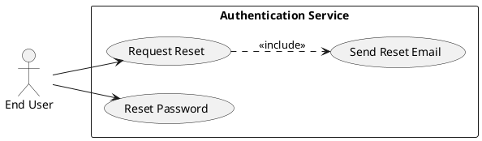
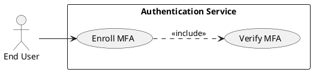
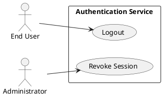
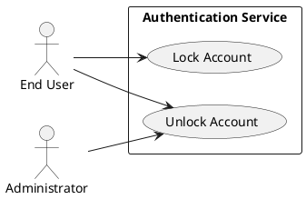
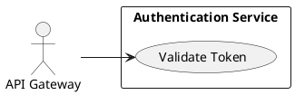

# Requirements Specification

## Feature Goal
Provide a central, secure Authentication Service that replaces ad-hoc authentication across applications with a unified identity platform. Current state: multiple applications implement inconsistent auth rules and storage. Desired state: a single, auditable, secure authentication service that supports deterministic behaviors for registration, login, password management, multi-factor authentication (MFA), token-based session management, account protection, and standardized integration endpoints for web, mobile, and API consumers.

## Business Justification
- Business value and user impact
  - Reduces security risk by centralizing authentication controls, enabling consistent enforcement of policies (OWASP alignment) and centralized auditing.
  - Improves user experience via consistent signup/login/reset flows and optional MFA, lowering support overhead.
  - Lowers integration cost for product teams by providing a single token validation endpoint and standardized SDKs.
- Integration with existing features
  - Provides JWT access tokens and refresh tokens consumable by API Gateway and web/mobile clients.
  - Connectors for external IdPs (OAuth / OIDC) and administrative UI for account management and audit review.
- Problems this solves and for whom
  - End users: consistent, secure access and predictable recovery flows.
  - Security & Compliance: centralized logging, policy enforcement, easier vulnerability management.
  - Developers: standard API for authentication and token validation.

## Feature Scope
User-visible behavior:
- Email-based signup with verification
- Login with email + password
- Password reset via secure email link
- Optional MFA methods: Authenticator App, Email OTP, SMS OTP
- Token-based session handling (access + refresh tokens), logout, inactivity auto-logout
- Account lockout and admin unlock workflows
Technical requirements:
- Secure password hashing (prefer Argon2id; bcrypt as fallback)
- HTTPS-only endpoints, OWASP mitigations, rate limiting, and monitoring
- Configurable TTLs for tokens and verification flows
- Token validation endpoint for API Gateway and external services
- Audit logging for authentication events with configurable retention
- Horizontal scalability and HA deployment model

### Success Criteria
- [ ] Login success rate > 95% across measured user population
- [ ] Login response time < 2s for 95% of auth requests under normal load
- [ ] Service supports 10,000+ concurrent sessions without auth-service-caused failures
- [ ] No critical OWASP findings in security audit
- [ ] MFA adoption > 20% among privileged users within 6 months (where applicable)

## Functional Requirements

Before expanding, list of requirements to generate:

| FR-ID | Summary |
|-------|---------|
| FR-001 | User Registration with email verification |
| FR-002 | Email Verification & account activation |
| FR-003 | User Login with credential validation |
| FR-004 | Token issuance: access and refresh semantics |
| FR-005 | Token validation endpoint for API Gateway |
| FR-006 | Password Reset (forgot password) |
| FR-007 | Enforce Password Policy on create/update |
| FR-008 | MFA enrollment & verification (Authenticator, Email OTP, SMS OTP) |
| FR-009 | Account Lockout and Unlock workflows |
| FR-010 | Session management: expiration, inactivity logout, single sign-out |
| FR-011 | Rate limiting & brute-force protections (IP/account) |
| FR-012 | Audit logging & security event capture |
| FR-013 | Integration with Identity Providers / SSO (OAuth/OIDC) |
| FR-014 | Monitoring, metrics, alerting (latency, errors, lockouts) |
| FR-015 | Adaptive Authentication / Risk-based scoring (HYBRID) |
| FR-016 | Administrative tools for account & audit management |
| FR-017 | Data retention & privacy controls (GDPR/region-specific) |

AI Triage Summary (Phase 0)
- Scan result: most core auth flows are deterministic and rule-based (tagged [DETERMINISTIC]). Adaptive/risk-based authentication and future anomaly detection features are [HYBRID] or [AI-CANDIDATE].
- Tagging approach applied to FRs above: FR-015 marked [HYBRID]/[AI-CANDIDATE] for risk scoring; all others default [DETERMINISTIC]. Tags appear inline below.

Expand each requirement (MUST + Acceptance Criteria). Each FR is a MUST.

- FR-001: [DETERMINISTIC] System MUST allow users to register an account via email verification.
  - Description: POST /register accepts email, password, firstName, lastName. Validates email format and password policy; creates a pending account and sends verification email with single-use token.
  - Acceptance Criteria:
    1. Given valid inputs, POST /register returns 202 Accepted and a verification email is queued within 5s.
    2. Verification token is single-use and expires in 24 hours (configurable).
    3. Registering with an existing verified email returns 409 Conflict with generic message "Email already registered".
    4. Re-send verification limited to 3 attempts per 24 hours per account; beyond limit returns 429 Too Many Requests.
  - Trigger: User submits registration form.
  - Success: Account transitions to Active after successful verification.
  - Failure: Invalid input → 400 Bad Request; rate-limit hit → 429.
  - Stakeholders: End Users, Product, Security.

- FR-002: [DETERMINISTIC] System MUST verify email and activate accounts.
  - Description: GET/POST /verify-email accepts token; on success, marks account verified and sets created_date/verified_date.
  - Acceptance Criteria:
    1. Valid token within TTL activates account and returns 200 OK.
    2. Reuse of token returns 410 Gone or 400 with "Token invalid or expired".
    3. Expired token path supports re-send verification per FR-001 rules.
  - Trigger: User clicks verification link.
  - Success: User may login per FR-003.
  - Failure: Token expired/invalid → user receives generic guidance; no email enumeration.

- FR-003: [DETERMINISTIC] System MUST authenticate users with email and password and handle MFA challenges.
  - Description: POST /login validates credentials against secure password hash; on success issue tokens or return mfa_required if MFA enabled.
  - Acceptance Criteria:
    1. Successful auth returns 200 and either tokens or JSON { mfa_required: true } if MFA is enabled.
    2. Invalid credentials return 401 Unauthorized with generic "Invalid credentials" (no account enumeration).
    3. Failed attempts increment failed-login counter and contribute toward lockout policy (FR-009).
    4. Successful login response time < 2s for 95% under normal load.
  - Trigger: User submits login form.
  - Success: Access granted and tokens issued or MFA challenge initiated.
  - Failure: 401 for bad credentials; 429/423 for lockout/rate-limit.

- FR-004: [DETERMINISTIC] System MUST issue access and refresh tokens with defined semantics and revocation support.
  - Description: Access token = JWT (short TTL, default 15m). Refresh token = opaque token (default TTL 30d) with rotation and revocation stored server-side.
  - Acceptance Criteria:
    1. Access token contains standard claims (iss, sub, aud, exp, iat) and is signed with rotating keys.
    2. Refresh token rotation: using a refresh token issues new refresh token and invalidates previous one (detect reuse).
    3. Admin or logout revocation invalidates tokens immediately.
    4. Token issuance failures and revocation logged per FR-012.
  - Trigger: Successful credential/MFA verification.
  - Success: Clients receive tokens and can call protected APIs.

- FR-005: [DETERMINISTIC] System MUST expose a token validation endpoint for API Gateway and services.
  - Description: POST /token/validate or introspect endpoint supports JWT verification or opaque refresh introspection.
  - Acceptance Criteria:
    1. Validation returns 200 + token claims when token valid; 401 when invalid/expired.
    2. Endpoint scales and handles 1000s req/s with caching headers (configurable TTL).
    3. Endpoint enforces rate limiting and authentication between API Gateway and auth service (mTLS or signed requests).
  - Trigger: API Gateway calls to validate incoming tokens.
  - Success: Downstream services can rely on validated claims.

- FR-006: [DETERMINISTIC] System MUST allow secure password reset flows.
  - Description: POST /forgot-password sends single-use reset link; POST /reset-password with token sets new password after policy validation.
  - Acceptance Criteria:
    1. Reset token expires by default in 1 hour (configurable) and is single-use.
    2. Reset initiation returns 202 and generic message to avoid enumeration.
    3. Password update validates policy per FR-007 and invalidates existing refresh tokens for the user.
    4. Re-send limits and rate limits enforced (e.g., 3 per 24 hours).
  - Trigger: User initiates "Forgot Password".
  - Success: Password changed and prior sessions optionally revoked.

- FR-007: [DETERMINISTIC] System MUST enforce configurable password policies on create and update.
  - Description: Minimum 8 chars, uppercase, lowercase, number, special char by default; policy configurable per tenant.
  - Acceptance Criteria:
    1. Passwords not meeting policy return 400 with specific validation violations (no account data leaked).
    2. Policy enforcement on registration, reset, and change password endpoints.
    3. Admin UI exposes policy configuration and defaults.
  - Trigger: Password submission during registration/reset/change.
  - Success: Password stored hashed (FR-009 covers hashing alg).

- FR-008: [DETERMINISTIC] System MUST support MFA enrollment and verification for supported methods.
  - Description: Support TOTP (authenticator apps), Email OTP, SMS OTP. Endpoints for enroll, verify, challenge, and remove.
  - Acceptance Criteria:
    1. Enrollment for TOTP returns QR code and secret; activation requires successful TOTP verification.
    2. OTP lifetimes: default 5 minutes (configurable); retry limits apply (e.g., 5 attempts).
    3. SMS/Email OTP delivery failures are retried and surfaced to monitoring (FR-014).
    4. When MFA enabled, login flow requires successful OTP before tokens issued.
  - Trigger: User opts into MFA or login triggers MFA.
  - Success: MFA-protected session issued.

- FR-009: [DETERMINISTIC] System MUST implement account lockout policy and unlock workflows.
  - Description: Lock account after configurable failed attempts (default 5) with configurable lock duration and admin unlock or email-based unlock.
  - Acceptance Criteria:
    1. After threshold failures, account marked Locked and returns 423 Locked for login attempts.
    2. Unlock via email verification link or admin panel; unlock actions audited.
    3. Progressive backoff or captcha options available to mitigate DoS.
  - Trigger: Repeated failed login attempts.
  - Success: Attack mitigated while providing legitimate recovery paths.

- FR-010: [DETERMINISTIC] System MUST manage sessions: expiration, inactivity logout, and single sign-out.
  - Description: Sessions tracked via tokens; supports session listing and revocation per user.
  - Acceptance Criteria:
    1. Access token TTL default 15m; refresh TTL default 30d; inactivity timeout applied server-side (configurable).
    2. Logout invalidates refresh token immediately and may remove access token on client.
    3. Admin/instrumented revocation invalidates sessions across devices.
  - Trigger: User logout, token rotation, admin action.
  - Success: Revoked tokens rejected by /token/validate.

- FR-011: [DETERMINISTIC] System MUST rate-limit authentication endpoints and protect against brute-force attacks.
  - Description: Rate limit per IP, per account, and sliding-window detection for abnormal patterns; integrate CAPTCHA or progressive delays.
  - Acceptance Criteria:
    1. Default rate limits applied to /login, /register, /forgot-password with configurable thresholds.
    2. Brute-force patterns generate alerts and temporary blocks; events logged.
    3. Mechanisms prevent account enumeration by using generic responses.
  - Trigger: High request rate or repeated failures.
  - Success: Attackers prevented; legitimate users degraded gracefully.

- FR-012: [DETERMINISTIC] System MUST capture audit logs for security events with retention configuration.
  - Description: Log events: registration, verification, login success/fail, password reset, MFA enrollment, token issuance/revocation, admin actions.
  - Acceptance Criteria:
    1. Audit events include timestamp, user_id (when available), event_type, IP, user_agent, outcome, and request_id.
    2. Logs available in append-only store with configurable retention and export to SIEM.
    3. Sensitive data (passwords, OTPs) never written to logs.
  - Trigger: Any auth-related event.
  - Success: Security team can investigate incidents.

- FR-013: [DETERMINISTIC] System MUST integrate with external Identity Providers (OAuth/OIDC) and support SSO.
  - Description: Connectors for common IdPs (Google, Microsoft, enterprise OIDC) with attribute/claim mapping.
  - Acceptance Criteria:
    1. OIDC flows implement standard redirect/callback and verify tokens per spec.
    2. Mapping configurable for claims to user profile fields.
    3. Ability to link external IdP identity to existing local account (link/unlink workflows).
  - Trigger: User selects external login.
  - Success: Seamless SSO with consistent session semantics.

- FR-014: [DETERMINISTIC] System MUST expose monitoring, metrics, and alerts for auth health and security signals.
  - Description: Metrics: login latency, error rates, lockouts, MFA failures, token validation latency, queue backlogs.
  - Acceptance Criteria:
    1. Expose Prometheus-compatible metrics and dashboards; alert thresholds configurable (e.g., login failure spike).
    2. Instrument SLA metrics for availability and response times.
    3. Health endpoints for Kubernetes readiness/liveness with secure access.
  - Trigger: System telemetry events.
  - Success: DevOps and SRE can detect regressions.

- FR-015: [HYBRID][AI-CANDIDATE] System SHOULD provide adaptive authentication / risk-based scoring to adjust friction.
  - Description: Optional component that computes risk scores from signals (IP reputation, device, velocity) to trigger stepped-up authentication.
  - Acceptance Criteria:
    1. Risk scoring module outputs numeric risk score for each auth attempt and suggested action (allow, challenge, deny).
    2. Human-tunable policy maps score ranges to actions; default policy safe (challenge above threshold).
    3. Model decisions auditable and reversible; fall back to deterministic rules if model unavailable.
  - Trigger: Login attempts with anomalous signals.
  - Success: Higher-risk attempts require additional verification.
  - Note: Design as hybrid: deterministic policy + ML scoring; initial implementation may use heuristics; mark as optional MVP.

- FR-016: [DETERMINISTIC] System MUST provide administrative tools for account unlock, audit viewing, and policy configuration.
  - Description: Admin UI with RBAC, audit search, ability to revoke sessions, unlock accounts, and adjust password/MFA policies.
  - Acceptance Criteria:
    1. Admin actions logged (who, when, what) and restricted by role-based access.
    2. Admin UI supports filtering audit logs and exporting CSV.
  - Trigger: Admin/operator actions.
  - Success: Support and operations can manage accounts securely.

- FR-017: [DETERMINISTIC] System MUST provide configurable data retention and privacy controls (GDPR/compliance).
  - Description: Configurable retention windows for audit logs, soft-delete workflows, data export/deletion requests handling.
  - Acceptance Criteria:
    1. Support user data export and deletion per region-specific policy; deletion cascades to tokens and personal identifiers.
    2. Data retention settings enforce automatic purge jobs and auditability.
  - Trigger: Legal/ops/automation tasks.
  - Success: Compliance with data subject requests.

## Use Case Analysis

### Actors & System Boundary
- Primary Actor: End User — registers, logs in, manages account, enrolls in MFA.
- Secondary Actor: Administrator — manages accounts, unlocks, views audit logs.
- System Actor: API Gateway — validates tokens for protected services.
- System Actor: Email/SMS Provider — delivers verification and OTP messages.
- System Boundary: Authentication Service (the system under design).

### Use Case Specifications

#### UC-001: User Registration & Email Verification
- Actor(s): End User
- Goal: Create a verified account to access services.
- Preconditions: User has an email and access to that inbox.
- Success Scenario:
  1. User POSTs /register with email+password+name.
  2. Auth service validates inputs and creates pending account.
  3. Service sends verification email with token.
  4. User clicks verification link; service verifies token and activates account.
- Extensions/Alternatives:
  - 2a. Duplicate email → return 409 Conflict with generic message.
  - 3a. Email delivery failure → log and retry; notify user generically.
- Postconditions: Account status = Active; user can authenticate.
##### Use Case Diagram

#### UC-002: User Login (Credentials + MFA)
- Actor(s): End User
- Goal: Authenticate and receive session tokens.
- Preconditions: Account exists and is Active (not Locked).
- Success Scenario:
  1. User POSTs /login with email+password.
  2. Service validates credentials; if MFA not enabled, issue tokens (FR-004). If MFA enabled, respond mfa_required.
  3. If MFA required, service sends challenge (TOTP or OTP), user provides OTP, service verifies and issues tokens.
- Extensions/Alternatives:
  - 2a. Invalid credentials → 401 Unauthorized and increment failed counter.
  - 2b. Account locked → 423 Locked.
  - 3a. OTP expired → 401 and option to resend limited times.
- Postconditions: Tokens issued; session established.
##### Use Case Diagram

#### UC-003: Password Reset (Forgot Password)
- Actor(s): End User
- Goal: Reset forgotten password securely.
- Preconditions: User has registered email.
- Success Scenario:
  1. User requests password reset via /forgot-password.
  2. Service queues reset email containing token.
  3. User follows link and POSTs new password with token.
  4. Service validates token, enforces password policy, updates password, invalidates refresh tokens.
- Extensions/Alternatives:
  - 1a. Abuse detected → rate-limited response; generic messaging maintained.
  - 3a. Token expired → offer re-request path.
- Postconditions: New password active; sessions revoked as configured.
##### Use Case Diagram

#### UC-004: MFA Enrollment & Verification
- Actor(s): End User
- Goal: Enroll and use a second factor for stronger authentication.
- Preconditions: User authenticated to start enrollment flow.
- Success Scenario:
  1. User requests enrollment for TOTP; service returns secret/QR.
  2. User verifies by submitting current OTP; service records MFA method as active.
- Extensions/Alternatives:
  - SMS/Email options: service sends OTP; user verifies.
  - User cancels enrollment.
- Postconditions: MFA method is active for account.
##### Use Case Diagram

#### UC-005: Session Management (Logout & Revocation)
- Actor(s): End User, Administrator
- Goal: Terminate sessions and revoke tokens.
- Preconditions: Active session exists.
- Success Scenario:
  1. User requests logout → service invalidates refresh token and returns success.
  2. Admin revokes session via admin UI → service invalidates target tokens and logs action.
- Extensions/Alternatives:
  - 1a. Token already expired → idempotent success.
- Postconditions: Tokens rejected by validation endpoint.
##### Use Case Diagram

#### UC-006: Account Lockout & Unlock
- Actor(s): End User, Administrator
- Goal: Prevent brute-force attacks and provide recovery.
- Preconditions: Failed login attempts tracked.
- Success Scenario:
  1. After threshold failures, account locked.
  2. User follows unlock flow via email or Admin unlocks.
- Extensions/Alternatives:
  - 1a. False positive → Admin review and unlock.
- Postconditions: Account unlocked or remains locked pending action.
##### Use Case Diagram

#### UC-007: Token Validation for API Gateway
- Actor(s): API Gateway
- Goal: Validate tokens for downstream service authorization.
- Preconditions: Gateway possesses credentials to call validation endpoint.
- Success Scenario:
  1. Gateway calls /token/validate with token.
  2. Service validates signature/revocation and responds with claims or 401.
- Extensions/Alternatives:
  - 2a. Connectivity or cache failure → Gateway falls back to local cache or rejects per policy.
- Postconditions: Gateway permits or denies request.
##### Use Case Diagram

## Risks & Mitigations (Top 5)
- Risk: Brute-force and credential-stuffing attacks.
  - Mitigation: FR-011 rate-limiting, progressive backoff, CAPTCHA, IP reputation filtering.
- Risk: Account enumeration through responses.
  - Mitigation: Generic responses for register/forgot-password; centralized rate limiting.
- Risk: Token theft or replay.
  - Mitigation: Short access token TTL, refresh token rotation, detection of refresh-token reuse, revocation endpoints.
- Risk: OTP interception (SMS) and delivery delays.
  - Mitigation: Prefer TOTP for high-risk users; monitor delivery; fallback flow and alerts for delivery failures.
- Risk: Audit/log tampering or inadequate retention for investigations.
  - Mitigation: Append-only audit store, immutable exports to SIEM, configurable retention with secure deletion.

## Constraints & Assumptions (Top 5)
- Constraint: Email/SMS delivery depends on third-party providers and regional regulations; SLA limits apply.
- Constraint: Cryptographic key rotation must be supported without breaking active tokens; requires key management.
- Assumption: Clients will implement token refresh and handle 401/refresh flows.
- Assumption: Multi-region deployments will replicate user stores with eventual consistency; design avoids strong cross-region locks.
- Constraint: Initial MVP will implement deterministic rules for adaptive auth; ML components (FR-015) are optional and gated.

---

Rules used by the workflow:
- ai-assistant-usage-policy
- code-anti-patterns
- dry-principle-guidelines
- iterative-development-guide
- language-agnostic-standards
- markdown-styleguide
- performance-best-practices
- security-standards-owasp
- uml-text-code-standards

Evaluation Scores

| Criterion | Score (1-5) |
|-----------|-------------|
| Completeness | 5 |
| Testability | 5 |
| Security Alignment | 5 |
| Clarity & Readability | 4 |
| Traceability (FR → UC → KPI) | 4 |
| Overall Average | 4.6 |

Evaluation summary:
Spec comprehensively covers authentication functionality, security, and integrations with clear, testable acceptance criteria and focused use cases. Adaptive/AI features are identified and isolated as hybrid/optional. Remaining clarifications (token model choices, lockout parameters, and vendor SLAs) are noted for decision prior to implementation.