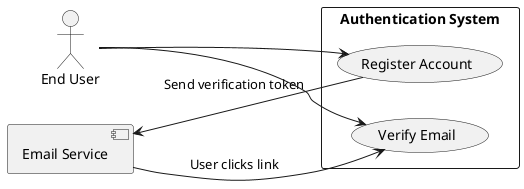
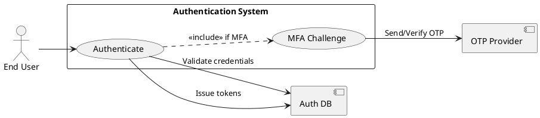
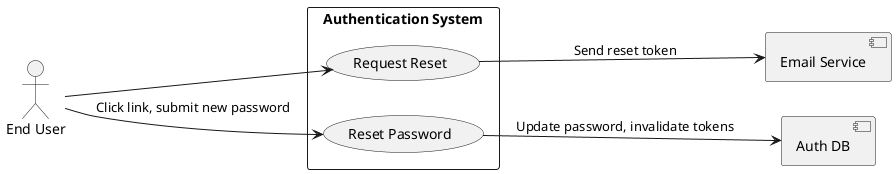
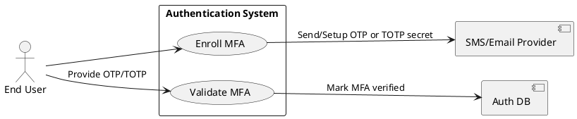
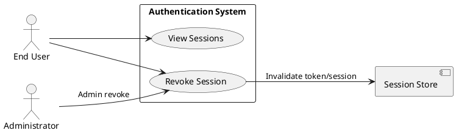
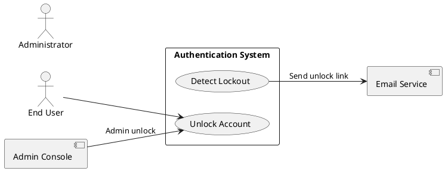
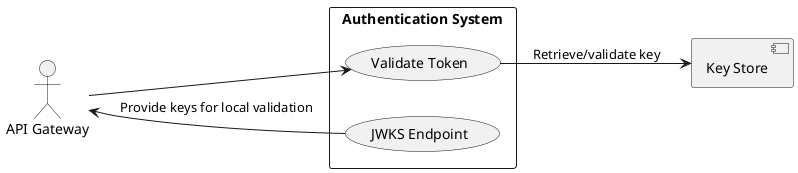

# Requirements Specification

## Feature Goal
Provide a central, secure Authentication System that replaces ad-hoc auth across applications with a unified identity service supporting user registration, secure login, password management, multi-factor authentication (MFA), token-based session management, account protection, and integration endpoints for web, mobile, API gateway, and external IdPs. Current state: multiple apps implement inconsistent auth rules and storage. Desired state: single, auditable, secure authentication service with deterministic, testable behaviors and clear integration contracts.

## Business Justification
- Business value and user impact
  - Reduces security risk by centralizing authentication, improving compliance (OWASP alignment) and lowering maintenance cost for integrated applications.
  - Improves user experience through consistent login/forgot-password flows and optional MFA.
  - Enables centralized auditing and incident response; simplifies onboarding of new applications.
- Integration with existing features
  - Serves web, mobile, API Gateway, and internal services via standardized token validation (JWT + refresh / optional opaque tokens).
  - Enables future SSO/OIDC support and central policy enforcement.
- Problems this solves and for whom
  - End users: consistent and secure access.
  - Security team: centralized logging, rate-limiting and audit trails.
  - Developers: standardized integration and tokens, fewer inconsistent implementations.

## Feature Scope
User-visible behavior:
- Sign up with email verification
- Login with email + password
- Password reset via email link
- Optional MFA via Email OTP, SMS OTP, or authenticator app
- Token-based session handling (access + refresh; revocation)
- Account lockout + administrative unlock workflows
Technical requirements:
- Secure password hashing (Argon2id preferred; bcrypt fallback configurable)
- HTTPS-only endpoints, OWASP controls, rate limiting, and monitoring
- Configurable retention and TTL parameters (defaults provided)
- Integration endpoints for API Gateway token validation and external IdP (OAuth/OIDC) connectors
- Audit events emitted for critical actions (login success/failure, password reset, MFA enrollment)
- Scalable deployment supporting horizontal scaling and load balancing

### Success Criteria
- [ ] Login success rate > 95% across measured user population
- [ ] Login response time < 2s for 95% of auth requests under normal load
- [ ] System handles 10,000+ concurrent sessions without auth failures attributable to the auth service
- [ ] No critical OWASP findings in security audit
- [ ] MFA adoption measured; > 20% of privileged users enabled within 6 months (where applicable)

## AI Fit Summary (GenAI Suitability Triage)
- Scanned features for AI-fit keywords and patterns.
- Tagged requirements below with one of: [AI-CANDIDATE], [DETERMINISTIC], [HYBRID].
- Summary:
  - Deterministic areas: credential validation, token issuance, password hashing, rate-limiting, MFA OTP delivery.
  - AI-candidate: adaptive / risk-based authentication (fraud/risk scoring, anomaly detection) and administrative insights (suspicious account detection).
  - Hybrid: MFA suggestions, risk-based step-up decisions where AI provides recommendation and human/system applies policy.

## Functional Requirements

Before expanding, list of requirements to generate:

| FR-ID | Summary |
|-------|---------|
| FR-001 | User Registration with email verification |
| FR-002 | User Login with credential validation and token issuance |
| FR-003 | Password Reset (forgot password flow) |
| FR-004 | Password Policy enforcement |
| FR-005 | Multi-Factor Authentication (MFA) support (Email/SMS/Authenticator) |
| FR-006 | Session & Token Management (access + refresh tokens, refresh, revoke, logout) |
| FR-007 | Account Lockout and Unlock workflows |
| FR-008 | API Gateway / Token Validation endpoint |
| FR-009 | Secure Password Storage (Argon2id) and key management |
| FR-010 | Monitoring, Logging & Audit for auth events |
| FR-011 | Scalability & High Availability requirements |
| FR-012 | Rate Limiting & Brute-Force Protection (CAPTCHA integration option) |
| FR-013 | Data Retention & Privacy Controls (GDPR/CCPA awareness) |
| FR-014 | Adaptive / Risk-based Authentication and anomaly detection (AI-CANDIDATE) |

Expand each FR below. Each FR is a MUST and includes acceptance criteria, classification tag, and operational details.

- FR-001: [DETERMINISTIC] System MUST allow new users to register an account via email verification.
  - Description: Public endpoint POST /register accepts Email, Password, FirstName, LastName (optional metadata). The system validates input, hashes password, creates a provisional user record, and sends a single-use verification email token.
  - Acceptance Criteria:
    1. Given valid inputs, POST /register returns 202 Accepted and a verification email is queued within 5 seconds.
    2. The verification token is single-use and expires in 24 hours (configurable).
    3. Attempting to register with an existing verified email returns 409 Conflict with "Email already registered".
    4. Unverified accounts older than configurable TTL (default 7 days) may be purged or re-claimed per policy.
    5. Re-send verification limited to 3 per 24 hours per account/IP.
  - Trigger: User submits registration form.
  - Who benefits: End users, Product/Support teams.
  - Success outcome: Account created and verified; user can authenticate.
  - Failure scenarios: Email delivery failure, duplicate email, malformed input; system returns appropriate 4xx and logs event.

- FR-002: [DETERMINISTIC] System MUST authenticate users via email + password and issue access and refresh tokens.
  - Description: POST /login validates credentials against stored hash. On success (and after MFA if enabled) returns access_token (JWT by default) and refresh_token (opaque or stored token), and emits audit events.
  - Acceptance Criteria:
    1. Successful auth returns HTTP 200 and JSON with access_token (JWT, default TTL 15 minutes) and refresh_token (opaque string, TTL 30 days).
    2. Failed auth increments failed-login counter and returns 401 Unauthorized with generic "Invalid credentials" message.
    3. If MFA is enabled, initial password validation returns 200 with mfa_required flag; no tokens until MFA verification completes.
    4. Response times for successful logins < 2s for 95% of requests under normal load.
    5. Tokens include standard claims (sub, exp, iat, jti) and issuer/tenant info.
  - Trigger: POST /login with email+password (optionally client_id).
  - Who benefits: End users, client applications, security teams.
  - Success outcome: Tokens issued and valid; user receives access to protected resources.
  - Failure scenarios: Invalid credentials, locked account, expired/inactive account, external provider failure.

- FR-003: [DETERMINISTIC] System MUST provide a secure "Forgot Password" flow to reset user passwords.
  - Description: POST /forgot-password sends a password-reset email with a single-use, time-limited token; POST /reset-password consumes token, validates new password against policy, and updates stored hash.
  - Acceptance Criteria:
    1. Reset request returns 202 Accepted and reset email queued within 5 seconds.
    2. Reset token expires in configurable TTL (default 1 hour) and is single-use.
    3. Successful reset invalidates active refresh tokens (configurable: all sessions or current session).
    4. Password history policy prevents reuse of last N passwords (configurable).
    5. Unsuccessful attempts are rate-limited per account/IP and CAPTCHAs may be triggered.
  - Trigger: User selects "Forgot Password" and submits email.
  - Who benefits: End users, support.
  - Success outcome: User resets password and regains access.
  - Failure scenarios: Email not delivered, token expired, weak new password (policy violation).

- FR-004: [DETERMINISTIC] System MUST enforce a configurable password policy.
  - Description: Password policy (min length, character classes, banned passwords, password history) enforced at registration and reset.
  - Acceptance Criteria:
    1. Passwords must meet default policy: min 8 chars, at least one uppercase, one lowercase, one number, one special char — configurable by admin.
    2. Password rejected with 400 and descriptive error when policy not met.
    3. Admin API can update policy with audit trail.
    4. System prevents reuse of last N passwords (default N=5).
  - Trigger: Registration or password-change/reset.
  - Who benefits: Security team, end users.
  - Success outcome: Only policy-compliant passwords accepted.
  - Failure scenarios: Policy misconfiguration; provide safe defaults and validation on policy changes.

- FR-005: [HYBRID] System MUST support Multi-Factor Authentication (MFA) with Email OTP, SMS OTP, and Authenticator App (TOTP); system SHOULD support enrollment, verification, and recovery flows.
  - Description: MFA enrollment APIs allow opt-in; during login, after password validation, an MFA challenge is issued; OTPs are deterministic, while risk-based step-up decisions may be hybrid when AI is applied.
  - Acceptance Criteria:
    1. User can enroll in MFA via POST /mfa/enroll and select method; enrollment requires successful verification (OTP or TOTP secret verification).
    2. During login, if MFA enabled, system returns mfa_required and issues OTP (or expects TOTP); successful MFA returns tokens.
    3. Backup codes generated once and shown once during enrollment; they are single-use.
    4. SMS/Email OTP delivery attempts retried per policy; failures logged and escalated.
    5. Administrative revocation/unenroll allowed via admin API with audit trail.
  - Trigger: User enables MFA or logs into an MFA-enabled account.
  - Who benefits: End users, security team.
  - Success outcome: MFA-protected accounts require second factor before tokens are issued.
  - Failure scenarios: SMS failure, clock drift with TOTP, lost device (use backup codes or admin unlock).

- FR-006: [DETERMINISTIC] System MUST manage sessions and tokens: issue, refresh, revoke, and expire tokens; support logout and session listing.
  - Description: Access tokens short-lived; refresh tokens rotate on use; token revocation available via blacklist or token store; endpoints include POST /token/refresh, POST /logout, GET /sessions, DELETE /sessions/{id}.
  - Acceptance Criteria:
    1. Refresh token rotation: when a refresh token is used, issue a new refresh token and revoke the previous one.
    2. POST /logout invalidates current refresh token and optionally all refresh tokens when global logout requested.
    3. GET /sessions returns active sessions (device, last_activity, ip) for a user; user can revoke sessions individually.
    4. Token revocation is effective within an SLA (e.g., < 5 seconds) across distributed instances.
    5. Token issuance and revocation events are auditable.
  - Trigger: Token issuance/refresh, user logout, admin action.
  - Who benefits: End users, security/ops.
  - Success outcome: Tokens are valid only as long as policy permits and can be revoked quickly on compromise.
  - Failure scenarios: Revocation propagation delay, clock drift, token store outage (mitigate with design for high availability).

- FR-007: [DETERMINISTIC] System MUST implement account lockout and unlock workflows.
  - Description: After configured consecutive failed login attempts (default 5), lock account temporarily; unlock via verified email link or admin action; provide status endpoint for admins.
  - Acceptance Criteria:
    1. After N failed attempts within window W, account status becomes Locked; subsequent login attempts return 423 Locked with generic messaging.
    2. Unlock methods: automatic timeout (configurable), self-service verified email link, or admin API immediate unlock with audit.
    3. Lockout counters reset after successful login or after configured decay period.
    4. Admins receive alert on repeated lockouts (threshold).
  - Trigger: Failed login attempts exceed threshold.
  - Who benefits: Security team, users (protection).
  - Success outcome: Brute-force attempts mitigated; legitimate users regain access via verified paths.
  - Failure scenarios: DOS via lockout (mitigate with CAPTCHAs and progressive delays), false positives for shared accounts.

- FR-008: [DETERMINISTIC] System MUST expose a Token Validation endpoint for API Gateway and services.
  - Description: Provide a high-performance token introspection or public-key endpoint (/.well-known/jwks.json) and a validate endpoint for opaque tokens or session checks.
  - Acceptance Criteria:
    1. JWKS endpoint available and updated on key rotation; validation succeeds for valid JWTs signed by current keys.
    2. Introspection endpoint supports validation of opaque refresh tokens and returns status + metadata.
    3. Validation latency < 50ms under expected load (cache & CDNs as applicable).
    4. Rate limit validation endpoints to protect against abuse.
  - Trigger: API Gateway or service requests token validation.
  - Who benefits: Client apps, API Gateway, downstream services.
  - Success outcome: Services can validate tokens quickly and reliably.
  - Failure scenarios: Key rotation misconfiguration, cache incoherence.

- FR-009: [DETERMINISTIC] System MUST store passwords using Argon2id (recommended) or bcrypt (configurable), with secure key management and parameterization.
  - Description: Passwords are hashed with Argon2id using recommended parameters (memory, iterations, parallelism) and per-user salt; admin can tune parameters via config and must re-hash on next login if parameters change.
  - Acceptance Criteria:
    1. New passwords stored using Argon2id with current recommended parameters; parameter changes cause rehash on next successful auth.
    2. No plaintext passwords logged or stored; secrets (hashing salts/keys) stored in secrets manager.
    3. Password hash migration strategy documented and supported.
  - Trigger: Password set/reset, authentication requiring hash check.
  - Who benefits: Security team, compliance.
  - Success outcome: Passwords resistant to brute-force and rainbow-table attacks.
  - Failure scenarios: Weak hashing parameters, secrets leaked (prevent via key management and rotation).

- FR-010: [DETERMINISTIC] System MUST provide monitoring, structured logging, and audit events for authentication-related actions and integrate with SIEM.
  - Description: Emit structured logs for login success/failure, registration, password reset, MFA events, token issuance/revocation, and admin actions; provide metrics and alerts.
  - Acceptance Criteria:
    1. Auth events emitted in JSON format to logging pipeline with consistent schema (timestamp, user_id, event_type, ip, user_agent, outcome).
    2. Key metrics available: login_success_rate, login_latency_p95, failed_logins_by_ip, active_sessions_count.
    3. Alerts for abnormal patterns (e.g., spike in failed logins) with configured thresholds.
    4. Retention and access controls for logs meet privacy/regulatory requirements.
  - Trigger: All significant auth lifecycle events.
  - Who benefits: Securityops, SRE, Compliance.
  - Success outcome: Rapid detection and investigation of incidents.
  - Failure scenarios: Logging outages, excessive log volume (mitigate with sampling).

- FR-011: [DETERMINISTIC] System MUST meet scalability and high availability patterns: horizontal scaling, stateless API tier, stateful token/session store highly available.
  - Description: Design must support autoscaling of API nodes, resilient session/token store (e.g., distributed cache + durable DB), and no single point of failure.
  - Acceptance Criteria:
    1. API tier is stateless; session/token store replicated and supports failover without downtime.
    2. System supports target concurrent sessions (10,000+) under defined performance budgets.
    3. Health checks, rolling deployments, and disaster recovery documented and tested.
    4. Failover scenarios maintain token validity or fail safe per policy.
  - Trigger: Production traffic and scaling events.
  - Who benefits: SRE, end-users (availability).
  - Success outcome: Service meets availability and scale SLAs.
  - Failure scenarios: State store partitioning (mitigate with replication and eventual consistency patterns).

- FR-012: [DETERMINISTIC] System MUST implement rate limiting and brute-force protection, with optional CAPTCHA integration.
  - Description: Per-IP and per-account rate limits for login, register, forgot-password endpoints; progressive delays, CAPTCHAs, and blocklisting for abusive clients.
  - Acceptance Criteria:
    1. Default rate limits in place (e.g., 10 requests/min per IP for auth endpoints) and configurable.
    2. After repeated failed attempts, present CAPTCHA or require step-up authentication rather than immediate lockout.
    3. Admin can view and manage blocklisted IPs and suspicious accounts.
    4. Rate-limiting metrics and logs emitted for monitoring.
  - Trigger: High-frequency requests or failed attempts.
  - Who benefits: Security, platform stability.
  - Success outcome: Reduced abuse and preserved service for legitimate users.
  - Failure scenarios: Legitimate user blocked due to shared IP (mitigate with progressive backoff and CAPTCHA).

- FR-013: [DETERMINISTIC] System MUST support data retention, privacy, and regulatory controls (GDPR/CCPA readiness).
  - Description: Provide mechanisms for data export, deletion (right to be forgotten), configurable retention windows for logs and user data, and consent tracking for communications.
  - Acceptance Criteria:
    1. Admins can export or delete user data per request; deletion propagates to backups per policy.
    2. Configurable retention for logs and audit events with soft-delete semantics.
    3. Consent for email/SMS recorded and respected in communication flows.
    4. Data access controls and encryption at rest/in transit are enforced.
  - Trigger: Legal/operational requests, retention schedules.
  - Who benefits: Compliance, legal, end users.
  - Success outcome: Meets regulatory obligations and provides user data controls.
  - Failure scenarios: Incomplete deletion from backups; document and mitigate via retention policies.

- FR-014: [AI-CANDIDATE] System MUST support adaptive / risk-based authentication to detect anomalies and recommend step-up actions.
  - Description: Optional service that analyzes login signals (ip, geolocation, device fingerprint, login velocity, historical patterns) to compute a risk score and recommend actions (step-up MFA, block, require password reset). AI/ML models suggested; system must allow deterministic policy thresholds and human-in-the-loop overrides.
  - Acceptance Criteria:
    1. Risk score computed for each login attempt with explainable factors surfaced in logs.
    2. System supports configurable actions for score ranges: allow, challenge (MFA), deny.
    3. Model decisions are auditable; fallback deterministic rules exist if model unavailable.
    4. False positive/negative rates tracked and can be tuned; conservative defaults used at rollout.
  - Trigger: Each authentication attempt and high-risk events.
  - Who benefits: Security operations, fraud prevention.
  - Success outcome: Reduce account takeover incidents while minimizing user friction.
  - Failure scenarios: Model drift, biased decisions, unexplainable denials; require monitoring and rollback capability.

## Use Case Analysis

### Actors & System Boundary
- Primary Actor: End User — authenticates, registers, resets password, enrolls in MFA.
- Secondary Actor: Administrator — manages accounts, unlocks accounts, manages policies.
- System Actor: Email Service (SMTP / SES), SMS Provider (e.g., Twilio), Auth DB, Token Store (Redis or DB), API Gateway, External IdP (OAuth/OIDC).
- System Boundary: "Authentication System" contains endpoints for registration, login, password reset, MFA, token management, admin APIs, and monitoring integration.

### Use Case Specifications

#### UC-001: User Registration & Email Verification
- Actor(s): End User
- Goal: Create a verified account using email verification.
- Preconditions: User has a valid, unique email address.
- Success Scenario:
  1. User submits registration form (POST /register).
  2. System validates input and creates provisional user record.
  3. System generates verification token and queues verification email via Email Service.
  4. User clicks verification link; system validates token and activates account.
  5. System emits audit event "user.verified".
- Extensions/Alternatives:
  - 2a. If email already exists and is verified → return 409 Conflict.
  - 3a. If email delivery fails → retry and surface user-facing delay message; allow re-send subject to rate limit.
- Postconditions: User account state = Active/Verified.
- Use Case Diagram

#### UC-002: User Login (Password + optional MFA)
- Actor(s): End User
- Goal: Authenticate and obtain access to protected resources.
- Preconditions: User exists and is Active/Verified.
- Success Scenario:
  1. User POST /login with email+password.
  2. System validates credentials against hashed password.
  3. If MFA enabled → system issues challenge; user supplies second factor and system validates.
  4. System issues access_token and refresh_token.
  5. System emits "login.success" audit event.
- Extensions/Alternatives:
  - 2a. Invalid credentials → increment failed counter; return 401.
  - 3a. MFA timeout or failure → return mfa_failed and allow retry per policy.
- Postconditions: Valid session(s) exist; tokens issued.
- Use Case Diagram

#### UC-003: Password Reset (Forgot Password)
- Actor(s): End User
- Goal: Reset forgotten password securely.
- Preconditions: User has registered email.
- Success Scenario:
  1. User requests password reset (POST /forgot-password).
  2. System queues reset email with single-use token.
  3. User follows link and sets new password (POST /reset-password).
  4. System validates token and updates password hash; invalidates relevant refresh tokens.
  5. System emits "password.reset" audit event.
- Extensions/Alternatives:
  - 2a. If reset requests exceed rate limit → present CAPTCHA.
  - 3a. Expired token → user prompted to request a new token.
- Postconditions: Password updated; active sessions rotated/invalidated as policy.
- Use Case Diagram

#### UC-004: MFA Enrollment and Authentication
- Actor(s): End User
- Goal: Enroll in MFA and authenticate using second factor.
- Preconditions: User authenticated (may require re-auth).
- Success Scenario:
  1. User requests enrollment (POST /mfa/enroll).
  2. System provides TOTP secret or sends verification OTP for SMS/Email.
  3. User verifies and enrollment completes; backup codes presented once.
  4. On subsequent login, MFA challenge is required and must be validated.
- Extensions/Alternatives:
  - 2a. If SMS provider unavailable → fallback to Email or TOTP.
  - 3a. Lost device → use backup codes or admin recovery flow.
- Postconditions: User has MFA method associated and flagged.
- Use Case Diagram

#### UC-005: Session Management and Logout
- Actor(s): End User, Administrator
- Goal: View and manage active sessions; logout current or all sessions.
- Preconditions: User authenticated.
- Success Scenario:
  1. User GET /sessions to view active sessions.
  2. User requests logout (POST /logout) or revoke specific session (DELETE /sessions/{id}).
  3. System revokes refresh token(s) and emits audit events.
- Extensions/Alternatives:
  - 2a. If token store unavailable → notify user and queue revocation.
- Postconditions: Selected sessions revoked; tokens invalidated.
- Use Case Diagram

#### UC-006: Account Lockout & Unlock
- Actor(s): End User, Administrator
- Goal: Protect accounts from brute-force and allow recovery.
- Preconditions: User attempts authentication.
- Success Scenario:
  1. System detects N failed attempts and locks account.
  2. User requests unlock via verified email link OR admin performs unlock via admin API.
  3. Upon unlock, failed counters reset; audit event recorded.
- Extensions/Alternatives:
  - 1a. Progressive delays and CAPTCHA before lockout to reduce DOS risk.
- Postconditions: Account unlocked and user notified.
- Use Case Diagram

#### UC-007: Token Validation for API Gateway
- Actor(s): API Gateway (system)
- Goal: Validate incoming tokens for downstream services.
- Preconditions: Token presented by client to API Gateway.
- Success Scenario:
  1. Gateway queries JWKS or introspection endpoint.
  2. Authentication System returns token status and metadata.
  3. Gateway enforces policy based on response.
- Extensions/Alternatives:
  - 1a. Cache JWKS and token metadata to reduce latency.
- Postconditions: Request accepted or rejected by gateway.
- Use Case Diagram

## Risks & Mitigations
- Risk: Brute-force or credential stuffing leading to account takeover.
  - Mitigation: Rate limiting, account lockout, CAPTCHA, IP reputation checks, monitoring.
- Risk: Token revocation propagation delays cause security exposure.
  - Mitigation: Design low-latency revocation store, use short-lived access tokens and refresh rotation.
- Risk: MFA delivery failures (SMS/Email) causing user lockout.
  - Mitigation: Multiple delivery channels, TOTP fallback, clear UX and support flows.
- Risk: Sensitive data leakage in logs or backups.
  - Mitigation: Structured logging without secrets, encryption at rest, access controls, retention policy.
- Risk: AI model drift or false positives in adaptive auth (if enabled).
  - Mitigation: Conservative rollout, monitoring, fallbacks to deterministic rules, human review path.

## Constraints & Assumptions
- Constraint: Must comply with OWASP Top 10 recommendations; HTTPS required for all external endpoints.
- Constraint: Use secrets manager (e.g., AWS Secrets Manager) for keys and hashing parameters; no hardcoded secrets.
- Constraint: Service will be consumed by web/mobile/API Gateway; assume clients can handle JWTs or opaque tokens.
- Assumption: Preferred password hash = Argon2id; bcrypt supported where Argon2 unavailable.
- Assumption: SMS/Email providers available and SLA-backed; fallback to alternate channels if one provider fails.

---

Rules Used by the Workflow
- Followed guardrails: rules/ai-assistant-usage-policy.md
- Code and doc anti-patterns: rules/code-anti-patterns.md
- Delta update and single-source rules: rules/dry-principle-guidelines.md
- Phased iterative workflow rules: rules/iterative-development-guide.md
- Language-agnostic standards and security: rules/language-agnostic-standards.md and rules/security-standards-owasp.md
- Markdown and UML standards: rules/markdown-styleguide.md and rules/uml-text-code-standards.md
- Performance practices: rules/performance-best-practices.md
- UML/text diagram standards: rules/uml-text-code-standards.md

Evaluation Scores

| Criterion | Score (1-5) |
|----------:|------------:|
| Completeness of FRs | 5 |
| Testability / Acceptance Criteria | 5 |
| Security & Compliance Coverage | 5 |
| Clarity & Unambiguity | 5 |
| Use Case & Diagram Coverage | 5 |
| Scalability & Performance Considerations | 4 |
| AI Triage Appropriateness | 5 |

Average Score: 4.86

Evaluation Summary
Spec comprehensively captures authentication requirements with measurable acceptance criteria, security-first controls (OWASP alignment), and clear use-case diagrams. Adaptive auth is marked as AI-candidate with conservative rollout guidance. Remaining items for stakeholder confirmation: token revocation model (opaque vs JWT-only), MFA policy (required vs opt-in), and regulatory scope details (GDPR/CCPA specifics).