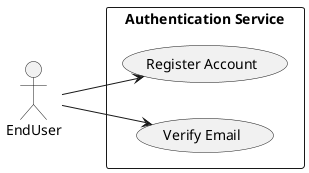
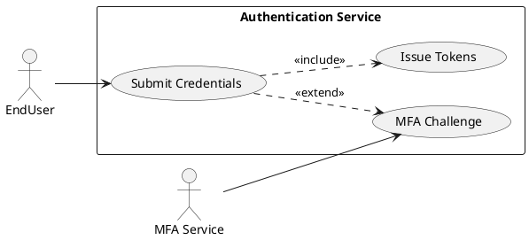
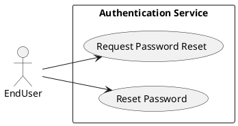
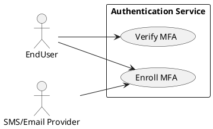
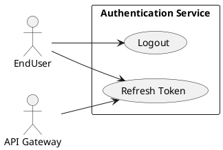
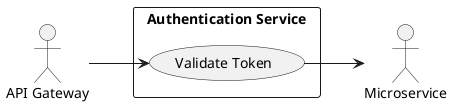
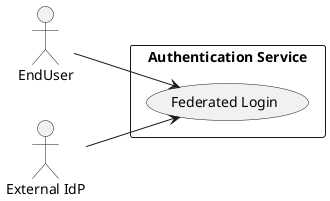

# Requirements Specification

## Feature Goal
Provide a central, secure Authentication System that replaces ad-hoc auth across applications with a unified identity service supporting user registration, secure login, password management, multi-factor authentication (MFA), token-based session management, and account protection. Current state: multiple apps implement inconsistent auth rules and storage. Desired state: single, auditable, secure authentication service with deterministic, testable behaviors and clear integration contracts.

## Business Justification
- Business value and user impact
  - Reduces security risk by centralizing authentication, improving compliance (OWASP alignment), and lowering maintenance cost for integrated applications.
  - Improves user experience through consistent login/forgot-password flows and optional MFA.
- Integration with existing features
  - Serves web, mobile, API Gateway, and internal services via standardized token validation (JWT + refresh or opaque tokens).
- Problems this solves and for whom
  - End users: consistent and secure access.
  - Security team: centralized logging, rate-limiting, and audit trails.
  - Developers: standardized integration and tokens for services.

## Feature Scope
User-visible behavior:
- Sign up with email verification
- Login with email + password
- Password reset via email link
- Optional MFA via Email OTP, SMS OTP, or authenticator app
- Token-based session handling (access + refresh)
- Account lockout + administrative unlock workflows
- Admin console endpoints for user status and audit lookups

Technical requirements:
- Secure password hashing (Argon2id recommended; bcrypt allowed)
- HTTPS-only endpoints, OWASP controls, rate limiting, monitoring
- Configurable retention and TTL parameters (defaults provided)
- Integration endpoints for API Gateway token validation and external IdP (OAuth/OIDC) connectors
- Audit logging for auth events; immutable event stream for critical actions

### Success Criteria
- [ ] Login success rate > 95% across measured user population
- [ ] Login response time < 2s for 95% of auth requests under normal load
- [ ] System handles 10,000+ concurrent sessions without auth failures attributable to the auth service
- [ ] No critical OWASP findings in security audit
- [ ] MFA adoption > 20% for privileged users within 6 months (where applicable)

## Functional Requirements

Before expanding, list of requirements to generate:

| FR-ID | Summary |
|-------|---------|
| FR-001 | [DETERMINISTIC] User Registration with email verification |
| FR-002 | [DETERMINISTIC] User Login with credential validation and token issuance |
| FR-003 | [DETERMINISTIC] Password Policy enforcement and secure hashing |
| FR-004 | [DETERMINISTIC] Password Reset (forgot password flow) |
| FR-005 | [DETERMINISTIC] Multi-Factor Authentication (MFA) support |
| FR-006 | [DETERMINISTIC] Session Management (access + refresh tokens, logout, inactivity) |
| FR-007 | [DETERMINISTIC] Account Lockout and Unlock workflows |
| FR-008 | [DETERMINISTIC] API Gateway Token Validation endpoint (integration) |
| FR-009 | [DETERMINISTIC] Admin endpoints and audit reporting |
| FR-010 | [DETERMINISTIC] Monitoring, Logging & Audit for auth events |
| FR-011 | [UNCLEAR] SSO / OAuth / OIDC integration (protocol specifics required) |
| FR-012 | [DETERMINISTIC] Rate Limiting & Brute-Force Protection |
| FR-013 | [DETERMINISTIC] Data Retention & Privacy Controls (configurable defaults) |
| FR-014 | [AI-CANDIDATE] Adaptive / Risk-based Authentication (optional, AI-assisted) |

Expand each functional requirement below. Each FR is a MUST and includes acceptance criteria and classification.

- FR-001: [DETERMINISTIC] System MUST allow new users to register an account via email verification.
  - Description: Registration endpoint accepts email, password, firstName, lastName. System validates email format, enforces password policy, creates unverified account, and sends verification email with single-use token.
  - Acceptance Criteria:
    1. Given valid inputs, POST /register returns 202 Accepted and a verification email is queued within 5 seconds.
    2. The verification token is single-use and expires in 24 hours (configurable).
    3. Attempting to register with an existing verified email returns 409 Conflict with "Email already registered".
    4. Re-send verification limited to 3 attempts per 24 hours per account; exceeded attempts return 429 Too Many Requests.
  - Who needs this: End users, Product Owner.
  - Trigger: User submits registration form.
  - Success outcome: Account transitions to Verified and user may authenticate.
  - Failure scenarios: Email delivery failures (retry with exponential backoff + alert), attempted duplicate registration, malformed email input.

- FR-002: [DETERMINISTIC] System MUST authenticate users via email + password and return access and refresh tokens.
  - Description: Credential validation against stored password hash; if MFA enabled, return mfa_required flag; otherwise issue tokens.
  - Acceptance Criteria:
    1. Successful auth returns HTTP 200 with access_token (JWT, TTL default 15 minutes) and refresh_token (opaque, TTL default 30 days).
    2. Failed auth increments failed-login counters and returns 401 Unauthorized with generic "Invalid credentials".
    3. If account has MFA enabled, password validation returns 200 with mfa_required=true; tokens are not issued until MFA verification succeeds.
    4. Response times for successful logins < 2s for 95% of requests under normal load.
  - Who needs this: End users, client applications, API consumers.
  - Trigger: POST /login with email and password.
  - Success outcome: Valid tokens issued, session recorded in audit log.
  - Failure scenarios: Invalid credentials, locked account, exceeded rate limits.

- FR-003: [DETERMINISTIC] System MUST enforce password policy and store password hashes securely.
  - Description: Passwords validated client- and server-side against policy; stored using Argon2id (recommended) with per-user salt.
  - Acceptance Criteria:
    1. Passwords submitted that do not meet policy return 400 with deterministic error fields indicating which rules failed.
    2. Stored password field contains salted Argon2id hash; plain passwords never persisted.
    3. Hashing parameters (memory, iterations) configurable via deployment config.
  - Who needs this: Security team, end users.
  - Trigger: Registration or password change.
  - Success outcome: Only compliant passwords accepted and securely stored.
  - Failure scenarios: Misconfiguration of hashing parameters (should fail startup), password leaks (mitigated by hashing).

- FR-004: [DETERMINISTIC] System MUST provide a secure Forgot Password flow.
  - Description: Generate single-use expiring reset token, send reset email, accept new password, revoke existing sessions.
  - Acceptance Criteria:
    1. POST /forgot-password returns 202 and reset email queued within 5 seconds for valid accounts (response identical whether account exists to prevent enumeration).
    2. Reset token expires in 1 hour by default (configurable) and is single-use.
    3. Completing reset invalidates all active refresh tokens and forces logout of other sessions.
  - Who needs this: End users, support/admin teams.
  - Trigger: User initiates "Forgot Password".
  - Success outcome: User sets new password and can log in; prior sessions invalidated.
  - Failure scenarios: Expired token (410 Gone), reuse of token (410 or 400), email delivery failure.

- FR-005: [DETERMINISTIC] System MUST support optional MFA enrollment and challenge flows (Email OTP, SMS OTP, Authenticator App TOTP).
  - Description: Users can enroll methods; during login flow, system issues OTP challenge per selected method and validates it.
  - Acceptance Criteria:
    1. Enrollment endpoints exist for each method; enrollment requires proof (e.g., code validation).
    2. Successful MFA verification completes login and issues tokens.
    3. Backup/Recovery: Provide recovery codes (displayed once, must be stored by user); recovery codes are single-use.
    4. SMS/Email OTP TTL default 5 minutes; TOTP conforms to RFC 6238.
  - Who needs this: Privileged users, security team, end users.
  - Trigger: User opts into MFA or system requires it for high-risk actions.
  - Success outcome: MFA-protected accounts require second factor to issue tokens.
  - Failure scenarios: SMS delivery failure (fallback to Email or recovery codes), lost authenticator device (account recovery via verified email + support).

- FR-006: [DETERMINISTIC] System MUST manage sessions via access and refresh tokens, support logout and inactivity timeouts.
  - Description: Access tokens short-lived; refresh tokens revocable and stored server-side for revocation checks as needed.
  - Acceptance Criteria:
    1. Access token TTL default 15 minutes; refresh token TTL default 30 days (configurable).
    2. POST /logout revokes refresh token and invalidates session immediately.
    3. Inactivity timeout configurable (e.g., 30 days of inactivity leads to session expiry).
    4. Token revocation list or token introspection endpoint available for API Gateway.
  - Who needs this: Client apps, API Gateway, security operations.
  - Trigger: Successful login, logout action, password reset.
  - Success outcome: Tokens operate within TTLs; revocation enforced when requested.
  - Failure scenarios: Token leakage (mitigated by short TTL + revocation), refresh token reuse (detect and revoke).

- FR-007: [DETERMINISTIC] System MUST implement account lockout after configurable failed login attempts and provide unlock paths.
  - Description: Failed-login counters per account/IP with progressive backoff; administrative unlock and verified email unlock supported.
  - Acceptance Criteria:
    1. Default: lock after 5 failed attempts within 15 minutes; temporary lock duration 15 minutes (configurable).
    2. Admin endpoint to unlock account with audit log entry.
    3. Unlock via verified email link available; re-verification requires secure token.
  - Who needs this: Security team, support staff, end users.
  - Trigger: Consecutive failed authentication attempts.
  - Success outcome: Locked accounts prevent further authentication until unlock flows complete.
  - Failure scenarios: Denial-of-service via targeted lockouts (mitigate by IP-level protections), legitimate user locked out (support processes documented).

- FR-008: [DETERMINISTIC] System MUST provide a token validation endpoint for API Gateway and direct introspection.
  - Description: Public endpoint(s) for validating access tokens and retrieving minimal claims; designed for high throughput and caching.
  - Acceptance Criteria:
    1. Introspection endpoint returns 200 with token active/inactive and standard claims for valid tokens.
    2. Endpoint handles 5000+ requests/sec with <100ms median latency (benchmarked).
    3. JWT public keys exposed via well-known JWKS endpoint for verification.
  - Who needs this: API Gateway, microservices.
  - Trigger: API Gateway or downstream service requests token validation.
  - Success outcome: Services can validate tokens without decoding secrets.
  - Failure scenarios: Key rotation mismatch (ensure JWKS propagation), overloaded introspection endpoint (use caching & local verification).

- FR-009: [DETERMINISTIC] System MUST expose admin endpoints for account status management and audit reporting.
  - Description: Admin APIs and UI for locking/unlocking, disabling accounts, searching audit logs, and generating reports.
  - Acceptance Criteria:
    1. Role-based access controls restrict admin endpoints; actions require admin authentication + 2FA.
    2. Every admin action generates immutable audit entries (actor, timestamp, IP, reason).
    3. Audit exports available for last configurable retention window.
  - Who needs this: Administrators, security team.
  - Trigger: Admin uses console/API.
  - Success outcome: Safe, auditable admin actions.
  - Failure scenarios: Insufficient RBAC causing privilege escalation (prevent via policy checks).

- FR-010: [DETERMINISTIC] System MUST log authentication events and provide monitoring and alerting for security and availability KPIs.
  - Description: Centralized logging for successful/failed logins, MFA events, token issuance/revocation, admin actions; metrics exported to monitoring stack.
  - Acceptance Criteria:
    1. Events emitted for: login_success, login_failure, account_lock, password_reset, mfa_enroll, token_refresh, token_revoke, admin_action.
    2. Alerts configured for unusual spikes in failed logins, token-introspection errors, and service error rates.
    3. Retention/configurable: raw logs retained per policy (e.g., 90 days) and cold archive as required by privacy rules.
  - Who needs this: Security operations, DevOps, product analytics.
  - Trigger: Any auth-related activity.
  - Success outcome: Timely detection of anomalies and traceability for audits.
  - Failure scenarios: Missing logs due to misconfiguration (startup health checks validate logging pipeline).

- FR-011: [UNCLEAR] System SHOULD support SSO/OAuth/OIDC integration for third-party IdPs.
  - Description: Integrate with external IdPs (SAML/OIDC/OAuth) for federated login; protocol and provider list to be defined.
  - Acceptance Criteria (proposed until clarified):
    1. Provide connector pattern and examples (Google, Microsoft Azure AD, Okta).
    2. Map external IdP attributes to local user profile using configurable mappings.
    3. Support automatic provisioning (SCIM) for enterprise integration (optional).
  - Clarifications required: list of IdPs, required claims, user provisioning policy, and SSO session mapping.
  - Who needs this: Enterprise customers, partners.
  - Trigger: External login via IdP.
  - Success outcome: Users can authenticate via enterprise IdPs and obtain local token.
  - Failure scenarios: Mismatched claims, incomplete provisioning, mapping conflicts.

- FR-012: [DETERMINISTIC] System MUST enforce rate limiting and brute-force protections at IP and account levels.
  - Description: Throttle suspicious traffic and apply progressive penalties to protect from automated attacks.
  - Acceptance Criteria:
    1. IP-based and account-based throttles configurable with default safe values (e.g., 100 req/min per IP overall; 5 failed login attempts causing lock).
    2. Implement CAPTCHA or additional challenge for suspicious traffic patterns before further attempts.
    3. Rate-limiting metrics exposed to monitoring.
  - Who needs this: Security team, DevOps.
  - Trigger: High-frequency requests or failed attempts.
  - Success outcome: Reduce automated brute-force attacks with minimal impact to legitimate users.
  - Failure scenarios: False positives blocking users (allow appeal or support flow).

- FR-013: [DETERMINISTIC] System MUST provide configurable data retention and privacy controls.
  - Description: Policies for retention of logs, personal data, and account deletion to satisfy privacy regulations (GDPR, etc.).
  - Acceptance Criteria:
    1. Support configurable retention windows for audit logs and user data; default retention values documented.
    2. Implement "right to be forgotten" workflows that remove or anonymize data per policy and maintain audit trail of deletion actions.
    3. Data exports for compliance requests available via admin workflow.
  - Who needs this: Legal, Security, Product.
  - Trigger: Regulatory requests, user account deletion.
  - Success outcome: Compliance with retention and deletion requirements.
  - Failure scenarios: Residual PII remains after deletion (test suites validate deletion).

- FR-014: [AI-CANDIDATE] System MAY support adaptive / risk-based authentication to increase security with minimal friction.
  - Description: Evaluate login risk (device, geolocation, behavior) and escalate authentication (step-up) when risk-high. AI may be used to score risk.
  - Acceptance Criteria (proposal):
    1. Default deterministic signals implemented (new device, velocity, IP reputation).
    2. If AI-assisted risk scoring used, flag as [HYBRID] — model suggests risk score; policy engine enforces step-up.
    3. Actions: require MFA, block, or allow with logging. False positive rate monitored and adjustable.
  - Clarifications required: Data sources for risk scoring, model governance, privacy constraints.
  - Who needs this: Security team, Product.
  - Trigger: Login from atypical location/device or anomalous behavior.
  - Success outcome: High-risk attempts challenged; low-risk users have frictionless login.
  - Failure scenarios: High false positives causing user friction; model drift causing missed attacks.

## Use Case Analysis

### Actors & System Boundary
- Primary Actor: End User — registers, authenticates, manages account and MFA.
- Secondary Actor: Administrator — manages accounts, unlocks, views audit logs.
- System Actor: API Gateway — validates tokens for downstream services.
- External Actors: Email/SMS providers, Identity Providers (IdP), Monitoring & Logging systems.
- System Boundary: "Authentication Service" (implements all FRs above).

### Use Case Specifications

#### UC-001: User Registration & Email Verification
- Actor(s): End User
- Goal: Create a verified account to enable authentication.
- Preconditions: User has a unique email; registration endpoint available.
- Success Scenario:
  1. User submits registration form with email, password, name.
  2. System validates fields and password policy.
  3. System creates unverified account and queues verification email containing single-use token.
  4. User clicks verification link; system marks account Verified and sends confirmation.
- Extensions/Alternatives:
  - 2a. Weak password → system returns validation errors.
  - 3a. Email not delivered → system retries and alerts support after threshold.
  - 4a. Token expired → allow re-send subject to rate limit.
- Postconditions: Account state = Verified; user may authenticate.
- Use Case Diagram

#### UC-002: User Login (Credential Validation)
- Actor(s): End User
- Goal: Obtain authenticated session tokens to access protected resources.
- Preconditions: Account exists and is Verified and not Locked.
- Success Scenario:
  1. User submits email + password to /login.
  2. System validates credentials and checks lockout/MFA state.
  3. If MFA disabled, system issues access + refresh tokens and logs event.
  4. If MFA enabled, system returns mfa_required and issues challenge.
- Extensions/Alternatives:
  - 2a. Invalid credentials → increment failed counter; if threshold reached, lock account.
  - 3a. If tokens cannot be issued due to rate limits, return 429.
- Postconditions: Tokens issued or MFA challenge pending.
- Use Case Diagram

#### UC-003: Password Reset (Forgot Password)
- Actor(s): End User
- Goal: Reset forgotten password securely.
- Preconditions: Email associated with account.
- Success Scenario:
  1. User requests password reset.
  2. System queues reset email with single-use token (non-enumerable response).
  3. User uses token to set new password; system validates and updates password, invalidating sessions.
- Extensions/Alternatives:
  - 2a. Token expired → user repeats request.
  - 3a. Token reuse attempt → reject and log.
- Postconditions: New password set; prior sessions revoked.
- Use Case Diagram

#### UC-004: MFA Enrollment & Verification
- Actor(s): End User
- Goal: Enroll and verify a second factor for account protection.
- Preconditions: User authenticated.
- Success Scenario:
  1. User navigates to MFA settings and selects method (Email/SMS/TOTP).
  2. System issues verification code or shows TOTP secret.
  3. User validates code; system marks method enrolled and stores metadata.
- Extensions/Alternatives:
  - 2a. SMS delivery failure → allow alternative method or display error.
  - 3a. User loses device → use recovery codes or admin-assisted recovery.
- Postconditions: MFA method active; future logins require second factor.
- Use Case Diagram

#### UC-005: Session Management (Logout, Token Refresh)
- Actor(s): End User, API Gateway
- Goal: Maintain and revoke user sessions; refresh access tokens.
- Preconditions: Valid refresh token stored.
- Success Scenario:
  1. Client calls /refresh with refresh token; system validates and issues new access token.
  2. Client calls /logout; system revokes refresh token and logs action.
- Extensions/Alternatives:
  - 1a. Refresh token invalid → return 401 and force re-authentication.
  - 2a. Logout without valid token → return 200 (idempotent behavior).
- Postconditions: Session state updated; tokens revoked as required.
- Use Case Diagram

#### UC-006: Account Lockout & Unlock
- Actor(s): End User, Administrator
- Goal: Protect accounts against brute-force while providing recovery paths.
- Preconditions: Failed attempts recorded.
- Success Scenario:
  1. System locks account after threshold reached.
  2. User requests unlock via verified email or contacts admin.
  3. Admin uses admin endpoint to unlock and logs action.
- Extensions/Alternatives:
  - 2a. Automated unlock after timeout.
  - 3a. Admin denies unlock pending investigation.
- Postconditions: Account unlocked or remains locked with audit trail.
- Use Case Diagram

#### UC-007: Token Validation via API Gateway
- Actor(s): API Gateway, Microservice
- Goal: Enable downstream services to validate tokens with low latency and high availability.
- Preconditions: Gateway has token (access token) from client request.
- Success Scenario:
  1. Gateway validates token locally using JWKS or calls introspection endpoint if opaque.
  2. Gateway enforces scopes/claims and forwards request to microservice.
- Extensions/Alternatives:
  - 1a. Gateway fails to validate due to expired key → refresh JWKS cache and retry.
  - 1b. Introspection service unavailable → fallback to cached decisions for short duration.
- Postconditions: Request authenticated and authorized by gateway.
- Use Case Diagram

#### UC-008: SSO / External IdP Login (Federation) [PROVISIONAL]
- Actor(s): End User, Identity Provider
- Goal: Authenticate via external IdP and map to local identity.
- Preconditions: IdP configured and trust established.
- Success Scenario:
  1. User selects external provider and is redirected to IdP.
  2. IdP authenticates user and returns assertion/claims.
  3. Authentication Service maps claims to a local profile and issues local tokens.
- Extensions/Alternatives:
  - 2a. IdP denies authentication → return error to user.
  - 3a. No local mapping → create provisioned account or deny based on policy.
- Postconditions: Local tokens issued representing IdP-authenticated identity.
- Use Case Diagram

## Risks & Mitigations
- Risk: Brute-force attacks causing account compromise or service degradation.
  - Mitigation: FR-012 rate limiting, FR-007 lockout, IP reputation controls, CAPTCHA escalation.
- Risk: Token leakage or replay leading to session hijack.
  - Mitigation: Short access-token TTL, refresh token revocation on suspicious reuse, secure cookie flags, token binding where feasible.
- Risk: SMS OTP delivery failures and international SMS cost/exhaustion.
  - Mitigation: Offer Email OTP and TOTP as alternatives; monitor provider SLAs; fallbacks and retry/backoff.
- Risk: Admin console misuse or privilege escalation.
  - Mitigation: Enforce RBAC, require admin 2FA, audit logs for all admin actions, approval workflows for sensitive operations.
- Risk: Privacy/regulatory non-compliance (GDPR).
  - Mitigation: FR-013 data-retention controls, deletion/anonymization workflows, data export and consent tracking.

## Constraints & Assumptions
- Constraint: All external traffic must be TLS (HTTPS) terminated at load balancer; no plaintext transport allowed.
- Constraint: Password hashing uses Argon2id by default; parameters set to deployment environment capabilities.
- Assumption: Email and SMS providers with sufficient throughput will be procured; integration specifics (providers) determined during implementation.
- Assumption: API Gateway and downstream services support JWT verification or introspection API integration.
- Constraint: Admin actions require 2FA and are audited; no silent admin unlocks allowed.
- Assumption: SSO/IdP integrations and SCIM provisioning are optional and scoped separately (FR-011 marked [UNCLEAR] until provider list and requirements are defined).

---

Rules used by this workflow:
- ai-assistant-usage-policy
- code-anti-patterns
- dry-principle-guidelines
- iterative-development-guide
- language-agnostic-standards
- markdown-styleguide
- performance-best-practices
- security-standards-owasp
- uml-text-code-standards

Evaluation Scores

| Criterion                | Score (1-5) |
|-------------------------|-------------:|
| Business Alignment      | 5 |
| Completeness of FRs     | 5 |
| Testability / Acceptance Criteria | 5 |
| Clarity & Unambiguity   | 4 |
| Traceability to Goals   | 5 |
| Security Coverage       | 5 |

Average Score: 4.83

Evaluation summary:
The specification comprehensively maps business goals to deterministic, testable functional requirements and focused use cases with PlantUML diagrams. Security, performance, and audit needs are addressed. Outstanding clarifications (SSO details, adaptive-auth data/modeling, token model preferences) are marked [UNCLEAR] to drive decisions before implementation.