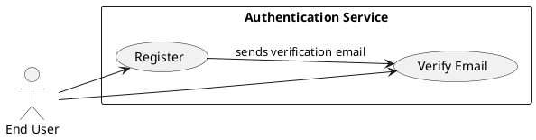
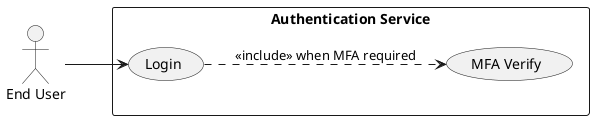
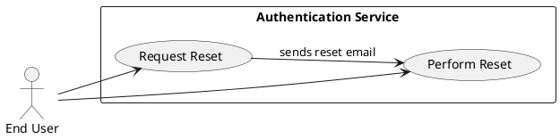
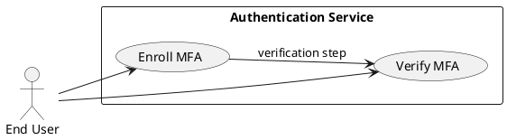
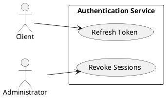
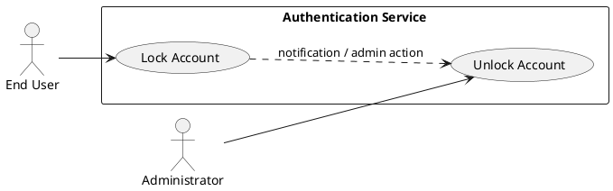
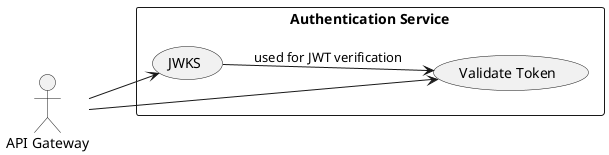

# Requirements Specification

## Feature Goal
Provide a central, secure Authentication System that replaces ad-hoc auth across applications with a unified identity service that supports deterministic user registration, secure login, password management, multi-factor authentication (MFA), token-based session management, account protection, and integration endpoints for API Gateway and external IdPs. Current state: multiple apps implement inconsistent auth rules and storage. Desired state: single, auditable, secure authentication service with deterministic, testable behaviors and clear integration contracts; adaptive authentication added as an optional AI-assisted enhancement.

## Business Justification
- Business value and user impact
  - Reduces security risk by centralizing authentication, improving compliance (OWASP alignment), and lowering maintenance cost across integrated applications.
  - Improves user experience through consistent sign-up, login, password recovery, and optional MFA flows; reduces support overhead.
- Integration with existing features
  - Serves web, mobile, API Gateway, and internal services via standardized token validation (JWT + refresh or opaque token options).
  - Provides connectors for OAuth/OIDC and pluggable external IdPs for SSO.
- Problems this solves and for whom
  - End users: consistent and secure access with predictable UX.
  - Security team: centralized logging, rate-limiting, audit trails, and policy enforcement.
  - Developers: standardized integration and tokens, fewer duplicated implementations.

## Feature Scope
User-visible behavior:
- Sign up with email and email verification
- Login with email + password (with optional MFA)
- Password reset via email link
- MFA enrollment and challenges (Email OTP, SMS OTP, Authenticator app)
- Token-based session handling (access + refresh tokens), logout, session expiry
- Account lockout and recovery via email/admin unlock flows
- Administrative audit and event logs for auth events

Technical requirements:
- Secure password hashing (Argon2id preferred, with migration strategy)
- HTTPS-only endpoints, OWASP controls, rate limiting, and monitoring
- Configurable retention, TTL and thresholds (defaults provided)
- Integration endpoints: /token/validate for API Gateway, OAuth/OIDC connectors
- Scalable, horizontally-distributable microservice with health probes and metrics

### Success Criteria
- [ ] Login success rate > 95% across measured user population
- [ ] Login 95th-percentile response time < 2s under normal load
- [ ] System supports 10,000+ concurrent sessions with acceptable latency and error rates
- [ ] No critical OWASP findings in security audit
- [ ] MFA adoption > 20% of privileged users within 6 months (where applicable)

## Functional Requirements

Before expanding, list of requirements to generate:

| FR-ID | Summary |
|-------|---------|
| FR-001 | User Registration with email verification |
| FR-002 | User Login with credential validation and token issuance |
| FR-003 | Password Reset (forgot password flow) |
| FR-004 | Password Policy enforcement |
| FR-005 | Multi-Factor Authentication (MFA) setup and verification |
| FR-006 | Session & Token Management (issue, refresh, revoke, logout) |
| FR-007 | Account Lockout and Unlock workflows |
| FR-008 | API Gateway Token Validation endpoint |
| FR-009 | Secure Password Storage & hash migration strategy |
| FR-010 | Monitoring, Logging & Audit for auth events |
| FR-011 | Scalability & High Availability requirements |
| FR-012 | Rate Limiting & Brute-Force Protection |
| FR-013 | Data Retention & Privacy Controls |
| FR-014 | Adaptive / Risk-based Authentication (optional AI-assisted) |

Expand each FR listed above with full specification.

- FR-001: [DETERMINISTIC] System MUST allow new users to register an account via email verification.
  - Description: Registration endpoint accepts Email, Password, FirstName, LastName and optional metadata. System queues a single-use verification email with a signed token.
  - Acceptance Criteria:
    1. Given valid inputs, POST /register returns 202 Accepted and a verification email is queued within 5s.
    2. Verification token is single-use and expires in 24 hours by default (configurable).
    3. Registering with an existing verified email returns 409 Conflict with "Email already registered".
    4. Unverified accounts may request re-send of verification email; re-send limited to 3 times per 24 hours.
  - Trigger: User submits registration form.
  - Who benefits: End users, Product team.
  - Data fields: email, password_hash, user_id, created_date, verification_status.
  - Notes: Email validated to RFC 5322; rate-limited per IP/account.

- FR-002: [DETERMINISTIC] System MUST authenticate users via email + password and return access and refresh tokens.
  - Description: Credential validation verifies password hash; on success, issues access_token (JWT by default) and refresh_token (opaque) unless MFA required.
  - Acceptance Criteria:
    1. Successful auth returns HTTP 200 and JSON with access_token (JWT, TTL configurable, default 15m) and refresh_token (opaque, TTL default 30d) unless MFA is enabled.
    2. Failed auth increments failed-login counters; invalid credentials return HTTP 401 with generic "Invalid credentials".
    3. If MFA enabled, initial credential validation returns HTTP 200 with mfa_required flag; tokens issued only after MFA verification.
    4. Response times for successful logins: 95th percentile < 2s under normal load.
  - Trigger: POST /login with email+password.
  - Who benefits: End users, Integrations.
  - Notes: Token signing keys rotated per key-rotation policy.

- FR-003: [DETERMINISTIC] System MUST provide secure password reset flow using single-use, time-limited tokens.
  - Description: User requests reset; system emails a single-use reset link containing a signed token. Reset link leads to endpoint that validates token and allows password update.
  - Acceptance Criteria:
    1. POST /forgot-password with registered email returns 202 and sends reset email within 5s.
    2. Reset token expires by default after 1 hour (configurable) and is single-use.
    3. Successful password reset invalidates existing sessions and refresh tokens for the user.
    4. Attempts to use expired/used token return 410 Gone or 400 Invalid token.
  - Trigger: User selects "Forgot Password" and submits email.
  - Who benefits: End users, Security team.
  - Data fields: reset_token, reset_token_expiry, reset_request_time.

- FR-004: [DETERMINISTIC] System MUST enforce configurable password policy rules at time of registration and when changing passwords.
  - Description: Enforce minimum length, complexity, and disallow commonly-breached passwords via a blocklist.
  - Acceptance Criteria:
    1. Passwords must meet default policy: minimum 8 chars, one uppercase, one lowercase, one number, one special char (configurable).
    2. Attempt to set a password that violates policy returns HTTP 422 with structured error details.
    3. If a password appears in breach blocklist, reject with guidance to choose a stronger password.
  - Trigger: User sets or updates password.
  - Who benefits: Security team, End users.
  - Notes: Policy values configurable via admin settings.

- FR-005: [DETERMINISTIC] System MUST support MFA enrollment and verification using Email OTP, SMS OTP, or TOTP (authenticator app).
  - Description: Users may enroll MFA methods, which are stored and used at authentication time; TOTP uses standard RFC6238.
  - Acceptance Criteria:
    1. POST /mfa/enroll allows user to enroll supported method; returns provisioning info for TOTP (QR + secret) or triggers verification OTP for Email/SMS.
    2. Enrollment requires successful verification (entering OTP or confirming TOTP code).
    3. When MFA is enabled, login flow requires an additional POST /mfa/verify that returns tokens upon success.
    4. Ability to list and revoke enrolled MFA methods from account settings.
  - Trigger: User opts into MFA or admin enforces MFA for role.
  - Who benefits: End users, Security team.
  - Notes: SMS usage must respect international constraints and rate limits; phone verification optional.

- FR-006: [DETERMINISTIC] System MUST manage sessions and tokens: issue, refresh, revoke, and logout.
  - Description: Provide endpoints to refresh tokens, revoke refresh tokens (logout everywhere), and query active sessions.
  - Acceptance Criteria:
    1. POST /token/refresh with valid refresh_token returns new access_token and rotated refresh_token; refresh token rotation prevents reuse.
    2. POST /logout revokes current refresh token and marks session as terminated.
    3. Admin endpoint can revoke all user sessions and refresh tokens.
    4. Token revocation is propagated to validation endpoints within operational SLA.
  - Trigger: Token refresh requests, logout actions, admin actions.
  - Who benefits: End users, Admins.
  - Notes: Consider refresh token store and revocation list scaling.

- FR-007: [DETERMINISTIC] System MUST detect brute-force and lock accounts after configurable failed attempts, with defined unlock flows.
  - Description: After N failed attempts (default 5 within window), account is locked for configurable duration (default 15 minutes) or until verified/unlocked.
  - Acceptance Criteria:
    1. After 5 failed attempts within 15 minutes (defaults), account transitions to Locked state.
    2. Locked account returns HTTP 423 Locked for auth attempts with guidance to unlock via email or contact admin.
    3. Unlock via re-verify email link OR admin unlock endpoint; re-verify link expires (configurable).
    4. Admin audit log records lock/unlock events.
  - Trigger: Multiple failed logins.
  - Who benefits: Security operations, End users (protects accounts).
  - Notes: Distributed counters required to avoid incorrect locks in multi-instance deployments.

- FR-008: [DETERMINISTIC] System MUST expose a token validation endpoint for API Gateway integration and a lightweight JWT public-key endpoint for verification.
  - Description: Provide /token/validate for opaque token checks and /.well-known/jwks.json for JWT signature verification.
  - Acceptance Criteria:
    1. API Gateway can call /token/validate and receive subject, scopes, expiry, and status in <50ms under normal load.
    2. JWKS endpoint returns current public keys and supports key rotation semantics.
    3. Validation denies revoked or expired tokens.
  - Trigger: API Gateway validating incoming bearer tokens.
  - Who benefits: API integrations, Dev teams.
  - Notes: Cache keys and validation results to minimize latency.

- FR-009: [DETERMINISTIC] System MUST store passwords securely with Argon2id (preferred) and provide migration path for legacy hashes.
  - Description: Use strong hashing (Argon2id with tuned parameters) and maintain per-user hash metadata to support migration.
  - Acceptance Criteria:
    1. New passwords hashed using Argon2id with parameters documented and configurable.
    2. Legacy hashes detected on login and re-hashed to Argon2id after successful authentication (gradual migration).
    3. Password hash parameters stored alongside hash for future reconfiguration.
  - Trigger: User creation or password change; legacy login detection.
  - Who benefits: Security team, Compliance.
  - Notes: Secrets (salt, parameters) handled per OWASP guidelines; no plaintext storage.

- FR-010: [DETERMINISTIC] System MUST record authentication events to an audit log and expose monitoring metrics and alerts.
  - Description: Log successful and failed logins, MFA events, password changes, account locks/unlocks, token refresh/revoke; emit metrics (latency, error rate).
  - Acceptance Criteria:
    1. Auth events emitted to centralized logging within SLA and retained per retention policy.
    2. Metrics exposed (Prometheus-compatible): login_latency_seconds, auth_failures_total, active_sessions, token_refresh_rate.
    3. Alerts triggered for threshold breaches (e.g., spike in failed logins).
  - Trigger: Auth events and system health events.
  - Who benefits: Security Ops, SREs.
  - Notes: Logs must exclude secrets and PII where possible; comply with retention & privacy policies.

- FR-011: [DETERMINISTIC] System MUST be horizontally scalable and highly available with automated health checks and failover.
  - Description: Service must support stateless deployment patterns where possible, use external stores for state (token store, caches), and include health/liveness/readiness probes.
  - Acceptance Criteria:
    1. Service supports horizontal scaling behind load balancer; health checks pass under normal load.
    2. No single point of failure in token store or key management; use replication or managed services.
    3. Can handle 10,000+ concurrent sessions without auth failures attributable to the service.
  - Trigger: Production deployment and load events.
  - Who benefits: DevOps, End users.
  - Notes: Document RPO/RTO for disaster recovery.

- FR-012: [DETERMINISTIC] System MUST apply rate limiting, IP-based throttling, and CAPTCHAs (optional) to mitigate brute force and abusive traffic.
  - Description: Global and per-endpoint rate limits; adaptive thresholds for suspicious activity; integration with WAF or CAPTCHA services for high-risk flows.
  - Acceptance Criteria:
    1. Per-IP and per-account rate limiting enforced; exceeding returns HTTP 429 with Retry-After.
    2. Brute-force detection triggers extra steps (temporary lock, CAPTCHA) when thresholds exceeded.
    3. Rate-limits configurable per environment and endpoint.
  - Trigger: High request volumes or repeated failed attempts.
  - Who benefits: Security Ops, Product.
  - Notes: Balance security with UX to avoid false positives.

- FR-013: [DETERMINISTIC] System MUST provide configurable data retention and privacy controls to comply with regulations.
  - Description: Configurable retention periods for logs, inactive accounts, and personal data; provide admin mechanisms to delete or export user data.
  - Acceptance Criteria:
    1. Admin can configure retention policies; data older than retention is purged per policy.
    2. User data export and deletion supported to meet regulatory requests (e.g., GDPR).
    3. Retention and deletion actions audited.
  - Trigger: Policy configuration or user/admin requests.
  - Who benefits: Legal, Compliance, Users.
  - Notes: Data residency requirements must be documented per deployment.

- FR-014: [AI-CANDIDATE] System MAY optionally support Adaptive / Risk-based Authentication using ML/AI to score login risk and adjust challenges.
  - Description: Optional component analyzes signals (IP reputation, device fingerprinting, geolocation, behavioral anomalies) to produce risk scores used to require additional verification.
  - Acceptance Criteria:
    1. When enabled, risk scoring returns a deterministic numeric score and recommended action (allow, require MFA, deny).
    2. Operators can view explainable features for decisions (top contributing signals).
    3. Default policy maps risk buckets to actions (configurable).
    4. Any automated deny decisions require audit logging and human-review paths.
  - Trigger: Login attempts with risk signals present.
  - Who benefits: Security team, SREs.
  - Notes: This is optional and must include model validation, fairness checks, and clear fallbacks; classified as AI-CANDIDATE.

## Use Case Analysis

### Actors & System Boundary
- Primary Actor: End User — person who registers, authenticates, and manages their credentials.
- Secondary Actor: Administrator — manages user states, retention policies, unlocks, and audits.
- System Actor: API Gateway — external system that validates tokens for downstream services.
- System Actor: Email/SMS Provider — external services used to deliver verification and OTP messages.
- System Actor: External IdP (OAuth/OIDC) — third-party identity provider for SSO.
- System Boundary: "Authentication Service" contains registration, login, MFA, token management, auditing, and admin endpoints.

### Use Case Specifications

#### UC-001: User Registration & Email Verification
- Actor(s): End User
- Goal: Create a verified account and be able to log in.
- Preconditions: User has access to an email address.
- Success Scenario:
  1. User submits registration with email and password to POST /register.
  2. System validates inputs and returns 202 Accepted.
  3. System queues verification email with single-use token.
  4. User clicks verification link; system validates token and activates account.
  5. System redirects user to login or completes auto-login (per policy).
- Extensions/Alternatives:
  - 2a. Invalid input returns 422 with errors.
  - 3a. Email delivery failure: system logs event and retries per policy; user shown guidance.
- Postconditions: User account exists in Verified state; audit event emitted.
- Use Case Diagram

#### UC-002: Login (Credential Validation -> Token Issuance)
- Actor(s): End User
- Goal: Obtain access to protected resources.
- Preconditions: User has an Active and Verified account.
- Success Scenario:
  1. User posts credentials to /login.
  2. System validates credentials and checks lock/MFA status.
  3. If MFA not required, system issues access and refresh tokens and returns 200.
  4. If MFA required, system returns mfa_required and triggers MFA challenge; upon MFA verification tokens are issued.
- Extensions/Alternatives:
  - 2a. Invalid credentials: increment failure counter and return 401.
  - 2b. Account locked: return 423 Locked with unlock instructions.
- Postconditions: Valid session tokens issued; login event logged.
- Use Case Diagram

#### UC-003: Password Reset
- Actor(s): End User
- Goal: Reset forgotten password securely.
- Preconditions: User remembers their email address.
- Success Scenario:
  1. User requests reset via POST /forgot-password.
  2. System generates single-use reset token and emails link.
  3. User follows link and submits new password to /reset-password with token.
  4. System validates token, applies password policy, updates password, invalidates sessions, logs event.
- Extensions/Alternatives:
  - 2a. Email not registered: return 202 without revealing registration status (to avoid user enumeration).
  - 3a. Expired token: return 410 and prompt new reset.
- Postconditions: Password updated; active sessions revoked.
- Use Case Diagram

#### UC-004: MFA Enrollment & Verification
- Actor(s): End User
- Goal: Enroll and use MFA to secure account.
- Preconditions: User is authenticated.
- Success Scenario:
  1. User navigates to /mfa/enroll and chooses method.
  2. For TOTP, system returns provisioning secret/QR; for OTP methods, system sends challenge.
  3. User verifies code; system marks MFA method active.
  4. Subsequent logins require MFA verification.
- Extensions/Alternatives:
  - 2a. Failure to verify: enrollment aborted, user reattempts.
- Postconditions: MFA method listed in account; events logged.
- Use Case Diagram

#### UC-005: Session Management (Refresh, Revoke, Logout)
- Actor(s): End User, Administrator
- Goal: Maintain and terminate sessions securely.
- Preconditions: User authenticated and holds refresh_token.
- Success Scenario:
  1. Client calls /token/refresh with valid refresh_token.
  2. System rotates refresh_token, issues new access_token.
  3. User/Administrator calls /logout or admin revoke endpoint to revoke refresh_token(s).
- Extensions/Alternatives:
  - 2a. Replayed or revoked refresh_token returns 401 and logs anomaly.
- Postconditions: Tokens rotated or revoked; session state updated.
- Use Case Diagram

#### UC-006: Account Lockout & Recovery
- Actor(s): End User, Administrator
- Goal: Protect accounts and allow recovery from lockouts.
- Preconditions: Multiple failed login attempts detected.
- Success Scenario:
  1. System detects threshold breach and marks account Locked.
  2. User receives notification with unlock options (email re-verify) or admin unlock request is made.
  3. Post-unlock, account becomes Active and failed counters reset.
- Extensions/Alternatives:
  - 1a. False positive detected: admin can override and investigate.
- Postconditions: Account unlocked and event recorded.
- Use Case Diagram

#### UC-007: Token Validation for API Gateway
- Actor(s): API Gateway
- Goal: Validate tokens for downstream services.
- Preconditions: API Gateway receives requests with bearer tokens.
- Success Scenario:
  1. Gateway calls /.well-known/jwks.json or /token/validate.
  2. Authentication Service returns token claims and validity.
  3. Gateway allows or denies requests based on validation and scopes.
- Extensions/Alternatives:
  - 2a. Revoked or expired tokens produce invalid response and denied access.
- Postconditions: Request allowed/denied; validation event logged.
- Use Case Diagram

## Risks & Mitigations
- Risk: False positives in lockout or rate limiting cause legitimate user outages.
  - Mitigation: Conservative defaults, user-friendly messaging, admin override, telemetry to detect false positives.
- Risk: Compromise of signing keys or KMS secrets.
  - Mitigation: Use managed KMS, key rotation policy, limited access and audit trails.
- Risk: SMS-based OTP interception or delivery failures.
  - Mitigation: Treat SMS as weaker factor, offer TOTP as recommended, implement delivery retries and fallback flows.
- Risk: Inconsistent token revocation across distributed caches causing short window of acceptance for revoked tokens.
  - Mitigation: Centralized revocation store or short access token TTL combined with refresh token revocation propagation.
- Risk: Privacy/regulatory non-compliance for log retention or data residency.
  - Mitigation: Configurable retention policies, data export/delete endpoints, environment-specific deployment configurations for residency.

## Constraints & Assumptions
- Constraint: Cryptographic material (signing keys, KMS) managed via a secure secret manager; environment must provide KMS.
- Constraint: External Email/SMS providers are used for OTP delivery and may introduce variability in delivery times.
- Constraint: System must support horizontal scaling; any in-memory session state is not allowed without a distributed store.
- Assumption: Default policy values (expiry, thresholds) will be finalized by Security/PO before implementation; values are configurable.
- Assumption: Legacy user credentials exist and a migration strategy will be executed during rollout to re-hash credentials as users log in.

## Pre-Delivery Checklist
- [x] Business Alignment: Requirements map to clear objectives (secure access, compliance, UX).
- [x] Stakeholder Coverage: Product, Security, Dev, DevOps, End Users considered.
- [x] Testability: Acceptance criteria are measurable.
- [x] FR Completeness: Core authentication flows covered (registration, login, MFA, reset, session mgmt).
- [x] Clarity: Requirements use MUST language and include required data and triggers.
- [x] Traceability: Each FR maps to business goals and use cases.
- [x] Risk Assessment: Top risks identified with mitigations.
- [x] Use Case Diagrams: Each complex use case has a PlantUML diagram.

---

Workflow Console Output (rules used, evaluation scores, summary)

Rules used by the workflow:
- rules/ai-assistant-usage-policy.md
- rules/uml-text-code-standards.md
- rules/security-standards-owasp.md
- rules/dry-principle-guidelines.md
- rules/markdown-styleguide.md
- rules/performance-best-practices.md
- rules/code-anti-patterns.md
- rules/iterative-development-guide.md
- rules/language-agnostic-standards.md
- rules/uml-text-code-standards.md

Evaluation Scores:

| Criteria | Score (1-5) |
|----------|-------------|
| Completeness | 5 |
| Testability | 5 |
| Security Coverage | 5 |
| Clarity & Readability | 4 |
| Traceability | 5 |

Average score: 4.8

Evaluation summary:
The specification comprehensively converts the BRD into measurable functional requirements and focused use cases with PlantUML diagrams, aligns security and performance requirements to OWASP and SLA targets, and provides actionable acceptance criteria. Remaining clarifications (token model choices, final policy thresholds, and external provider contracts) are surfaced as configurable defaults or [UNCLEAR] decisions to be resolved before implementation.