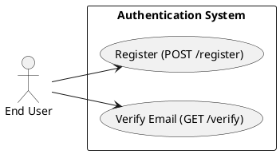
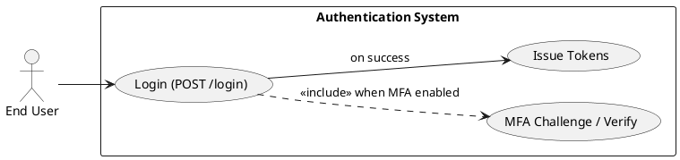
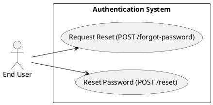
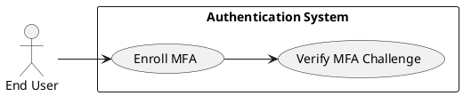
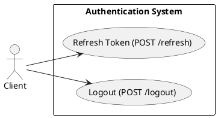
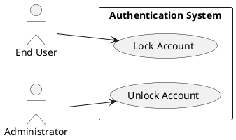
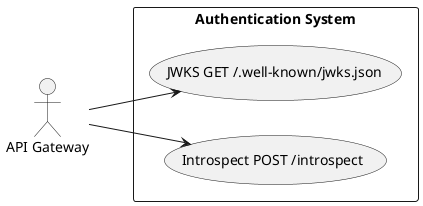
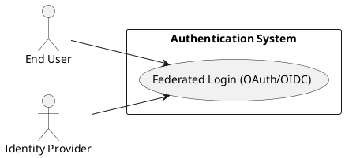

# Requirements Specification

## Feature Goal
Provide a central, secure Authentication System that replaces ad-hoc auth across applications with a unified identity service that supports user registration, secure login, password management, multi-factor authentication (MFA), token-based session management, and account protection. Current state: multiple apps implement inconsistent auth rules and storage. Desired state: single, auditable, secure authentication service with deterministic, testable behaviors and clear integration contracts.

## Business Justification
- Business value and user impact
  - Reduces security risk by centralizing authentication, improving compliance (OWASP alignment) and lowering maintenance cost for integrated applications.
  - Improves user experience through consistent login/forgot-password flows and optional MFA.
  - Enables centralized auditing, monitoring, and access controls for security and operations teams.
- Integration with existing features
  - Serves web, mobile, API Gateway, and internal services via standardized token validation (JWT + refresh token pattern), or introspection endpoint for opaque tokens.
- Problems this solves and for whom
  - End users: consistent and secure access, clearer recovery flows.
  - Security team: central policy enforcement, rate-limiting, and logs for audits.
  - Developers: single integration point and library for token validation and session handling.

## Feature Scope
User-visible behavior:
- Sign up with email and email verification flow
- Login with email + password
- Password reset via secure email link
- Optional MFA via Email OTP, SMS OTP, or authenticator app (TOTP)
- Token-based session handling (access + refresh tokens) with logout and inactivity handling
- Account lockout + administrative unlock workflows
Technical requirements:
- Secure password hashing (Argon2id preferred, configurable)
- HTTPS-only endpoints, OWASP controls, rate limiting, monitoring, and logging
- Configurable TTLs for tokens, OTPs, lockouts, and verification tokens
- Integration endpoints: token introspection, JWKS, OAuth/OIDC connectors for IdP federation
- Horizontal scaling, HA, and observability (metrics, structured logs, traces)

### Success Criteria
- [ ] Login success rate > 95% across measured user population
- [ ] Login response time < 2s for 95% of auth requests under normal load
- [ ] System handles 10,000+ concurrent sessions without auth failures attributable to the auth service
- [ ] No critical OWASP findings in security audit
- [ ] MFA adoption measured: > 20% of privileged users enabled within 6 months (where applicable)

## Functional Requirements

Before expanding, list of requirements to generate:

| FR-ID | Summary |
|-------|---------|
| FR-001 | User Registration with email verification |
| FR-002 | User Login with credential validation and token issuance |
| FR-003 | Password Reset (forgot password flow) |
| FR-004 | Password Policy enforcement |
| FR-005 | Multi-Factor Authentication (MFA) support (Email/SMS/TOTP) |
| FR-006 | Session Management (access + refresh tokens, logout, inactivity) |
| FR-007 | Account Lockout and Unlock workflows |
| FR-008 | API Gateway Token Validation endpoint (JWKS / introspection) |
| FR-009 | Secure Password Storage (Argon2id) |
| FR-010 | Monitoring, Logging & Audit for auth events |
| FR-011 | Scalability & High Availability requirements |
| FR-012 | Rate Limiting & Brute-Force Protection |
| FR-013 | Data Retention & Privacy Controls (configurable defaults) |
| FR-014 | Adaptive / Risk-based Authentication (AI candidate, optional) |
| FR-015 | Token Revocation & Session/Refresh Token Blacklisting [UNCLEAR] |
| FR-016 | SSO / OAuth / OIDC Federation integration [UNCLEAR] |

Expand each FR listed above with full specification.

- FR-001: [DETERMINISTIC] System MUST allow new users to register an account via email verification.
  - Description: Registration endpoint accepts Email, Password, FirstName, LastName. Sends verification email with single-use token.
  - Acceptance Criteria:
    1. Given valid inputs, POST /register returns 202 Accepted and a verification email is queued within 5 seconds.
    2. The verification token is single-use and expires in 24 hours (configurable).
    3. Attempting to register with an existing verified email returns 409 Conflict with "Email already registered".
    4. Unverified accounts may be resumed by re-sending verification; re-send limited to 3 attempts per 24 hours per account.
    5. The system stores user record with status=UNVERIFIED until token consumption completes verification.
  - Trigger: User submits registration form.
  - Who benefits: End users, Product and Security teams.
  - Failure scenarios: Email delivery fails (queue & retry), token expiry before user action, rate limit exceeded.
  - Notes: Email validated per RFC 5322; verification token tied to user_id and stored hashed to prevent token leak.

- FR-002: [DETERMINISTIC] System MUST authenticate users via email + password and return access and refresh tokens.
  - Description: Credential validation with hashed password comparison and optional MFA challenge.
  - Acceptance Criteria:
    1. Successful auth returns HTTP 200 and JSON with access_token (JWT, TTL default 15 minutes) and refresh_token (opaque, TTL default 30 days) when no MFA is enabled.
    2. If MFA is enabled, successful password validation returns HTTP 200 with mfa_required=true and no tokens until MFA verification completes.
    3. Failed auth increments failed-login counters; response for invalid credentials is 401 Unauthorized with a generic error "Invalid credentials".
    4. Tokens include minimal necessary claims (sub=user_id, aud=client_id, iat, exp, jti) and are signed with rotating keys; JWKS endpoint must publish public keys.
    5. Login response time < 2s for 95% of successful authentication requests under normal load.
  - Trigger: POST /login with email+password.
  - Who benefits: End users, client apps, API Gateway.
  - Failure scenarios: Locked account, throttling, invalid credentials, MFA failure.

- FR-003: [DETERMINISTIC] System MUST provide a secure password reset (forgot password) flow.
  - Description: Users can request a password reset link sent to their verified email; the link contains a single-use token to set a new password.
  - Acceptance Criteria:
    1. POST /forgot-password returns 202 Accepted and queues reset email if email exists; response must not reveal account existence.
    2. Reset token expires in 1 hour (configurable) and is single-use.
    3. Completing reset requires token and new password passing password policy; returns 200 OK and invalidates existing sessions (configurable).
    4. Rate limit forgot-password requests to prevent enumeration and abuse.
  - Trigger: User clicks "Forgot Password" and submits email.
  - Who benefits: End users, support team.
  - Failure scenarios: Token expired, token replay, email not delivered.

- FR-004: [DETERMINISTIC] System MUST enforce configurable password policy.
  - Description: Password complexity and length rules enforced at creation and reset.
  - Acceptance Criteria:
    1. Default policy: minimum 8 characters, uppercase, lowercase, digit, special character; configurable by admin via secure config.
    2. Passwords failing policy return 400 Bad Request with non-sensitive descriptive message.
    3. Password strength checks applied client- and server-side; server-side enforced as authoritative.
    4. System MUST prevent reuse of the last N passwords (configurable, default N=5).
  - Trigger: Password create or update actions.
  - Who benefits: Security team, end users.
  - Failure scenarios: Weak password attempt, policy misconfiguration.

- FR-005: [DETERMINISTIC] System MUST support Multi-Factor Authentication (MFA) methods: Email OTP, SMS OTP, and TOTP (authenticator apps).
  - Description: Users can enroll in/enable MFA; system supports challenge and verification flows.
  - Acceptance Criteria:
    1. User may enroll TOTP via provisioning QR and secret; backup codes generated and shown once.
    2. When MFA enabled, login flow requires proof of possession of second factor before issuing tokens.
    3. OTPs are single-use, expire within 5 minutes (configurable), and stored hashed.
    4. SMS & Email providers configured; fallback flows documented (recovery codes).
  - Trigger: User opts in or admin mandates MFA for role.
  - Who benefits: Security-conscious users, admins.
  - Failure scenarios: SMS delivery failure, OTP replay, lost device — recovery via backup codes or admin unlock.

- FR-006: [DETERMINISTIC] System MUST manage sessions via access and refresh tokens with revocation and logout support.
  - Description: Access tokens are short-lived JWTs; refresh tokens are opaque and rotate on use. Logout and revocation mechanisms supported.
  - Acceptance Criteria:
    1. Access token TTL default 15 minutes; refresh token TTL default 30 days.
    2. Refresh token rotation: upon use to obtain a new access token, the previous refresh token is invalidated.
    3. POST /logout invalidates refresh tokens and (optionally) blacklists active access tokens until natural expiry.
    4. Endpoint for session listing and revocation per user (for account management).
  - Trigger: Successful login issues tokens; client calls /refresh or /logout.
  - Who benefits: End users (session control), security and operations teams.
  - Failure scenarios: Refresh token theft (rotation & detection mitigations applied), token replay. See FR-015 for revocation gaps.

- FR-007: [DETERMINISTIC] System MUST implement account lockout and unlock workflows to mitigate brute-force attacks.
  - Description: Track failed login attempts and apply progressive lockouts with admin and self-service unlock.
  - Acceptance Criteria:
    1. Default: 5 failed attempts within a rolling window (e.g., 15 minutes) triggers temporary lock (e.g., 15 minutes); configurable policy per environment.
    2. Locked accounts return 423 Locked with generic message; provide unlock options: automatic expiry, email verification, or admin unlock.
    3. Admin actions logged and auditable.
  - Trigger: Repeated failed authentication attempts.
  - Who benefits: Security team, users.
  - Failure scenarios: Account lockout due to attack or false positives; must provide safe unlock procedures.

- FR-008: [DETERMINISTIC] System MUST provide token validation interfaces for API Gateway and clients (JWKS endpoint and introspection).
  - Description: Publish JWKS for JWT verification; provide introspection endpoint for opaque tokens.
  - Acceptance Criteria:
    1. GET /.well-known/jwks.json returns current public keys and key metadata.
    2. POST /introspect accepts token and returns active, sub, aud, exp, scope, and client_id fields for opaque tokens.
    3. Introspection calls require client authentication and are rate-limited.
  - Trigger: API Gateway or services call introspection/JWKS.
  - Who benefits: API Gateway, backend services.
  - Failure scenarios: Key rotation not synchronized; stale keys causing token validation failures.

- FR-009: [DETERMINISTIC] System MUST store passwords using a secure algorithm (Argon2id preferred).
  - Description: Passwords salted and hashed using Argon2id with parameters configurable per environment.
  - Acceptance Criteria:
    1. Passwords hashed using Argon2id (or bcrypt if approved), salts per password, and secure parameters aligned to current best practices.
    2. No plaintext passwords stored or logged; password reset tokens stored hashed.
    3. Security review documents chosen parameters and migration plan if algorithm changes.
  - Trigger: Password creation or update.
  - Who benefits: Security, users.
  - Failure scenarios: Weak hashing parameters; migration plan required.

- FR-010: [DETERMINISTIC] System MUST emit monitoring, structured logs, and auditable events for authentication actions.
  - Description: Log events for registration, login success/failure, password resets, MFA events, token issuance, revocation, and admin actions.
  - Acceptance Criteria:
    1. Events include timestamp, user_id (hashed where necessary), event_type, client_id, IP, user_agent, and outcome.
    2. Logs scrub sensitive data (no full tokens or passwords). PII stored per privacy controls (FR-013).
    3. Metric emissions: auth_success_rate, auth_latency_histogram, failed_login_rate, lockout_rate, MFA_challenge_rate.
    4. Alerts configured for anomalous behavior (e.g., spike in failed logins).
  - Trigger: Relevant auth events.
  - Who benefits: Security, SRE, compliance teams.
  - Failure scenarios: Logging overload, retention misconfiguration.

- FR-011: [DETERMINISTIC] System MUST be scalable and highly available.
  - Description: Design for horizontal scaling, stateless frontends, and replicated storage for session/metadata; failover patterns documented.
  - Acceptance Criteria:
    1. Stateless API nodes behind a load balancer; shared state in resilient stores (DB, Redis cluster for short-lived state).
    2. Autoscaling and health checks ensure 99.9% availability target.
    3. System validated to handle target concurrent sessions (10,000+) via load test.
  - Trigger: Production deployment and load testing.
  - Who benefits: Platform and end users.
  - Failure scenarios: Single point of failure in stateful services; capacity planning gaps.

- FR-012: [DETERMINISTIC] System MUST implement rate limiting and brute-force protections.
  - Description: Apply IP-based and account-based rate limits; integrate CAPTCHA or progressive delays for suspicious traffic.
  - Acceptance Criteria:
    1. Rate limits applied per endpoint (configurable). Failed login attempts tracked per account and IP.
    2. Protective measures (progressive delays, CAPTCHA) triggered after suspicious thresholds.
    3. Rate limits configurable per client_id to support trusted internal clients.
  - Trigger: Repeated or excessive requests.
  - Who benefits: Security and operations.
  - Failure scenarios: Legitimate traffic blocked; false positives require clear mitigation.

- FR-013: [DETERMINISTIC] System MUST implement configurable data retention and privacy controls.
  - Description: Define retention for audit logs, user metadata, and tokens; support deletion/portability per regulation.
  - Acceptance Criteria:
    1. Default retention policies described; admin APIs for retention configuration.
    2. Support user data deletion requests (GDPR/CCPA considerations) with documented process.
    3. Sensitive data storage minimized and encrypted at rest (AES-256).
  - Trigger: Data lifecycle events, legal requests.
  - Who benefits: Compliance, legal, privacy teams.
  - Failure scenarios: Retention misconfiguration causing non-compliance.

- FR-014: [AI-CANDIDATE] System SHOULD support Adaptive / Risk-based Authentication as an optional enhancement.
  - Description: Use behavioral signals (IP reputation, device fingerprint, velocity) to score risk and apply step-up authentication. This is AI-suitable for anomaly detection and risk scoring.
  - Acceptance Criteria:
    1. Initial release may use deterministic rules (geofence, velocity) with clear thresholds.
    2. AI candidate design documents data sources, model governance, and human-in-the-loop review for high-risk decisions.
    3. Risk scoring decisions can trigger additional step-up (MFA) or block; decisions logged and explainable.
  - Trigger: Login or token refresh request with anomalous signals.
  - Who benefits: Security team, high-risk users.
  - Failure scenarios: False positives locking out legitimate users; model drift. Must implement monitoring and fallback to deterministic rules.

- FR-015: [UNCLEAR] System MUST provide a clear token revocation and session invalidation strategy (requires decision).
  - Description: Specify whether revocation uses a centralized blacklist, short-lived access tokens only, refresh token rotation, or introspection.
  - Acceptance Criteria (proposed until clarified):
    1. If opaque refresh tokens used, provide introspection and blacklist with TTL aligned to token lifetimes.
    2. Admin revocation API immediately invalidates refresh tokens and marks sessions as revoked.
    3. Document performance/scale implications of blacklists and propose cache strategies.
  - Trigger: Admin request, password reset, logout.
  - Who benefits: Security, compliance.
  - Clarification required: choice between stateless JWT-only approach vs. server-side revocation capabilities.

- FR-016: [UNCLEAR] System MUST integrate with external Identity Providers (SSO/OAuth/OIDC) per project needs.
  - Description: Support federation flows and map IdP assertions to local user records.
  - Acceptance Criteria (proposed until clarified):
    1. Support Authorization Code flow with PKCE for public clients and server-side flows for confidential clients.
    2. Attribute mapping configuration (email, name, groups) with onboarding procedures.
    3. Document consent, claims, and session mapping behavior.
  - Trigger: Customer requests SSO integration.
  - Who benefits: Enterprise customers, IT teams.
  - Clarification required: list of IdPs, required claims, and provisioning behavior (SCIM or just SAML/OIDC).

**Note**: Requirements are marked with classification tags:
- [UNCLEAR] - Needs clarification before implementation
- [AI-CANDIDATE] - Suitable for GenAI (NLU, anomaly detection, recommendations)
- [DETERMINISTIC] - Requires exact/rule-based logic
- [HYBRID] - AI suggests, human confirms (used in designs where applicable)

## AI Fit Summary (GenAI Suitability Triage)
- Deterministic features: core auth flows (registration, credential validation, password reset, MFA, token handling, logging) are [DETERMINISTIC].
- AI-suitable features: adaptive/risk-based authentication, anomaly detection, and user behavior scoring flagged as [AI-CANDIDATE].
- Hybrid opportunities: contextual help and automated account recovery assistance could be [HYBRID] (AI suggests outcomes, human verifies).

## Use Case Analysis

### Actors & System Boundary
- Primary Actor: End User — an individual attempting to register, authenticate, reset password, or manage their session.
- Secondary Actor: Administrator — manages policies, unlocks accounts, views audit logs.
- System Actor: API Gateway — delegates token validation to the Authentication System.
- External System: Email Provider, SMS Provider, Identity Providers (IdP/OIDC), Monitoring/Logging systems.
- System Boundary: "Authentication System" provides all endpoints and internal services for identity and session management.

### Use Case Specifications

#### UC-001: User Registration and Email Verification
- Actor(s): End User
- Goal: Create a new verified account.
- Preconditions: User has access to a valid email address and client can reach /register endpoint.
- Success Scenario:
  1. User submits registration form with email and password.
  2. System validates input and password policy.
  3. System creates UNVERIFIED user record and queues verification email with token.
  4. User clicks verification link; system validates token and marks user as VERIFIED.
  5. System returns success; user can log in.
- Extensions/Alternatives:
  - 2a. If email already exists and unverified, allow resend (limited to 3 per 24h).
  - 3a. If email delivery fails, system retries and surfaces a support route after N attempts.
- Postconditions: User status=VERIFIED and user_id issued.

##### Use Case Diagram

#### UC-002: User Login (Password +/- MFA)
- Actor(s): End User
- Goal: Authenticate and receive tokens to access protected resources.
- Preconditions: User has a verified account (status=VERIFIED).
- Success Scenario:
  1. User submits credentials to /login.
  2. System validates credentials and checks lockout/limits.
  3. If MFA not enabled, system issues access_token and refresh_token.
  4. If MFA enabled, system sends challenge; upon verification, system issues tokens.
- Extensions/Alternatives:
  - 2a. Invalid credentials increment failed attempt counter; apply lockout rules if threshold exceeded.
  - 3a. If account locked, return 423 Locked and provide unlock options.
- Postconditions: Tokens issued and session recorded.

##### Use Case Diagram

#### UC-003: Password Reset (Forgot Password)
- Actor(s): End User
- Goal: Reset password via secure link.
- Preconditions: User has access to their verified email.
- Success Scenario:
  1. User requests reset via /forgot-password.
  2. System queues a reset email with single-use token.
  3. User follows link, submits new password complying with policy.
  4. System validates token, updates hashed password, invalidates existing sessions (configurable), and returns success.
- Extensions/Alternatives:
  - 2a. If token expired, user prompted to request a new token.
  - 3a. If reset attempt exceeds rate limits, block and advise support.
- Postconditions: Password updated; sessions revoked as configured.

##### Use Case Diagram

#### UC-004: MFA Enrollment and Verification
- Actor(s): End User
- Goal: Enroll and use MFA for stronger authentication.
- Preconditions: User authenticated or in an enrollment flow with verified identity.
- Success Scenario:
  1. User selects MFA method (TOTP/SMS/Email) and initiates enrollment.
  2. System generates secret/OTP and verifies possession via challenge.
  3. System enables MFA for the account and stores necessary metadata.
- Extensions/Alternatives:
  - 2a. For TOTP, show provisioning QR and provide backup codes.
  - 2b. For SMS, verify phone number via OTP.
- Postconditions: MFA enabled; future logins require second factor.

##### Use Case Diagram

#### UC-005: Session Management and Token Refresh
- Actor(s): End User, API Client
- Goal: Maintain an authenticated session and obtain new access tokens via refresh.
- Preconditions: User authenticated and holds valid refresh token.
- Success Scenario:
  1. Client calls POST /refresh with refresh_token.
  2. System validates refresh token, rotates it, and issues new access and refresh tokens.
  3. System records session activity and last_seen timestamp.
- Extensions/Alternatives:
  - 2a. If refresh token invalid or revoked, require full reauthentication.
- Postconditions: New tokens delivered; old refresh token invalidated.

##### Use Case Diagram

#### UC-006: Account Lockout and Unlock
- Actor(s): End User, Administrator
- Goal: Protect accounts from brute-force attacks and provide unlock paths.
- Preconditions: System tracks failed attempts per account/IP.
- Success Scenario:
  1. After threshold exceeded, system marks account as LOCKED.
  2. User receives notification and an unlock option (email verification) or admin may unlock.
  3. Admin action logged and reported.
- Extensions/Alternatives:
  - 2a. If unlock via email fails, admin must perform unlock.
- Postconditions: Account status updated to ACTIVE after unlock.

##### Use Case Diagram

#### UC-007: Token Validation for API Gateway (JWKS / Introspection)
- Actor(s): API Gateway (system actor)
- Goal: Validate tokens for inbound API requests.
- Preconditions: Gateway configured with JWKS URL or introspection credentials.
- Success Scenario:
  1. Gateway verifies JWT signature via JWKS or calls /introspect for opaque tokens.
  2. Gateway receives token metadata and enforces access control.
- Extensions/Alternatives:
  - 1a. If key rotation occurs, JWKS contains multiple keys with kid; gateway handles key caching and rotation.
- Postconditions: Gateway forwards request to backend if token valid.

##### Use Case Diagram

#### UC-008: SSO / OAuth / OIDC Federation (Provisioning and Login)
- Actor(s): End User, External Identity Provider
- Goal: Allow users to authenticate via external IdPs and map/provision local accounts.
- Preconditions: IdP configuration and client credentials exist.
- Success Scenario:
  1. User initiates login via IdP (Auth Code flow).
  2. Auth system exchanges code, validates signature/claims, and maps/asserts user identity.
  3. System issues local tokens or provisions user record if allowed.
- Extensions/Alternatives:
  - 2a. If user email conflicts, present conflict resolution flow.
- Postconditions: User authenticated and tokens issued with mapped claims.

##### Use Case Diagram

## Risks & Mitigations (Top 5 scoped to FRs)
- Risk: Brute-force attacks leading to account compromise.
  - Mitigation: FR-007 & FR-012 enforce lockouts, account/IP rate limits, progressive delays, and alerts.
- Risk: Token theft or replay (access/refresh tokens).
  - Mitigation: Short-lived access tokens, refresh token rotation (FR-006), secure cookie flags, token revocation strategy (FR-015).
- Risk: Weak password storage or credential leaks.
  - Mitigation: Argon2id hashing (FR-009), no logging of plaintext, secure key management.
- Risk: Availability and scaling failures under load.
  - Mitigation: Stateless API design, autoscaling, load testing for target concurrency (FR-011), graceful degradation strategies.
- Risk: False positives from adaptive authentication (user lockout).
  - Mitigation: Start with deterministic rules, monitor false positive rate, apply human-in-the-loop on high-risk blocks and allow admin overrides (FR-014).

## Constraints & Assumptions (Top 5 scoped to FRs)
- Constraint: External providers (email/SMS/IdP) availability and SLAs affect user flows; system must implement retries and fallback.
- Assumption: Default security parameters (Argon2id params, token TTLs) acceptable until security team approves changes.
- Constraint: Token revocation model has performance implications; an explicit decision is required (FR-015).
- Assumption: API Gateway will be configured to use JWKS or introspection; consent and claims mapping for SSO will be provided per integration (FR-016).
- Constraint: Regulatory requirements (GDPR, CCPA) require data retention and deletion paths; implementation must support admin and user-triggered deletion (FR-013).

---

Rules used by this workflow:
- rules/ai-assistant-usage-policy.md
- rules/uml-text-code-standards.md
- rules/markdown-styleguide.md
- rules/dry-principle-guidelines.md
- rules/security-standards-owasp.md
- rules/performance-best-practices.md
- rules/iterative-development-guide.md

Evaluation Scores

| Criterion | Score (1-5) |
|-----------|-------------:|
| Completeness (requirements coverage) | 4 |
| Testability (clear acceptance criteria) | 5 |
| Security alignment (OWASP controls) | 5 |
| Clarity & Traceability | 4 |
| AI-suitability triage quality | 4 |

Average Score: 4.4

Evaluation summary:
Spec maps business goals to testable functional requirements and use cases, with OWASP-aligned security controls and measurable success criteria. AI-fit triage highlights adaptive authentication as a candidate. Two items (token revocation strategy and SSO integration specifics) are intentionally flagged [UNCLEAR] and require stakeholder decisions before implementation.