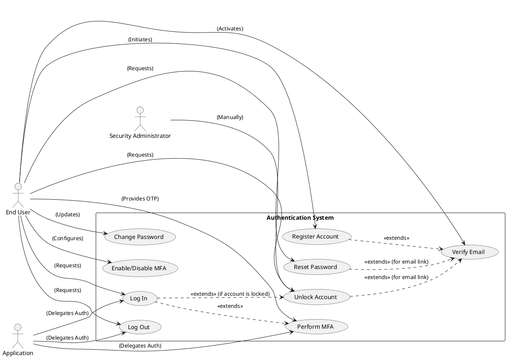

## Product Specification: Authentication System

---

### 1. Executive Summary

This document outlines the product specification for a new, secure Authentication System. The primary goal is to establish a central identity service that verifies user identities and controls access to protected application resources across web applications, mobile applications, and APIs. This system will mitigate risks associated with unauthorized access and data breaches by implementing robust security measures, including secure registration, login, password management, optional multi-factor authentication (MFA), and comprehensive session management. By adhering to industry best practices and security standards like OWASP Top 10, the system aims to provide a reliable, scalable, and secure user experience, safeguarding sensitive data while supporting a growing user base.

---

### 2. Goals and Objectives

The implementation of the Authentication System is driven by the following key objectives:

*   **Secure Access:** MUST ensure that only authenticated and authorized users can access sensitive application resources and data.
*   **Data Protection:** SHALL protect all sensitive user credentials and related identity data against unauthorized access, compromise, or misuse.
*   **Compliance:** MUST adhere to established security best practices and industry standards, including the OWASP Top 10, to minimize vulnerabilities.
*   **User Experience:** SHALL provide a smooth, intuitive, and secure authentication experience for end-users, minimizing friction while maintaining high security.
*   **Scalability:** MUST be capable of supporting a large and growing number of users and concurrent authentication requests without degradation in performance.

---

### 3. Target Users

The Authentication System is designed to serve the following primary user groups:

*   **End Users:** Individuals who will register, log in, and manage their accounts to access various integrated web and mobile applications.
*   **Application Developers:** Teams responsible for integrating their applications (web, mobile, APIs) with the central Authentication System.
*   **Security Team:** Responsible for defining, auditing, and enforcing security policies and ensuring compliance.
*   **DevOps Team:** Responsible for the deployment, monitoring, maintenance, and operational integrity of the Authentication System infrastructure.

---

### 4. Functional Requirements (FR-XXX)

#### 4.1. User Registration

**FR-001: New User Account Creation**
The system SHALL allow new users to create an account by providing an email address, password, and name.
*   **Acceptance Criteria:**
    *   The system successfully creates a new user account upon submission of valid details and successful email verification.
    *   A unique user ID is generated and associated with the new account.
    *   The user receives confirmation of successful account creation.
[DETERMINISTIC]

**FR-002: Email Format Validation**
The system MUST validate that the provided email address adheres to a standard email format (e.g., `user@domain.com`).
*   **Acceptance Criteria:**
    *   The system rejects registration attempts with invalid email formats and displays an appropriate error message.
    *   The system accepts registration attempts with valid email formats.
[DETERMINISTIC]

**FR-003: Password Policy Enforcement (Registration)**
The system MUST enforce the defined password policy during user registration.
*   **Acceptance Criteria:**
    *   Registration attempts with passwords not meeting the policy are rejected, and specific policy violations are communicated to the user.
    *   Registration attempts with passwords meeting the policy are accepted.
[DETERMINISTIC]

**FR-004: Email Uniqueness Validation**
The system MUST ensure that each registered email address is unique.
*   **Acceptance Criteria:**
    *   An attempt to register with an already existing email address results in an error message indicating the email is taken.
    *   Registration with a unique email address proceeds successfully.
[DETERMINISTIC]

**FR-005: Email Verification**
The system SHALL require email verification to activate a new user account.
*   **Acceptance Criteria:**
    *   Upon initial registration, an email containing a unique verification link is sent to the user's provided email address.
    *   The user's account status remains "unverified" or "pending" until the verification link is clicked.
    *   Clicking the verification link successfully activates the account and updates its status to "active."
    *   Expired or invalid verification links result in an appropriate error message and prompt to resend the link.
[DETERMINISTIC]

#### 4.2. User Login

**FR-006: Credential-Based Login**
The system SHALL allow registered users to log in using their verified email address and password.
*   **Acceptance Criteria:**
    *   Upon successful verification of credentials, the system issues an authentication token/session.
    *   The user is redirected to the intended protected application resource.
[DETERMINISTIC]

**FR-007: Invalid Credential Handling**
The system MUST display a generic error message for invalid login attempts (e.g., "Invalid email or password").
*   **Acceptance Criteria:**
    *   Login attempts with incorrect email or password result in a consistent, non-specific error message.
    *   No information revealing whether the email exists or if only the password was incorrect is exposed.
[DETERMINISTIC]

**FR-008: Account Lockout Integration (Login)**
The system SHALL integrate with the Account Lockout mechanism (FR-019) to prevent access to locked accounts.
*   **Acceptance Criteria:**
    *   Login attempts to an account previously locked due to excessive failed attempts are rejected with a specific message indicating the account is locked.
    *   The system correctly tracks and applies the lockout status for affected accounts.
[DETERMINISTIC]

#### 4.3. Password Management

**FR-009: Forgot Password Initiative**
The system SHALL allow users to initiate a password reset process if they forget their password.
*   **Acceptance Criteria:**
    *   Upon request, a unique password reset link with a defined expiration time is sent to the user's registered email address.
    *   The system confirms that a reset email has been sent without revealing if the email exists if it's not found.
[DETERMINISTIC]

**FR-010: Password Reset via Link**
The system SHALL allow a user to set a new password using a valid, non-expired password reset link.
*   **Acceptance Criteria:**
    *   Clicking a valid reset link presents the user with a form to enter and confirm a new password.
    *   Upon successful submission of a new password meeting policy, the old password is invalidated, and the new one is hashed and stored.
    *   The user receives confirmation of a successful password change.
[DETERMINISTIC]

**FR-011: Password Policy Enforcement (Reset)**
The system MUST enforce the defined password policy (FR-013) when a user sets a new password during a reset.
*   **Acceptance Criteria:**
    *   Password reset attempts with new passwords not meeting the policy are rejected, and specific policy violations are communicated.
    *   Password reset attempts with new passwords meeting the policy are accepted.
[DETERMINISTIC]

**FR-012: Expired/Invalid Reset Link Handling**
The system MUST handle expired or invalid password reset links gracefully.
*   **Acceptance Criteria:**
    *   Attempts to use an expired or invalid password reset link result in an error message, prompting the user to initiate a new reset process.
[DETERMINISTIC]

**FR-013: Password Policy Definition**
The system SHALL enforce the following minimum password complexity requirements:
*   Minimum 8 characters in length.
*   At least one uppercase letter.
*   At least one lowercase letter.
*   At least one number.
*   At least one special character (e.g., !@#$%^&*).
*   **Acceptance Criteria:**
    *   All password creation and update flows validate against these 5 rules.
    *   The system provides explicit feedback when a password violates any of these rules.
[DETERMINISTIC]

**FR-014: Logged-in User Password Change**
The system SHALL allow a logged-in user to change their password.
*   **Acceptance Criteria:**
    *   The user is prompted to enter their current password, and the new password (twice).
    *   The system validates the current password against the stored hash.
    *   The new password MUST adhere to the password policy (FR-013).
    *   Upon successful change, the user's session remains active, and a confirmation message is displayed.
    *   Attempts with incorrect current password or new password violating policy are rejected with specific error messages.
[DETERMINISTIC]

#### 4.4. Multi-Factor Authentication (MFA)

**FR-015: Optional MFA Enrollment**
The system SHALL allow users to optionally enroll in Multi-Factor Authentication (MFA).
*   **Acceptance Criteria:**
    *   Users can initiate MFA setup from their account settings.
    *   The system provides options to choose an MFA method (Email OTP, SMS OTP, Authenticator App).
    *   Upon successful enrollment, MFA is active for that user's subsequent logins.
[DETERMINISTIC]

**FR-016: Email OTP MFA Method**
The system SHALL support Email OTP (One-Time Password) as an MFA method.
*   **Acceptance Criteria:**
    *   When MFA is enabled, upon successful primary credential verification, an OTP is sent to the user's registered email address.
    *   The system prompts the user to enter the OTP within a specified timeframe (e.g., 5 minutes).
    *   Valid OTP entry grants access; invalid or expired OTP entry denies access.
[DETERMINISTIC]

**FR-017: SMS OTP MFA Method**
The system SHALL support SMS OTP as an MFA method.
*   **Acceptance Criteria:**
    *   When MFA is enabled, upon successful primary credential verification, an OTP is sent via SMS to the user's registered phone number.
    *   The system prompts the user to enter the OTP within a specified timeframe (e.g., 5 minutes).
    *   Valid OTP entry grants access; invalid or expired OTP entry denies access.
[DETERMINISTIC]

**FR-018: Authenticator App MFA Method**
The system SHALL support Authenticator App (e.g., Google Authenticator) as an MFA method.
*   **Acceptance Criteria:**
    *   During enrollment, the system displays a QR code or secret key for the user to configure their authenticator app.
    *   Upon successful primary credential verification, the system prompts the user to enter a time-based OTP (TOTP) from their authenticator app.
    *   Valid TOTP entry grants access; invalid or expired TOTP entry denies access.
[DETERMINISTIC]

#### 4.5. Session Management

**FR-019: Token-Based Authentication**
The system SHALL issue secure, cryptographically signed tokens (e.g., JWT) or session IDs upon successful authentication.
*   **Acceptance Criteria:**
    *   A valid token/session ID is generated and returned to the client upon successful login.
    *   Each token/session ID contains necessary claims for authorization and user identification.
    *   Tokens/Session IDs are signed to prevent tampering.
[DETERMINISTIC]

**FR-020: Session Expiration**
The system SHALL manage session expiration based on a configurable duration (e.g., 1 hour for access tokens, 7 days for refresh tokens).
*   **Acceptance Criteria:**
    *   Access tokens automatically become invalid after their defined expiry time.
    *   Requests with an expired access token are rejected, requiring re-authentication or refresh token usage.
[DETERMINISTIC]

**FR-021: Explicit Logout Functionality**
The system SHALL provide functionality for users to explicitly log out of their session.
*   **Acceptance Criteria:**
    *   Upon logout, the user's current session token/ID is immediately invalidated on the server-side.
    *   The user is redirected to the login page or a logged-out confirmation page.
    *   Subsequent requests with the invalidated token/ID are rejected.
[DETERMINISTIC]

**FR-022: Automatic Logout on Inactivity**
The system SHALL automatically log out users after a configurable period of inactivity (e.g., 30 minutes).
*   **Acceptance Criteria:**
    *   After the inactivity period, the user's session is terminated, and the token/session ID is invalidated.
    *   The user is prompted to re-authenticate upon subsequent interaction with the application.
[DETERMINISTIC]

#### 4.6. Account Lockout

**FR-023: Failed Login Attempt Counter**
The system SHALL maintain a counter for failed login attempts associated with each user account.
*   **Acceptance Criteria:**
    *   The counter increments for each unsuccessful login attempt for a specific email address.
    *   The counter resets to zero upon a successful login.
[DETERMINISTIC]

**FR-024: Account Locking Threshold**
The system MUST temporarily lock an account after 5 consecutive failed login attempts within a defined period (e.g., 15 minutes).
*   **Acceptance Criteria:**
    *   Upon reaching the threshold, the account's status is updated to "locked."
    *   Subsequent login attempts for a locked account are rejected with an "Account Locked" message.
[DETERMINISTIC]

**FR-025: Account Unlock Mechanism**
The system SHALL provide mechanisms for a locked account to be unlocked.
*   **Acceptance Criteria:**
    *   A locked account automatically unlocks after a configured duration (e.g., 30 minutes) *or*
    *   The user can initiate an email-based verification process to unlock the account *or*
    *   An administrator can manually unlock the account via an internal tool.
[DETERMINISTIC]

---

### 5. Non-Functional Requirements (NFR-XXX)

#### 5.1. Security

**NFR-001: OWASP Top 10 Compliance**
The system MUST adhere to the security principles outlined in the OWASP Top 10 to protect against common web application vulnerabilities.
*   **Acceptance Criteria:**
    *   Regular security audits and penetration testing confirm compliance with OWASP Top 10 guidelines (e.g., no SQL Injection, XSS, broken authentication vulnerabilities detected).
    *   All development practices follow secure coding guidelines.
[DETERMINISTIC]

**NFR-002: Secure Password Hashing**
The system MUST use strong, industry-standard cryptographic hashing algorithms (e.g., bcrypt, Argon2) for storing user passwords.
*   **Acceptance Criteria:**
    *   Passwords are never stored in plain text.
    *   Verification confirms the use of a computationally expensive, salted hashing algorithm with a sufficient work factor.
[DETERMINISTIC]

**NFR-003: HTTPS Encryption**
All communication between the client (web/mobile application) and the Authentication System, and between internal services, MUST be encrypted using HTTPS/TLS.
*   **Acceptance Criteria:**
    *   All API endpoints and web interfaces enforce HTTPS connections.
    *   Attempts to access resources via HTTP are automatically redirected to HTTPS or rejected.
[DETERMINISTIC]

**NFR-004: Brute-Force Protection**
The system MUST implement protection mechanisms against brute-force attacks, including account lockout (FR-024) and rate limiting.
*   **Acceptance Criteria:**
    *   The account lockout mechanism correctly triggers and prevents further login attempts.
    *   Rate limiting is applied to login endpoints, limiting the number of requests from a single IP address over a timeframe.
[DETERMINISTIC]

#### 5.2. Performance

**NFR-005: Login Response Time**
The system SHALL achieve a login response time of less than 2 seconds for 95% of requests.
*   **Acceptance Criteria:**
    *   Load testing demonstrates an average login response time below 2 seconds under peak load conditions.
    *   Monitoring metrics confirm consistent performance in production.
[DETERMINISTIC]

**NFR-006: Concurrent User Support**
The system SHALL support at least 10,000 concurrent active users.
*   **Acceptance Criteria:**
    *   Load testing simulates 10,000 concurrent users without significant performance degradation or system failures.
    *   The system maintains stability and responsiveness under this load.
[DETERMINISTIC]

#### 5.3. Scalability

**NFR-007: Horizontal Scalability**
The Authentication System MUST be designed to support horizontal scaling.
*   **Acceptance Criteria:**
    *   The system architecture allows for stateless services or distributed state management, enabling additional instances to be added without code changes.
    *   Successful deployment and operation with multiple horizontally scaled instances are demonstrated.
[DETERMINISTIC]

**NFR-008: Load Balancing Support**
The system MUST be compatible with standard load balancing solutions.
*   **Acceptance Criteria:**
    *   The system integrates seamlessly with common load balancers (e.g., AWS ELB, Nginx) without requiring special configurations.
    *   Traffic is evenly distributed across instances by the load balancer.
[DETERMINISTIC]

**NFR-009: Microservice Architecture**
The Authentication System SHALL be implemented as a microservice, promoting independent deployment and scaling.
*   **Acceptance Criteria:**
    *   The authentication service operates as an independent deployable unit with a well-defined API.
    *   Changes to the authentication service can be deployed without affecting other parts of the larger application ecosystem.
[DETERMINISTIC]

#### 5.4. Reliability

**NFR-010: High Availability**
The system SHALL maintain 99.9% uptime (excluding scheduled maintenance).
*   **Acceptance Criteria:**
    *   System monitoring reports an availability of 99.9% or higher over a 3-month period.
    *   Automatic failover mechanisms ensure continuous service during component failures.
[DETERMINISTIC]

**NFR-011: Data Backup and Recovery**
User authentication data MUST be regularly backed up with a defined recovery point objective (RPO) and recovery time objective (RTO).
*   **Acceptance Criteria:**
    *   Daily backups of all critical authentication data are performed.
    *   A successful data recovery test from backups is demonstrated within the defined RTO.
[DETERMINISTIC]

**NFR-012: Comprehensive Monitoring and Logging**
The system SHALL implement comprehensive monitoring and logging for operational health and security events.
*   **Acceptance Criteria:**
    *   Critical metrics (e.g., login success/failure rates, response times, error rates) are actively monitored via dashboards.
    *   All security-relevant events (e.g., failed logins, account lockouts, password changes) are logged with sufficient detail for auditing and incident response.
    *   Alerts are triggered for predefined thresholds or critical events.
[DETERMINISTIC]

---

### 6. Use Case Analysis

#### 6.1. Use Case Diagram

#### 6.2. Detailed Use Cases

**UC-001: New User Successfully Registers and Verifies Email**

*   **Actor:** End User
*   **Preconditions:** User has a valid, unique email address.
*   **Postconditions:** User account is created and activated. User can log in.
*   **Main Flow:**
    1.  User navigates to the registration page.
    2.  User enters Email, Password (meeting policy), and Name.
    3.  User submits registration form.
    4.  System validates input (email format, password policy, email uniqueness).
    5.  System creates a pending account and sends a verification email to the provided address.
    6.  System displays a confirmation message, instructing the user to check their email.
    7.  User receives the verification email and clicks the unique link.
    8.  System verifies the link and activates the user account.
    9.  System confirms account activation to the user.
*   **Alternate Flows:**
    *   **AF-001a: Invalid Email Format:** System rejects input at step 4, displays "Invalid email format."
    *   **AF-001b: Password Policy Violation:** System rejects input at step 4, displays specific password policy failures.
    *   **AF-001c: Email Already Registered:** System rejects input at step 4, displays "Email already registered."
    *   **AF-001d: Expired/Invalid Verification Link:** At step 8, system rejects link, displays "Verification link expired/invalid," and offers to resend.

**UC-005: Registered User Successfully Logs In**

*   **Actor:** End User
*   **Preconditions:** User has an active, verified account.
*   **Postconditions:** User is authenticated, a session token is issued, and access to protected resources is granted.
*   **Main Flow:**
    1.  User navigates to the login page.
    2.  User enters registered Email and Password.
    3.  User submits login form.
    4.  System validates credentials.
    5.  (If MFA is enabled) System initiates MFA challenge (UC-008).
    6.  System generates a secure session token.
    7.  System sends the session token to the client.
    8.  User is redirected to the intended application resource.
*   **Alternate Flows:**
    *   **AF-005a: Invalid Credentials:** At step 4, system rejects credentials, increments failed login counter, and displays "Invalid email or password."
    *   **AF-005b: Account Locked:** At step 4, system identifies account as locked (due to FR-024), displays "Account locked. Please reset password or try again later."
    *   **AF-005c: MFA Required (UC-008 detailed below):** At step 5, system proceeds to MFA flow.

**UC-008: User Logs In with MFA Enabled**

*   **Actor:** End User
*   **Preconditions:** User has MFA enabled for their account; primary login credentials successfully verified.
*   **Postconditions:** User is authenticated, a session token is issued, and access to protected resources is granted.
*   **Main Flow:**
    1.  (From UC-005, step 5) System identifies MFA is enabled for the user's account.
    2.  System determines the user's preferred MFA method (e.g., Email OTP, SMS OTP, Authenticator App).
    3.  System generates an OTP and sends it via the chosen method (e.g., email, SMS) or prompts for Authenticator App OTP.
    4.  System presents an OTP input screen to the user.
    5.  User retrieves the OTP and enters it into the input screen.
    6.  User submits the OTP.
    7.  System validates the OTP (correctness, expiration).
    8.  (If valid) System generates a secure session token.
    9.  System sends the session token to the client.
    10. User is redirected to the intended application resource.
*   **Alternate Flows:**
    *   **AF-008a: Invalid/Expired OTP:** At step 7, system rejects OTP, displays "Invalid or expired OTP," and allows retry or resend.
    *   **AF-008b: Too Many OTP Attempts:** After N invalid OTP attempts, MFA challenge is temporarily locked, forcing the user to re-initiate login.

**UC-010: User Initiates Password Reset for Forgotten Password**

*   **Actor:** End User
*   **Preconditions:** User has a registered account.
*   **Postconditions:** Password reset link is sent to user's email.
*   **Main Flow:**
    1.  User clicks "Forgot Password" on the login page.
    2.  User enters their registered Email address.
    3.  User submits the request.
    4.  System validates the email format.
    5.  System checks if the email exists in the database.
    6.  (If email exists) System generates a unique, time-limited password reset token.
    7.  System sends an email containing the reset link (with the token) to the user's email address.
    8.  System displays a generic confirmation message (e.g., "If an account exists, a password reset link has been sent.").
*   **Alternate Flows:**
    *   **AF-010a: Invalid Email Format:** At step 4, system rejects input, displays "Invalid email format."
    *   **AF-010b: Email Not Found:** At step 5, system proceeds to step 8 without sending an email (to prevent account enumeration).

**UC-011: User Successfully Resets Password via Link**

*   **Actor:** End User
*   **Preconditions:** User has received a valid, non-expired password reset link.
*   **Postconditions:** User's password is updated, and the reset token is invalidated.
*   **Main Flow:**
    1.  User clicks the password reset link from their email.
    2.  System validates the reset token (existence, expiration).
    3.  System presents a "Set New Password" form.
    4.  User enters and confirms a New Password (meeting policy).
    5.  User submits the new password.
    6.  System validates the New Password against the policy (FR-013).
    7.  System hashes and updates the user's password in the database.
    8.  System invalidates the used reset token.
    9.  System displays a "Password successfully reset" confirmation and provides a link to the login page.
*   **Alternate Flows:**
    *   **AF-011a: Expired/Invalid Reset Link:** At step 2, system rejects the link, displays "Reset link expired/invalid," and suggests initiating a new reset.
    *   **AF-011b: New Password Policy Violation:** At step 6, system rejects the new password, displays specific policy violations.

---

### 7. Constraints, Assumptions, and Risks

#### 7.1. Constraints

*   **Technology Stack:** Initial deployment will target a cloud-native environment (e.g., AWS, Azure, GCP) using containerization (Docker, Kubernetes) for scalability.
*   **Security Standards:** MUST comply with all relevant data privacy regulations (e.g., GDPR, CCPA) for user data handling, though specific legal counsel will define exact requirements.
*   **External Service Dependency:** Reliance on external email service providers (e.g., SendGrid, SES) and SMS gateway providers for OTP delivery.
*   **Timeline:** Initial MVP delivery within 6 months.

#### 7.2. Assumptions

*   **Email Service Availability:** An email sending service will be available and reliable for email verification, password resets, and MFA OTPs.
*   **SMS Gateway Availability:** An SMS gateway will be available for SMS OTPs, if enabled.
*   **Integrator Readiness:** Consuming applications (web, mobile, APIs) will be ready to integrate with the Authentication System's API and token-based authentication model.
*   **Infrastructure Support:** Adequate infrastructure resources (compute, storage, network) will be provisioned and managed by the DevOps team to meet performance and scalability requirements.
*   **Security Team Collaboration:** The Security Team will provide clear and timely policy decisions and participate in security reviews.

#### 7.3. Risks and Mitigation

*   **R-001: Brute Force Attacks**
    *   **Description:** Attackers repeatedly attempt to guess passwords, leading to unauthorized access.
    *   **Mitigation:** Implement account lockout after N failed attempts (FR-024). Implement rate limiting on login attempts per IP address/user.
*   **R-002: Password Breaches**
    *   **Description:** Stored passwords could be compromised if the database is breached.
    *   **Mitigation:** Use strong, salted, and computationally expensive hashing algorithms (e.g., Argon2, bcrypt) (NFR-002). Never store plain text passwords. Implement strict access controls for the database.
*   **R-003: Session Hijacking**
    *   **Description:** An attacker gains unauthorized access to a user's session.
    *   **Mitigation:** Enforce HTTPS/TLS for all communication (NFR-003). Use secure, short-lived tokens. Implement strict cookie security flags (HttpOnly, Secure, SameSite). Require re-authentication for sensitive actions.
*   **R-004: Unauthorized Access (via Phishing/Weak Credentials)**
    *   **Description:** Users fall victim to phishing, or use weak, easily guessable passwords, leading to account compromise.
    *   **Mitigation:** Enforce a strong password policy (FR-013). Provide and encourage the use of Multi-Factor Authentication (FR-015). Educate users on security best practices.
*   **R-005: Denial of Service (DoS) on Authentication Service**
    *   **Description:** An attack floods the authentication service with requests, making it unavailable.
    *   **Mitigation:** Implement robust rate limiting at the API Gateway level. Design for horizontal scalability (NFR-007) and deploy behind load balancers (NFR-008). Monitor system health and respond to anomalies quickly (NFR-012).