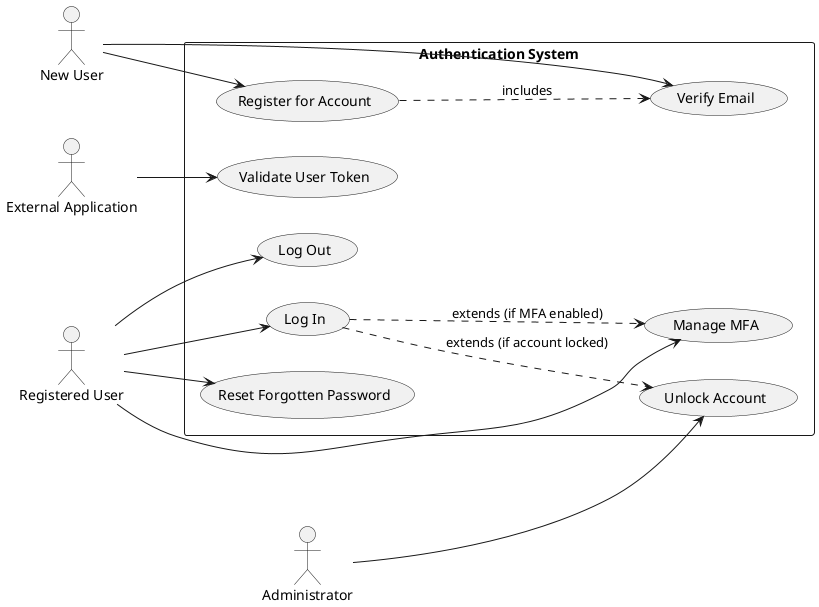

# Product Specification: Authentication System

## 1. Executive Summary

This Product Specification outlines the requirements for a robust, secure, and scalable Authentication System. The primary objective is to establish a central identity service that securely verifies user identities and controls access to various integrated applications, including web, mobile, and APIs. This system will mitigate security vulnerabilities, ensure compliance with industry best practices (e.g., OWASP Top 10), and provide a consistent, seamless user experience. By centralizing authentication, we aim to enhance data protection, streamline development efforts for client applications, and achieve high availability and performance targets for a growing user base.

## 2. Goals and Objectives

The implementation of the Authentication System is driven by the following business objectives:

*   **Secure Access:** The system MUST ensure that only authorized and authenticated users can access protected system resources.
*   **Data Protection:** The system SHALL safeguard sensitive user data, including credentials and personal information, against unauthorized access, disclosure, or modification.
*   **Compliance:** The system SHALL adhere to leading security best practices and standards, specifically the OWASP Top 10, to minimize security risks and ensure regulatory compliance.
*   **User Experience:** The system MUST provide a smooth, intuitive, and secure authentication process for end-users across all integrated applications.
*   **Scalability:** The system SHALL be designed to support a large and growing number of users and integrated applications without compromising performance or reliability.

## 3. Target Users

The Authentication System serves multiple user groups:

*   **End Users:** Individuals who register, log in, and manage their accounts to access various applications (web, mobile, internal services).
*   **Product Owners:** Stakeholders responsible for defining and prioritizing authentication-related features and requirements.
*   **Security Team:** Experts responsible for defining and enforcing security policies, auditing the system, and ensuring compliance.
*   **Development Team:** Engineers responsible for implementing, testing, and maintaining the authentication services.
*   **DevOps Team:** Personnel responsible for deploying, monitoring, and maintaining the infrastructure supporting the authentication system.
*   **Application Developers:** Developers of client applications (web, mobile, API gateways) who will integrate with the Authentication System for user authentication and authorization.

## 4. Functional Requirements

### 4.1. User Registration

**FR-REG-001: New User Account Creation**
The system MUST allow new users to securely create an account.
*   **Requirements:**
    *   FR-REG-001.1: The system SHALL accept a unique email address, a password, and a name from the user during registration. [DETERMINISTIC]
    *   FR-REG-001.2: The system SHALL validate the format of the provided email address. [DETERMINISTIC]
    *   FR-REG-001.3: The system SHALL ensure the provided password adheres to the defined password policy (refer to FR-PASS-003). [DETERMINISTIC]
    *   FR-REG-001.4: The system SHALL require email verification to activate the newly created account. [DETERMINISTIC]
*   **Acceptance Criteria:**
    *   A new user can successfully submit registration details, receive a verification email, click the verification link, and activate their account.
    *   Attempting to register with an already existing email address results in an appropriate error message (e.g., "Email already registered").
    *   Invalid email formats (e.g., "user@.com") are rejected with a specific error message.
    *   Passwords not meeting FR-PASS-003 policy are rejected with a specific error message outlining policy violations.
    *   Account status in the database is "Pending Verification" until email is verified, then transitions to "Active".

### 4.2. User Login (Authentication)

**FR-LOGIN-001: User Authentication**
The system MUST authenticate registered users based on their provided credentials.
*   **Requirements:**
    *   FR-LOGIN-001.1: The system SHALL accept a user's registered email and password for login. [DETERMINISTIC]
    *   FR-LOGIN-001.2: Upon successful validation of credentials, the system SHALL issue an authentication token or session ID. [DETERMINISTIC]
    *   FR-LOGIN-001.3: If credentials are invalid, the system SHALL display an error message indicating authentication failure. [DETERMINISTIC]
    *   FR-LOGIN-001.4: The system SHALL trigger the account lockout mechanism (refer to FR-ACC-001) after a predefined number of consecutive failed login attempts for a specific user. [DETERMINISTIC]
*   **Acceptance Criteria:**
    *   A registered user can successfully log in with correct credentials and receive a valid authentication token.
    *   Logging in with incorrect credentials (email/password mismatch) results in an error message like "Invalid credentials".
    *   The system prevents login for accounts that are locked or not yet verified.
    *   A user is unable to log in after 5 consecutive failed attempts, and the account enters a locked state.

### 4.3. Password Management

**FR-PASS-001: Password Reset (Forgot Password)**
The system MUST allow users to reset forgotten passwords securely.
*   **Requirements:**
    *   FR-PASS-001.1: The system SHALL provide a "Forgot Password" flow initiated by the user. [DETERMINISTIC]
    *   FR-PASS-001.2: Upon initiation, the system SHALL send a unique, time-limited password reset link to the user's registered email address. [DETERMINISTIC]
    *   FR-PASS-001.3: The user SHALL be able to set a new password via the reset link, which MUST comply with FR-PASS-003. [DETERMINISTIC]
    *   FR-PASS-001.4: The system SHALL update the user's password in the database upon successful reset. [DETERMINISTIC]
*   **Acceptance Criteria:**
    *   A user can successfully request a password reset, receive an email, click the link, and set a new password.
    *   The password reset link expires after 60 minutes (configurable).
    *   The new password MUST adhere to the password policy specified in FR-PASS-003, otherwise, an error message is displayed.
    *   Attempting to use an expired or invalid reset link results in an error message.

**FR-PASS-002: Password Policy Enforcement**
The system MUST enforce a strong password policy for all user passwords.
*   **Requirements:**
    *   FR-PASS-002.1: Passwords SHALL have a minimum length of 8 characters. [DETERMINISTIC]
    *   FR-PASS-002.2: Passwords SHALL include at least one uppercase letter. [DETERMINISTIC]
    *   FR-PASS-002.3: Passwords SHALL include at least one lowercase letter. [DETERMINISTIC]
    *   FR-PASS-002.4: Passwords SHALL include at least one number. [DETERMINISTIC]
    *   FR-PASS-002.5: Passwords SHALL include at least one special character (e.g., `!@#$%^&*`). [DETERMINISTIC]
*   **Acceptance Criteria:**
    *   During registration (FR-REG-001) and password reset (FR-PASS-001), any password not meeting all five criteria is rejected with specific error messages for each failed criterion.
    *   The password policy is clearly communicated to the user during registration and password reset.

### 4.4. Multi-Factor Authentication (MFA)

**FR-MFA-001: Multi-Factor Authentication Support**
The system SHALL provide optional multi-factor authentication to enhance security.
*   **Requirements:**
    *   FR-MFA-001.1: The system SHALL support Email One-Time Passcodes (OTP) as an MFA method. [HYBRID]
    *   FR-MFA-001.2: The system SHALL support SMS One-Time Passcodes (OTP) as an MFA method. [HYBRID]
    *   FR-MFA-001.3: The system SHALL support Authenticator App (e.g., Google Authenticator) for time-based one-time passcodes (TOTP) as an MFA method. [DETERMINISTIC]
    *   FR-MFA-001.4: When MFA is enabled for a user, the system SHALL prompt the user for a second factor after successful primary credential authentication. [DETERMINISTIC]
    *   FR-MFA-001.5: Access to application resources SHALL only be granted after successful verification of both primary credentials and the second factor. [DETERMINISTIC]
*   **Acceptance Criteria:**
    *   A user can successfully enroll in and use Email OTP, SMS OTP, and Authenticator App MFA methods.
    *   For MFA-enabled users, a valid OTP from the chosen method is required post-password entry to gain access.
    *   Invalid OTPs (e.g., expired, incorrect) are rejected with an appropriate error message.
    *   OTP delivery (email/SMS) occurs within 15 seconds.

### 4.5. Session Management

**FR-SESS-001: Token-Based Authentication**
The system MUST manage user sessions using secure, token-based authentication.
*   **Requirements:**
    *   FR-SESS-001.1: Upon successful primary and (if applicable) secondary authentication, the system SHALL issue a signed authentication token (e.g., JWT) or a secure session ID. [DETERMINISTIC]
    *   FR-SESS-001.2: The authentication token SHALL contain claims necessary for identifying the user and its expiration time. [DETERMINISTIC]
    *   FR-SESS-001.3: All subsequent authenticated requests to protected resources SHALL require a valid, unexpired token. [DETERMINISTIC]
*   **Acceptance Criteria:**
    *   A successful login returns a JWT or session ID that can be used to authenticate requests.
    *   The token contains a valid signature and an `exp` claim.
    *   Requests with an invalid or expired token are rejected with a "401 Unauthorized" response.

**FR-SESS-002: Session Expiration and Inactivity Logout**
The system MUST manage session lifecycles including expiration and inactivity-based termination.
*   **Requirements:**
    *   FR-SESS-002.1: All issued authentication tokens SHALL have a configurable expiration time. [DETERMINISTIC]
    *   FR-SESS-002.2: The system SHALL automatically invalidate user sessions and require re-authentication after a configurable period of inactivity. [DETERMINISTIC]
*   **Acceptance Criteria:**
    *   A token issued with a 1-hour expiration time (example) becomes invalid after 1 hour, requiring re-login.
    *   A user's session is automatically terminated after 30 minutes (example) of no activity, even if the token has not technically expired.

**FR-SESS-003: User Logout Functionality**
The system MUST provide functionality for users to explicitly log out of their active sessions.
*   **Requirements:**
    *   FR-SESS-003.1: The system SHALL allow a user to initiate a logout action from any integrated application. [DETERMINISTIC]
    *   FR-SESS-003.2: Upon successful logout, the system SHALL invalidate the user's active session and authentication token, rendering it unusable for further access. [DETERMINISTIC]
*   **Acceptance Criteria:**
    *   After a user clicks "Logout" from a connected application, any subsequent requests with the previously valid token are rejected.
    *   The user is redirected to the login page or a logged-out confirmation page.

### 4.6. Account Lockout

**FR-ACC-001: Brute Force Protection via Account Lockout**
The system MUST implement an account lockout mechanism to protect against brute-force attacks.
*   **Requirements:**
    *   FR-ACC-001.1: The system SHALL temporarily lock a user account after 5 consecutive failed login attempts within a defined timeframe (e.g., 5 minutes). [DETERMINISTIC]
    *   FR-ACC-001.2: A locked account SHALL be unlockable either by the user via an email verification process or by an authorized administrator. [DETERMINISTIC]
    *   FR-ACC-001.3: While an account is locked, no login attempts with correct credentials SHALL succeed until the account is unlocked. [DETERMINISTIC]
*   **Acceptance Criteria:**
    *   A user account is locked immediately after the 5th incorrect login attempt for that account within a 5-minute window.
    *   An email-based unlocking process successfully reactivates the account.
    *   An administrator can successfully unlock a user's account via a management interface.
    *   Login attempts on a locked account receive an "Account Locked" error message.

## 5. Non-Functional Requirements

### 5.1. Security

**NFR-SEC-001: Security Compliance**
The system MUST comply with established security standards and implement robust protection mechanisms.
*   **Requirements:**
    *   NFR-SEC-001.1: The system SHALL adhere to the security principles and guidelines outlined in the OWASP Top 10. [HYBRID]
    *   NFR-SEC-001.2: All communication between the Authentication System and client applications SHALL be encrypted using HTTPS. [DETERMINISTIC]
    *   NFR-SEC-001.3: The system SHALL incorporate protection mechanisms against common web application attacks (e.g., XSS, CSRF) where applicable. [DETERMINISTIC]
*   **Acceptance Criteria:**
    *   A third-party penetration test confirms no critical vulnerabilities listed in the OWASP Top 10.
    *   All API endpoints enforce HTTPS, and attempts to access via HTTP are rejected or redirected.
    *   Security headers (e.g., CSP, X-Content-Type-Options) are correctly implemented for web interfaces.

**NFR-SEC-002: Secure Password Hashing**
The system MUST store user passwords securely using industry-standard hashing algorithms.
*   **Requirements:**
    *   NFR-SEC-002.1: User passwords SHALL be hashed using a strong, one-way adaptive hashing algorithm (e.g., bcrypt or Argon2) with a sufficient work factor. [DETERMINISTIC]
    *   NFR-SEC-002.2: Password hashes SHALL be stored with a unique salt for each user. [DETERMINISTIC]
*   **Acceptance Criteria:**
    *   Code review confirms the use of bcrypt or Argon2 for password hashing.
    *   No plain-text passwords are stored in the database or logs.
    *   Each password hash entry in the database includes a unique salt.

### 5.2. Performance

**NFR-PERF-001: Login Response Time**
The system MUST provide a fast response time for user login requests.
*   **Requirements:**
    *   NFR-PERF-001.1: The average login response time SHALL be less than 2 seconds under normal load conditions. [DETERMINISTIC]
*   **Acceptance Criteria:**
    *   Load test results show the 95th percentile for login response time is consistently below 2 seconds with 5,000 concurrent users.

**NFR-PERF-002: Concurrent User Support**
The system MUST support a large number of concurrent users.
*   **Requirements:**
    *   NFR-PERF-002.1: The Authentication System SHALL support a minimum of 10,000 concurrent active users. [DETERMINISTIC]
*   **Acceptance Criteria:**
    *   Load test results demonstrate the system maintaining stability and performance targets (e.g., NFR-PERF-001) with 10,000 concurrent active users for a continuous 1-hour period.

**NFR-AVAIL-001: System Availability**
The system MUST maintain high availability.
*   **Requirements:**
    *   NFR-AVAIL-001.1: The Authentication System SHALL achieve an availability target of 99.9% uptime. [DETERMINISTIC]
*   **Acceptance Criteria:**
    *   Monitoring reports confirm a monthly uptime of 99.9% or higher over a continuous 3-month period.

### 5.3. Scalability

**NFR-SCAL-001: Scalable Architecture**
The Authentication System SHALL be designed for horizontal scalability and modularity.
*   **Requirements:**
    *   NFR-SCAL-001.1: The system SHALL support horizontal scaling by adding more instances of its services. [DETERMINISTIC]
    *   NFR-SCAL-001.2: The system SHALL be compatible with load balancing solutions to distribute traffic across multiple instances. [DETERMINISTIC]
    *   NFR-SCAL-001.3: The system SHALL be architected as a microservice or a set of loosely coupled services. [DETERMINISTIC]
*   **Acceptance Criteria:**
    *   Architectural design document illustrates a microservice-based structure.
    *   Deployment configurations support running multiple instances behind a load balancer.
    *   Scaling out by adding new instances is achievable without downtime or reconfiguration of existing instances.

### 5.4. Reliability

**NFR-REL-001: Redundancy and Automatic Failover**
The system MUST ensure high reliability through redundancy and automatic failover.
*   **Requirements:**
    *   NFR-REL-001.1: The system SHALL deploy redundant authentication servers and database instances. [DETERMINISTIC]
    *   NFR-REL-001.2: The system SHALL implement automatic failover mechanisms to switch to redundant components in case of failure without manual intervention. [DETERMINISTIC]
*   **Acceptance Criteria:**
    *   Disaster recovery plan outlines redundancy for all critical components.
    *   Failover testing demonstrates a Recovery Time Objective (RTO) of less than 5 minutes for primary service failure scenarios.

**NFR-REL-002: Monitoring and Logging**
The system MUST provide comprehensive monitoring and logging capabilities.
*   **Requirements:**
    *   NFR-REL-002.1: The system SHALL capture detailed logs for all authentication events, system errors, and security-related incidents. [DETERMINISTIC]
    *   NFR-REL-002.2: The system SHALL provide real-time monitoring of service health, performance metrics, and security alerts. [DETERMINISTIC]
*   **Acceptance Criteria:**
    *   Logs are centralized, searchable, and retained for a minimum of 90 days.
    *   A monitoring dashboard displays critical metrics (e.g., login success rate, error rates, CPU/memory usage) and alerts relevant teams on predefined thresholds.

### 5.5. Integration

**NFR-INT-001: Web Application Integration**
The system SHALL provide standard mechanisms for integration with web applications.
*   **Requirements:**
    *   NFR-INT-001.1: The system SHALL expose well-documented APIs and/or conform to standard protocols (e.g., OAuth2, OpenID Connect) for web application integration. [DETERMINISTIC]
*   **Acceptance Criteria:**
    *   An integration guide for web applications is available and accurately reflects the API.
    *   A sample web application successfully authenticates and authorizes users via the Authentication System.

**NFR-INT-002: Mobile Application Integration**
The system SHALL provide standard mechanisms for integration with mobile applications.
*   **Requirements:**
    *   NFR-INT-002.1: The system SHALL expose well-documented APIs and/or conform to standard protocols (e.g., OAuth2, OpenID Connect) suitable for mobile application integration. [DETERMINISTIC]
*   **Acceptance Criteria:**
    *   An integration guide for mobile applications is available and accurately reflects the API.
    *   A sample mobile application successfully authenticates and authorizes users via the Authentication System.

**NFR-INT-003: API Gateway Integration**
The system SHALL support integration with API Gateways for token validation.
*   **Requirements:**
    *   NFR-INT-003.1: The system SHALL provide an API endpoint for external systems, such as API Gateways, to validate the authenticity and authorization of issued tokens. [DETERMINISTIC]
*   **Acceptance Criteria:**
    *   API Gateway can successfully call the token validation endpoint and receive a valid/invalid response for a given token.
    *   The validation endpoint responds within 100ms for 99% of requests.

## 6. Use Case Analysis

### 6.1. Use Case Diagram: Authentication System Overview

### 6.2. Detailed Use Case Description Examples

#### Use Case: Register for Account

*   **ID:** UC-REG-001
*   **Goal:** A new user successfully creates an account within the Authentication System.
*   **Actor(s):** New User
*   **Preconditions:**
    *   The user does not have an existing account.
    *   The Authentication System is operational.
*   **Flow:**
    1.  New User accesses the registration page provided by a client application.
    2.  New User provides required registration details: Email, Password, Name.
    3.  Client Application submits details to Authentication System's registration API.
    4.  Authentication System validates email format (FR-REG-001.2) and password against policy (FR-REG-001.3, FR-PASS-002).
    5.  Authentication System creates a pending account and sends a verification email to the provided address (FR-REG-001.4).
    6.  Authentication System sends a success response to the Client Application.
    7.  New User clicks the verification link in the email, which activates the account (FR-REG-001.4).
    8.  Authentication System marks the account as active.
*   **Postconditions:**
    *   A new, active user account exists in the system.
    *   The user can now log in.
*   **Related Functional Requirements:** FR-REG-001, FR-PASS-002

#### Use Case: Log In

*   **ID:** UC-LOGIN-001
*   **Goal:** A registered user successfully logs into an application.
*   **Actor(s):** Registered User
*   **Preconditions:**
    *   The user has an active, registered account.
    *   The Authentication System is operational.
*   **Flow:**
    1.  Registered User accesses the login page of a client application.
    2.  Registered User enters their Email and Password.
    3.  Client Application submits credentials to the Authentication System's login API.
    4.  Authentication System validates credentials (FR-LOGIN-001.2).
    5.  **IF** MFA is enabled for the user (FR-MFA-001):
        *   Authentication System initiates the MFA challenge (e.g., sends OTP).
        *   Registered User enters the OTP.
        *   Authentication System verifies the OTP.
    6.  Authentication System issues an authentication token (FR-SESS-001.1).
    7.  Authentication System sends a success response with the token to the Client Application.
    8.  Client Application redirects the user to the protected resource.
*   **Alternative Flows:**
    *   **Invalid Credentials:** If credentials validation fails, Authentication System increments failed login counter. If threshold met, triggers account lockout (FR-LOGIN-001.4, FR-ACC-001). Authentication System returns error message (FR-LOGIN-001.3).
    *   **MFA Failure:** If OTP verification fails, Authentication System returns error.
    *   **Account Locked:** If the account is locked (FR-ACC-001), the login attempt is rejected, and an appropriate message is displayed.
*   **Postconditions:**
    *   The user is successfully authenticated and has an active session (FR-SESS-001).
    *   An authentication token is issued.
*   **Related Functional Requirements:** FR-LOGIN-001, FR-MFA-001, FR-SESS-001, FR-ACC-001

## 7. Constraints, Assumptions, and Risks

### 7.1. Constraints

*   **Regulatory & Security Compliance:** The system MUST operate under strict compliance with data privacy regulations (e.g., GDPR, CCPA if applicable) and security standards such as OWASP Top 10.
*   **Performance & Availability Targets:** The system is constrained by defined performance and availability targets (NFR-PERF-001, NFR-PERF-002, NFR-AVAIL-001), requiring specific architectural and infrastructure choices.
*   **Integration Protocols:** The system is constrained to support standard authentication/authorization protocols (e.g., OAuth2, OpenID Connect) for integration with client applications.
*   **Technology Stack:** The choice of underlying technologies (programming languages, frameworks, databases) may be constrained by existing organizational standards or expertise.
*   **Infrastructure Environment:** Deployment will primarily be cloud-native, necessitating adherence to cloud provider best practices for security and scalability.

### 7.2. Assumptions

*   **Infrastructure Availability:** It is assumed that the necessary cloud infrastructure (compute, network, storage, database services) will be provisioned and maintained by the DevOps team to support the system's performance and availability requirements.
*   **External Service Reliability:** The reliability of external services, such as email delivery providers (for verification/reset links, MFA OTPs) and SMS gateways (for MFA OTPs), is assumed to be high and within acceptable SLAs.
*   **Client Application Updates:** Client application teams (web, mobile, API Gateway) are assumed to be able and willing to integrate with the new Authentication System using the provided APIs and protocols, and update their codebase as required.
*   **Security Team Collaboration:** The Security Team will actively collaborate throughout the design and implementation phases, providing timely feedback and approvals for security policies and controls.
*   **Network Connectivity:** End-users and integrated applications are assumed to have stable internet connectivity to interact with the Authentication System.

### 7.3. Risks and Mitigation

| Risk                      | Description                                                                 | Mitigation                                                                                                                                                                                                                                                                                                |
| :------------------------ | :-------------------------------------------------------------------------- | :-------------------------------------------------------------------------------------------------------------------------------------------------------------------------------------------------------------------------------------------------------------------------------------------------------- |
| **Brute Force Attacks**   | Attackers attempting to guess user passwords through repeated login attempts. | Implement account lockout (FR-ACC-001) after a few failed attempts. Apply rate limiting at the network/API gateway level. Use CAPTCHA for login attempts. Utilize threat intelligence feeds to block known malicious IPs.                                                                                     |
| **Password Breaches**     | Compromise of user passwords stored in the system's database.                 | Employ strong, adaptive password hashing algorithms (NFR-SEC-002) like bcrypt or Argon2. Use unique salts for each password. Enforce strong password policies (FR-PASS-002). Encrypt sensitive data at rest. Implement strict access controls for the database.                                                  |
| **Session Hijacking**     | An attacker gaining unauthorized control of a user's authenticated session.   | Enforce HTTPS encryption for all communications (NFR-SEC-001.2). Implement secure token management (FR-SESS-001) with short expiration times (FR-SESS-002), secure cookies (HttpOnly, Secure flags), and token invalidation on logout (FR-SESS-003). Monitor for unusual session activity.               |
| **Unauthorized Access**   | Malicious actors gaining access to accounts or system resources without permission. | Implement Multi-Factor Authentication (FR-MFA-001) as an optional but highly recommended security layer. Follow OWASP Top 10 guidelines (NFR-SEC-001.1). Implement robust authorization checks at every level. Conduct regular security audits and penetration testing.                                       |
| **Downtime/Availability** | The authentication service becomes unavailable, preventing users from logging in. | Design for high availability with redundancy (NFR-REL-001) for all critical components (e.g., active-passive/active-active setup). Implement automatic failover. Deploy comprehensive monitoring and alerting (NFR-REL-002) to detect and respond to issues proactively. Ensure robust disaster recovery plans. |
| **Scalability Bottlenecks** | The system fails to handle increasing user load or concurrent requests, leading to performance degradation. | Design with a microservice architecture and support horizontal scaling (NFR-SCAL-001). Implement efficient caching strategies for frequently accessed data. Conduct thorough load testing (NFR-PERF-002) to identify and address bottlenecks early.                                                            |