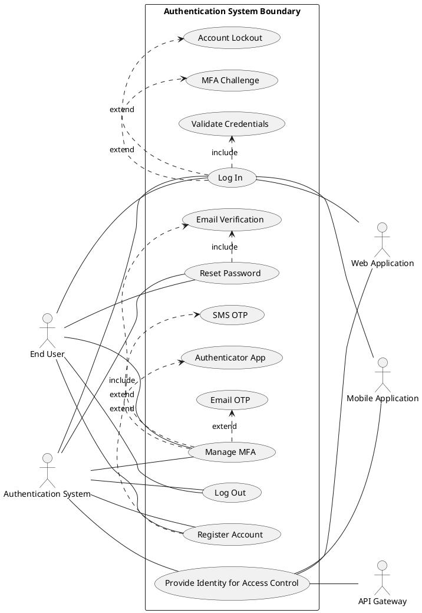

# Product Specification: Authentication System

## 1. Executive Summary

This document outlines the product specification for the Authentication System, a central identity service designed to provide secure and robust user identity verification for various applications. Its primary purpose is to ensure that only authorized users can access protected application resources, safeguarding sensitive data and maintaining compliance with industry security standards. The system will encompass functionalities such as user registration, login authentication, password management, Multi-Factor Authentication (MFA), session management, and account lockout mechanisms, integrating seamlessly with web applications, mobile applications, and APIs. By implementing this system, we aim to enhance overall security, protect user data, provide a smooth user experience, and ensure scalability for a growing user base.

## 2. Goals and Objectives

The primary goals of the Authentication System are derived directly from key business objectives, prioritized as follows:

**P1 - Critical Objectives:**

*   **Secure Access:** To ensure that only authenticated and authorized users can gain entry to the system and its associated resources.
    *   *Acceptance Criteria:* Less than 0.1% of login attempts by unauthorized users are successful; no critical vulnerabilities related to authentication bypass identified in security audits.
*   **Data Protection:** To protect all sensitive user credentials and other system data from unauthorized access, compromise, or disclosure.
    *   *Acceptance Criteria:* All stored passwords are securely hashed with industry-standard algorithms; no instances of sensitive data exposure through authentication vulnerabilities reported.
*   **Compliance:** To adhere strictly to industry security best practices and standards, including but not limited to the OWASP Top 10.
    *   *Acceptance Criteria:* 100% compliance with defined OWASP Top 10 security principles for authentication identified in security audits prior to launch; all relevant security policies are documented and followed.

**P2 - High Importance Objectives:**

*   **User Experience:** To provide users with a smooth, intuitive, and secure login and registration experience that minimizes friction while upholding security standards.
    *   *Acceptance Criteria:* Average login response time is less than 2 seconds for 95% of users; user feedback surveys indicate high satisfaction (e.g., >80% positive sentiment) regarding login/registration process.
*   **Scalability:** To design and implement an authentication service capable of supporting a large and growing number of users and authentication requests without degradation in performance or security.
    *   *Acceptance Criteria:* System demonstrates ability to handle 10,000+ concurrent users with no more than 10% increase in average login response time; system design supports horizontal scaling and load balancing.

## 3. Target Users

The Authentication System is designed to serve a diverse group of users and integrated systems:

*   **End Users:** Individuals who will create accounts, log in, manage their passwords, and utilize multi-factor authentication to access protected web and mobile applications.
*   **Application Developers:** Teams responsible for integrating their web and mobile applications with the Authentication System for user identity verification and token validation.
*   **API Consumers:** Services or applications that will interact with the Authentication System to validate tokens for secure API access.
*   **Security Team:** Stakeholders who define and enforce security policies, ensuring the system meets compliance and protection standards.
*   **Product Owner:** Defines and prioritizes authentication requirements, ensuring alignment with business objectives.
*   **DevOps Team:** Responsible for the deployment, monitoring, and maintenance of the Authentication System's infrastructure.

## 4. Functional Requirements

### FR-100: User Registration

**FR-101: Account Creation with User Provided Information**
*   The system SHALL allow new users to create accounts by providing their email, a password, and their name.
*   *Acceptance Criteria:* Upon successful submission and validation, a new user account entry MUST be created in the system database containing the provided email, a hashed password, and the user's name.
*   `[DETERMINISTIC]`

**FR-102: Email Format Validation**
*   The system SHALL validate that the provided email address conforms to a standard email format (e.g., `user@example.com`).
*   *Acceptance Criteria:* If the email format is invalid, the system MUST display an error message to the user, and account creation SHALL be prevented.
*   `[DETERMINISTIC]`

**FR-103: Password Policy Enforcement during Registration**
*   The system SHALL enforce the defined password policy (as specified in FR-340) during user registration.
*   *Acceptance Criteria:* If the provided password does not meet all criteria specified in FR-341 through FR-345, the system MUST prevent account creation and display specific error messages indicating which policy requirements were not met.
*   `[DETERMINISTIC]`

**FR-104: Email Verification for Account Activation**
*   The system SHALL require email verification to activate a newly registered account.
*   *Acceptance Criteria:* After registration, an activation link MUST be sent to the user's provided email address. The account SHALL remain in a 'pending' state until the user clicks the verification link within a specified timeframe (e.g., 24 hours), upon which the account status changes to 'active'.
*   `[DETERMINISTIC]`

### FR-200: User Login

**FR-201: Credential Submission and Validation**
*   The system SHALL authenticate registered users based on their submitted email and password.
*   *Acceptance Criteria:* Upon submission of email and password, the system MUST compare the provided password against the securely hashed password stored for the corresponding email.
*   `[DETERMINISTIC]`

**FR-202: Login Success**
*   If the submitted credentials are valid, the system SHALL grant login access and generate an authentication token or session.
*   *Acceptance Criteria:* A valid authentication token (e.g., JWT) or session ID MUST be issued to the user's client, indicating successful authentication.
*   `[DETERMINISTIC]`

**FR-203: Login Failure and Error Message Display**
*   If the submitted credentials are invalid, the system SHALL deny login access and display a generic error message.
*   *Acceptance Criteria:* A generic "Invalid credentials" or similar error message MUST be displayed to the user without indicating which specific credential (email or password) was incorrect. No token or session ID SHALL be issued.
*   `[DETERMINISTIC]`

**FR-204: Account Lockout Integration for Failed Attempts**
*   The system SHALL integrate with the account lockout mechanism (FR-600) to prevent brute-force attacks during login.
*   *Acceptance Criteria:* If a user exceeds the defined number of failed login attempts (FR-601), their account MUST be temporarily locked as per FR-602, and subsequent login attempts SHALL be denied until the lockout is resolved.
*   `[DETERMINISTIC]`

### FR-300: Password Management

#### FR-330: Password Reset (Forgot Password)

**FR-331: Initiate Password Reset**
*   The system SHALL provide a "Forgot Password" functionality that allows users to initiate a password reset process by providing their registered email address.
*   *Acceptance Criteria:* Upon submission of a valid registered email address, the system MUST acknowledge the request (e.g., "If an account exists, a reset link has been sent") without confirming account existence.
*   `[DETERMINISTIC]`

**FR-332: Secure Password Reset Link Delivery**
*   The system SHALL send a unique, time-limited password reset link to the user's registered email address.
*   *Acceptance Criteria:* A unique URL containing a secure, randomly generated token MUST be sent to the user's registered email address. This link MUST expire after a defined duration (e.g., 15 minutes) and be single-use.
*   `[DETERMINISTIC]`

**FR-333: Password Reset Link Validation**
*   The system SHALL validate the integrity and validity of the password reset link upon access.
*   *Acceptance Criteria:* If the reset link is expired, already used, or invalid, the system MUST deny access to the password reset form and instruct the user to initiate a new request.
*   `[DETERMINISTIC]`

**FR-334: New Password Setting with Policy Enforcement**
*   The system SHALL allow the user to set a new password, enforcing the defined password policy (FR-340).
*   *Acceptance Criteria:* The user interface for setting a new password MUST only be accessible via a valid reset link. The system MUST validate the new password against FR-341 through FR-345 before allowing the update.
*   `[DETERMINISTIC]`

**FR-335: Password Update in System**
*   Upon successful policy validation, the system SHALL update the user's password with the new, securely hashed password.
*   *Acceptance Criteria:* The old password hash in the database MUST be replaced with the hash of the new password. The user MUST then be able to log in successfully with the new password.
*   `[DETERMINISTIC]`

#### FR-340: Password Policy

**FR-341: Minimum Password Length**
*   User passwords SHALL have a minimum length of 8 characters.
*   *Acceptance Criteria:* Any password less than 8 characters MUST be rejected during registration and password reset.
*   `[DETERMINISTIC]`

**FR-342: Uppercase Character Requirement**
*   User passwords SHALL include at least one uppercase letter (A-Z).
*   *Acceptance Criteria:* Passwords without at least one uppercase letter MUST be rejected.
*   `[DETERMINISTIC]`

**FR-343: Lowercase Character Requirement**
*   User passwords SHALL include at least one lowercase letter (a-z).
*   *Acceptance Criteria:* Passwords without at least one lowercase letter MUST be rejected.
*   `[DETERMINISTIC]`

**FR-344: Numeric Character Requirement**
*   User passwords SHALL include at least one number (0-9).
*   *Acceptance Criteria:* Passwords without at least one numeric character MUST be rejected.
*   `[DETERMINISTIC]`

**FR-345: Special Character Requirement**
*   User passwords SHALL include at least one special character (e.g., !, @, #, $, %, ^, &, *).
*   *Acceptance Criteria:* Passwords without at least one special character from the approved set MUST be rejected.
*   `[DETERMINISTIC]`

### FR-400: Multi-Factor Authentication (MFA)

**FR-401: Support for Multiple MFA Methods**
*   The system SHALL support Email OTP, SMS OTP, and Authenticator App (e.g., Google Authenticator) as optional Multi-Factor Authentication methods.
*   *Acceptance Criteria:* The system MUST provide user interfaces and backend logic to allow users to enroll and utilize each of the specified MFA methods.
*   `[DETERMINISTIC]`

**FR-402: MFA Authentication Flow**
*   When MFA is enabled, the system SHALL prompt the user for a second factor after successful primary credential validation.
*   *Acceptance Criteria:* After entering correct email and password, the user MUST be redirected to an MFA challenge screen.
*   `[DETERMINISTIC]`

**FR-403: OTP Generation and Delivery**
*   For Email OTP and SMS OTP, the system SHALL generate a time-based One-Time Password (OTP) and securely deliver it to the user's registered email or phone number.
*   *Acceptance Criteria:* A unique, time-limited (e.g., 5 minutes) OTP MUST be generated and sent via email or SMS. The OTP MUST be at least 6 digits long.
*   `[DETERMINISTIC]`

**FR-404: OTP Validation**
*   The system SHALL validate the submitted OTP against the generated OTP for the active MFA challenge.
*   *Acceptance Criteria:* If the user enters a correct and unexpired OTP, access MUST be granted. If the OTP is incorrect or expired, access MUST be denied, and an appropriate error message displayed.
*   `[DETERMINISTIC]`

**FR-405: Authenticator App Integration**
*   The system SHALL integrate with standard Authenticator Apps (e.g., Google Authenticator) for MFA using Time-based One-Time Passwords (TOTP).
*   *Acceptance Criteria:* During enrollment, the system MUST display a QR code or secret key for the user to scan/enter into their authenticator app. During login, the system MUST validate the TOTP provided by the user against the expected value for their account.
*   `[DETERMINISTIC]`

### FR-500: Session Management

**FR-501: Token-based Authentication**
*   The system SHALL implement token-based authentication (e.g., JWT) for managing user sessions.
*   *Acceptance Criteria:* Upon successful login, the system MUST issue a cryptographically signed token (e.g., JWT) containing necessary user identity information, and this token MUST be used for subsequent API requests for authentication.
*   `[DETERMINISTIC]`

**FR-502: Session/Token Expiration**
*   The system SHALL implement expiration for issued authentication tokens/sessions.
*   *Acceptance Criteria:* Each token MUST contain an expiration timestamp (`exp` claim for JWTs). Upon token expiration, the user MUST be required to re-authenticate or refresh their token.
*   `[DETERMINISTIC]`

**FR-503: User-initiated Logout Functionality**
*   The system SHALL provide functionality for users to explicitly log out of their active session.
*   *Acceptance Criteria:* Upon a user initiating a logout, their active session MUST be terminated (e.g., by invalidating the token on the server-side or client-side removal), and they MUST be redirected to the login page.
*   `[DETERMINISTIC]`

**FR-504: Automatic Logout after Inactivity**
*   The system SHALL automatically log out users after a predefined period of inactivity.
*   *Acceptance Criteria:* If no user activity is detected for a configurable duration (e.g., 30 minutes), the user's session MUST be terminated, requiring re-authentication for continued access.
*   `[DETERMINISTIC]`

### FR-600: Account Lockout

**FR-601: Failed Login Attempt Threshold**
*   The system SHALL implement an account lockout mechanism that triggers after 5 consecutive failed login attempts for a single user account.
*   *Acceptance Criteria:* On the 5th consecutive failed login attempt within a predefined time window (e.g., 10 minutes), the user account's status MUST change to 'locked'.
*   `[DETERMINISTIC]`

**FR-602: Temporary Account Lockout Duration**
*   A locked account SHALL remain temporarily locked for a duration of 30 minutes.
*   *Acceptance Criteria:* Any login attempts to a locked account within the 30-minute lockout period MUST be denied, and an error message indicating the account is locked MUST be displayed. After 30 minutes, the account MUST automatically revert to an 'active' state.
*   `[DETERMINISTIC]`

**FR-603: Account Unlock Mechanisms**
*   The system SHALL provide mechanisms for users to unlock their accounts via email verification or for administrators to manually unlock accounts.
*   *Acceptance Criteria:* For user-initiated unlock, a unique verification link MUST be sent to the user's registered email, similar to password reset, which, when clicked, unlocks the account. An administrative interface MUST exist to allow authorized personnel to manually unlock user accounts.
*   `[DETERMINISTIC]`

### FR-700: Access Control Integration Interface

**FR-701: Identity Token Issuance**
*   The Authentication System SHALL issue an identity token containing the authenticated user's unique identifier and potentially role information to consuming applications.
*   *Acceptance Criteria:* Upon successful authentication and token generation, the issued token MUST contain a unique `User ID` and optionally a `Role` claim, enabling consuming applications to make access control decisions.
*   `[DETERMINISTIC]`

**FR-702: Token Validation Endpoint**
*   The Authentication System SHALL provide an endpoint for external applications to validate issued authentication tokens.
*   *Acceptance Criteria:* Consuming applications MUST be able to send an issued token to a dedicated endpoint (e.g., `/api/v1/auth/validate`) and receive a response indicating the token's validity and potentially the associated user's identity.
*   `[DETERMINISTIC]`

## 5. Non-Functional Requirements

### NFR-100: Security

**NFR-101: OWASP Top 10 Compliance**
*   The Authentication System MUST comply with the current OWASP Top 10 security guidelines.
*   *Acceptance Criteria:* A comprehensive security audit MUST be performed prior to launch, demonstrating that no critical or high-severity vulnerabilities related to the OWASP Top 10 are present in the system.
*   `[DETERMINISTIC]`

**NFR-102: Secure Password Hashing**
*   The system SHALL use robust, industry-standard cryptographic hashing algorithms for storing user passwords, such as bcrypt or Argon2.
*   *Acceptance Criteria:* All stored user passwords MUST be hashed using either bcrypt or Argon2 with an appropriate work factor (e.g., bcrypt cost factor of 12 or higher). Passwords MUST NOT be stored in plaintext.
*   `[DETERMINISTIC]`

**NFR-103: HTTPS Encryption for All Communications**
*   All communication channels between clients (web/mobile applications) and the Authentication System, and between the Authentication System and integrated services, SHALL be encrypted using HTTPS/TLS 1.2 or higher.
*   *Acceptance Criteria:* All API endpoints for the Authentication System MUST only be accessible via HTTPS. Network traffic MUST be inspected to confirm full TLS encryption.
*   `[DETERMINISTIC]`

**NFR-104: Protection Against Brute-Force Attacks**
*   The system SHALL implement comprehensive protection against brute-force attacks.
*   *Acceptance Criteria:* This MUST include the account lockout mechanism (FR-600) and rate-limiting on login attempts (e.g., 10 attempts per IP address per minute) to prevent dictionary attacks or password spraying.
*   `[DETERMINISTIC]`

**NFR-105: Session Hijacking Protection**
*   The system SHALL employ measures to prevent session hijacking.
*   *Acceptance Criteria:* All authentication tokens (e.g., JWTs) MUST be transmitted via secure channels (HTTPS) and stored securely (e.g., HTTP-only cookies, local storage with appropriate security measures). Tokens MUST be invalidated upon logout or unusual activity detection.
*   `[DETERMINISTIC]`

### NFR-200: Performance

**NFR-201: Login Response Time**
*   The system SHALL process user login requests with a response time of less than 2 seconds.
*   *Acceptance Criteria:* Under normal operating conditions, 95% of user login requests MUST complete within 2 seconds, measured from request initiation to token issuance.
*   `[DETERMINISTIC]`

**NFR-202: Concurrent Users**
*   The system SHALL support at least 10,000 concurrent active users.
*   *Acceptance Criteria:* Performance tests MUST demonstrate stable operation with 10,000 simulated concurrent users without degradation in login response time beyond the NFR-201 target.
*   `[DETERMINISTIC]`

**NFR-203: System Availability**
*   The Authentication System SHALL maintain an availability of 99.9% uptime.
*   *Acceptance Criteria:* The system MUST demonstrate 99.9% availability, excluding planned maintenance, over a continuous 30-day monitoring period. This equates to no more than 43 minutes and 49 seconds of downtime per month.
*   `[DETERMINISTIC]`

### NFR-300: Scalability

**NFR-301: Horizontal Scaling Support**
*   The Authentication System SHALL be designed to support horizontal scaling.
*   *Acceptance Criteria:* The architecture MUST allow for additional instances of the authentication service to be deployed and integrated via a load balancer, increasing capacity without requiring code changes.
*   `[DETERMINISTIC]`

**NFR-302: Load Balancing Integration**
*   The system SHALL be capable of integrating with standard load balancing solutions.
*   *Acceptance Criteria:* The service MUST be stateless where possible, or session affinity MUST be manageable by the load balancer, to distribute incoming requests across multiple instances effectively.
*   `[DETERMINISTIC]`

**NFR-303: Microservice Architecture**
*   The Authentication System SHALL be implemented as a microservice.
*   *Acceptance Criteria:* The authentication functionality MUST be encapsulated within a single, independently deployable service that communicates via well-defined APIs.
*   `[DETERMINISTIC]`

### NFR-400: Reliability

**NFR-401: Backup Authentication Servers**
*   The system SHALL include provisions for backup authentication servers.
*   *Acceptance Criteria:* At least one redundant authentication server instance MUST be deployed in a separate availability zone to serve as a backup.
*   `[DETERMINISTIC]`

**NFR-402: Automatic Failover**
*   The system SHALL implement automatic failover capabilities.
*   *Acceptance Criteria:* In the event of a primary server failure, the system MUST automatically switch to a backup server within 5 minutes, ensuring minimal service interruption.
*   `[DETERMINISTIC]`

**NFR-403: Monitoring and Logging**
*   The system SHALL implement comprehensive monitoring and logging for operational health and security events.
*   *Acceptance Criteria:* Critical system metrics (e.g., CPU, memory, network I/O, error rates) MUST be logged and monitored in real-time. All authentication attempts (success/failure), account lockouts, and password resets MUST be logged with relevant details (timestamp, user ID, IP address).
*   `[DETERMINISTIC]`

## 6. Use Case Analysis

### Main Use Case Diagram: Authentication System

### Use Case Descriptions:

1.  **Register Account:**
    *   **Actor:** End User
    *   **Description:** The user provides their email, password, and name to create a new account within the system. The system validates the input and initiates an email verification process.
    *   **Flow:**
        1.  User navigates to the registration page.
        2.  User enters email, password, and name.
        3.  System validates email format and password policy.
        4.  System sends an email verification link.
        5.  User clicks the verification link to activate the account.
        6.  System marks the account as active.

2.  **Log In:**
    *   **Actor:** End User, Web Application, Mobile Application
    *   **Description:** The user enters their credentials (email and password) to gain access to the application. The system authenticates the user and, if successful, issues an authentication token.
    *   **Flow:**
        1.  User provides email and password.
        2.  System validates credentials.
        3.  **[EXTEND]** If credentials fail multiple times, system triggers **Account Lockout**.
        4.  **[EXTEND]** If MFA is enabled, system triggers **MFA Challenge**.
        5.  If credentials are valid (and MFA passed, if applicable), system generates and issues an authentication token.
        6.  Application grants user access based on the token.

3.  **Reset Password:**
    *   **Actor:** End User
    *   **Description:** The user, having forgotten their password, requests a password reset. The system sends a reset link to their registered email, allowing them to set a new password.
    *   **Flow:**
        1.  User clicks "Forgot Password" link.
        2.  User enters registered email.
        3.  System sends a time-limited, unique password reset link to the email.
        4.  User accesses the link and sets a new password.
        5.  System validates the new password against policy and updates it.

4.  **Manage MFA:**
    *   **Actor:** End User
    *   **Description:** The user enrolls in or authenticates using various Multi-Factor Authentication methods (Email OTP, SMS OTP, Authenticator App).
    *   **Flow (Enrollment - simplified):**
        1.  User chooses an MFA method (Email OTP, SMS OTP, or Authenticator App).
        2.  System guides user through setup (e.g., sending test OTP, displaying QR code for Authenticator App).
        3.  User confirms setup.
        4.  System enables MFA for the chosen method.
    *   **Flow (Authentication - see Log In MFA Challenge):**
        1.  After primary login, system requests OTP.
        2.  User provides OTP from chosen method.
        3.  System validates OTP.

5.  **Log Out:**
    *   **Actor:** End User
    *   **Description:** The user explicitly terminates their active session with the application.
    *   **Flow:**
        1.  User clicks "Logout" button.
        2.  Application informs the Authentication System (or invalidates client-side token).
        3.  Authentication System (if stateful) invalidates the session.
        4.  User is redirected to the login page.

6.  **Provide Identity for Access Control:**
    *   **Actor:** Web Application, Mobile Application, API Gateway
    *   **Description:** After successful authentication, the Authentication System provides an identity token (e.g., JWT) that consuming applications use to verify the user's identity and make access control decisions.
    *   **Flow:**
        1.  User authenticates successfully with the Auth System.
        2.  Auth System issues a signed token to the client.
        3.  Client sends the token with requests to WebApp/MobileApp/APIGateway.
        4.  WebApp/MobileApp/APIGateway validates the token's signature and claims with the Auth System (or independently if self-contained).
        5.  WebApp/MobileApp/APIGateway uses the User ID and any role claims from the token to enforce granular access control.

## 7. Constraints, Assumptions, and Risks

### Constraints

*   **Technology Stack:** The Authentication System MUST be implemented as a microservice, supporting horizontal scaling and load balancing.
*   **Security Standards:** The system MUST adhere to OWASP Top 10 security guidelines and use HTTPS for all communications.
*   **Integration:** The system MUST integrate with existing or future web applications, mobile applications, and API Gateways.
*   **Password Policy:** The system MUST enforce the minimum password policy specified in FR-340.

### Assumptions

*   **Email Service Availability:** An external email service provider (SMTP) will be available and reliable for sending account verification and password reset emails.
*   **SMS Provider Availability (if applicable):** If SMS OTP is enabled, a reliable SMS gateway service will be available and integrated.
*   **Network Infrastructure:** The underlying network infrastructure will provide sufficient bandwidth and low latency for communication between the Authentication System, client applications, and integrated services.
*   **Application-Level Access Control:** Consuming applications are responsible for implementing their own authorization logic based on the identity information provided by the Authentication System (e.g., User ID, roles in tokens). The Authentication System is not an Authorization System.
*   **Client-Side Security:** Client applications (web, mobile) will implement appropriate secure storage and handling of authentication tokens to prevent client-side vulnerabilities.

### Risks and Mitigation

*   **Brute Force Attacks:**
    *   **Description:** Malicious actors attempt to gain unauthorized access by trying numerous password combinations.
    *   **Mitigation:** Implement account lockout mechanisms (FR-600) and API rate limiting (NFR-104) on login attempts to deter and block such attacks.
*   **Password Breaches:**
    *   **Description:** Stored user passwords could be compromised through database breaches or weak hashing.
    *   **Mitigation:** Enforce strong password policies (FR-340) and utilize robust, industry-standard secure password hashing algorithms (e.g., bcrypt, Argon2) with appropriate salt and work factors (NFR-102).
*   **Session Hijacking:**
    *   **Description:** An attacker gains control of a legitimate user's session to impersonate them.
    *   **Mitigation:** Ensure all communications are encrypted with HTTPS/TLS (NFR-103), use secure, cryptographically signed tokens (NFR-105), implement token expiration (FR-502), and provide explicit logout functionality (FR-503).
*   **Unauthorized Access (General):**
    *   **Description:** An attacker bypasses authentication or exploits vulnerabilities to gain access to protected resources.
    *   **Mitigation:** Implement Multi-Factor Authentication (FR-400) as an optional security layer for users. Adhere strictly to OWASP Top 10 guidelines (NFR-101) and conduct regular security audits and penetration testing.
*   **Scalability Limitations:**
    *   **Description:** The system struggles to handle a growing number of users or high concurrent load, leading to performance degradation or outages.
    *   **Mitigation:** Design with a microservice architecture (NFR-303) supporting horizontal scaling (NFR-301) and deploy with load balancing (NFR-302) from the outset. Implement robust monitoring (NFR-403) to proactively address load issues.